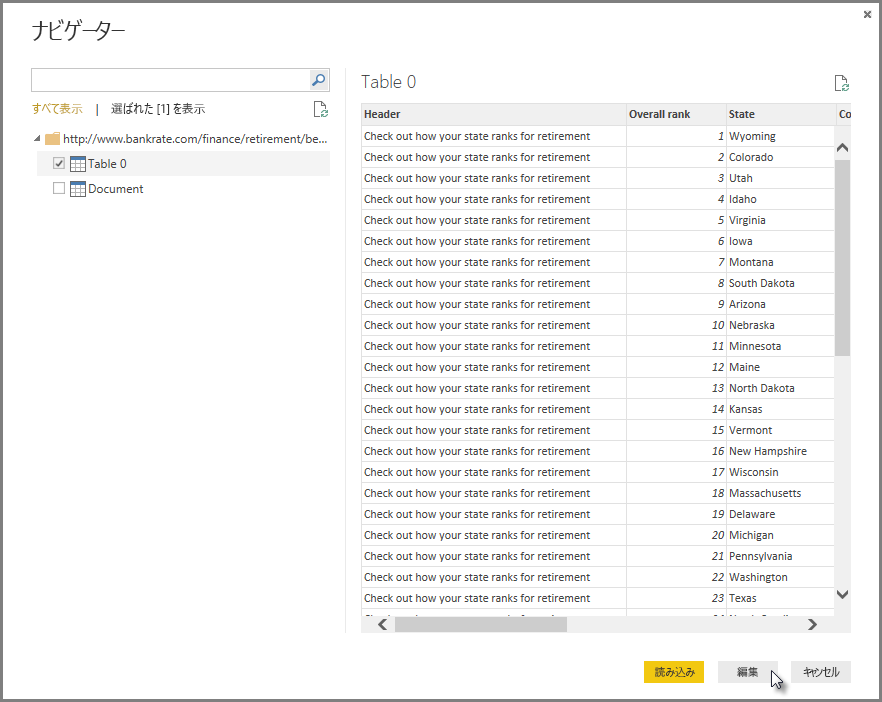
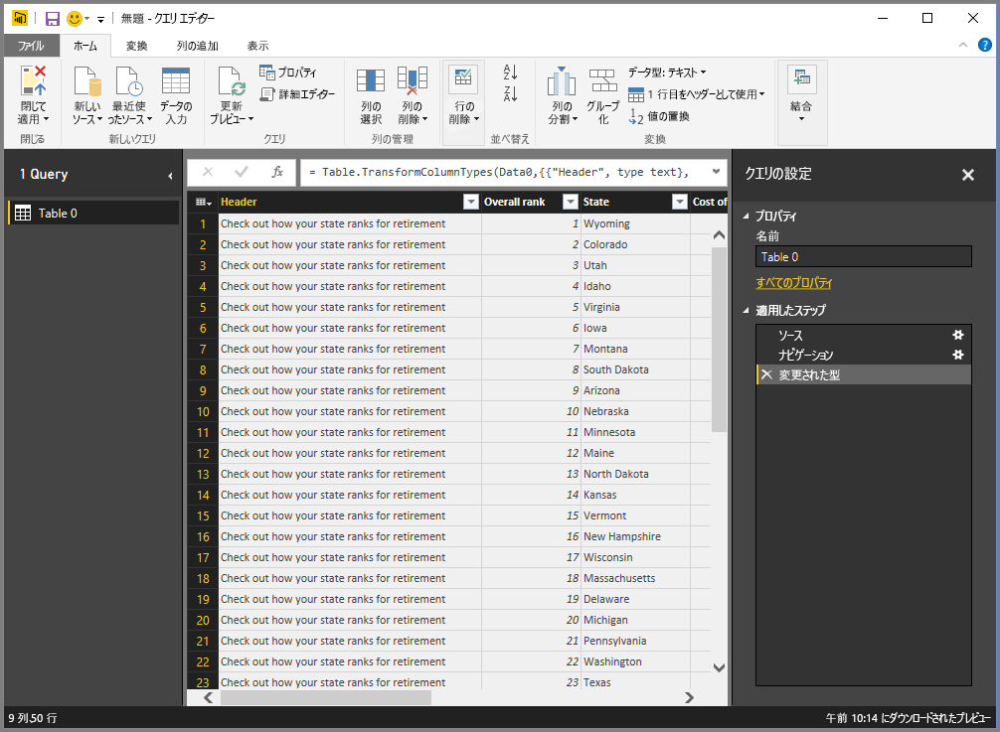
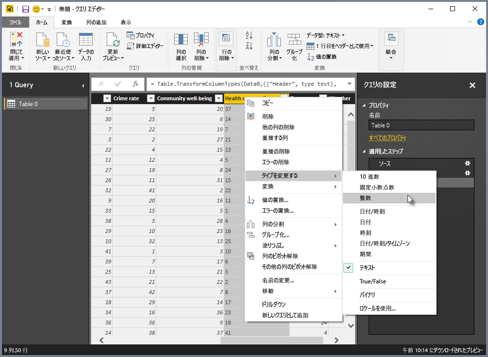
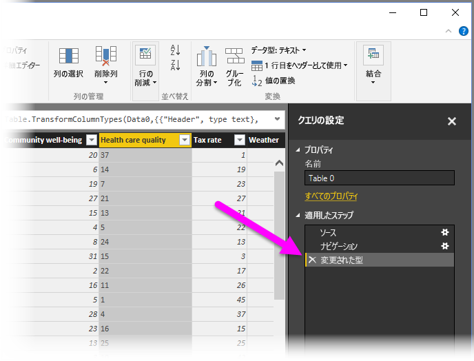
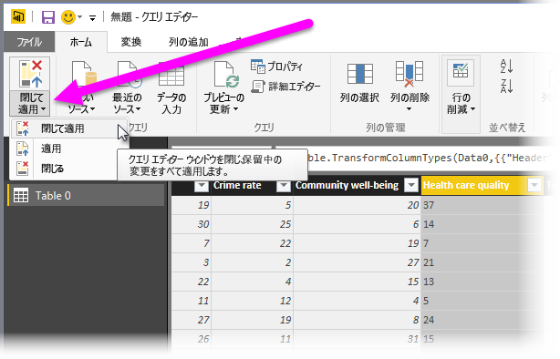
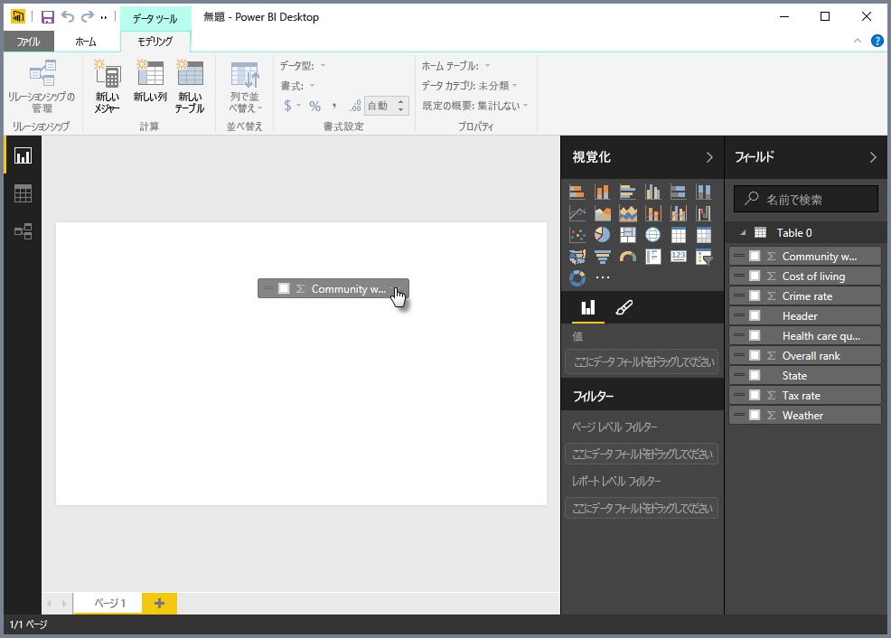
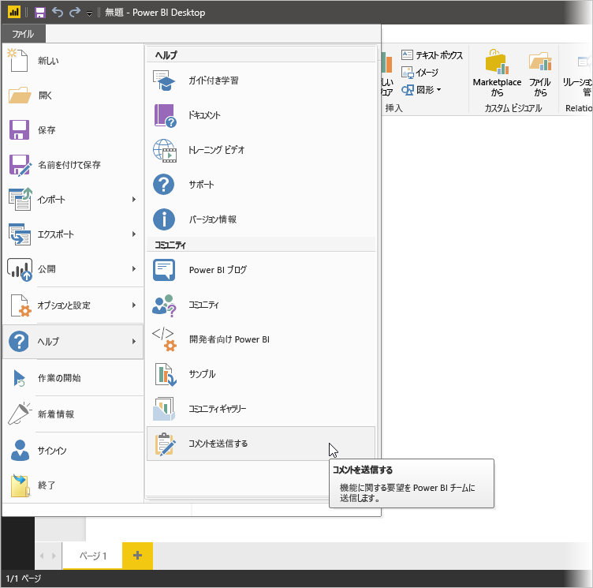

# Power BI Desktop におけるデータへの接続
Power BI Desktop があれば、拡張し続けるデータの世界に簡単につながることができます。 Power BI Desktop をお持ちでない場合は、[ダウンロード](http://go.microsoft.com/fwlink/?LinkID=521662)してインストールできます。

Power BI Desktop では、 *あらゆる種類* のデータ ソースを使用できます。 次の図は、**[ファイル]** リボンで **[データの取得] \> [詳細]** をクリックして行う、データへの接続方法を示しています。

この例では、 **Web** データ ソースに接続します。

あなたは退職を間近に控えて、陽当たりが良く、税制が有利で、医療が充実した場所への移転を考えているとします。 あるいは、データ アナリストとして、顧客のサポートにそのような情報を必要としているかもしれません。 たとえば、レインコートを製造するクライアントに降雨量が *多い* 場所を販売ターゲットとするよう促す場合です。

いずれの場合も、これらのトピックやその他のトピックに関する興味深いデータを含んだ Web リソースを見つけます。

[*http://www.bankrate.com/finance/retirement/best-places-retire-how-state-ranks.aspx*](http://www.bankrate.com/finance/retirement/best-places-retire-how-state-ranks.aspx)

**[データの取得] \> [Web]** をクリックしてから、アドレスを入力します。

**[OK]**をクリックすると、Power BI Desktop の **クエリ** 機能が動作します。 Power BI Desktop は Web リソースにアクセスし、 **[ナビゲーター]** ウィンドウにその Web ページで検出した結果が返されます。 この場合は、テーブル (テーブル 0) とドキュメント全体が検出されました。 テーブルに興味があるので、一覧からテーブルを選択します。 **[ナビゲーター]** ウィンドウにプレビューが表示されます。

この時点で、ウィンドウの下部にある **[編集]** をクリックしてテーブルを読み込む前にクエリを編集するか、テーブルを読み込みます。

**[編集]**を選択すると、テーブルが読み込まれ、クエリ エディターが起動します。 **[クエリの設定]** ウィンドウが表示されます (表示されない場合は、リボンにある **[表示]** をクリックしてから、**[表示] \> [クエリの設定]** の順にクリックすると **[クエリの設定]** ウィンドウが表示されます)。 表示は次のようになります。

これらのスコアはすべて数値ではなくテキストになっています。ですが、必要なのは数値です。 列ヘッダーを右クリックして **[型の変更] \> [整数]** の順に選ぶだけで変更できるので、心配は不要です。 複数の列を選ぶには、まず 1 つの列を選んでから、**Shift** キーを押したまま追加の隣接する列を選びます。その後、列ヘッダーを右クリックして選んだ列をすべて変更します。 **Ctrl キー**を使用すると、隣接していない列を選択できます。

**[クエリの設定]** の **[適用したステップ]** に、これまでに加えたすべての変更が反映されます。 データをさらに変更すると、クエリ エディターはそれらの変更を **[適用したステップ]** セクションに記録します。このセクションで、必要に応じて調整、再アクセス、再配置、削除を行うことができます。

テーブルを読み込んだ後も変更をさらに加えることはできますが、今のところはこれで十分です。 操作が終わって、**[ホーム]** リボンから **[閉じて適用]** を選択すると、Power BI Desktop で変更が適用され、クエリ エディターが閉じます。

データ モデルが読み込まれている状態で、Power BI Desktop の **レポート** ビューのキャンバスにフィールドをドラッグすると、ビジュアルを作成することができます。

もちろん、これはデータ接続が 1 つしかない単純なモデルです。ほとんどの Power BI Desktop のレポートは、さまざまなデータ ソースに接続していて、豊富なデータ モデルを生み出すリレーションシップがあり、ユーザーのニーズに合わせて整形されます。 

### 次の手順
Power BI Desktop を使用すると、さまざまなことを行えます。 そのような機能について詳しくは、次のリソースをご覧ください。

* [Power BI Desktop の概要](desktop-getting-started.md)
* [Power BI Desktop でのクエリの概要](desktop-query-overview.md)
* [Power BI Desktop のデータ ソース](desktop-data-sources.md)
* [Power BI Desktop でのデータの整形と結合](desktop-shape-and-combine-data.md)
* [Power BI Desktop での一般的なクエリ タスク](desktop-common-query-tasks.md)   

弊社に対するフィードバックを歓迎いたします。 フィードバックをご希望の場合は Power BI Desktop の **[フィードバックの送信]** メニュー項目をご利用ください。 皆さまからのご意見をお待ちしています。

