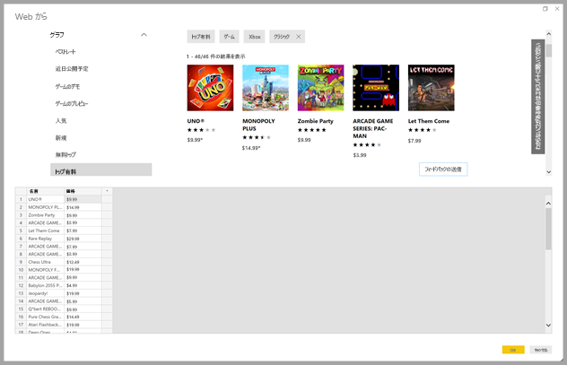
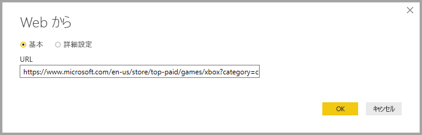
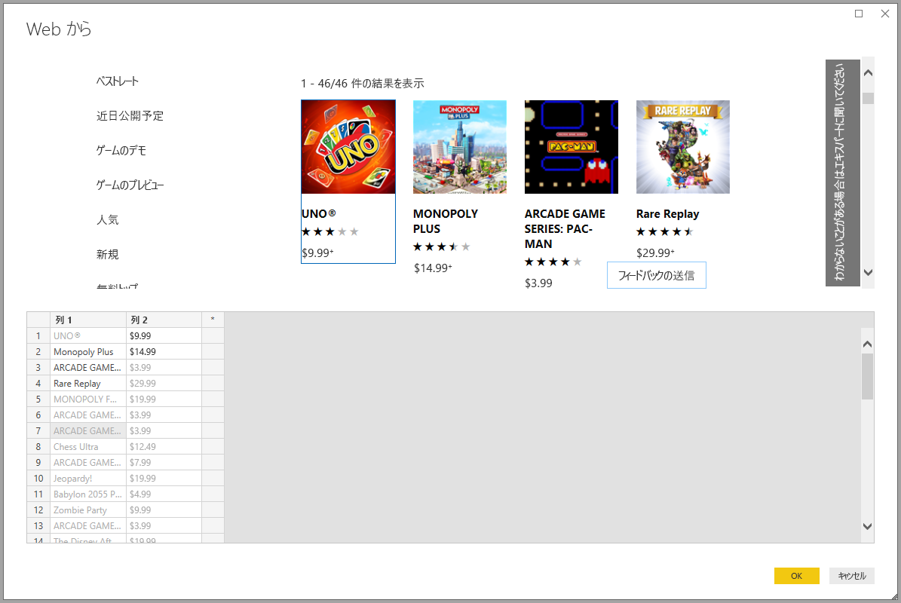
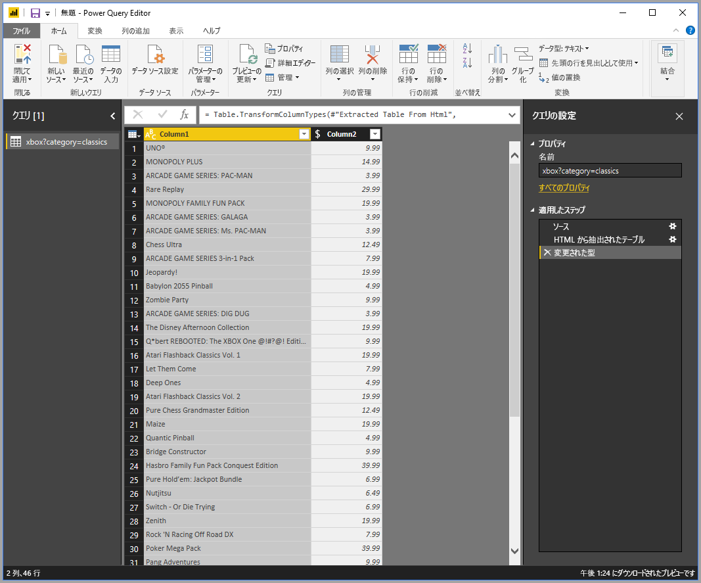

# 例を指定して Web ページからデータを取得する

Web ページからのデータ取得を利用すると、ユーザーは Web ページからデータを簡単に抽出し、そのデータを **Power BI Desktop** にインポートすることができます。 ただし、多くの場合、Web ページ上のデータは、抽出が容易な整理されたテーブル形式ではないので、たとえ構造化され、一貫していても、そのようなページからデータを取得することは困難です。 

そこで解決策があります。 **[Get Data from Web by example]\(例を指定して Web からデータを取得する\)** 機能を使用すると、基本的にはコネクタ ダイアログで 1 つ以上の例を指定して抽出するデータを **Power BI Desktop** に示すことができます。その結果、指定した例に合うその他のデータが収集され、ページに表示されます。 この解決策を利用すると、テーブルで見つかったデータ*だけでなく*、その他のテーブル以外のデータなど、Web ページからあらゆる種類のデータを抽出できます。 

## [Get Data from Web by example]\(例を指定して Web からデータを取得する\) の使用

**[Get Data from Web by example]\(例を指定して Web からデータを取得する\)** を使用するには、 **[ホーム]** リボン メニューから **[データを取得]** を選択します。 表示されるウィンドウで、左ウィンドウのカテゴリから **[その他]** を選択し、 **[Web]** を選択します。

![[データを取得] から [Web] を選択する](media/desktop-connect-to-web-by-example/web-by-example_03.png)

ここから、データを抽出する Web ページの URL を入力します。 この記事では、Microsoft Store の Web ページを使用し、このコネクタのしくみを紹介します。 

この記事に従って操作する場合は、この記事で使用している [Microsoft Store の URL](https://www.microsoft.com/store/top-paid/games/xbox?category=classics) を利用できます。

    https://www.microsoft.com/store/top-paid/games/xbox?category=classics

**[OK]** を選択すると、 **[ナビゲーター]** ダイアログが表示され、Web ページから自動検出されたテーブルが表示されます。 下図の例では、テーブルは見つかりませんでしたが、ページの下部に、 **[Extract table using examples]\(例を使用してテーブルを抽出する\)** というボタンが表示されます。このボタンをクリックして例を指定できます。

![[ナビゲーター] ウィンドウ](media/desktop-connect-to-web-by-example/web-by-example_05.png)

**[Extract table using examples]\(例を使用してテーブルを抽出する\)** を選択すると、対話型ウィンドウが表示されます。ここでは、Web ページのコンテンツをプレビューし、抽出するデータのサンプル値を入力できます。 

この例では、ページ上のゲームごとに*名前*と*価格*を抽出します。 次の図に示すように、ページの各列からいくつかの例を指定することで、抽出することができます。 このように例を入力すると、**Power Query** (Web ページからデータを抽出する基礎となるテクノロジ) で、スマート データ抽出アルゴリズムを使用してサンプル エントリのパターンに適合するデータを抽出することができます。

> 注:値の候補に含まれるのは、長さが 128 文字以下の値のみです。

Web ページから抽出されたデータに満足したら、 **[OK]** を選択して **[クエリ エディター]** に移動します。クエリ エディターではさらに変換を適用したり、データを整形したりすることができます (このデータを他のデータ ソースと組み合わせるなど)。

そこからビジュアルを作成したり、**Power BI Desktop** レポートを作成するときに Web ページ データを使用したりすることができます。

## 次の手順
**Power BI Desktop** を使用して接続できるデータの種類は他にもあります。 データ ソースの詳細については、次のリソースを参照してください。

* [例による列を追加します。](desktop-add-column-from-example.md)
* [Web ページに接続する](desktop-connect-to-web.md)
* [Power BI Desktop のデータ ソース](desktop-data-sources.md)
* [Power BI Desktop でのデータの整形と結合](desktop-shape-and-combine-data.md)
* [Power BI Desktop で Excel ブックに接続する](desktop-connect-excel.md)   
* [Power BI Desktop で CSV ファイルに接続する](desktop-connect-csv.md)   
* [Power BI Desktop にデータを直接入力する](desktop-enter-data-directly-into-desktop.md)   

