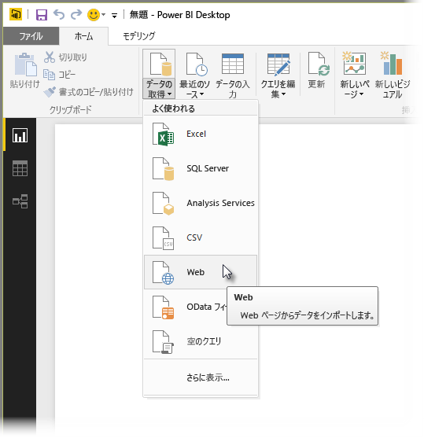
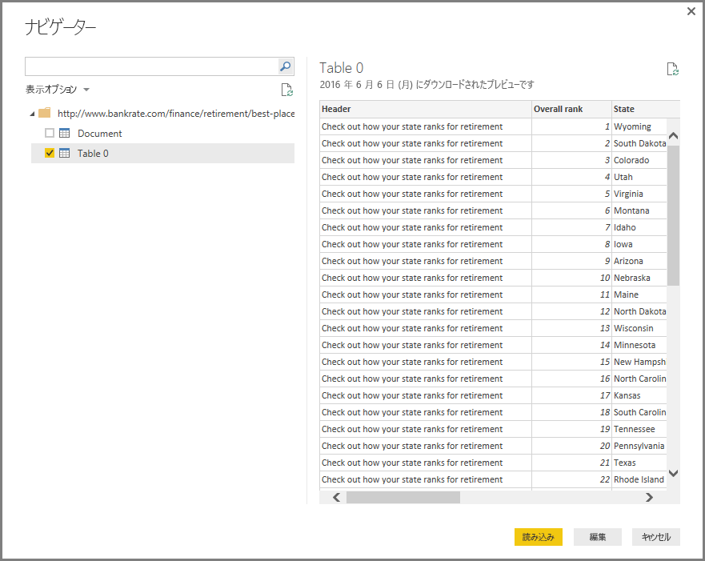
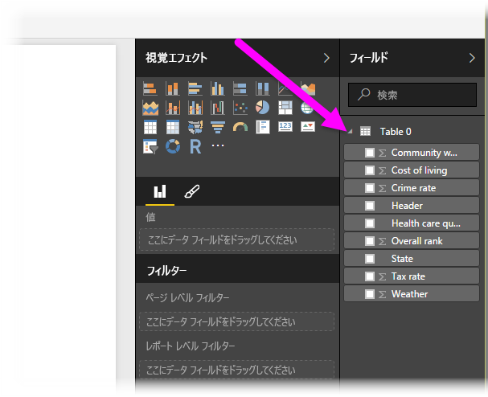

# Power BI Desktop から Web ページに接続する
Web ページに接続し、そのデータを Power BI Desktop にインポートして、表示やデータ モデルで使用できます。

Power BI Desktop で、**[ホーム]** リボンから **[データの取得]、[Web]** の順に選択します。

ダイアログが表示され、データをインポートする Web ページの URL の指定を要求されます。

URL を入力するか貼り付けて、**[OK]** をクリックします。 Power BI Desktop はそのページに接続し、ページで利用可能なデータを **[ナビゲーター]** ウィンドウに表示します。 ページ全体のテーブルなど、利用可能なデータ要素の 1 つを選択すると、**[ナビゲーター]** ウィンドウの右側にデータのプレビューが表示されます。

Power BI Desktop にデータをインポートする前に、**[編集]** ボタンを選択して **[クエリ エディター]** を起動し、その Web ページのデータを調整および変換できます。 または、**[読み込み]** ボタンを選択して、左側のウィンドウで選択したすべてのデータ要素をインポートできます。

**[読み込み]** を選択すると、選択した項目がインポートされて、Power BI Desktop の [レポート] ビューの右側の **[フィールド]** ウィンドウで使用できるようになります。

Web ページへの接続と Power BI Desktop へのデータの取り込みは以上です。

この後は、これらのフィールドをレポート キャンバスにドラッグして、必要なすべての表示を作成できます。 他のデータと同じように Web ページのデータを処理できます。データを調整したり、データとモデルの他のデータ ソースとの間にリレーションシップを作成したり、必要な Power BI レポートを作成するための処理を行ったりできます。

Web ページへの接続の詳細については、「[Power BI Desktop 概要ガイド](desktop-getting-started.md)」を参照してください。

### 次の手順
Power BI Desktop を使用して接続できるデータの種類は他にもあります。 データ ソースの詳細については、次のリソースを参照してください。

* [Power BI Desktop のデータ ソース](desktop-data-sources.md)
* [Power BI Desktop でのデータの整形と結合](desktop-shape-and-combine-data.md)
* [Power BI Desktop で Excel ブックに接続する](desktop-connect-excel.md)   
* [Power BI Desktop で CSV ファイルに接続する](desktop-connect-csv.md)   
* [Power BI Desktop にデータを直接入力する](desktop-enter-data-directly-into-desktop.md)   

