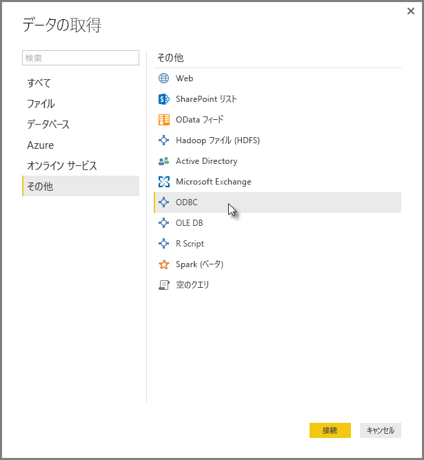
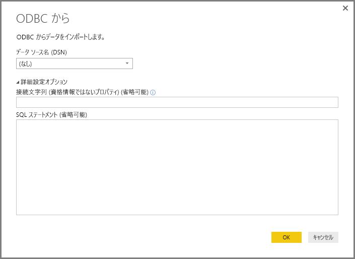
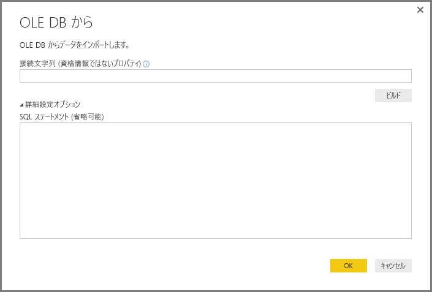
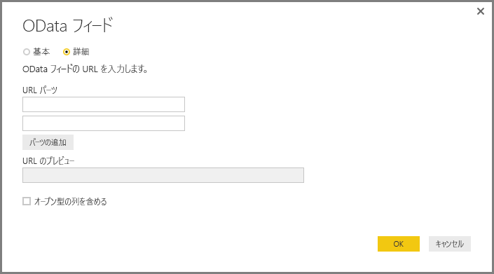
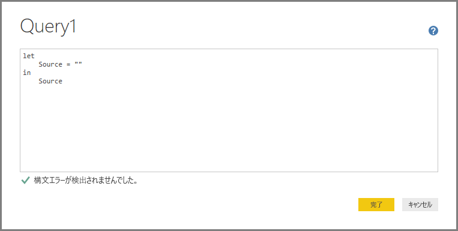
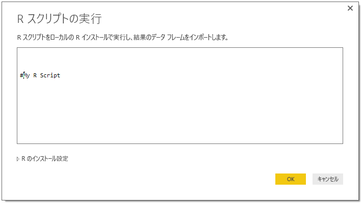

# Power BI Desktop でジェネリック インターフェイスを使用してデータに接続する
**Power BI Desktop** では、**[データの取得]** ウィンドウに表示されるように、**Access データベース**から **Zendesk** まで広範にカバーする組み込みデータ接続を使用して、さまざまな異なるデータ ソースに接続できます。 また、**Power BI Desktop** に組み込まれているジェネリック インターフェイス (**ODBC** や **REST API** など) を使うことで、*その他*のあらゆる種類のデータ ソースに接続でき、接続オプションの範囲が大きく広がります。

## Power BI Desktop のデータ インターフェイス
**Power BI Desktop** に含まれる、特定のデータ ソースに接続するために作成されたデータ コネクタのコレクションは増え続けています。 たとえば、**SharePoint リスト**のデータ コネクタは、**SharePoint リスト**向けに設計された接続シーケンスの間に特定のフィールドとサポート情報を提供します。**[データの取得] > [その他]** を選択すると表示されるウィンドウの他のデータ ソースについても同様です (上図を参照)。

さらに、**Power BI Desktop** では、以下のジェネリック データ インターフェイスのいずれかを使うことで、**[データの取得]** の一覧には具体的に示されていないデータ ソースにも接続できます。

* **ODBC**
* **OLE DB**
* **OData**
* **REST API**
* **R スクリプト**

これらのジェネリック インターフェイスで提供される接続ウィンドウの適切なパラメーターにより、**Power BI Desktop** でアクセスして使用できるデータ ソースの範囲が大きく広がります。

以下のセクションでは、これらのジェネリック インターフェイスでアクセスできるデータ ソースの一覧を示します。

**Power BI Desktop** で使いたいデータ ソースが見つからない場合は、 [ご連絡](https://ideas.powerbi.com/)をいただければ、アイデアとご要望の一覧に追加します。

## ODBC でアクセスできるデータ ソース
**Power BI Desktop** の **ODBC** コネクタを使うと、**データ ソース名 (DSN)** または*接続文字列*を指定するだけで、任意のサードパーティ製 ODBC ドライバーから簡単にデータをインポートできます。 必要であれば、ODBC ドライバーに対して SQL ステートメントを実行することもできます。

次の一覧では、ジェネリック **ODBC** インターフェイスを使って **Power BI Desktop** が接続できるいくつかのデータ ソースの詳細な例を示します。

| Power BI Desktop のジェネリック コネクタ | 外部データ ソース | 詳細情報のリンク |
| --- | --- | --- |
| ODBC |Cassandra |[Cassandra ODBC ドライバー](http://www.simba.com/drivers/cassandra-odbc-jdbc/) |
| ODBC |Couchbase DB |[Couchbase と Power BI](https://powerbi.microsoft.com/en-us/blog/visualizing-data-from-couchbase-server-v4-using-power-bi/) |
| ODBC |DynamoDB |[DynamoDB ODBC ドライバー](http://www.simba.com/drivers/dynamodb-odbc-jdbc/) |
| ODBC |Google BigQuery |[BigQuery ODBC ドライバー](http://www.simba.com/drivers/bigquery-odbc-jdbc/) |
| ODBC |Hbase |[Hbase ODBC ドライバー](http://www.simba.com/drivers/hbase-odbc-jdbc/) |
| ODBC |Hive |[Hive ODBC ドライバー](http://www.simba.com/drivers/hive-odbc-jdbc/) |
| ODBC |IBM Netezza |[IBM Netezza の情報](https://www.ibm.com/support/knowledgecenter/SSULQD_7.2.1/com.ibm.nz.datacon.doc/c_datacon_plg_overview.html) |
| ODBC |Presto |[Presto ODBC ドライバー](http://www.simba.com/drivers/presto-odbc-jdbc/) |
| ODBC |Project Online |[Project Online の記事](desktop-project-online-connect-to-data.md) |
| ODBC |Progress OpenEdge |[Progress OpenEdge ODBC ドライバーのブログ投稿](https://na01.safelinks.protection.outlook.com/?url=https%3A%2F%2Fwww.progress.com%2Fblogs%2Fconnect-microsoft-power-bi-to-openedge-via-odbc-driver&data=02%7C01%7CMatt.Masson%40microsoft.com%7C5e63742e6c454308b58a08d4034b5923%7C72f988bf86f141af91ab2d7cd011db47%7C1%7C0%7C636137069555329811&sdata=gSu2Rq3vZ0uBVOgjaXxd8Y3uBf%2B8DidX6PG33jwAduY%3D&reserved=0) |

## OLE DB でアクセスできるデータ ソース
**Power BI Desktop** の **OLE DB** コネクタを使うと、*接続文字列*を指定するだけで、任意のサードパーティ製 OLE DB ドライバーから簡単にデータをインポートできます。 必要であれば、OLE DB ドライバーに対して SQL ステートメントを実行することもできます。

次の一覧では、ジェネリック **OLE DB** インターフェイスを使って **Power BI Desktop** が接続できるいくつかのデータ ソースの詳細な例を示します。

| Power BI Desktop のジェネリック コネクタ | 外部データ ソース | 詳細情報のリンク |
| --- | --- | --- |
| OLE DB |SAS OLE DB |[SAS Provider for OLE DB](https://support.sas.com/downloads/package.htm?pid=648) |
| OLE DB |Sybase OLE DB |[Sybase Provider for OLE DB](http://infocenter.sybase.com/help/index.jsp?topic=/com.sybase.infocenter.dc35888.1550/doc/html/jon1256941734395.html) |

## OData でアクセスできるデータ ソース
**Power BI Desktop** の **OData** コネクタを使うと、**OData** の URL を入力するか貼り付けるだけで、任意の **OData** URL からデータをインポートできます。 **[OData フィード]** ウィンドウのテキスト ボックスにリンクを入力するか貼り付けることにより、URL の複数の部分を追加できます。

次の一覧では、ジェネリック **OData** インターフェイスを使って **Power BI Desktop** が接続できるいくつかのデータ ソースの詳細な例を示します。

| Power BI Desktop のジェネリック コネクタ | 外部データ ソース | 詳細情報のリンク |
| --- | --- | --- |
| OData |近日公開予定 |後で確認してください |

## REST API でアクセスできるデータ ソース
**REST API** を使ってデータ ソースに接続し、**REST** をサポートするあらゆる種類のデータ ソースのデータを使用できます。

次の一覧では、ジェネリック **REST API** インターフェイスを使って **Power BI Desktop** が接続できるいくつかのデータ ソースの詳細な例を示します。

| Power BI Desktop のジェネリック コネクタ | 外部データ ソース | 詳細情報のリンク |
| --- | --- | --- |
| REST API |Couchbase DB |[Couchbase REST API の情報](https://powerbi.microsoft.com/en-us/blog/visualizing-data-from-couchbase-server-v4-using-power-bi/) |

## R スクリプトでアクセスできるデータ ソース
**R スクリプト**を使ってデータ ソースにアクセスし、**Power BI Desktop** でそのデータを使うことができます。

次の一覧では、ジェネリック **R スクリプト** インターフェイスを使って **Power BI Desktop** が接続できるいくつかのデータ ソースの詳細な例を示します。

| Power BI Desktop のジェネリック コネクタ | 外部データ ソース | 詳細情報のリンク |
| --- | --- | --- |
| R スクリプト |SAS ファイル |[CRAN からの R スクリプトのガイダンス](https://cran.r-project.org/doc/manuals/R-data.html) |
| R スクリプト |SPSS ファイル |[CRAN からの R スクリプトのガイダンス](https://cran.r-project.org/doc/manuals/R-data.html) |
| R スクリプト |R 統計ファイル |[CRAN からの R スクリプトのガイダンス](https://cran.r-project.org/doc/manuals/R-data.html) |

## 次の手順
Power BI Desktop を使用して接続できるデータ ソースの種類は他にもあります。 データ ソースの詳細については、次のリソースを参照してください。

* [Power BI Desktop の概要](desktop-getting-started.md)
* [Power BI Desktop のデータ ソース](desktop-data-sources.md)
* [Power BI Desktop でのデータの整形と結合](desktop-shape-and-combine-data.md)
* [Power BI Desktop で Excel ブックに接続する](desktop-connect-excel.md)   
* [Power BI Desktop にデータを直接入力する](desktop-enter-data-directly-into-desktop.md)   

