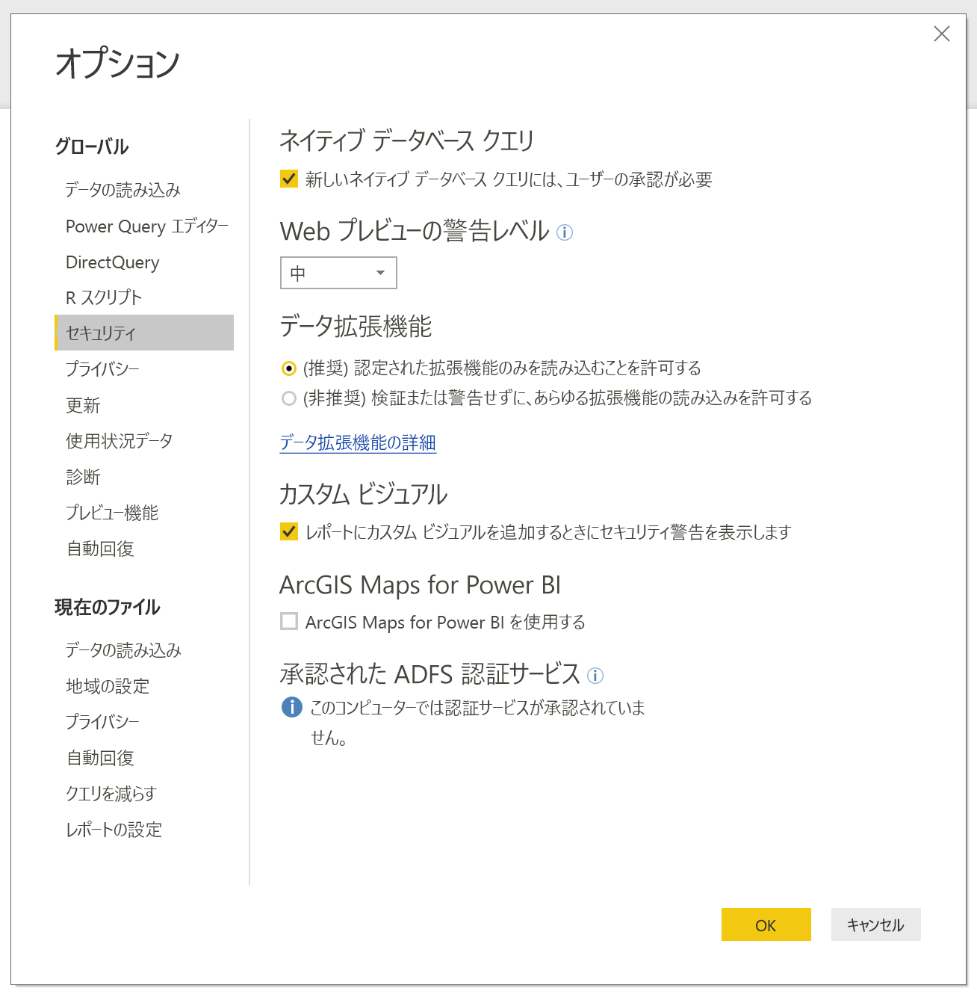
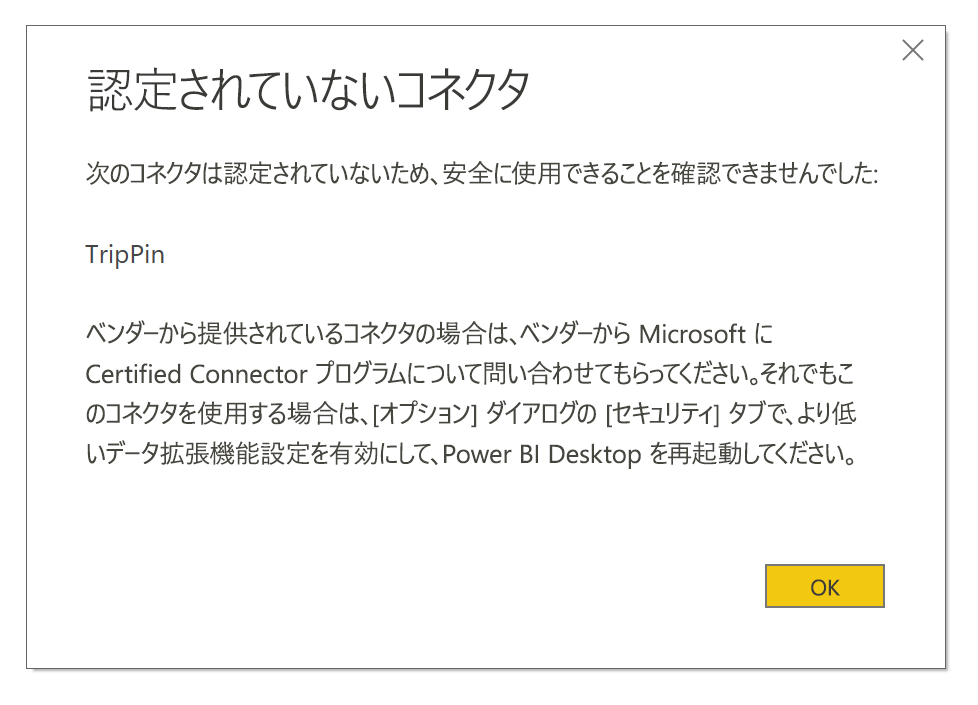

# Power BI でのコネクタの機能拡張

Power BI では、顧客や開発者はデータ ソースを拡張し、それにさまざまな方法でつながることができます。たとえば、既存のコネクタや一般的なデータ ソース (ODBC、OData、Oledb、Web、CSV、XML、JSON) を利用できます。 これらのデータ ソースに加え、開発者は**カスタム コネクタ**と呼ばれているデータ拡張を作成し、コネクタを認定して**認定コネクタ**にすることができます。

現在、**カスタム コネクタ**を使用する機能は機能スイッチを利用して有効にします。 この機能をベータから一般公開に移行する前に、お使いのシステムで実行を許可するカスタム コードのレベルを安全に制御できるメニューを追加しました。あらゆるカスタム コネクタの実行を許可したり、**[データを取得]** ダイアログで Microsoft が認定して配布したコネクタのみの実行を許可したりすることができます。

## カスタム コネクタ

**カスタム コネクタ**では、ビジネスにとって不可欠な小規模 API から、Microsoft がコネクタをリリースしていない大規模な産業固有のサービスまで、さまざまなことができます。 多くのコネクタはベンダー自身によって配布されます。特定のデータ コネクタが必要であれば、ベンダーにご連絡ください。

**カスタム コネクタ**を使用するには、*\[Documents]\\Power BI Desktop\\Custom Connectors* フォルダーにそのコネクタを置き、次のセクションの説明に基づいてセキュリティ設定を調整します。

**認定コネクタ**を使用するためにセキュリティ設定を調整する必要はありません。

## データ拡張機能のセキュリティ

データ拡張機能のセキュリティ設定を変更するには、**Power BI Desktop** で **[ファイル]、[オプションと設定]、[オプション]、[セキュリティ]** の順に選択します。

**[データ拡張機能]** の下では、2 つのセキュリティ レベルから選択できます。

* [(Recommended) Only allow certified extensions to load]\(推奨) 認定されている拡張機能のみ読み込みを許可する\
* [(Not Recommended) Allow any extension to load without warning]\(非推奨) あらゆる拡張機能の読み込みを警告なしで許可する\

**カスタム コネクタ**、あるいは自分かサードパーティが開発して配布したコネクタを使用する予定の場合、**[(Not Recommended) Allow any extension to load without warning]\((非推奨) あらゆる拡張機能の読み込みを警告なしで許可する\)** を選択する必要があります。 カスタム コネクタを全面的に信頼しているのでなければ、このセキュリティ設定はお勧めしません。コードによって資格情報が処理され (たとえば、HTTP 経由で送信されます)、プライバシー レベルが無視されるためです。

**[(推奨)]** セキュリティ設定を選択している場合、お使いのシステムにカスタム コネクタが存在すると、エラーが表示され、セキュリティに基づいてコネクタを読み込めないと説明されます。

エラーを解決し、読み込めないとされたコネクタを使用するには、上記の説明に基づいてセキュリティ設定を **[(非推奨)]** 設定に変更し、**Power BI Desktop** を再起動する必要があります。

## 認定コネクタ

一部の限られたデータ拡張機能は**認定**されており、そのような認定コネクタは **[データを取得]** ダイアログで選択できますが、保守管理とサポートを担当するのはそのコネクタを開発したサードパーティ開発者となります。 Microsoft はこれらのコネクタを配布しますが、パフォーマンスや機能の継続性については責任を負いません。

カスタム コネクタの認定を希望する場合は、dataconnectors@microsoft.com に連絡するようにベンダーにご依頼ください。
