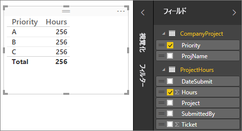
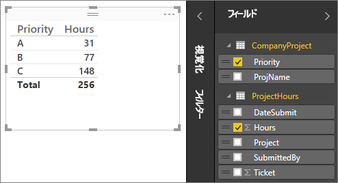
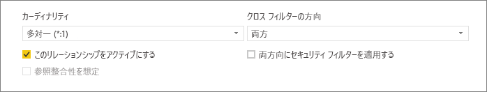
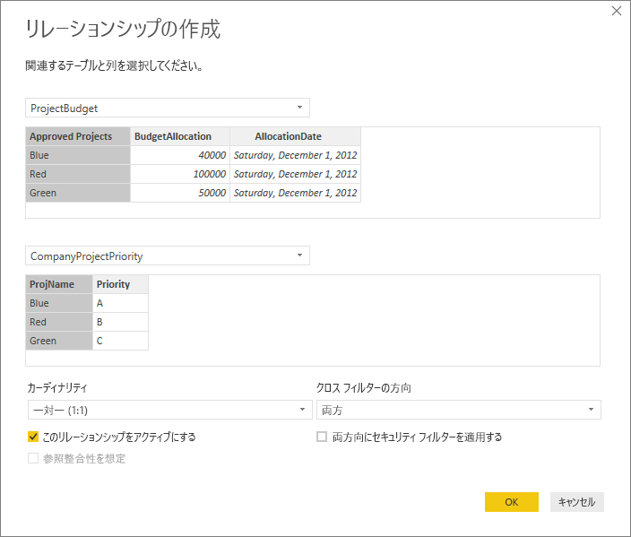
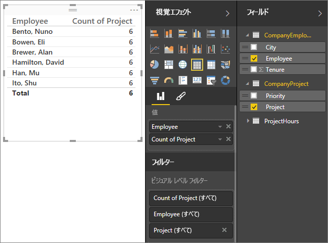
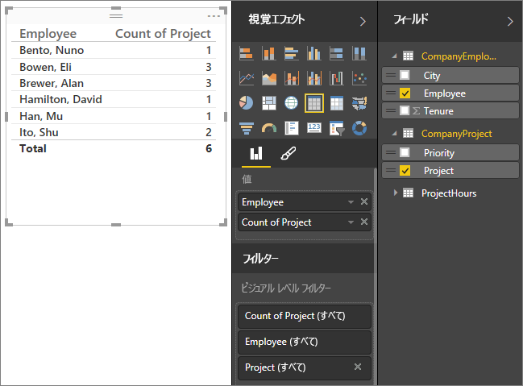
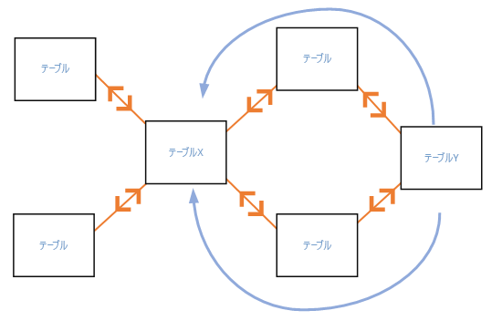
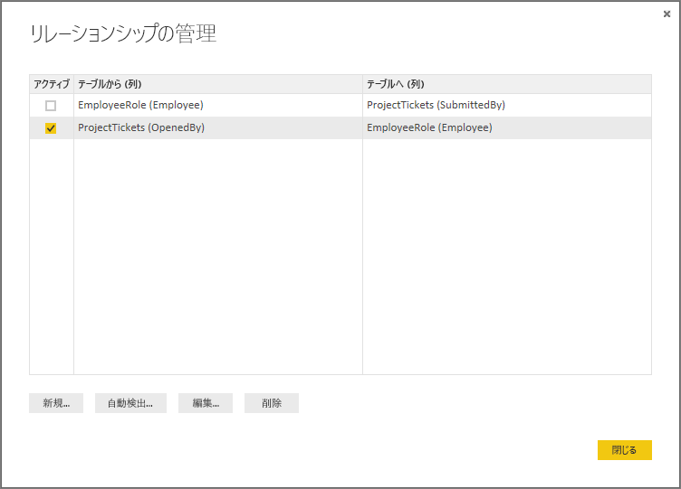
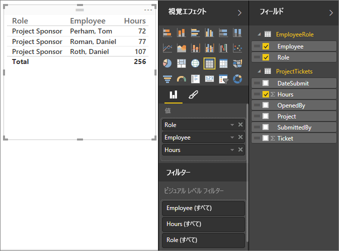
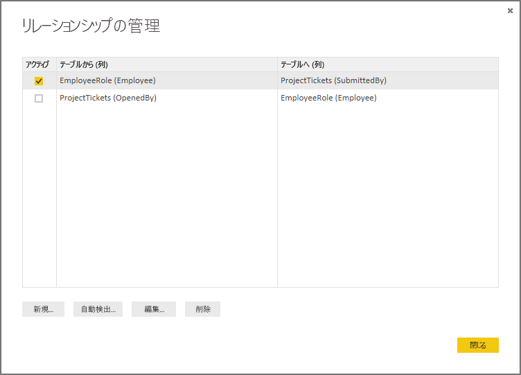

# Power BI Desktop でのリレーションシップの作成と管理
複数のテーブルをインポートする際、これらのすべてのテーブルからデータを使用して分析を実行する可能性が高くなります。 結果を正確に計算し、レポートに正しい情報を表示するためには、これらのテーブル間のリレーションシップが必要です。 Power BI Desktop を使用すると、これらのリレーションシップを簡単に作成できます。 実際、ほとんどの場合、自動検出機能が実行してくれるため、何もすることはありません。 ただし、場合によっては、自分でリレーションシップを作成したり、リレーションシップにいくつかの変更を加えたりすることが必要な場合があります。 いずれの場合も、Power BI Desktop におけるリレーションシップおよびその作成方法と編集方法を理解することが重要です。

## 読み込み中の自動検出
データが読み込まれるときに、同時に複数のテーブルのクエリを実行する場合、Power BI Desktop はリレーションシップの検索および作成を試みます。 カーディナリティ、クロス フィルターの方向、およびアクティブ プロパティが自動的に設定されます。 Power BI Desktop は、潜在的なリレーションシップがあるかどうかを判断するために、クエリを実行しているテーブルの列名を見ます。 そのようなリレーションシップがある場合は、自動的に作成されます。 Power BI Desktop が高いレベルの信頼度で一致するものがあると判断できない場合、リレーションシップは自動的に作成されません。 その場合でも、[リレーションシップの管理] ダイアログ ボックスを使用すれば、リレーションシップを作成または編集できます。

## 自動検出を使用したリレーションシップの作成
**[ホーム]** タブで、**[リレーションシップの管理]**\>**[自動検出]** の順にクリックします。

## 手動でのリレーションシップの作成
1. **[ホーム]** タブで、**[リレーションシップの管理]** \> **[新規]** の順にクリックします。
2. **[リレーションシップの作成]** ダイアログにある最初のテーブルのドロップダウン リストで、テーブルを選んでから、リレーションシップで使用する列を選びます。
3. 2 つ目のテーブルのドロップダウン リストで、リレーションシップに必要なもう一方のテーブルを選択してから、使用する他の列を選択し、 **[OK]** をクリックします。

既定では、Power BI Desktop は新しいリレーションシップのカーディナリティ (の方向)、クロス フィルターの方向、およびアクティブ プロパティを自動的に構成します。ただし、必要に応じて変更することができます。 詳細については、この記事で後述する「詳細設定オプションについて」のセクションを参照してください。

リレーションシップに選択したテーブルに一意の値が含まれるものがない場合、*列の 1 つに一意の値を与える必要がある*旨のエラーが表示されることにご注意ください。 リレーションシップの少なくとも 1 つのテーブルに別個の (一意の) キー値リストが含まれている*必要があります*。これはあらゆるリレーショナル データベース技術における共通の要件です。 

このエラーに遭遇した場合、いくつかの方法で問題を解決できます。

* "重複行の削除" を利用し、一意の値を含む列を作成します。 この手法の短所は、重複行が削除されると情報が失われることです。多くの場合、キー (行) は正当な理由があって複製されます。
* 個別キー値の一覧で構成される中間テーブルをモデルに追加します。このモデルがリレーションシップの両方の元の列にリンクされます。

詳しくは、この[ブログ投稿](https://blogs.technet.microsoft.com/cansql/2016/12/19/relationships-in-power-bi-fixing-one-of-the-columns-must-have-unique-values-error-message/)をご覧ください。この題材について詳しく取り上げています。

## リレーションシップの編集
1. **[ホーム]** タブで、 **[リレーションシップの管理]** をクリックします。
2. **リレーションシップの管理** ダイアログ ボックスで、リレーションシップを選択してから **[編集]** をクリックします。

## 詳細設定オプションの構成
リレーションシップを作成または編集するときは、詳細設定オプションを構成できます。  既定では、詳細設定オプションは最善の推測に基づいて自動的に構成されます。 これは、列内のデータに基づいてリレーションシップごとに異なることがあります。

## カーディナリティ
**多対一 (\*:1)** - 最も一般的な、既定の型です。 つまり、1 つのテーブル内の列は値のインスタンスを複数持つことができ、関連するもう 1 つのテーブル (多くの場合ルックアップ テーブルとして知られる) は値のインスタンスを 1 つだけ持つことができます。

**一対一 (1:1)** - 1 つのテーブル内の列は特定の値のインスタンスを 1 つだけ持ち、関連するもう 1 つのテーブルも特定の値のインスタンスを 1 つだけ持つことを意味します。

カーディナリティを変更するタイミングの詳細については、この記事で後述する「詳細設定オプションについて」を参照してください。

## クロス フィルターの方向
**双方向** – 最も一般的な、既定の方向です。 つまり、フィルター処理の目的で、両方のテーブルが 1 つのテーブルであるかのように扱われます。  これは、周囲に複数のルックアップ テーブルが存在する 1 つのテーブルの場合に、上手く機能します。  一例として、部門のルックアップ テーブルのある販売実績テーブルがあります。  これは多くの場合、スター スキーマ構成 (複数のルックアップ テーブルと 1 つの中心テーブル) と呼ばれます。ただし、複数のルックアップ テーブル (一部は共通) を含むテーブルが 2 つ以上ある場合は、"双方向" の設定を使用したいとは思わないでしょう。  前の例で言えば、この場合、各部門のターゲット予算を記録する予算売上テーブルもあるということです。  そして、部門テーブルが、売上テーブルと予算のテーブルの両方に接続されます。  こうした構成を "双方向" の設定で行うことは避けてください。

**一方向** – 接続されたテーブルでのフィルター処理の選択内容が、値が集約されているテーブルに対して機能することを意味します。 Excel 2013 以前のデータ モデルに Power Pivot をインポートすると、すべてのリレーションシップが一方向になります。 

クロス フィルターの方向を変更するタイミングの詳細については、この記事の後半にある「詳細設定オプションについて」を参照してください。

## このリレーションシップをアクティブにする
チェックした場合、リレーションシップはアクティブな既定のリレーションシップとして機能することを意味します。  2 つのテーブル間に複数のリレーションシップがある場合、両方のテーブルを含む視覚化を Power BI Desktop が自動的に作成するには、アクティブなリレーションシップが使用されます。

特定のリレーションシップをアクティブにするタイミングの詳細については、この記事で後述する「詳細設定オプションについて」を参照してください。

## リレーションシップについて
2 つのテーブルをリレーションシップでつなぐと、両方のテーブルにあるデータを 1 つのテーブルであるかのように操作できます。これにより、リレーションシップの詳細について考慮したり、インポートする前にこれらのテーブルを 1 つのテーブルにフラット化したりする必要がなくなります。  多くの場合、Power BI Desktop は自動的にリレーションシップを作成できるため、自分でこれらのリレーションシップを作成する必要はありません。 ただし、2 つのテーブル間にリレーションシップが存在することがかなり確実であるという場合以外は、Power BI Desktop はリレーションシップを自動的に作成しません。 その場合は、ユーザーがリレーションシップを作成する必要があります。   

Power BI Desktop でのリレーションシップのしくみを分かりやすくするために、少しチュートリアルをしましょう。

>[!TIP]
>このレッスンは自分で完了できます。 下の [ProjectHours] テーブルを Excel ワークシートにコピーし、すべてのセルを選択してから、**[挿入]** \>**[テーブル]** の順にクリックします。 **[テーブルの作成]** ダイアログ ボックスで、 **[OK]** をクリックします。 次に、 **[テーブル名]** に **「ProjectHours」** と入力します。 [CompanyProject] テーブルで同じ操作を行います。 Power BI Desktop の **[データの取得]** を使用して、データをインポートします。 データ ソースとして、ブックとテーブルを選択します。

この最初のテーブル [ProjectHours] は、ある人が特定のプロジェクトで作業した時間数を記録する作業チケットのレコードです。  

**ProjectHours**

| **Ticket** | **SubmittedBy** | **Hours** | **Project** | **DateSubmit** |
| ---:|:--- | ---:|:--- | ---:|
| 1001 |Brewer, Alan |22 |青 |2013 年 1 月 1 日 |
| 1002 |Brewer, Alan |26 |赤 |2013 年 2 月 1 日 |
| 1003 |Ito, Shu |34 |黄 |2012 年 12 月 4 日 |
| 1004 |Brewer, Alan |13 |オレンジ色 |2012 年 1 月 2 日 |
| 1005 |Bowen, Eli |29 |紫 |2013 年 10 月 1 日 |
| 1006 |Bento, Nuno |35 |緑 |2013 年 2 月 1 日 |
| 1007 |Hamilton, David |10 |黄 |2013 年 10 月 1 日 |
| 1008 |Han, Mu |28 |オレンジ色 |2012 年 1 月 2 日 |
| 1009 |Ito, Shu |22 |紫 |2013 年 2 月 1 日 |
| 1010 |Bowen, Eli |28 |緑 |2013 年 10 月 1 日 |
| 1011 |Bowen, Eli |9 |青 |2013 年 10 月 15 日 |

2 番目のテーブル [CompanyProject] は、優先順位 A、B、または C が割り当てられたプロジェクトの一覧です。 

**CompanyProject**

| **ProjName** | **Priority** |
| --- | --- |
| 青 |A |
| 赤 |B |
| 緑 |C |
| 黄 |C |
| 紫 |B |
| オレンジ色 |C |

各テーブルにプロジェクトの列があることに注意してください。 それぞれのテーブルで名前はわずかに異なりますが、値は同じように見えます。 これは重要なことで、少し後でまた考慮します。

2 つのテーブルをモデルにインポートしたので、レポートを作成してみましょう。 最初に取得するものは、プロジェクトの優先度ごとに送信された時間数です。そのため、フィールドから **[優先順位]** と **[時間数]** を選びます。

 

レポート キャンバスでテーブルを見ると、各プロジェクトの時間数が **256.00** で、これが合計でもあることが分かります。 これは明らかに正しくありません。 なぜでしょうか。 理由は、2 つのテーブル間にリレーションシップがない状態では、1 つのテーブル ([プロジェクト] テーブルの [時間数]) を別のテーブル ([CompanyProject] テーブルの [優先順位]) でスライスして値の合計を計算できないためです。

そこで、これら 2 つのテーブル間のリレーションシップを作成しましょう。

両方のテーブルのプロジェクト名が含まれる列を見たとき、値が似ていたことを覚えていますか。 ここでは、これら 2 つの列を使用して、テーブル間のリレーションシップを作成します。

なぜこれらの列なのでしょうか。 [ProjectHours] テーブルの [プロジェクト] 列を見ると、青、赤、黄、オレンジ色などの値があります。 そして、いくつかの行が同じ値を持っていることがわかります。 また、プロジェクトには多数の色の値があります。

[CompanyProject] テーブルの [ProjName] 列を見ると、プロジェクトの色の値ごとに 1 つの色の値だけがあります。 このテーブルの各色の値は一意です。このことは、これら 2 つのテーブル間にリレーションシップを作成できるようになるという点で重要です。 この場合は、多対一リレーションシップです。 多対一のリレーションシップでは、いずれかのテーブルの少なくとも 1 つの列に一意の値が含まれる必要があります。 一部のリレーションシップにはいくつかの詳細設定オプションがあります。これらについては後で説明しますが、ここでは 2 つのテーブルのそれぞれにある [プロジェクト] 列の間にリレーションシップを作成しましょう。

### リレーションシップを新規作成するには
1. **[リレーションシップの管理]** をクリックします。
2. **[リレーションシップの管理]** で、**[新規]** をクリックします。 **[リレーションシップの作成]** ダイアログが開きます。ここで、テーブル、列、リレーションシップのすべての詳細設定を選べます。
3. 最初のテーブルで、 **[ProjectHours]** をクリックしてから、 **[プロジェクト]** 列をクリックします。 これがリレーションシップの "多" 側です。
4. 2 番目のテーブルで、 **[CompanyProject]** をクリックしてから、 **[ProjName]** 列をクリックします。 これがリレーションシップの "一" 側です。  
5. 先に進んで、 **[リレーションシップの作成]** ダイアログ ボックスと **[リレーションシップの管理]** ダイアログ ボックスの両方で **[OK]** をクリックします。

すべてを示すために、ここではリレーションシップを厳密な方法で作成しました。 [リレーションシップの管理] ダイアログ ボックスの [自動検出] ボタンをクリックする方法も考えられました。 実際、両方の列の名前が同じであったとしたら、データが読み込まれるときに自動検出は既に実行されているはずです。 しかし、そこにどのような課題があるのでしょうか。

ここで、もう一度レポート キャンバスで、テーブルを見てみましょう。

 

全体に外観が良くなっていますね。

優先順位ごとに時間数を合計すると、Power BI Desktop は、CompanyProject のルックアップ テーブルで一意の色の値の各インスタンスを探します。その後、CompanyProject テーブルにあるこれらの各値の各インスタンスを探し、一意の値ごとに合計を計算します。

これは非常に簡単でした。実際、自動検出を使用すれば、これらの操作さえ不要な可能性があります。

## 詳細設定オプションについて
自動検出または手動でリレーションシップを作成する場合、Power BI Desktop は、テーブル内のデータに基づいて詳細設定オプションを自動的に構成します。 [リレーションシップの作成] または [リレーションシップの編集] ダイアログ ボックスの最下部で、これらの詳細なリレーションシップ プロパティを構成できます。

 

先ほど述べたとおり、これらの設定は自動的に行われるため、操作の必要はありません。ただし、自分でこれらのオプションを構成する必要が生じる可能性がある状況がいくつかあります。

## データの今後の更新には、異なるカーディナリティが必要になります。
通常、Power BI Desktop は、リレーションシップに最適なカーディナリティを自動的に判断できます。  今後データが変更されることが分かっているため、自動設定をオーバーライドする必要がある場合は、カーディナリティ コントロールで選択することができます。 異なるカーディナリティを選択する必要がある場合の例を見てみましょう。

次の [CompanyProjectPriority] テーブルは、会社のプロジェクトとその優先順位の一覧です。 ProjectBudget テーブルは、予算が承認されたプロジェクトの一式です。

**ProjectBudget**

| **Approved Projects** | **BudgetAllocation** | **AllocationDate** |
|:--- | ---:| ---:|
| 青 |40,000 |2012 年 12 月 1 日 |
| 赤 |100,000 |2012 年 12 月 1 日 |
| 緑 |50,000 |2012 年 12 月 1 日 |

**CompanyProjectPriority**

| **Project** | **Priority** |
| --- | --- |
| 青 |A |
| 赤 |B |
| 緑 |C |
| 黄 |C |
| 紫 |B |
| オレンジ色 |C |

[CompanyProjectPriority] テーブルの [プロジェクト] 列と [ProjectBudget] テーブルの [承認済みプロジェクト] 列の間にリレーションシップを作成すると、次のようになります。

 

カーディナリティは自動的に一対一 (1:1) に設定され、クロス フィルターは "双方向" に設定されます (次に示すとおり)。  これは、Power BI Desktop にとって、2 つのテーブルの最良の組み合わせが次のようになるためです。

| **Project** | **Priority** | **BudgetAllocation** | **AllocationDate** |
|:--- | --- | ---:| ---:|
| 青 |A |40,000 |2012 年 12 月 1 日 |
| 赤 |B |100,000 |2012 年 12 月 1 日 |
| 緑 |C |50,000 |2012 年 12 月 1 日 |
| 黄 |C |  |  |
| 紫 |B |  |  |
| オレンジ色 |C |  |  |

2 つのテーブル間には一対一のリレーションシップがあります。これは、結合したテーブルの [プロジェクト] 列に値の繰り返しがないためです。 [プロジェクト] 列は一意です。これは、各値が 1 回のみ発生するためです。このため、2 つのテーブルの行を重複なしで直接結合することができます。

しかし、次回データを更新すると、データが変更されることが分かっているとしましょう。 更新後の ProjectBudget テーブルには、青と赤の行が追加されています。

**ProjectBudget**

| **Approved Projects** | **BudgetAllocation** | **AllocationDate** |
| --- | ---:| ---:|
| 青 |40,000 |2012 年 12 月 1 日 |
| 赤 |100,000 |2012 年 12 月 1 日 |
| 緑 |50,000 |2012 年 12 月 1 日 |
| 青 |80,000 |2013 年 6 月 1 日 |
| 赤 |90,000 |2013 年 6 月 1 日 |

 これは、2 つのテーブルの最良の組み合わせが次のようになることを意味します。 

| **Project** | **Priority** | **BudgetAllocation** | **AllocationDate** |
| --- | --- | ---:| ---:|
| 青 |A |40,000 |2012 年 12 月 1 日 |
| 赤 |B |100,000 |2012 年 12 月 1 日 |
| 緑 |C |50,000 |2012 年 12 月 1 日 |
| 黄 |C |  |  |
| 紫 |B |  |  |
| オレンジ色 |C |  |  |
| 青 |A |80000 |2013 年 6 月 1 日 |
| 赤 |B |90000 |2013 年 6 月 1 日 |

この結合された新しいテーブルでは、[プロジェクト] 列に値の繰り返しがあります。  テーブルが更新されると、元の 2 つのテーブルに一対一のリレーションシップはなくなります。 この場合、今後の更新によって [プロジェクト] 列に重複が生じることがわかっているため、カーディナリティを多対一 (\*:1) に設定する必要があります。ここで、"多" は ProjectBudget 側で、"一" は CompanyProjectPriority 側です。

## 複雑なテーブルとリレーションシップのセットでクロス フィルターの方向を調整する
ほとんどのリレーションシップでは、クロス フィルターの方向は '双方向' に設定されています。  ただし、一般的な状況ではないものの、この設定を既定とは異なる設定にする必要が生じる可能性がある場合 (古いバージョンの Power Pivot からモデルをインポートする場合など) や、各リレーションシップを一方向に設定する場合も考えられます。 

"双方向" に設定すると、Power BI Desktop は、接続されたテーブルのすべての側面を、1 つのテーブルであるかのように扱えるようになります。  ただし、状況によっては、Power BI Desktop がリレーションシップのクロス フィルターの方向を '双方向' に設定できない場合や、レポートの目的で明確な既定値の一式を使用可能なままにする場合もあります。 リレーションシップのクロス フィルターの方向が "双方向" に設定されていない場合、通常はあいまいさが生じていることが原因です。  既定のクロス フィルターの設定が機能していない場合は、特定のテーブルに対して設定するか、"双方向" に設定してみてください。

一方向のクロス フィルターは、多くの状況で機能します。  実際に、Excel 2013 以前の Power Pivot からモデルをインポートした場合、すべてのリレーションシップは一方向に設定されます。  一方向とは、接続されたテーブルでのフィルター処理の選択内容が、集約作業が発生しているテーブルで機能することを意味します。  クロス フィルター処理を理解することは少し難しいことがあるので、例を見てみましょう。

 

一方向のクロス フィルターを使用すると、プロジェクトの時間をまとめたレポートを作成する場合、[CompanyProject]、[優先順位] または [CompanyEmployee]、[市区町村] でまとめる (またはフィルター処理する) ことができます。   ただし、プロジェクトごとの従業員数をカウントする場合 (あまり一般的なテーマではありません) は機能しません。 すべてが同じ値の列が得られます。  次の例で、両方のリレーションシップのクロス フィルターの方向は、[ProjectHours] テーブルへの一方向に設定されています。

 

(次の図に示すように) フィルター処理の指定では、[CompanyProject] から [CompanyEmployee] へ流れます。しかし、[CompanyEmployee] に向かっては流れません。  ただし、クロス フィルターを双方向に設定すると、流れるようになります。  双方向に設定すると、フィルター処理の指定で [従業員] に向かって流れるように指定できます。

 

クロス フィルターの方向を双方向にすると、レポートが正しく表示されるようになります。

 

上記のパターンのようなテーブルのリレーションシップのパターンでは、双方向のクロス フィルターは適切に機能します。 この最も一般的な呼び方がスター スキーマで、次のようになります。

 

クロス フィルターの方向は、この図のように、データベースによく見られるより一般的なパターンでは適切に機能しません。

 

このようなループがあるテーブルのパターンの場合、クロス フィルターによりあいまいなリレーションシップのセットが作成されます。 たとえば、TableX のフィールドを合計してから、TableY のフィールドでフィルター処理する場合、フィルター処理が上のテーブルを通るのか、下のテーブルを通るのか、どのように進むかが明確ではありません。 この種のパターンの一般的な例は、TableX を実際のデータを含む Sales テーブルとして使用し、TableY を予算のデータに使用するというものです。 次に、中央のテーブルは、部門や地域など、両方のテーブルが使用するルックアップ テーブルです。 

アクティブまたは非アクティブなリレーションシップのように、レポートであいまいさが生じる場合、Power BI Desktop はリレーションシップを双方向に設定することを許可しません。 これに対処できる方法はいくつかあります。最も一般的な 2 つの方法は次のとおりです。

* あいまいさを減らすため、リレーションシップを削除するか、非アクティブとしてマークする。 その後、リレーションシップのクロス フィルターを双方向に設定できる場合があります。
* ループをなくすために、テーブルを 2 回指定する (2 回目は異なる名前で)。  これにより、リレーションシップのパターンがスター スキーマのようになります。  スター スキーマでは、すべてのリレーションシップを双方向に設定できます。

## 正しくないアクティブなリレーションシップ
Power BI Desktop が自動的にリレーションシップを作成する際、2 つのテーブル間に複数のリレーションシップが作成される場合があります。  このような場合、1 つのリレーションシップだけがアクティブに設定されます。  アクティブなリレーションシップは、既定のリレーションシップとして機能します。それにより、2 つの異なるテーブルからフィールドを選択する際、Power BI Desktop が自動的に視覚化を作成できるようになります。  ただし、場合によっては、自動的に選択したリレーションシップが正しくないことがあります。  [リレーションシップの管理] ダイアログ ボックスを使用すると、リレーションシップをアクティブまたは非アクティブに設定することができます。または、[リレーションシップの編集] ダイアログ ボックスでアクティブなリレーションシップを設定することができます。 

既定のリレーションシップが確実にあるようにするため、Power BI Desktop は、特定の時点で 2 つのテーブル間にアクティブなリレーションシップを 1 つだけ許可します。  したがって、まず、現在のリレーションシップを非アクティブにしてから、アクティブにするリレーションシップを設定する必要があります。

例を見てみましょう。 この最初のテーブルは [ProjectTickets] で、次のテーブルは [EmployeeRole] です。

**ProjectTickets**

| **Ticket** | **OpenedBy** | **SubmittedBy** | **Hours** | **Project** | **DateSubmit** |
| ---:|:--- |:--- | ---:|:--- | ---:|
| 1001 |Perham, Tom |Brewer, Alan |22 |青 |2013 年 1 月 1 日 |
| 1002 |Roman, Daniel |Brewer, Alan |26 |赤 |2013 年 2 月 1 日 |
| 1003 |Roth, Daniel |Ito, Shu |34 |黄 |2012 年 12 月 4 日 |
| 1004 |Perham, Tom |Brewer, Alan |13 |オレンジ色 |2012 年 1 月 2 日 |
| 1005 |Roman, Daniel |Bowen, Eli |29 |紫 |2013 年 10 月 1 日 |
| 1006 |Roth, Daniel |Bento, Nuno |35 |緑 |2013 年 2 月 1 日 |
| 1007 |Roth, Daniel |Hamilton, David |10 |黄 |2013 年 10 月 1 日 |
| 1008 |Perham, Tom |Han, Mu |28 |オレンジ色 |2012 年 1 月 2 日 |
| 1009 |Roman, Daniel |Ito, Shu |22 |紫 |2013 年 2 月 1 日 |
| 1010 |Roth, Daniel |Bowen, Eli |28 |緑 |2013 年 10 月 1 日 |
| 1011 |Perham, Tom |Bowen, Eli |9 |青 |2013 年 10 月 15 日 |

**EmployeeRole**

| **Employee** | **ロール** |
| --- | --- |
| Bento, Nuno |プロジェクト マネージャー |
| Bowen, Eli |プロジェクト リーダー |
| Brewer, Alan |プロジェクト マネージャー |
| Hamilton, David |プロジェクト リーダー |
| Han, Mu |プロジェクト リーダー |
| Ito, Shu |プロジェクト リーダー |
| Perham, Tom |プロジェクト スポンサー |
| Roman, Daniel |プロジェクト スポンサー |
| Roth, Daniel |プロジェクト スポンサー |

ここには 2 つのリレーションシップが存在しています。 1 つは [ProjectTickets] テーブルの [SubmittedBy] と [EmployeeRole] テーブルの [Employee] の間のリレーションシップ、もう 1 つは [ProjectTickets] テーブルの [OpenedBy] と [EmployeeRole] テーブルの [Employee] の間のリレーションシップです。

 

モデルに両方のリレーションシップを追加する場合 (OpenedBy が先) 、[リレーションシップの管理] ダイアログ ボックスに、OpenedBy がアクティブであることが表示されます。

 

ここで、レポート キャンバスのテーブルの視覚化にある [EmployeeRole] の [ロール] フィールドと [従業員] フィールド、[ProjectTickets] の [時間数] フィールドを使用してレポートを作成すると、プロジェクト スポンサーのみが表示されます。これは、プロジェクト チケットを開いたのがプロジェクト スポンサーのみであるためです。

 

アクティブなリレーションシップを変更して、OpenedBy ではなく SubmittedBy を取得することができます。 [リレーションシップの管理] で、ProjectTickets(OpenedBy) から EmployeeRole(Employee) へのリレーションシップをオフにします。続いて、Project Tickets(SubmittedBy) から EmployeeRole(Employee) へのリレーションシップをオンにします。

## リレーションシップ ビューで、すべてのリレーションシップを参照してください。
場合によっては、モデルに複数のテーブルがあり、それらのテーブル間に複雑なリレーションシップが含まれることがあります。 Power BI Desktop のリレーションシップ ビューでは、モデル内のすべてのリレーションシップ、その方向、カーディナリティが、分かりやすくカスタマイズ可能なダイアグラムに表示されます。 詳細については、「[Power BI Desktop のリレーションシップ ビュー](desktop-relationship-view.md)」をご覧ください。

