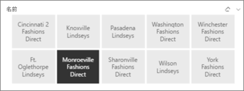
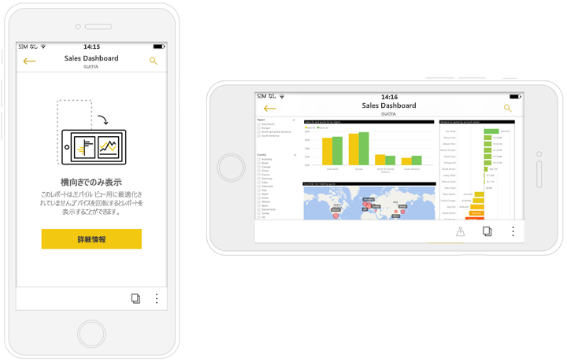

# Power BI 電話アプリに最適化されたレポートを作成する
電話専用のレポートのバージョンを作成して、モバイル アプリで電話のレポートの表示エクスペリエンスを向上させることができます。 Power BI Desktop および Power BI サービスで、ビジュアルを再配置およびサイズ変更し、それらのすべてを含めないようにするなど、最適な操作性のために、レポートを電話に適応させます。 さらに、電話上で適切にサイズ変更されて表示される[*レスポンシブ* ビジュアル](#optimize-a-visual-for-any-size)と[レスポンシブ スライサー](#enhance-slicers-to-to-work-well-in-phone-reports)を作成することもできます。 また、レポートにフィルターを追加した場合、これらのフィルターが電話レポートに自動的に表示されます。 レポートの読者は、それを使ってレポートをフィルター処理することができます。

## 電話用のレポート ページをレイアウトする

レポートを作成したら、電話用にそれを最適化することができます。

1. Power BI Desktop のレポート ビューにある **[表示]** タブで、**[電話レイアウト]** を選択します。  
   
    ![[電話レイアウト] アイコン](media/desktop-create-phone-report/desktop-create-phone-report-3.png)
   
    Power BI サービスで、**[レポートの編集]** > **[モバイル レイアウト]** を選択します。

    空の電話キャンバスが表示されます。 元のレポート ページのすべてのビジュアルが、右側の [視覚化] ウィンドウに表示されます。

3. 電話レイアウトにビジュアルを追加するには、それを [視覚化] ウィンドウから電話キャンバスにドラッグします。
   
    電話レポートは、グリッド レイアウトを使用します。 ビジュアルをモバイル キャンバスにドラッグすると、そのグリッドにスナップされます。
   
    
   
    マスター レポート ページの一部またはすべてのビジュアルを電話レポート ページに追加できます。 各ビジュアルは 1 回だけ追加することができます。

4. ダッシュボードやモバイル ダッシュボード上のタイルの場合と同様に、グリッド上のビジュアルのサイズを変更できます。
   
   電話レポートのグリッドは、小さい画面の電話でも大きい画面の電話でもレポートがよく見えるように、さまざまなサイズの電話でスケールされます。
   
   

## ビジュアルのサイズを最適化する
ダッシュ ボードまたはレポート内のビジュアルを "*レスポンシブ*" に設定することができます。これにより、ビジュアルは画面のサイズに関係なく、最大量のデータとインサイトを表示できるように動的に変化します。 

ビジュアルがサイズを変更するとき、Power BI はデータ ビューを優先します (たとえば、自動的に余白を削除し凡例をビジュアルの上部に移動します)。これにより、ビジュアルは小さくなっても引き続き有益な情報を提供できます。

ビジュアルごとに応答性を有効にするかどうかを選択します。 詳細については、[ビジュアルの最適化](visuals/desktop-create-responsive-visuals.md)に関するページをご覧ください。

## 電話レイアウトまたはレポート レイアウトを作成する場合の注意事項
* 複数ページのレポートの場合、すべてのページまたは数ページだけを最適化できます。 
* レポート ページの背景色を定義した場合、電話レポートに同じ背景色が設定されます。
* 電話用だけの書式設定を変更することはできません。 書式設定は、マスターとモバイルのレイアウトで一貫しています。 たとえば、フォント サイズは同じになります。
* 書式設定、データセット、フィルター、またはその他の属性の変更など、ビジュアルを変更するには、通常のレポート作成モードに戻ります。
* Power BI は、モバイル アプリの電話レポートに対して既定のタイトルとページ名を指定します。 レポートでタイトルとページ名のテキスト ビジュアルを作成していた場合は、それらを電話レポートに追加しないことを検討してください。     

## 電話レイアウトからのビジュアルの削除
* ビジュアルを削除するには、電話キャンバス上のビジュアルの右上にある [X] をクリックするか、またはビジュアルを選択して、**Delete** キーを押します。
  
   このビジュアルの削除では、電話レイアウト キャンバスからビジュアルが削除されるだけです。 ビジュアルとレポートは影響を受けません。
  
   

## 電話レポートで適切に機能するようにスライサーを拡張する
スライサーは、レポート データのキャンバス上のフィルター処理を行います。 通常のレポートの作成モードでスライサーを設計する場合、電話レポートそれらを使いやすくするために、いくつかのスライサー設定を変更できます。

* レポートの閲覧者が、1 つだけの項目を選択できるか、または複数選択できるかを決定します。
* レポートをスキャンしやすくなるように、スライサーの周りにボックスを配置します。
* スライサーを垂直、水平、または*レスポンシブ*にします。 

スライサーをレスポンシブにすると、スライサーのサイズとシェイプの変更に応じて表示されるオプションの数が増減します。 高さを変えたり、幅を変えたりできます。 非常に小さくすると、レポート ページにフィルターのアイコンだけが表示されるようになります。 

詳細については、[レスポンシブ スライサーの作成](power-bi-slicer-filter-responsive.md)に関するページをお読みください。

## 電話レポートの発行
* レポートの電話バージョンを発行するには、[Power BI Desktop から Power BI サービスにメイン レポートを発行](desktop-upload-desktop-files.md)し、同時に電話バージョンを発行します。
  
    詳しくは、[Power BI での共有およびアクセス許可](service-how-to-collaborate-distribute-dashboards-reports.md)に関するページを参照してください。

## 電話で最適化されたレポートと最適化されていないレポートを表示する
電話のモバイル アプリの Power BI は、最適化された電話レポートと最適化されていない電話レポートを自動的に検出します。 電話用に最適化されたレポートが存在する場合、Power BI の電話アプリは自動的に電話レポート モードでレポートを開きます。

電話用に最適化されたレポートが存在しない場合は、最適化されていない横長ビューでレポートが開きます。  

電話レポートで、電話の向きを横長に変更すると、レポートを最適化しているかどうかに関係なく、元のレポート レイアウトの最適化されていないビューでレポートが開きます。

一部のページのみを最適化している場合、縦長ビューに、レポートを横長で使用できることを示すメッセージが表示されます。

レポート閲覧者は、電話を横向きにして、横長モードでページを表示できます。 詳しくは、[電話用に最適化された Power BI レポートとの対話](consumer/mobile/mobile-apps-view-phone-report.md)に関するページを参照してください。

## 次の手順
* [Power BI でダッシュボードの Phone ビューを作成する](service-create-dashboard-mobile-phone-view.md)
* [電話用に最適化された Power BI レポートを表示する](consumer/mobile/mobile-apps-view-phone-report.md)
* [任意のサイズに最適化されるレスポンシブ ビジュアルを作成する](visuals/desktop-create-responsive-visuals.md)
* 他にわからないことがある場合は、 [Power BI コミュニティで質問してみてください](http://community.powerbi.com/)。

