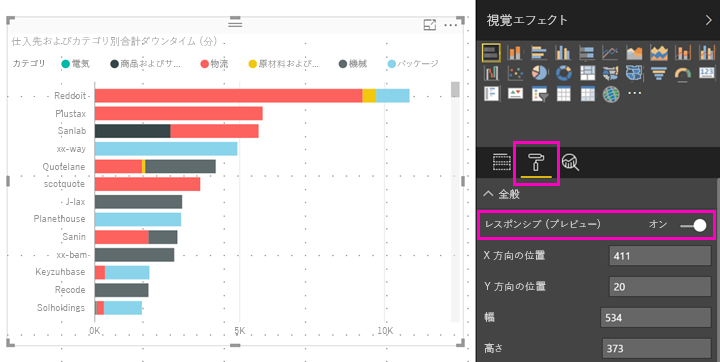

# Power BI のビジュアルのサイズを最適化する
既定では、新しく作成したレポートのビジュアルは "*レスポンシブ*" になります。ビジュアルは画面のサイズに関係なく、最大量のデータとインサイトを表示できるように動的に変化します。 古いレポートのビジュアルも、動的にサイズが変わるように設定できます。

ビジュアルがサイズを変更するとき、Power BI はデータ ビューを優先します (たとえば、自動的に余白を削除し凡例をビジュアルの上部に移動します)。これにより、ビジュアルは小さくなっても引き続き有益な情報を提供できます。 電話の Power BI モバイル アプリのビジュアルでは、応答性が特に役立ちます。

X 軸と Y 軸のあるすべてのビジュアルおよびスライサーは、レスポンシブにサイズを変更できます。

## Power BI Desktop で応答性をオンにする
1. Power BI Desktop の古いレポートの **[表示]** タブで、**[デスクトップ レイアウト]** になっていることを確認します。
   
    ![[デスクトップ レイアウト] アイコン](media/desktop-create-responsive-visuals/power-bi-desktop-layout.png)
2. ビジュアルを選択し、**[視覚エフェクト]** ウィンドウで **[書式]** セクションを選択します。
3. **[全般]** を展開し、**[レスポンシブ]** を **[オン]** にスライドさせます。
   
    
   
     これで、[電話用に最適化したレポートを作成](desktop-create-phone-report.md)し、このビジュアルを追加すると、ビジュアルのサイズが適切に変化します。

## Power BI サービスの応答性をオンにする
Power BI サービスの古いレポートのビジュアルを応答性にすることができます。 レポートを編集できるようにする必要があります。

1. Power BI サービス ([https://powerbi.com](https://powerbi.com)) のレポートで、**[レポートの編集]** を選択します。
2. ビジュアルを選択し、**[視覚エフェクト]** ウィンドウで **[書式]** セクションを選択します。
3. **[全般]** を展開し、**[レスポンシブ]** を **[オン]** にスライドさせます。
   
    
   
     これで、[このレポートの電話ビューを作成](desktop-create-phone-report.md)し、このビジュアルを追加すると、ビジュアルのサイズが適切に変化します。

## 次の手順
* [Power BI 電話アプリ用に最適化したレポートを作成する](desktop-create-phone-report.md)
* [電話用に最適化された Power BI レポートを表示する](mobile-apps-view-phone-report.md)
* 他にわからないことがある場合は、 [Power BI コミュニティで質問してみてください](http://community.powerbi.com/)。

