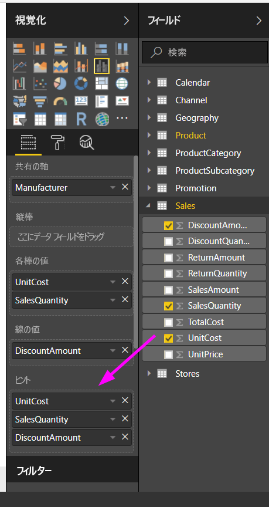
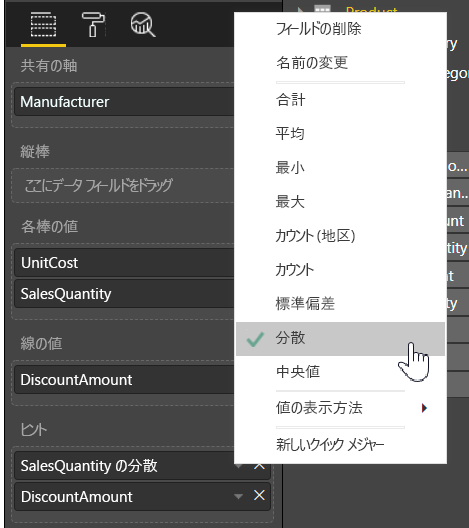

# Power BI Desktop でのヒントのカスタマイズ
ヒントにより、ビジュアル上のデータ ポイントのコンテキスト情報と詳細を、洗練された方法で提供できます。 次の図は、Power BI Desktop のグラフに適用されたヒントを示しています。

視覚エフェクトが作成されると、既定のヒントに、データ ポイントの値とカテゴリが表示されます。 ヒント情報をカスタマイズできると便利な例は多数あります。また、カスタマイズすることで、ビジュアルを表示しているユーザーに、追加のコンテキストと情報が提供されます。 カスタム ヒントを使用すると、ヒントの一部として表示する追加のデータ ポイントを指定できます。

## ヒントをカスタマイズする方法
カスタマイズされたヒントを作成するには、次の図に示すように、**[視覚化]** ウィンドウの **[フィールド]** ウェルで、フィールドを **[ヒント]** バケットにドラッグするだけです。 次の図では、2 つのフィールドが **[ヒント]** バケットに配置されています。

ヒントがフィールド ウェルに追加されると、視覚エフェクトのデータ ポイントにポインターを合わせたときに、そのフィールドの値がヒントに表示されます。

## 集計または簡単な計算でのヒントのカスタマイズ
ヒントをさらにカスタマイズするには、**[ヒント]** バケットのフィールドの横にある矢印を使用して集計関数または *[簡単な計算]* を選択し、使用可能なオプションを選択します。

データセットで使用できるフィールドを使って**ヒント**をカスタマイズし、ダッシュボードやレポートを閲覧しているユーザーに情報と洞察をすばやく伝える方法は多数あります。

