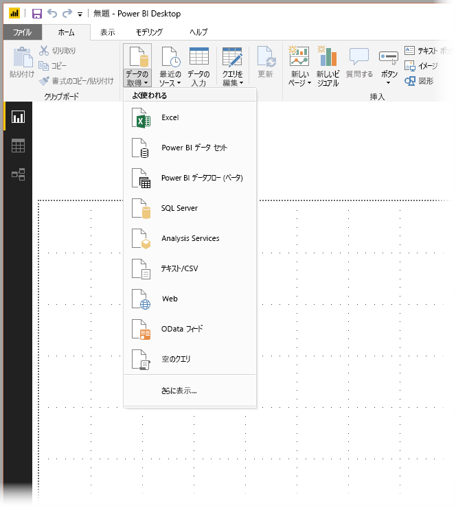
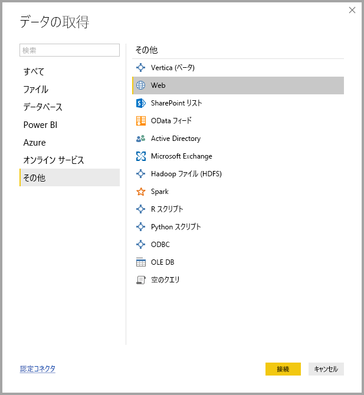

# Power BI Desktop のデータ ソース
Power BI Desktop を使用すると、多種多様なソースからデータに接続できます。 使用できるデータ ソースの完全な一覧は、このページの下部にあります。

データに接続するには、 **[ホーム]** リボンの **[データの取得]** を選択します。 下向きの矢印を選択するか、ボタン上の **[データの取得]** テキストを選択すると、次の画像に示されているように **[最も一般的]** なデータ型が記載されたメニューが表示されます。

**[その他]** を **[最も一般的]** メニューから選択すると、**[データの取得]** ウィンドウが表示されます。 **[データの取得]** ウィンドウを表示する場合 ( **[最も一般的]** メニューをバイパスします)、 **[データの取得]** **アイコン ボタン** を直接選択することもできます。

![[データの取得] ボタン](media/desktop-data-sources/data-sources_02.png)

> [!NOTE]
> Power BI チームは **Power BI Desktop** や **Power BI サービス**で利用できるデータ ソースを継続的に拡張しています。 そのため、*ベータ*や*プレビュー*などのマークが付いた、未完成の早期バージョンのデータ ソースが頻繁に公開されています。 データ ソースに*ベータ*や*プレビュー*などのマークが付いている場合、サポートや機能が限定されています。運用環境では利用しないでください。
> 
> 

## データ ソース
データ型は、次のカテゴリに分類されます。

* すべて
* ファイル
* データベース
* する
* アジュール
* オンライン サービス
* その他

**[すべて]** カテゴリには、すべてのカテゴリにあるすべてのデータ接続の種類が含まれます。

**[ファイル]** カテゴリには、次のデータ接続があります。

* Excel
* TEXT/CSV
* XML
* JSON
* フォルダー
* PDF (ベータ)
* SharePoint フォルダー

次の図は、 **[ファイル]** の **[データの取得]** ウィンドウを示しています。

![[データの取得] > [ファイル]](media/desktop-data-sources/data-sources_03.png)

**[データベース]** カテゴリには、次のデータ接続があります。

* SQL Server データベース
* Access データベース
* SQL Server Analysis Services
* Oracle データベース
* IBM DB2 データベース
* IBM Informix データベース (Beta)
* IBM Netezza
* MySQL データベース
* PostgreSQL データベース
* Sybase データベース
* Teradata データベース
* SAP HANA データベース
* SAP Business Warehouse Application サーバー
* SAP Business Warehouse メッセージ サーバー (Beta)
* Amazon Redshift
* Impala
* Google BigQuery
* Snowflake
* Exasol (ベータ)
* Jethro (ベータ)

> [!NOTE]
> 一部のデータベース コネクタの場合、有効にするためには、**[ファイル]、[オプションと設定]、[オプション]** の順に選択し、**[プレビュー機能]** を選択し、コネクタを有効にする必要があります。 前途コネクタの一部が表示されず、その中に使用したいコネクタも含まれている場合は、**[プレビュー機能]** を確認してください。 データ ソースに*ベータ*や*プレビュー*などのマークが付いている場合、サポートや機能が限定されていることにもご注意ください。運用環境では利用しないでください。
> 
> 

次の図は、 **[データベース]** の **[データの取得]** ウィンドウを示しています。

![[データの取得] > [データベース]](media/desktop-data-sources/data-sources_04.png)

**[Power BI]** カテゴリには、次のデータ接続があります。

* Power BI データ セット
* Power BI データフロー (ベータ)

次の図は、**[Power BI]** の **[データの取得]** ウィンドウを示しています。

![[データの取得] > [Power BI]](media/desktop-data-sources/data-sources_05.png)

**[Azure]** カテゴリには、次のデータ接続があります。

* Azure SQL Database
* Azure SQL Data Warehouse
* Azure Analysis Services データベース
* Azure BLOB ストレージ
* Azure テーブル ストレージ
* Azure Cosmos DB (ベータ版)
* Azure Data Lake Store
* Azure HDInsight (HDFS)
* Azure HDInsight Spark
* HDInsight 対話型クエリ (Beta)
* Azure KustoDB (Beta)

次の図は、 **[Azure]** の **[データの取得]** ウィンドウを示しています。

![[データの取得] > [Azure]](media/desktop-data-sources/data-sources_06.png)

**[オンライン サービス]** カテゴリには、次のデータ接続があります。

* SharePoint Online リスト
* Microsoft Exchange Online
* Dynamics 365 (オンライン)
* Dynamics NAV (Beta)
* Dynamics 365 Business Central
* アプリ用 Common Data Service (Beta)
* Common Data Service (Beta)
* Microsoft Azure Consumption Insights (Beta)
* Visual Studio Team Services (Beta)
* Salesforce オブジェクト
* Salesforce レポート
* Google アナリティクス
* Adobe Analytics
* appFigures (Beta)
* comScore Digital Analytix (Beta)
* Dynamics 365 for Customer Insights (ベータ)
* Data.World - データセットの取得 (Beta)
* Facebook
* GitHub (Beta)
* MailChimp (Beta)
* Marketo (Beta)
* Mixpanel (Beta)
* Planview Enterprise One - PRM (Beta)
* Planview Projectplace (Beta)
* QuickBooks Online (Beta)
* Smartsheet
* SparkPost (Beta)
* Stripe (Beta)
* SweetIQ (Beta)
* Planview Enterprise One - CMT (Beta)
* Twilio (Beta)
* tyGraph (Beta)
* Webtrends (Beta)
* Zendesk (Beta)
* TeamDesk (Beta)

次の図は、**[オンライン サービス]** の **[データの取得]** ウィンドウを示しています。

![[データの取得] > [オンライン サービス]](media/desktop-data-sources/data-sources_07.png)

**[その他]** カテゴリには、次のデータ接続があります。

* Vertica (Beta)
* Web
* SharePoint リスト
* OData フィード
* Active Directory
* Microsoft Exchange
* Hadoop ファイル (HDFS)
* Spark
* R スクリプト
* Python スクリプト
* ODBC
* OLE DB
* 空のクエリ

次の図は、 **[その他]** の **[データの取得]** ウィンドウを示しています。

![[データの取得] > [その他]](media/desktop-data-sources/data-sources_08.png)

> [!NOTE]
> 現時点では、Azure Active Directory を使用して保護されているカスタム データ ソースに接続することはできません。
> 
> 

## データ ソースへの接続
データ ソースに接続するには、 **[データの取得]** ウィンドウでデータ ソースを選択し、 **[接続]** を選びます。 次の図の場合、 **[その他]** データ接続カテゴリで **[Web]** が選択されています。

対象のデータ接続に固有の接続ウィンドウが表示されます。 資格情報が必要な場合には、入力を求めるプロンプトが表示されます。 次の図には、Web データ ソースに接続するために URL を入力している様子が示されています。

URL またはリソースの接続情報を入力したら、 **[OK]** を選択します。 Power BI Desktop はデータ ソースに接続し、 **[ナビゲーター]** に利用可能なデータ ソースが示されます。

![[ナビゲーター] 画面](media/desktop-data-sources/datasources_fromnavigatordialog.png)

**[ナビゲーター]** ウィンドウの下部にある **[読み込み]** ボタンを選択してデータを読み込むか、 **[編集]** ボタンを選択してクエリを編集してからデータを読み込みます。

これで、Power BI Desktop でデータ ソースに接続できます。 データ ソースの一覧は拡大を続けており、ここからデータへの接続をお試しください。一覧への追加は絶えず続いているため、頻繁にご確認ください。

## 次の手順
Power BI Desktop を使用すると、さまざまなことを行えます。 そのような機能について詳しくは、次のリソースをご覧ください。

* [Power BI Desktop とは何ですか?](desktop-what-is-desktop.md)
* [Power BI Desktop でのクエリの概要](desktop-query-overview.md)
* [Power BI Desktop でのデータ型](desktop-data-types.md)
* [Power BI Desktop でのデータの整形と結合](desktop-shape-and-combine-data.md)
* [Power BI Desktop での一般的なクエリ タスク](desktop-common-query-tasks.md)    
