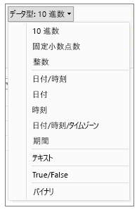
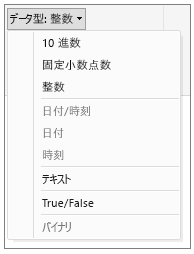

# Power BI Desktop でのデータ型
この記事では、Power BI Desktop と Data Analysis Expressions (DAX) でサポートされるデータ型について説明します。 

Power BI Desktop にデータを読み込むと、ソース列のデータ型は、ストレージへの効率的な格納、計算、データの視覚化をより適切にサポートできるデータ型に変換されます。 たとえば、Excel からインポートする値の列に小数部の値が含まれない場合は、Power BI Desktop により、そのデータの列全体が整数を格納するのに適した整数データ型に変換されます。

一部の DAX 関数はデータ型について特別な要件を持つため、どのデータ型に変換されるかは重要です。 多くの場合、DAX によってデータ型が暗黙的に変換されますが、データ型が変換されない場合もあります。  たとえば、日付データ型が必要な DAX 関数に対して、列のデータ型がテキストであると、DAX 関数は正しく機能しません。  そのため、列に適切なデータ型が設定されることは、重要であり、便利です。 暗黙的な変換については、この記事の後半で説明します。

## 列のデータ型を決定および指定する
Power BI Desktop では、列のデータ型を、クエリ エディターで、あるいはデータ ビューまたはレポート ビューで確認し、指定できます。

**クエリ エディターのデータ型**

**データ ビューまたはレポート ビューのデータ型**

クエリ エディターの [データ型] ドロップダウンには、現時点でデータ ビューまたはレポート ビューに存在しない 2 つのデータ型である **日付/時刻/タイムゾーン** と **期間**が含まれています。 これらのデータ型の列をモデルに読み込んでデータ ビューまたはレポート ビューで表示すると、日付/時刻/タイムゾーンデータ型の列は日付/時刻に変換され、期間データ型の列は 10 進数に変換されます。

### 数値型
Power BI Desktop では、次の 3 つの数値型がサポートされています。

**10 進数** – 64 ビット (8 バイト) の浮動小数点数を表します。 これは最も一般的な数値型で、数値として通常想定される数に対応します。  小数部の値を持つ数値を処理するように設計されていますが、整数を処理することもできます。  10 進数型で処理できる値は、負の値 -1.79E +308 から -2.23E -308 までと、0 と、正の値 2.23E -308 から 1.79E +308 までです。 たとえば、34、34.01、34.000367063 などの数値は、10 進数として有効です。 10 進数型で表現できる最も大きい値の長さは 15 桁です。  小数点区切り文字は、数値内の任意の位置に置くことができます。 10 進数型は、Excel で数値を格納する方法に対応しています。

**固定小数点** – 小数点区切り文字の位置は固定されています。 小数点区切り文字の右側には常に 4 桁の数字が入り、有効数字は最大 19 桁です。  表現できる最も大きい値は 922,337,203,685,477.5807 (正または負) です。  固定小数点数型では、丸め処理を行うと誤差が出てしまう場合に便利です。  小さい小数部の値を持つたくさんの数値を計算していると、そのような小数部が累積して数値が少しずれることがあります。  小数点区切り文字の右側 4 桁より小さい値は切り捨てられるため、固定小数点数型は、その種の誤差を回避するために役立ちます。   SQL Server に慣れているなら、このデータ型は Decimal (19,4) に相当します。また、Power Pivot では通貨データ型に相当します。 

**整数** – 64 ビット (8 バイト) の整数値を表します。 これは、整数なので、小数点の右側に桁はありません。 19 桁まで可能です。-9,223,372,036,854,775,808 (-2^63) から 9,223,372,036,854,775,807 (2^63-1) までの正または負の整数を格納できます。  各種の数値データ型の中で、最大の数値を表現できます。  固定小数点数型と同じように、丸め処理を制御する必要がある場合に整数型が便利です。 

### 日付/時刻型
Power BI Desktop では、クエリ ビューでは 5 つの日付/時刻型、レポート ビューとモデルでは 3 つの日付/時刻データ型がサポートされます。   日付/時刻/タイムゾーンと期間は、モデルに読み込まれる時点で変換されます。

**日付/時刻** – 日付と時刻の両方の値を表します。  背後の実際の値では、日付/時刻値は 10 進数型として保存されます。  そのため、実際にはこの 2 つの間で変換できます。   日付値の時刻部分は、1/300 秒 (3.33 ミリ秒) の整数倍の分数として保存されます。  1900 年から 9999 年までの日付がサポートされます。

**日付** – 日付だけを表します (時刻部分はありません)。  モデルに変換される際、日付値は日付/時刻値の分数部分に 0 が入った値と同じになります。

**時刻** – 時刻だけを表します (日付部分はありません)。  モデルに変換される際、時刻値は 日付/時刻値の小数点の左側に桁がない値と同じになります。

**日付/時刻/タイムゾーン** – UTC 日付/時刻を表します。  現時点では、モデルに読み込まれる際に日付/時刻に変換されます。

**期間** – 時間の長さを表します。 モデルに読み込まれる際に 10 進数型に変換されます。  10 進数型であれば、日付/時刻フィールドと加算または減算を行ったとき、正しい結果が得られます。  10 進数型であれば、視覚化のときに大きさを示すために使用しやすくなります。

### テキスト型
**テキスト** - Unicode 文字のデータ文字列です。 テキスト形式で表現した文字列、数値、または日付を格納できます。 文字列の最大長は 268,435,456 Unicode 文字 (256 メガ文字) または 536,870,912 バイトです。

### True/False 型
**True/False** – True または False のどちらかの値を示すブール値。

### 空白または null 値型
**Blank** - SQL の null を表し、null と置き換わる DAX データ型です。 [BLANK](http://msdn.microsoft.com/library/ee634820.aspx) 関数を使用すると、空白を作成できます。空白かどうかをテストするには、[ISBLANK](https://msdn.microsoft.com/library/ee634204.aspx) 論理関数を使用します。

### テーブル データ型
DAX では、集計やタイム インテリジェンス計算など、多くの関数でテーブル データ型を使用します。 一部の関数は、テーブルへの参照を必要とします。また、関数からテーブルが返され、そのテーブルを他の関数への入力として使用できる場合もあります。 入力としてテーブルを必要とするいくつかの関数では、テーブルに評価される式を指定できます。また、ベース テーブルへの参照を必要とする関数もあります。 特定の関数の要件については、「[DAX 関数リファレンス](https://msdn.microsoft.com/library/ee634396.aspx)」をご覧ください。

## DAX 数式で暗黙的および明示的なデータ型の変換
各 DAX 関数には、入力と出力として使用するデータの型について特定の要件があります。 たとえば、引数としていつかの整数といくつかの日付を必要とする関数があります。テキストやテーブルを必要とする関数もあります。

引数として指定した列に含まれるデータに、関数で必要になるデータ型と互換性がない場合、DAX では多くの場合にエラーが返されます。 ただし、可能な場合には、必要なデータ型への変換が DAX によって暗黙的に行われます。 例:

* 日付を文字列型にすることができます。その場合、DAX によって文字列が解析され、Windows の日付や時刻の形式のいずれかとしてキャストが行われます。
* TRUE に 1 を加算することができます。その結果は 2 です。TRUE は暗黙的に数値 1 に変換され、1+1 という演算が行われます。
* 2 つの列に含まれる値を加算する場合に、1 つの値がテキスト ("12")、もう 1 つの値が数値 (12) として表現されている場合、DAX によって文字列が数値に暗黙的に変換され、数値の結果に対して加算が行われます。 式 "22" + 22 は、44 という結果を返します。
* 2 つの数値を連結しようとすると、Excel によってそれらの数値が文字列表現に変換されてから、連結されます。 式 12 & 34 は、"1234" という結果を返します。

### 暗黙的なデータ変換のテーブル
実行される変換の種類は、演算子によって決まります。要求された演算を実行する前に、演算子に必要な値へのキャストが行われます。 以下の表に、演算子の一覧と、各列のデータ型を交差する行のデータ型と組み合わせた場合に実行される変換を示します。

> [!NOTE]
>  テキスト データ型は、これらの表に含まれていません。 数値がテキスト形式で表されている場合、Power BI は数値の種類を特定し、数値として表現しようとします。
> 
> 

**加算 (+)**

| 演算子 (+) | 整数 | 通貨 | 実数 | 日付/時刻 |
| --- | --- | --- | --- | --- |
| 整数 |整数 |通貨 |実数 |日付/時刻 |
| 通貨 |通貨 |通貨 |実数 |日付/時刻 |
| 実数 |実数 |実数 |実数 |日付/時刻 |
| 日付/時刻 |日付/時刻 |日付/時刻 |日付/時刻 |日付/時刻 |

たとえば、通貨値と組み合わせる加算演算で実数を使用した場合であれば、両方の値が実数に変換され、結果は実数として返されます。

**減算 (-)**

次の表で、行見出しは被減数 (左側) で、列見出しは減数 (右側) です。

| 演算子 (-) | 整数 | 通貨 | 実数 | 日付/時刻 |
| --- | --- | --- | --- | --- |
| 整数 |整数 |通貨 |実数 |実数 |
| 通貨 |通貨 |通貨 |実数 |実数 |
| 実数 |実数 |実数 |実数 |実数 |
| 日付/時刻 |日付/時刻 |日付/時刻 |日付/時刻 |日付/時刻 |

たとえば、日付と他のデータ型で減算を行う場合、両方の値が日付に変換され、返される値も日付です。

> [!NOTE]
>    データ モデルでは単項演算子 - (負号) もサポートしていますが、この演算子はオペランドのデータ型を変更しません。
> 
> 

**乗算 (*)**

| 演算子(*) | 整数 | 通貨 | 実数 | 日付/時刻 |
| --- | --- | --- | --- | --- |
| 整数 |整数 |通貨 |実数 |整数 |
| 通貨 |通貨 |実数 |通貨 |通貨 |
| 実数 |実数 |通貨 |実数 |実数 |

たとえば、乗算演算で整数を実数と組み合わせると、両方の数値が実数に変換され、返される値も実数です。

**除算 (/)**

次の表では、行見出しが分子、列見出しが分母です。

| 演算子 (/) (行/列) | 整数 | 通貨 | 実数 | 日付/時刻 |
| --- | --- | --- | --- | --- |
| 整数 |実数 |通貨 |実数 |実数 |
| 通貨 |通貨 |実数 |通貨 |実数 |
| 実数 |実数 |実数 |実数 |実数 |
| 日付/時刻 |実数 |実数 |実数 |実数 |

たとえば、除算演算で整数を通貨値と組み合わせると、両方の値が実数に変換され、結果も実数になります。

### 比較演算子
比較式では、ブール値は文字列値より大きいと見なされます。文字列値は数値または日付/時刻値よりも大きいと見なされます。数値と日付/時刻値は同じランクであると見なされます。 ブール値または文字列値については暗黙的な変換は実行されません。BLANK または空白値は、他方の比較値のデータ型に応じて 0 /""/false に変換されます。

次の DAX 式に、この動作の例を示します。

=IF(FALSE()\>"true","Expression is true", "Expression is false") は "Expression is true" を返します。

=IF("12"\>12,"Expression is true", "Expression is false") は "Expression is true" を返します。

=IF("12"=12,"Expression is true", "Expression is false") は "Expression is false" を返します。

数値型または日付/時刻型については、次の表に示すように暗黙的に変換されます。

| 比較演算子 | 整数 | 通貨 | 実数 | 日付/時刻 |
| --- | --- | --- | --- | --- |
| 整数 |整数 |通貨 |実数 |実数 |
| 通貨 |通貨 |通貨 |実数 |実数 |
| 実数 |実数 |実数 |実数 |実数 |
| 日付/時刻 |実数 |実数 |実数 |日付/時刻 |

### 空白、空の文字列、およびゼロ値の処理
DAX では、null、空白値、空のセル、または欠落値はすべて、同じ新しい値型である BLANK で表されます。 BLANK 関数を使用すると、空白を生成することもできます。空白かどうかをテストするには、ISBLANK 関数を使用します。

加算や連結などの操作で空白が処理される方法は、個々の関数によって異なります。 次の表は、DAX と Microsoft Excel の数式で空白が処理される方法の違いをまとめたものです。

| 式 | DAX | Excel |
| --- | --- | --- |
| BLANK + BLANK |BLANK |0 (ゼロ) |
| BLANK + 5 |5 |5 |
| BLANK * 5 |BLANK |0 (ゼロ) |
| 5/BLANK |無限大 |エラー |
| 0/BLANK |NaN |エラー |
| BLANK/BLANK |BLANK |エラー |
| FALSE OR BLANK |FALSE |FALSE |
| FALSE AND BLANK |FALSE |FALSE |
| TRUE OR BLANK |TRUE |TRUE |
| TRUE AND BLANK |FALSE |TRUE |
| BLANK OR BLANK |BLANK |エラー |
| BLANK AND BLANK |BLANK |エラー |

