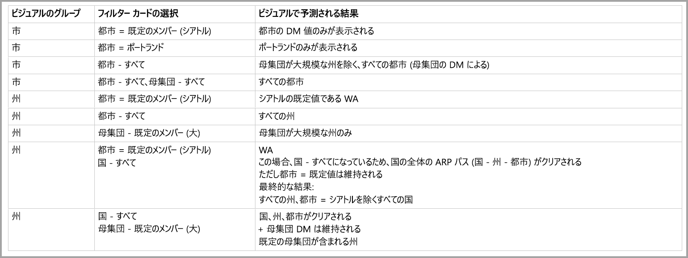

# Power BI での多次元モデルの既定のメンバー

Power BI で多次元モデルに接続し、モデル内のすべての種類のデータを視覚化するレポートを作成できます。 多次元モデルを使用するとき、Power BI では、"*既定のメンバー*" として定義されている列に基づいて、データの処理方法にルールが適用されます。 

多次元モデルを使用するとき、Power BI では、**DefaultMember** を含む列に基づいてモデルのデータが処理されます。 *DefaultMember* 属性は、多次元モデルの特定の列に対して CSDL (Conceptual Schema Definition Language) で設定されます。 既定のメンバーについて詳しくは、[属性のプロパティに関する記事](https://docs.microsoft.com/sql/analysis-services/multidimensional-models/attribute-properties-define-a-default-member?view=sql-server-2017)をご覧ください。 DAX クエリを実行すると、モデルで指定されている既定のメンバーが自動的に適用されます。

この記事では、多次元モデルのさまざまな状況における、"*既定のメンバー*" が見つかった場所に基づく Power BI の動作方法について説明します。 

## フィルター カードの操作

既定のメンバーであるフィールドでフィルター カードを作成すると、既定のメンバーのフィールドの値がフィルター カードで自動的に選択されます。 結果として、フィルター カードによって影響を受けるすべてのビジュアルについて、データベース内に既定のモデルが保持されます。 そのようなフィルター カードの値は、その既定のメンバーに反映されます。

既定のメンバーが削除された場合、値の選択を解除すると、フィルター カードが適用されているすべてのビジュアルについてそれがクリアされ、表示される値に既定のメンバーが反映されなくなります。

たとえば、既定のメンバーが *USD* に設定された "*通貨*" 列があるものとします。

* この例で、"*売り上げ合計*" を表示するカードがある場合、値には適用される既定のメンバーがあり、"USD" に対応する売り上げが表示されます。
* "*通貨*" をフィルター カードのウィンドウにドラッグした場合、選択された既定値として *USD* が表示されます。 既定のメンバーが適用されるので、"*売り上げ合計*" の値は同じままです。
* しかし、フィルター カードで *USD* の値の選択を解除した場合は、"*通貨*" の既定のメンバーがクリアされるので、"*売り上げ合計*" にはすべての通貨が反映されます。
* したがって、既定のメンバーと共にフィルター カードで別の値を選択すると (たとえば、*EURO* を選択)、"*売り上げ合計*" には *Currency IN {USD, EURO}* というフィルターが反映されます。

## グループ化の動作

Power BI では、"*既定のメンバー*" がある列でビジュアルをグループ化するたびに、その列に対する "*既定のメンバー*" とその属性リレーションシップ パスがクリアされます。 これにより、ビジュアルには、既定値だけでなく、すべての値が表示されます。

## 属性リレーションシップ パス (ARP)

属性リレーションシップ パス (ARP) では "*既定のメンバー*" に強力な機能が提供されますが、複雑さもある程度増します。 Power BI で ARP が検出されると、ARP のパスに従って他の列に対する追加の既定メンバーがクリアされ、ビジュアルに対するデータが一貫して正確に処理されるようになります。

動作がわかりやすいように次に例を示します。 次のような構成の ARP について考えます。

これらの列に次のような "*既定のメンバー*" が設定されているものとします。

* City > Seattle
* State > WA
* Country > US
* Population > Large

それでは、各列が Power BI で使用されるとどうなるか見てみましょう。 ビジュアルが次の列でグループ化されたときの結果を示します。

* **City** - *City*、*State*、*Country* についてはすべての**既定のメンバー**がクリアされてすべての市が表示されますが、*Population* については**既定のメンバー**が維持されます。*City* に対する ARP 全体がクリアされます。
    > [!NOTE]
    > *Population* は *City* の ARP 内になく、*State* のみに関係するので、クリアされません。
* **State** - *City*、*State*、*Country*、*Population* のすべての**既定のメンバー**がクリアされて、すべての *States* が表示されます。
* **Country** - *City*、*State*、*Country* についてはすべての**既定のメンバー**がクリアされてすべての国が表示されますが、*Population* については**既定のメンバー**が維持されます。
* **City、State** - すべての列のすべての**既定のメンバー**がクリアされます。

ビジュアルに表示されるグループでは、ARP パス全体がクリアされます。 

ビジュアルには表示されなくても、別のグループ化された列の ARP パスの一部であるグループについては、次の処理が適用されます。

* ARP パスのすべての分岐が自動的にクリアされるわけではありません。
* そのグループは、そのクリアされていない**既定のメンバー**によってまだフィルター処理されます。

### スライサーとフィルター カード

スライサーまたはフィルター カードを使用するときは、次のような動作になります。

* スライサーまたはフィルター カードにデータが読み込まれるときは、前のセクションで説明したのと同じ動作になるように、ビジュアル内の列でグループ化されます。

スライサーとフィルター カードは他のビジュアルとの対話に使用されることが多いため、影響を受けるビジュアルの**既定のメンバー**を消去するロジックが、次の表で説明するように実行されます。 

このテーブルでは、この記事の前半で使用したものと同じサンプル データが使用されています。

このような状況での Power BI の動作方法には、次のルールが適用されます。

特定の列が次の条件を満たす場合、**既定のメンバー**はクリアされます。

* Power BI のグループ化が、その列で行われている
* Power BI のグループ化が、その列に関連する列で行われている (ARP の上位または下位のどこか)
* Power BI によって ARP 内の (上位または下位) 列でフィルター処理が行われている
* 列に *ALL* 状態のフィルター カードがある
* 列に任意の値が選択されたフィルター カードがある (Power BI はその列のフィルターを受け取る)

特定の列が次の条件を満たす場合、**既定のメンバー**はクリアされません。

* 列に既定の状態のフィルター カードがあり、Power BI によって ARP 内のその列でグループ化されている。
* 列が ARP 内で別の列の上位にあり、その別の列に対して既定の状態のフィルター カードがある。

## 次の手順

この記事では、多次元モデルで既定のメンバーを使用するときの Power BI の動作について説明しました。 次の記事にも興味をもたれるかもしれません。 

* [Power BI でデータのない項目を表示する](desktop-show-items-no-data.md)
* [Power BI Desktop のデータ ソース](desktop-data-sources.md)
