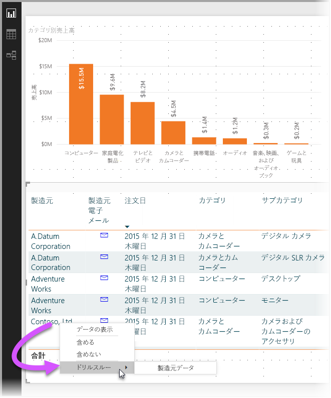
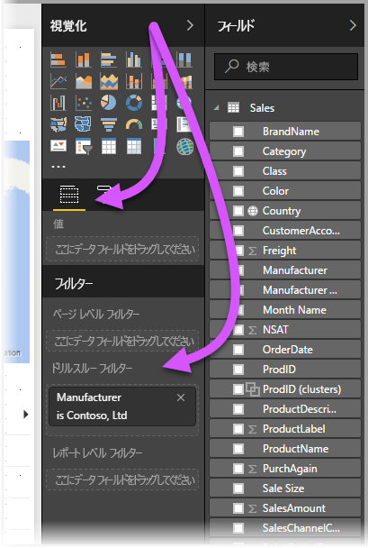
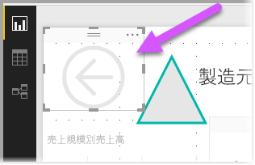
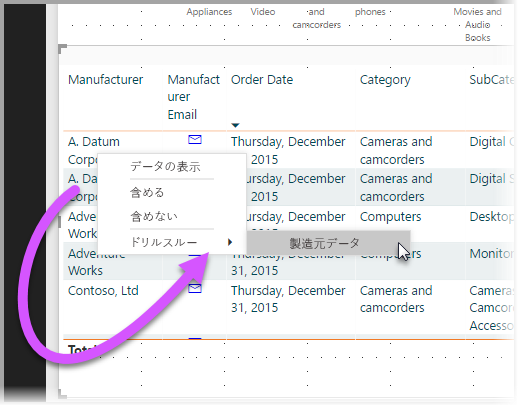
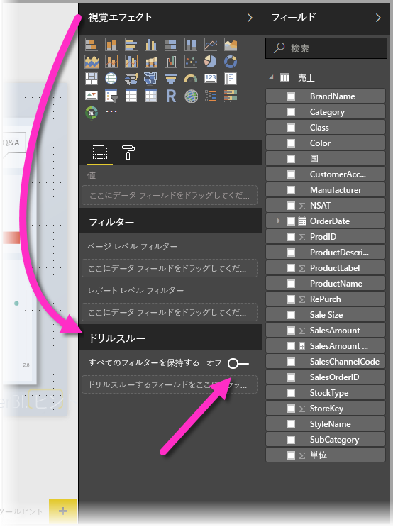
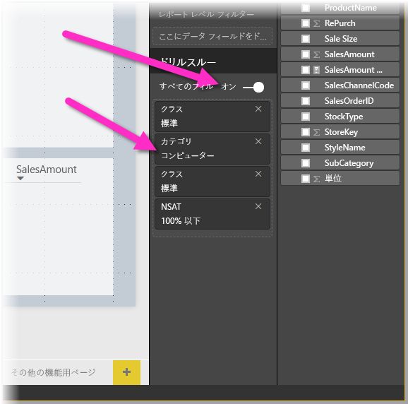

# Power BI Desktop でドリルスルーを使用する
**Power BI Desktop** の**ドリルスルー**を利用すると、サプライヤー、顧客、メーカーなど、特定のエンティティに焦点を置くページをレポートに作成できます。 そのような集中ページを作成した状態で、他のレポート ページでデータ ポイントを右クリックし、集中ページまでドリルスルーし、その文脈に合わせて絞り込んだ詳細を取得できます。

## ドリルスルーを利用する
1. **ドリルスルー**を利用するには、ドリルスルーする種類のエンティティに関して表示したいビジュアルを含むレポート ページを作成します。 

    たとえば、メーカーをドリルスルーするのであれば、売上合計、合計出荷単位、カテゴリ別の売上、地域別の売上などを表示するビジュアルを含むドリルスルー ページを作成します。 そのページにドリルスルーすると、選択したメーカーに固有のビジュアルが表示されます。

2. その後、そのドリルスルー ページの **[視覚化]** ウィンドウの **[フィールド]** セクションで、ドリルスルー対象のフィールドを **[ドリル スルー フィルター]** までドラッグします。

    

    **ドリルスルー フィルター**にフィールドを追加すると、**Power BI Desktop** は *[戻る]* ボタン ビジュアルを自動的に作成します。 このビジュアルは、公開されたレポートでボタンになります。**Power BI サービス**でレポートを利用するユーザーは、アクセス元 (ドリルスルーを選択したページ) からレポート ページに簡単に戻ることができます。

    

## [戻る] ボタンに独自の画像を使用する    
 [戻る] ボタンは画像なので、そのビジュアルの画像を任意の画像に変更できます。変更後も [戻る] ボタンとして機能するので、レポート利用者は元のページに戻ることができます。

1. **[ホーム]** タブで **[イメージ]** をクリックし、イメージを探してドリルスルー ページ上に配置します。
2. [ドリルスルー] ページで新しいイメージを選択し、[形式のイメージ] セクションで、**[リンク]** スライダーをオンに設定して、**[種類]** を **[戻る]** に設定します。 これで、その画像が [戻る] ボタンとして機能します。

    ![[戻る] に画像を使う](media/desktop-drillthrough/drillthrough_05.png)

    **ドリルスルー** ページが完了し、**ドリルスルー フィルター**に置いたフィールドを使用するレポートでデータ ポイントを右クリックすると、そのページへのドリルスルーをサポートするコンテキスト メニューが表示されます。

    

    レポート利用者がドリルスルーを選択すると、ページが絞り込まれ、右クリックしたデータ ポイントに関する情報が表示されます。 たとえば、Contoso (メーカー) に関するデータ ポイントを右クリックし、ドリルスルーを選択すると、表示されたドリルスルー ページが Contoso を対象に絞り込まれます。

## ドリルスルーですべてのフィルターを渡す

2018 年 5 月バージョンの **Power BI Desktop** 以降では、適用されているすべてのフィルターをドリルスルー ウィンドウに渡すことができます。 たとえば、製品の特定のカテゴリのみを選択し、ビジュアルをそのカテゴリでフィルター処理した状態で、ドリルスルーを選択します。 すべてのフィルターを適用してドリルスルーを表示できます。

適用されたすべてのフィルターを維持するには、**[視覚化]** ウィンドウの **[ドリルスルー]** セクションで、**[すべてのフィルターを保持する]** トグルを **[オン]** に設定します。 

2018 年 5 月より前の **Power BI Desktop** のバージョンの動作は、このトグルを **[オフ]** に設定した場合と同じです。

その状態でビジュアルにドリルスルーすると、ソース ビジュアルに一時的なフィルターが適用された結果として、適用されたフィルターを確認できます。 ドリルスルー ウィンドウでは、これらの一時的なフィルターは斜体で表示されます。 

ツールヒント ページでこれを行うこともできますが、悪い影響があるので (ツールヒントが正常に機能しません)、ツールヒントで行うことはお勧めしません。

レポートで**ドリルスルー**を使用する方法は以上です。 ドリルスルー フィルターに選択したエンティティ情報で表示を拡張する優れた方法です。

## 次の手順

次の記事にも興味をもたれるかもしれません。

* [Power BI Desktop でスライサーを使用する](desktop-slicers.md)

