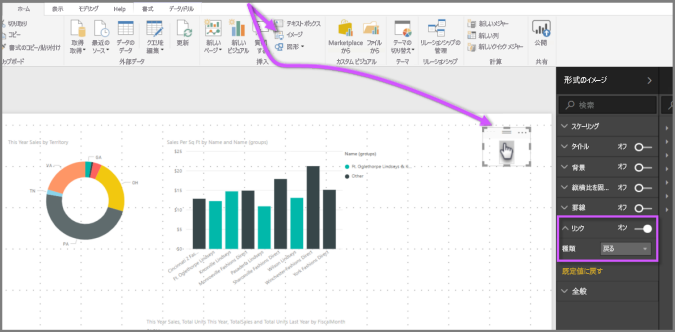

# Power BI Desktop でドリルスルーを使用する
**Power BI Desktop** の**ドリルスルー**を利用すると、サプライヤー、顧客、メーカーなど、特定のエンティティに焦点を置くページをレポートで作成できます。 そのような集中ページを作成した状態で、他のレポート ページでデータ ポイントを右クリックし、集中ページまでドリルスルーし、その文脈に合わせて絞り込んだ詳細を取得できます。

## ドリルスルーを利用する
**ドリルスルー**を利用するには、ドリルスルーする種類のエンティティに関して表示したいビジュアルを含むレポート ページを作成します。 たとえば、メーカーをドリルスルーするのであれば、売上合計、合計出荷単位、カテゴリ別の売上、地域別の売上などを表示するビジュアルを含むドリルスルー ページを作成します。 そのページにドリルスルーすると、クリックし、ドリルスルー対象として選択したメーカーに固有のビジュアルが表示されます。

その後、そのドリルスルー ページの **[視覚化]** ウィンドウの **[フィールド]** セクションで、ドリルスルー対象のフィールドを**ドリルスルー フィルター**までドラッグします。

**ドリルスルー フィルター**にフィールドを追加すると、**Power BI Desktop** は *[戻る]* ボタン ビジュアルを自動的に作成します。 このビジュアルは、公開されたレポートでボタンになります。**Power BI サービス**でレポートを利用するユーザーは、アクセス元 (ドリルスルーを選択したページ) からレポート ページに簡単に戻ることができます。

*[戻る]* ボタンは画像なので、そのビジュアルの画像を任意の画像に変更できます。変更後もボタンとして問題なく機能し、レポート利用者は元のページに戻ることができます。 [戻る] ボタンに独自の画像を利用するには、ドリルスルー ページで画像ビジュアルを置き、そのビジュアルを選択し、*戻るボタン*のスライダーをオンにします。 これで選択した画像が *[戻る]* ボタンとして機能します。

**ドリルスルー** ページが完了し、ドリルスルー ページで**ドリルスルー フィルター**に置いたフィールドを使用するレポートでデータ ポイントを右クリックすると、コンテキスト メニューが表示されます。ユーザーはそのページにドリルスルーできます。

ドリルスルーを選択すると、ページが絞り込まれ、右クリックしたデータ ポイントに関する情報が表示されます。 たとえば、Contoso (メーカー) に関するデータ ポイントを右クリックし、ドリルスルーを選択すると、表示されたドリルスルー ページが Contoso を対象に絞り込まれます。

> [!NOTE]
> **ドリルスルー フィルター**にあるフィールドのみが、ドリルスルー レポート ページに渡されます。 その他のコンテキスト情報は渡されません。
> 
> 

レポートで**ドリルスルー**を使用する方法は以上です。 ドリルスルー フィルターに選択したエンティティ情報で表示を拡張する優れた方法です。

