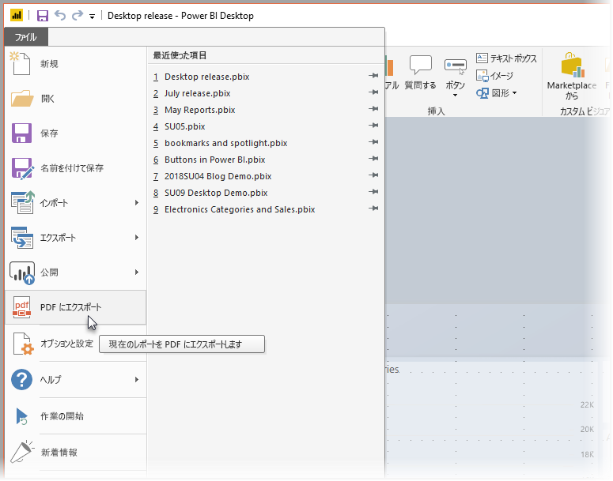

# Power BI Desktop からレポートを PDF にエクスポートする
**Power BI Desktop** では、レポートを PDF ファイルにエクスポートすることができます。これにより、ご利用のレポートをその PDF で容易に共有したり印刷したりできます。

**Power BI Desktop** から PDF にレポートをエクスポートすると、その PDF を印刷または他のユーザーと共有できるようになります。このエクスポート処理は簡単です。 Power BI Deskop で **[ファイル]、[PDF にエクスポート]** の順に選択するだけです。

**[PDF にエクスポート]** 処理では、レポート内に*表示されている*すべてのページがエクスポートされ、各レポート ページは PDF 内の単一ページにエクスポートされます。 現在表示されていないレポート ページ (ツール ヒントまたは非表示ページなど) は、PDF ファイルにはエクスポートされません。 

![処理中の [PDF にエクスポート]](media/desktop-export-to-pdf/export-to-pdf_02.png)

**[ファイル]、[PDF にエクスポート]** の順に選択すると、エクスポートが開始され、エクスポート処理が進行中であることを示すダイアログが表示されます。 ダイアログは、エクスポート処理が完了するまで、画面上に表示されたままとなります。 エクスポート処理中には、エクスポート中のレポートとのやりとりはすべて無効になります。 レポートとやりとりするには、エクスポート処理が完了するまで待つか、またはエクスポートをキャンセルするしかありません。 

エクスポートが完了すると、PDF は、コンピューター上の既定の PDF ビューアーに読み込まれます。 

## 考慮事項と制限事項
**[PDF にエクスポート]** 機能にはいくつかの考慮事項があるので注意してください。

* **[PDF にエクスポート]** 機能は、**Power BI Desktop** でのみ利用できます。現在のところ、**Power BI サービス**では利用できません。
* この機能では、カスタム ビジュアルはエクスポートされますが、レポートに壁紙が適用されている場合、それはエクスポートされ*ません*。

壁紙は PDF にエクスポートされないので、濃色の壁紙を使用しているレポートには特に注意してください。 濃色の壁紙を背景にしてテキストを目立たせるために、ご利用のレポート内のテキストが明るい色または白色になっている場合、壁紙はレポートの残りの部分と一緒にエクスポートされないので、PDF へのエクスポート処理によってテキストは読みづらくなるか、判読不可能になります。 

## 次の手順
**Power BI Desktop** には、あらゆる種類の興味深いビジュアル要素や機能があります。 詳細については、次のリソースを参照してください。

* [ビジュアル要素を使用して Power BI レポートを強化する](desktop-visual-elements-for-reports.md)
* [Power BI Desktop とは何ですか?](desktop-what-is-desktop.md)

