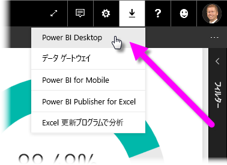
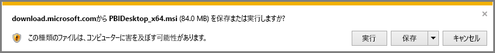
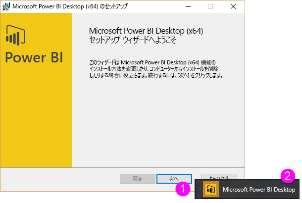
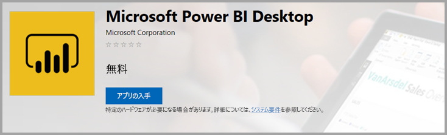
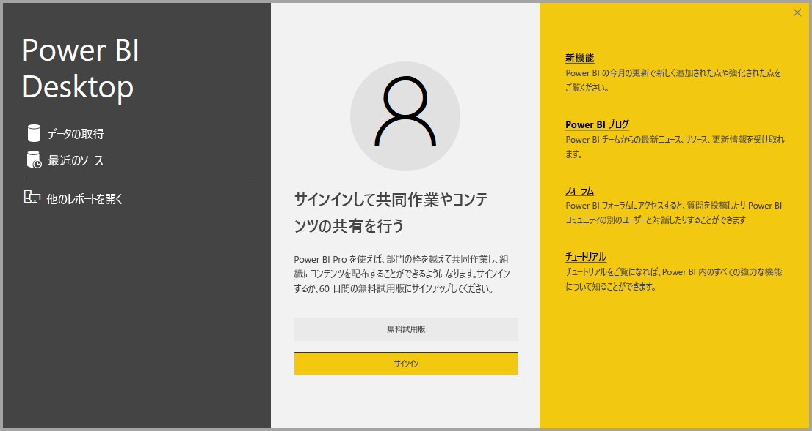

# Power BI Desktop の取得
**Power BI Desktop** では、データを視覚化する高度なクエリ、モデル、レポートを作成できます。 **Power BI Desktop** を使うと、データ モデルを作成し、レポートを作成し、Power BI サービスに発行することで作業を共有することができます。  **Power BI Desktop** は無料でダウンロードできます。

**Power BI Desktop** は 2 つの方法で取得でき、次のセクションではそれぞれについて説明します。

* 直接**ダウンロード**する (MSI パッケージをダウンロードしてコンピューターにインストール)
* **Windows ストア**からアプリとしてインストールする

どちらの方法でも最新バージョンの **Power BI Desktop** がコンピューターにインストールされますが、注目すべきいくつかの違いがあります。これについては以下のセクションで説明します。

## Power BI Desktop をダウンロードする
**Power BI Desktop** の最新バージョンをダウンロードするには、Power BI サービスの右上隅からダウンロード アイコンを選択し、**[Power BI Desktop]** を選択します。

また、次のダウンロード ページから Power BI Desktop の最新バージョンをダウンロードすることもできます。

* [**Power BI Desktop のダウンロード** (32/64 ビットの両バージョン)](https://powerbi.microsoft.com/desktop).
  
  

どちらの方法でダウンロードしても、**Power BI Desktop** のダウンロードが終わると、インストール ファイルを実行するよう求められます。

**Power BI Desktop** がアプリケーションとしてインストールされて、デスクトップで実行します。

> [!NOTE]
> 同じコンピューターに **Power BI Desktop** のダウンロード (MSI) バージョンと **Windows ストア** バージョンをインストールすること (*サイド バイ サイド* インストールとも呼ばれます) はサポートされていません。
> 
> 

## Windows ストアからアプリとしてインストールする
次のリンクを使って、Windows ストアから **Power BI Desktop** を取得することもできます。

* [**Power BI Desktop** を **Windows ストア**からインストールする](http://aka.ms/pbidesktopstore)

Windows ストアから **Power BI Desktop** を入手するといくつかの利点があります。

* **自動更新** - Windows は最新バージョンが入手できるようになるとすぐ自動的にダウンロードするので、バージョンは常に最新の状態です。
* **ダウンロード量が少なくなる** - **Windows ストア**では、各更新で変更されたコンポーネントのみがコンピューターにダウンロードされるようになっています。結果的に、各更新のダウンロード量が少なくなります。
* **管理者特権が必要ない** - MSI を直接ダウンロードしてインストールする場合は、インストールが正常に完了するには管理者が行う必要があります。 Windows ストアから **Power BI Desktop** を入手するときは、管理者特権は必要*ありません*。
* **IT のロールアウトが可能** - **Windows ストア** バージョンの方が組織内の全ユーザーへのデプロイ ("*ロールアウト*") が簡単であり、**ビジネス向け Microsoft ストア**から **Power BI Desktop** を入手できるようにすることができます。
* **言語検出** - **Windows ストア** バージョンにはサポート対象のすべての言語が含まれ、コンピューターを起動するたびに使われている言語が確認されます。 これは、**Power BI Desktop** で作成されるモデルのローカライズにも影響します。たとえば、組み込みの日付階層は、.pbix ファイルが作成されたときに **Power BI Desktop** で使われていた言語と一致します。

Windows ストアからの **Power BI Desktop** のインストールには、以下で示すようないくつかの考慮事項と制限があります。

* SAP コネクタを使う場合、SAP ドライバー ファイルを *Windows\System32* フォルダーに移動することが必要な場合があります。

> [!NOTE]
> 同じコンピューターに **Power BI Desktop** のダウンロード (MSI) バージョンと **Windows ストア** バージョンをインストールすること (*サイド バイ サイド* インストールとも呼ばれます) はサポートされていません。
> 
> [!NOTE]
> **Power BI Desktop** の Power BI Report Server バージョンは、この記事で説明されているバージョンとは異なるものであり、別途インストールします。 **Power BI Desktop** の Report Server バージョンについては、「[クイックスタート: Power BI Report Server の Power BI レポートの作成](report-server/quickstart-create-powerbi-report.md)」をご覧ください。
> 
> 

## Power BI Desktop の使用
**Power BI Desktop** を実行すると、*[ようこそ]* 画面が表示されます。

**Power BI Desktop** を初めて使う場合は (インストールがアップグレードではない場合)、フォームに入力していくつかの質問に回答すること、または先に進む前に **Power BI サービス**にサインインすることを求められます。

ここから、データ モデルやレポートの作成を開始し、Power BI サービス上で他のユーザーと共有することができます。 この記事の末尾にある「**詳細**」では、**Power BI Desktop** の使用を開始するのに役立つガイドへのリンクを紹介しています。

## 最小要件
**Power BI Desktop** の実行に必要な最小要件は、次のとおりです。

* Windows 7 または Windows Server 2008 R2 以降
* .NET 4.5
* Internet Explorer 9 以降
* **メモリ (RAM):** 1 GB 以上使用可能、1.5 GB 以上を推奨します。
* **表示**: 1440 x 900 以上または 1600 x 900 (16:9) を推奨します。 1024 x 768 または 1280 x 800 などのより低い解像度は推奨されていません。特定のコントロール (起動画面を閉じるなど) は、これらの解像度を超えて表示されるためです。
* **Windows の表示の設定:** テキスト、アプリ、その他の項目のサイズが 100% より大きくなるように表示設定を変更してある場合、**Power BI Desktop** の使用を続けるために閉じたり応答したりする必要がある特定のダイアログを表示できないことがあります。 この問題が発生した場合は、Windows で **[設定] > [システム] > [表示]** に移動して **[表示設定]** を確認し、スライダーを使って表示設定を 100% に戻します。
* **CPU:** 1 ギガヘルツ (GHz) または高速な x86 ビットまたは x64 ビットのプロセッサを推奨します。

## 次の手順
以下のガイドは、**Power BI Desktop** をインストールした後で、すばやく作業を開始するのに役立ちます。

* [Power BI Desktop の概要](desktop-getting-started.md)
* [Power BI Desktop でのクエリの概要](desktop-query-overview.md)
* [Power BI Desktop のデータ ソース](desktop-data-sources.md)
* [Power BI Desktop におけるデータへの接続](desktop-connect-to-data.md)
* [Power BI Desktop でのデータの整形と結合](desktop-shape-and-combine-data.md)
* [Power BI Desktop での一般的なクエリ タスク](desktop-common-query-tasks.md)   

