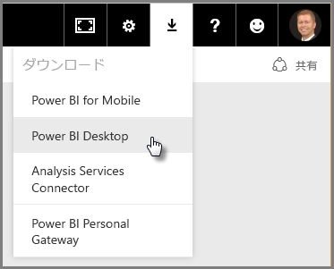
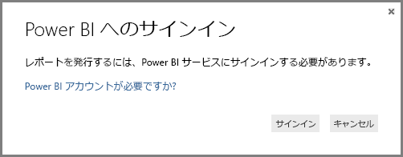

# Power BI Desktop の概要
「**Power BI Desktop 概要ガイド**」へようこそ。 この短いツアーでは、Power BI Desktop の機能を説明し、その動作の実例を示します。これにより、強力なデータ モデルと優れたレポートをより迅速に作成できるようになり、ビジネス インテリジェンスの作業を拡張できます。 

読むよりも見ることをご希望ですか。 [概要を示すビデオをどうぞご覧ください](desktop-videos.md)。 ビデオを閲覧しながら対応するサンプル データも参照する場合は、[このサンプルの Excel ブックをダウンロード](http://go.microsoft.com/fwlink/?LinkID=521962)します。

Power BI Desktop によって、他のユーザーと簡単に共有できるクエリ、データ接続、およびレポートのコレクションを作成することができます。 Power BI Desktop は、実績のある Microsoft テクノロジ (強力なクエリ エンジン、データ モデリング、視覚エフェクト) を統合して、オンラインの[**Power BI サービス**](https://app.powerbi.com/)とシームレスに連携します。

**Power BI Desktop** により、アナリストなどが強力なデータ接続、モデル、レポートを作成できます。また、[**Power BI サービス**](https://preview.powerbi.com/)により、Power BI Desktop のレポートを共有して、ユーザーがそれらを表示したり操作したりできます。これら 2 つを組み合わせると、データの世界から新しい見識をモデル化、構築、共有、拡張することが容易になります。

データの世界に接続してこれを整形し、堅牢なモデルを構築して、適切に構成されたレポートを作成する上で、Power BI Desktop が強力で柔軟性の高い、アクセスの容易なツールであることをデータ アナリストは実感できます。

## このガイドの使用方法
このガイドは、簡単な概要を知るために素早く参照したり、Power BI Desktop の動作のしくみについて深く理解するために各セクションを読み通すなど、いくつかの方法で使用できます。

時間が限られている場合には、数分でさっと参照することにより、Power BI Desktop の動作のしくみと使用方法を適切に理解できます。 このガイドの大部分は、Power BI Desktop の機能を視覚的に示す画面で構成されています。

より詳しく理解するために、各セクションを読み通して、その手順を実行し、独自の Power BI Desktop ファイルを出力することもできます。そのファイルを **Power BI** サービスに投稿して他のユーザーと共有することができます。

>[!NOTE]
>[**Power BI Report Server**](report-server/get-started.md) という **Power BI** の別の特殊なバージョンもあります。これは、データやレポートをオンプレミスで保持する必要がある顧客向けです。 この特殊なバージョンと使用できる、**Power BI Report Server 向け Power BI Desktop** という **Power BI Desktop** の別の特殊なバージョンもあります。これは、Report Server バージョンの Power BI でのみ動作します。 この記事では、標準の **Power BI Desktop** について説明します。

## Power BI Desktop の動作のしくみ
Power BI Desktop によって、 *データに接続* し (通常は複数のデータ ソース)、 *そのデータを整形* し (洞察と説得力があるデータ モデルを作成するためのクエリを使用)、そのモデルを使用して *レポートを作成* します (他のユーザーによる活用、基盤としての使用、共有が可能)。

接続、整形、レポートの各手順が満足のいく仕方で完了したら、その作業を .pbix の拡張子が付いた Power BI Desktop 形式のファイルに保存できます。 Power BI Desktop ファイルは、他のすべてのファイルと同じ方法で共有できます。しかし Power BI Desktop ファイルを共有する最も優れた方法は、[**Power BI サービス**](https://preview.powerbi.com/)にファイルをアップロードする (共有する) ことです。 

Power BI Desktop により、ビジネス インテリジェンスのリポジトリとレポートの設計と作成は、ばらばらに切り離された困難なプロセスではなく、一元化された、シンプルで効率的なプロセスになります。

では、実際に試してみます。 開始しましょう。

## Power BI Desktop のインストールと実行
**歯車** の形のアイコンを選択してから **[Power BI Desktop]** を選択することにより、Power BI サービスから **Power BI Desktop**をダウンロードすることができます。

Power BI Desktop がアプリケーションとしてインストールされて、デスクトップで実行します。

Power BI Desktop を実行すると、 *[ようこそ]* 画面が表示されます。

*[ようこそ]* 画面で (左ウィンドウのリンクから)、直接**データを取得**したり、**最近使用したソース**を表示したり、**他の** **レポートを開いたり**することができます。 画面を閉じた場合 (右上隅の **[x]** を選択)、Power BI Desktop の **レポート** ビューが表示されます。

Power BI Desktop には 3 つのビューがあります。**[レポート]** ビュー、**[データ]** ビュー、**[リレーションシップ]** ビューです。 Power BI Desktop には、**クエリ エディター**も含まれています。クエリ エディターは別のウィンドウで開きます。 **クエリ エディター**では、クエリを作成してデータを変換し、その調整されたデータ モデルを Power BI Desktop に読み込み、レポートを作成することができます。

次の画面では、Power BI Desktop の左側に沿って次の 3 つのビューのアイコンが表示されます:上から下に **[レポート]**、**[データ]**、**[リレーションシップ]**。 現在表示されているビューは、左側の黄色のバーで示されています。 このケースでは、 **レポート** ビューが現在表示されています。 ビューを変更するには、これら 3 つのアイコンのいずれかを選択します。

Power BI Desktop をインストールすると、データへの接続、データの整形、およびレポートの作成を (通常はこの順序で) 行う準備が整います。 次のいくつかのセクションで、それぞれのツアーを順番に行います。

## データへの接続
Power BI Desktop をインストールすると、拡大を続けるデータの世界につながる準備が整います。 クエリ ウィンドウでは、 *あらゆる種類* のデータ ソースを使用できます。 次の図は、**[ホーム]** リボンで **[データの取得] \> [詳細]** を選んで行う、データへの接続方法を示しています。

 

このクイック ツアーでは、いくつかの異なる **Web** データ ソースに接続します。

退職を間近に控えて、陽当たりが良く、税額が有利で、医療が充実した場所への移転を考えているとします。または、データ アナリストとして、顧客のためにそのような情報を探しているとします。 たとえば、サングラスの小売業者に対して、日照時間の最も長い地域を営業のターゲットとするように支援する場合があります。

いずれの場合も、次の Web リソースには、これらのトピックやその他のトピックに関する興味深いデータが含まれています。

[*http://www.bankrate.com/finance/retirement/best-places-retire-how-state-ranks.aspx*](http://www.bankrate.com/finance/retirement/best-places-retire-how-state-ranks.aspx)

**[データの取得] \> [Web]** を選んで、アドレスを貼り付けます。

 

**[OK]** をクリックすると、Power BI Desktop の **クエリ** 機能が動作します。 クエリは Web リソースにアクセスし、 **[ナビゲーター]** ウィンドウは、その Web ページでの検出内容を返します。 このケースでは、テーブル (*Table 0*) と Web ドキュメント全体が見つかりました。 テーブルに興味があるので、一覧からテーブルを選択します。 **[ナビゲーター]** ウィンドウにプレビューが表示されます。

 

この時点で、ウィンドウの下部にある **[編集]** をクリックしてテーブルを読み込む前にクエリを編集するか、テーブルを読み込みます。

**[編集]** を選択すると、クエリ エディターが起動し、テーブルを表すビューが表示されます。 **[クエリの設定]** ウィンドウが表示されます (表示されない場合は、リボンにある **[表示]** をクリックしてから、**[表示] \> [クエリの設定]** の順にクリックすると **[クエリの設定]** ウィンドウが表示されます)。 表示は次のようになります。

 

データへの接続について詳しくは、「[Power BI Desktop におけるデータへの接続](desktop-connect-to-data.md)」をご覧ください。

次のセクションでは、ニーズを満たすようにデータを調整します。 接続されているデータを調整するプロセスは、データの *整形* と呼ばれます。

## データの整形と結合
これで、データ ソースに接続したので、ニーズに合わせてデータを調整する必要があります。 調整とは、列またはテーブルの名前の変更、テキストから数値への変更、行の削除、先頭の行をヘッダーに設定するなどのデータの *変換* を意味することもあります。

Power BI Desktop のクエリ エディターでは、リボンで使用可能なタスクを実行できることに加えて、右クリック メニューも広範囲に使用します。 **[変換]** リボンで選択できるほとんどの項目は、(列などの) 項目を右クリックし、表示されるメニューからクリックして使用することもできます。

## データの整形
**クエリ エディター**でデータを整形する際は、(**クエリ エディター**が行う) 手順ごとの指示を与えて、**クエリ エディター**が読み込んで表示するデータを調整します。 元のデータ ソースに影響は及びません。この特定のデータ表示のみが調整または*整形*されます。

指定する手順 (テーブル名の変更、データ型の変換、または列の削除など) は**クエリ エディター**によって記録され、このクエリがデータ ソースに接続するたびにこれらの手順が実行されます。そうすることで、データは常に指定されたとおりに整形されます。 ユーザーが Power BI Desktop でクエリを使用するたびに、あるいは任意のユーザーが **Power BI** サービスなどで共有クエリを使用する場合に、このプロセスが実行されます。 これらの手順は、**[クエリの設定]** ウィンドウの **[適用される手順]** で順番にキャプチャされます。

次の図は、整形されたクエリを表示した **[クエリの設定]** ウィンドウを示しています。これらの各手順については、以降のいくつかの段落で説明します。

 

Web のデータ ソースに接続して検索した退職者関係のデータについて再び考えます。このデータをニーズに合わせて整形することにします。

まず、多くの評価値は整数として**クエリ エディター**に取り込まれますが、すべてがそうではありません (1 つの列にはテキストと数値が含まれているため、自動変換されませんでした)。 データは数値であることが必要です。 心配ありません。列ヘッダーを右クリックして **[型の変更] \> [整数]** の順に選ぶだけでデータ型を変更できます。 複数の列を選ぶ必要がある場合は、まず 1 つの列を選んでから、**Shift キー**を押したまま追加の隣接する列を選べます。その後、列ヘッダーを右クリックして選んだ列をすべて変更します。 **Ctrl キー**を使用して、連続していない列を選ぶこともできます。

 

さらに、**[変換]** リボンを使用して、列をテキストからヘッダーに変更または*変換*することもできます。 **[変換]** リボンを次に示します。矢印は、現在のデータ型を別のデータ型に変換する **[データ型]** ボタンを指しています。

 

**[クエリの設定]** では、 **適用される手順** が、加えられたすべての変更を反映することに注意してください。 整形プロセスからいずれかの手順を削除する場合は、その手順を選択してから、手順の左側にある **[X]** を選択します。

 

クエリを望ましい形にするために、あといくつかの変更を行う必要があります。

* *最初の列を削除する* – この列は不要です。”お住まいの州の退職後の生活ランキングをチェック” という冗長な行が含まれているに過ぎません。これが Web ベースのテーブルであることに伴う結果です。

<!-- -->

* *いくつかのエラーを修正する* – Web ページで、1 つの列にはテキストと数値が混在しています (あるカテゴリで複数の州が同一ランクになっています)。 これは Web サイトでは適切ですが、データ分析では不適切です。 (このケースでは) 修正は容易であり、これによって**クエリ エディター**とその**適用手順**の優れた機能をお見せします。

<!-- -->

* *テーブル名を変更する* – **Table 0** は役立つ記述子ではありませんが、それを変更することは簡単です。

これらの各手順は、「**[Power BI Desktop でのデータの整形と結合](desktop-shape-and-combine-data.md)**」で例示されています。 そのページを自由に確認することができます。または、現在のドキュメントを読み進めて次に行う手順を参照することもできます。 次のセクションでは、上記の変更が適用された後について扱います。

## データの結合
さまざまな州に関するこのデータは興味深く、追加の分析作業とクエリの構築に役立ちます。 ただし、1 つ問題があります。ここにあるほとんどのデータでは、州コードの 2 文字の省略形を使用し、州の完全名を使用していません。 何らかの方法により、州名をその省略形に関連付ける必要があります。

幸運にも、ぴったりな別の公共データ ソースがあります。しかし、この退職者テーブルに接続する前に、いくらかの整形を行う必要があります。 州の省略形の Web リソースを次に示します。

<http://en.wikipedia.org/wiki/List_of_U.S._state_abbreviations>

**クエリ エディター**の **[ホーム]** リボンで、**[データの取得] \> [Web]** の順に選び、アドレスを入力して **[OK]** を選びます。その Web ページの内容が **[ナビゲーター]** ウィンドウに表示されます。

 

ここでは "**Table[edit]**" を選びました。このテーブルには必要なデータが含まれているためです。しかし、テーブルのデータの余分なところを省くにはかなりの作業が必要です。 これらの各手順は、「**[Power BI Desktop でのデータの整形と結合](desktop-shape-and-combine-data.md)**」でも例示されています。 これらの手順をまとめると、以下のようになります。

**[編集]** を選びます。次に以下を行います。

* *先頭の 2 行を削除する* – これらは Web ページのテーブルを作成した方法のために生じたものであり、不要です。

<!-- -->

* *末尾の 26 行を削除する* – これらはすべて準州であり、含める必要はありません。

<!-- -->
* *ワシントン DC を除外する* – 退職者統計テーブルには DC が含まれていません。そこで一覧から除外します。

<!-- -->

* *いくつかの不要な列を削除する* – 州と公式の 2 文字の省略形のマッピングのみが必要であるため、その他の列は削除できます。

<!-- -->

* *最初の行をヘッダーとして使用する* – 先頭の 3 行を削除したため、現在の先頭の行が必要なヘッダーになります。

    >[!NOTE]
    >ここで、**クエリ エディター**において適用される手順の*順番*は重要であり、データの整形方法に影響を与えることを指摘しておきます。 また、1 つの手順がこれ以降の別の手順にどのような影響を与える可能性があるかを検討することも重要です。**適用される手順**から手順を削除すると、クエリの手順の順番による影響のため、これ以降のステップは最初に意図したとおりに動作しない可能性があります。

* *列とテーブル自体の名前を変更する* – 通常どおり、列の名前を変更するにはいくつかの方法があります。必要に応じていずれかを選べます。

*StateCodes* テーブルを整形したら、これらの 2 つのテーブルまたはクエリを 1 つに結合できます。現在あるテーブルはデータに適用したクエリの結果であるため、"*クエリ*" と呼ばれることがよくあります。

クエリの結合には、 *マージ* と *追加*という主な 2 つの方法があります。

別のクエリに追加する 1 つ以上の列がある場合は、クエリを **マージ** します。 既存のクエリに追加するデータの追加の行がある場合は、クエリを **追加** します。

ここではクエリをマージします。 最初に、他のクエリのマージ *先の* クエリを選択してから、リボンの **[ホーム]** タブで **[クエリのマージ]** を選択します。

 

**[マージ]** ウィンドウが表示されて、選んだテーブルにマージするテーブルを選んでから、マージに使用する一致する列を選ぶよう求めるメッセージが表示されます。 *RetirementStats* テーブル (クエリ) から*州*を選びます。次に、*StateCodes* クエリを選びます (この場合は、他のクエリが 1 つのみであるため簡単です。多数のデータ ソースに接続する場合、選択対象のクエリが多数になります)。 一致する列を正しく選ぶと (*RetirementStats* の *[州]* と *StateCodes* の *[州名]*)、**[マージ]** ウィンドウは次のようになり、**[OK]** ボタンが有効になります。

 

クエリの末尾に **NewColumn** が作成されます。これは、既存のクエリとマージされたテーブル (クエリ) のコンテンツです。 マージされたクエリのすべての列が **NewColumn** に凝縮されますが、テーブルの **[展開]** を選ぶと、必要な列をどれでも含めることができます。 マージされたテーブルを展開して含める列を選択するには、展開アイコンを選択します ()。 **[展開]** ウィンドウが表示されます。

 

このケースでは、*[州コード]* 列のみが必要であるため、この列のみを選んで **[OK]** を選びます。 **[元の列名をプレフィックスとして使用する]** のチェックボックスは、不要なためチェックを外します。選んだままにすると、マージされた列の名前は *NewColumn.州コード* (元の列名、または *NewColumn* とドットの後にクエリに含める列の名前を続けたもの) になります。

>[!NOTE]
>*NewColumn* テーブルの導入操作を試してみることができます。 少し実験してみてください。結果に満足できない場合は、**[クエリの設定]** ウィンドウの **[適用される手順]** の一覧からその手順を削除してください。クエリは、**[展開]** の手順を適用する前の状態に戻ります。 これは、展開プロセスが希望どおりになるまで何回でも好きなだけ実行できる無料のやり直しのようなものです。

2 つのデータ ソースを結合した 1 つのクエリ (テーブル) ができました。それぞれがニーズに合わせて整形されています。 このクエリは、いずれかの州の住宅費の統計、人口統計、または求人情報など、その他の多くの興味深いデータ接続の基礎となっています。

データ整形と結合に関するこれらの各手順について詳しくは、「[Power BI Desktop でのデータの整形と結合](desktop-shape-and-combine-data.md)」をご覧ください。

これで、いくつかの興味深いレポートを、すべて Power BI Desktop 内で作成するために十分なデータが揃いました。 ここはマイルストーンとなる箇所なので、この Power BI Desktop ファイルを保存します。その名前を「**Power BI Desktop の概要**」とします。 **クエリ エディター**で変更内容を適用し、Power BI Desktop に読み込むには、**[ホーム]** リボンの **[閉じて適用する]** を選びます。

## レポートの作成
テーブルが読み込まれた後に追加の変更を行うことができます。また、行われたすべての変更を適用するには、モデルを再読み込みします。 今回は、このまま進めることができます。 Power BI Desktop の**レポート** ビューでレポートの作成を開始します。

**レポート** ビューには、次の 5 つの主な領域があります。

1. リボン。これにはレポートと視覚エフェクトに関連する一般的なタスクが表示されます。
2. **レポート** ビューまたはキャンバス。ここに視覚エフェクトが作成されて配置されます。
3. **[ページ]** タブ領域 (下部にあります)。レポートのページを選択または追加できます。
4. **[視覚エフェクト]** ウィンドウ。視覚エフェクトの変更、色や軸のカスタマイズ、フィルターの適用、フィールドのドラッグなどを行えます。
5. **[フィールド]** ウィンドウ。ここではクエリの要素とフィルターを**レポート** ビューにドラッグしたり、**[視覚エフェクト]** ウィンドウの**フィルター**領域にドラッグしたりできます。
   
   

**[視覚エフェクト]** ウィンドウと **[フィールド]** ウィンドウは、端の小さな矢印を選んで折りたたむことができます。これにより、**レポート** ビューの領域が増えて、優れた視覚エフェクトを作成できます。 さらに、視覚エフェクトを変更する際、上下の矢印が表示されます。これは、状況に応じてそのセクションの展開や折りたたみができることを意味します。

 

**[フィールド]** リストから **レポート** ビューにフィールドをドラッグするだけで、視覚エフェクトを作成できます。 このケースでは、 *[州]* フィールドを *[RetirementStats]* からドラッグして、その結果を観察します。

 

ご覧ください。Power BI Desktop により、地図ベースの視覚エフェクトが自動的に作成されました。これは、*[州]* フィールドに地理的位置情報データが含まれていることが認識されたためです。

**[視覚エフェクト]** ウィンドウでは、さまざまな種類の視覚エフェクトを選べることにご注意ください。また、これらのアイコンの下の領域では、凡例を適用するためにフィールドをさまざまな領域にドラッグするか、他の方法で視覚エフェクトを変更できます。

 

少し話を早く進めて、いくつかの視覚エフェクトを追加した後の **レポート** ビューと新しいレポート ページがどのようになるかを見てみます。 レポートについて詳しくは、「[Power BI Desktop のレポート ビュー](desktop-report-view.md)」をご覧ください。

最初のレポート ページには、 *全体的なランク付け*に基づくデータのパースペクティブが示されています。 視覚エフェクトのいずれかを選択すると、 **[フィールドとフィルター]** ウィンドウには、どのフィールドが選択されたか、および視覚エフェクトの構造 (どのフィールドが **[共有の軸]**、 **[列の値]**、および **[行の値]** に適用されるか) が表示されます。

 

このレポートには 6 つの **ページ** があり、それぞれにデータの特定の要素が視覚化されています。

1. 上に示す最初のページには、 *全体的なランク付け*に基づき、すべての州が示されます。
2. 2 番目のページでは、 *全体的なランク付け*に基づく上位 10 の州に注意を向けています。
3. 3 番目のページでは、上位 10 の州の生活費 (および関連データ) が視覚化されています。
4. 4 番目のページでは、天候に注目して、日照時間の長い上位 15 の州が選ばれています。
5. 5 番目のページでは、地域社会の福祉が上位の 15 の州についてグラフで示され、視覚化されています。
6. 最後に、犯罪統計が視覚化されて、最良 (事件件数が下位) の 10 の州が示されています。

生活費に注目したレポート ページの例をここに示します。

 

あらゆる種類の興味深いレポートや視覚エフェクトを作成することができます。

## 作業の共有
Power BI Desktop レポートがある程度完成したので、それを **Power BI** サービスで他のユーザーと共有できます。 Power BI Desktop で作業を共有する方法はいくつかあります。 **Power BI** サービスに発行できます。Power BI サービスから直接 .pbix ファイルをアップロードしたり、.pbix ファイルを保存し、他のすべてのファイルと同様に送信したりできます。

まず、Power BI Desktop から直接 **Power BI** サービスに発行する様子を見てみましょう。 **[ホーム]** リボンで、 **[発行]** をクリックします。

Power BI にサインインするように求めるメッセージが表示されます。

サインインして、発行プロセスが完了すると、次のダイアログ ボックスが表示されます。

Power BI にサインインすると、サービスの **ダッシュボード**、 **レポート**、および **データセット** の各セクションに、読み込んだ Power BI Desktop ファイルが表示されていることが分かります。

作業を共有するもう 1 つの方法は、 **Power BI** サービス内から Power BI Desktop ファイルを読み込むことです。 次のリンクにより、ブラウザーに **Power BI** サービスが表示されます。

`https://app.powerbi.com`

**[データの取得]** を選択して、Power BI Desktop レポートを読み込むプロセスを開始します。

 

**[データの取得]** ページが表示されます。ここでデータの取得元を選べます。 このケースでは、**[ファイル]** ボックスから **[取得]** を選びます。

**ファイル** ビューが表示されます。 このケースでは、 **[ローカル ファイル]** を選択します。

ファイルを選択すると、Power BI はファイルをアップロードします。

ファイルがアップロードされたら、Power BI サービスの左ウィンドウで **[レポート]** からファイルを選択できます。

**Power BI** サービスに、レポートの最初のページが表示されます。 ページの下部で、タブを選択し、レポートのそのページを表示できます。

 

レポート キャンバスの上部で **[レポートの編集]** をクリックすると、 **Power BI** サービスでレポートに変更を加えることができます。

レポートを保存するには、サービスから **[ファイル] \> [名前を付けて保存]** の順に選びます。 レポートから、あらゆる種類の興味深いビジュアルを **Power BI** サービスに作成し、それを *ダッシュボード*に固定することができます。 **Power BI** サービスのダッシュボードについて詳しくは、「<strong>[優れたダッシュボードのデザインに関するヒント](service-dashboards-design-tips.md)</strong>」をご覧ください。

 

保存したら、メイン ページで **[共有]** アイコンを選択します。

 

ダッシュボードを共有したい同僚に対して、ここから電子メールを送信できます。

 

ダッシュボードの作成、共有、変更について詳しくは、「[ダッシュボードの共有](service-share-dashboards.md)」をご覧ください。

Power BI Desktop と Power BI サービスにより、データに関連したあらゆる種類の説得力のあるマッシュ アップや視覚化を行うことができます。 詳細については、次のセクションを参照してください。

## 診断

Power BI Desktop は、診断ポートへの接続をサポートします。 診断ポートは、その他のツールの接続と、診断目的のトレースの実行を可能にします。 *モデルに対する変更はサポートされていません。モデルに変更を加えると、破損とデータ損失が発生する可能性があります。*

## 次の手順
Power BI Desktop を使用すると、さまざまなことを行えます。 そのような機能について詳しくは、次のリソースをご覧ください。

* [Power BI Desktop でのクエリの概要](desktop-query-overview.md)
* [Power BI Desktop のデータ ソース](desktop-data-sources.md)
* [Power BI Desktop におけるデータへの接続](desktop-connect-to-data.md)
* [Power BI Desktop でのデータの整形と結合](desktop-shape-and-combine-data.md)
* [Power BI Desktop での一般的なクエリ タスク](desktop-common-query-tasks.md)   