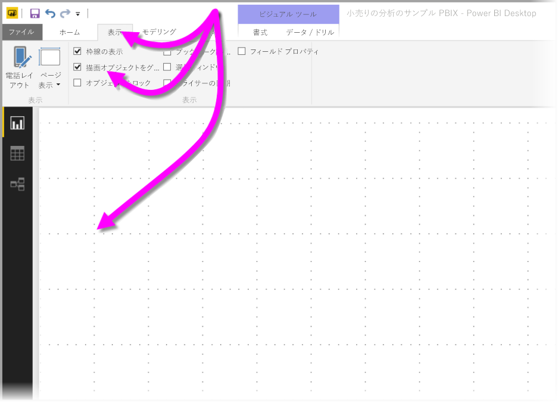
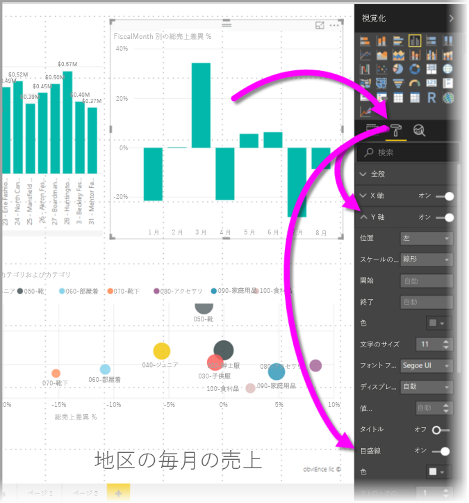
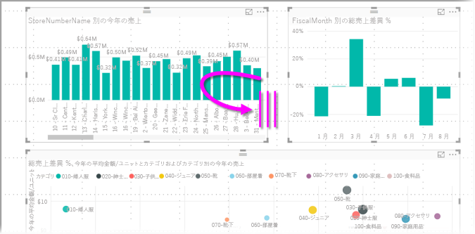
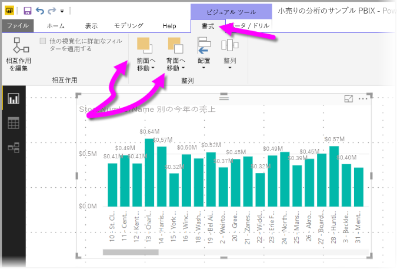
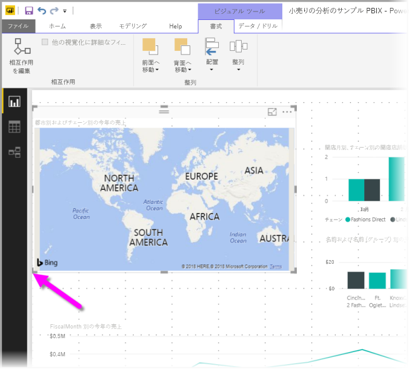
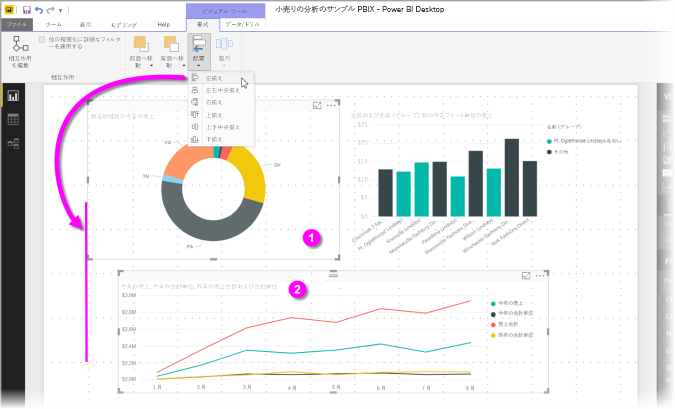
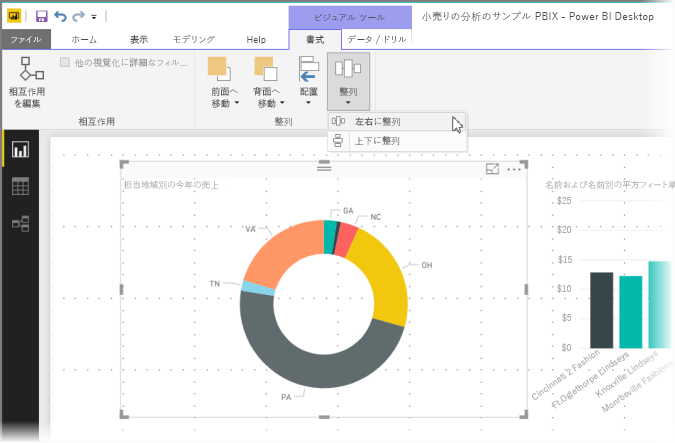

# Power BI Desktop レポートでグリッド線と "グリッドにスナップ" を使用する
**Power BI Desktop** のレポート キャンバスには、グリッド線と "グリッドにスナップ" 機能が提供されました。グリッド線を使用すると、レポート上でビジュアルを一直線に並べることができます。また、"グリッドにスナップ" 機能を使用すると、レポート内のビジュアルがきれいに揃えられ、間隔が均等に見えるようになります。

**Power BI Desktop** では、レポートのオブジェクトの重ね順 (前面へ移動、背面へ移動) を調整したり、キャンバスで選択したビジュアルを配置したり均等に整列したりすることもできます。

### グリッド線と "グリッドにスナップ" を有効にする
グリッド線と "グリッドにスナップ" を有効にするには、リボンの **[表示]** を選択し、**[グリッド線の表示]** と **[描画オブジェクトをグリッドにスナップ]** のチェック ボックスをオンにします。 どちらか一方または両方のオプションを選択できます。つまり、別々に動作します。

> [!NOTE]
> **[グリッド線の表示]** と **[描画オブジェクトをグリッドにスナップ]** が使用できない場合は、任意のデータ ソースに接続すると、使用できるようになります。
> 
> 

### グリッド線を使用する
グリッド線はビジュアルを揃えるのに役立つ目に見えるガイドです。 2 つ (以上) のビジュアルが水平方向または垂直方向に一直線に並んでいるかどうかを確認する場合は、ガイドラインを使用すると、これらの罫線が一直線に並んでいるかどうかを確認できます。

Ctrl キーを押しながらクリックを使用すると、複数のビジュアルを一度に選択できます。これにより、選択したすべてのビジュアルの罫線が表示されるため、ビジュアルが一直線に並んでいるかどうかを簡単に確認できます。

#### ビジュアル内でグリッド線を使用する
Power BI では、ビジュアル内にもグリッド線があります。データ ポイントや値を比較するための目に見えるガイドになります。 2017 年 9 月リリースの **Power BI Desktop** 以降、**X 軸**カードと **Y 軸**カード (ビジュアル タイプに基づく) でビジュアル内のグリッド線を操作できるようになりました。カードは **[視覚化]** ウィンドウの **[書式]** セクションにあります。 ビジュアル内では、グリッド線の次の要素を操作できます。

* グリッド線のオン/オフを切り替える
* グリッド線の色を変更する
* グリッド線のストローク (幅) を調整する
* 実線、破線、点線など、ビジュアルのグリッド線のスタイルを選択する

グリッド線の特定の要素を変更することは、ビジュアルに暗い背景が使用されているレポートで特に役立ちます。 次の画像では、**Y 軸**カードの **[グリッド線]** セクションを確認できます。

### "グリッドにスナップ" を使用する
**[描画オブジェクトをグリッドにスナップ]** チェック ボックスをオンにした場合、**Power BI Desktop** のキャンバス上のすべてのビジュアルは、移動 (またはサイズ変更) すると、自動的に最も近いグリッドの軸に合わせて整列されます。これにより、さらに簡単に複数のビジュアルが同じ水平方向または垂直方向の配置またはサイズに揃うようになります。

これで完了です。**グリッド線**と**グリッドにスナップ**を使用して、レポート内のビジュアルを一直線に並べることができました。

### 重ね順、配置、整列の使用
レポートでのビジュアルの前面から背面への順序 (要素の "*重ね順*") を管理できます。 この機能により、任意の方法でビジュアルを重ね合わせ、各ビジュアルの前後関係を調整することができます。 **[書式]** リボンの **[整列]** セクションの **[前面へ移動]** ボタンと **[背面へ移動]** ボタンを使用して、ビジュアルの順序を設定します。 **[書式]** リボンは、ページで 1 つ以上のビジュアルを選択するとすぐに表示されます。

**[書式]** リボンではさまざまな方法でビジュアルを揃えることができ、ページ上のビジュアルを最適な外観と動作に配置できます。

次の図に示すように、**[配置]** ボタンは、レポート キャンバスの端 (または中央) に選択したビジュアルを配置します。

複数のビジュアルを選ぶと、まとめて配置され、配置には既に配置されているビジュアルの境界が使われます。 たとえば、2 つのビジュアルを選んで **[左揃え]** オプションを選ぶと、ビジュアルは選択したすべてのビジュアルのうち左端の境界に揃えられます。

レポート キャンバスの全体に、ビジュアルを縦または横に整列することもできます。 それには、**[書式]** リボンの **[整列]** ボタンを使います。

これらのグリッド線、配置、整列ツールからいくつか選択するだけで、レポートを望む見た目にすることができます。

