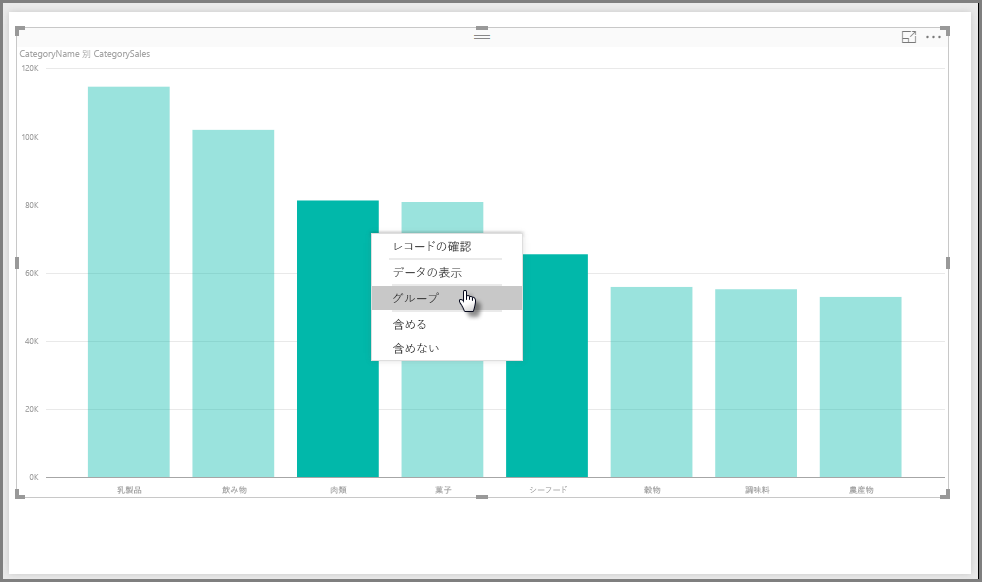
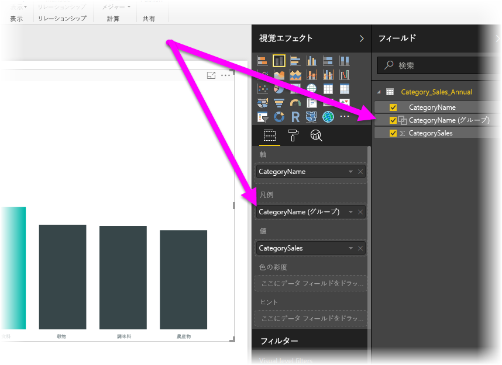
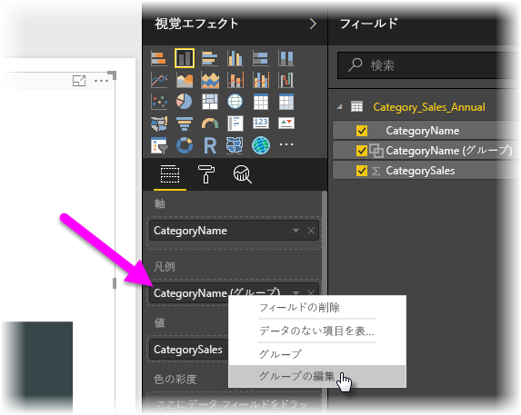
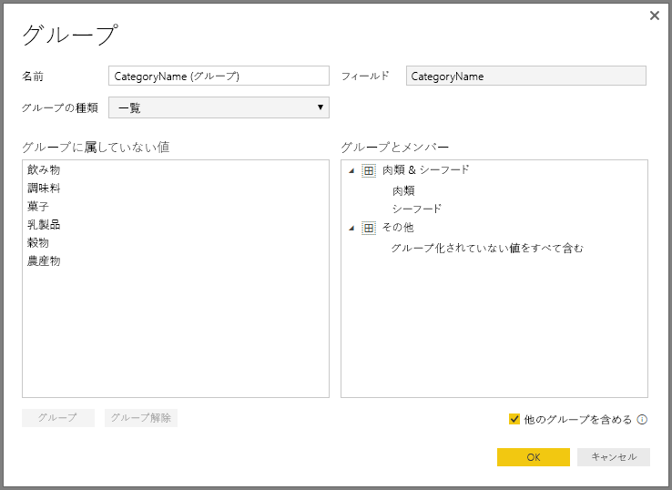
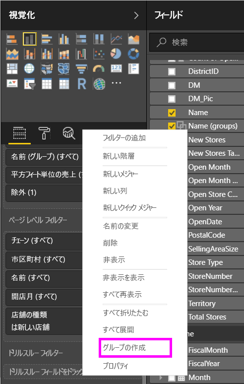
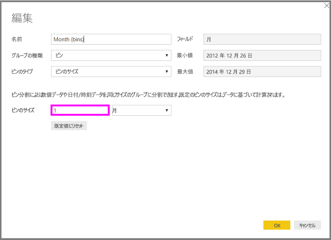
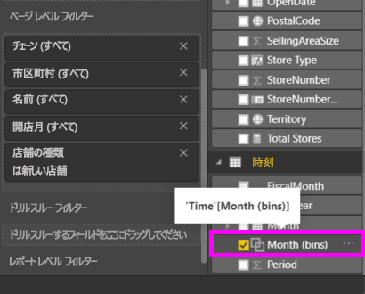

# Power BI Desktop でグループ化とビン分割を使用する
**Power BI Desktop** は、ビジュアルを作成するとき、基になっているデータで見つかった値に基づいて、データをチャンク (またはグループ) にまとめて集計します。 多くの場合は問題ありませんが、チャンクの表示方法の調整が必要になる場合もあります。 たとえば、3 つの製品カテゴリを 1 つの大きなカテゴリ (1 つの *グループ*) にしたい場合などです。 または、売上を均等に分割した 923,983 ドルではなく 1,000,000 ドルのビン サイズにしたいこともあります。

Power BI Desktop では、データ ポイントを**グループ化**して、ビジュアルでのデータと傾向の表示、分析、調査をいっそう明確にすることができます。 また、**ビン サイズ** (*ビン分割*とも呼ばれます) を定義して、意味のある方法でデータを視覚化しやすくする等しいサイズのグループに値をまとめることもできます。

### グループ化の使用
グループ化を使用するには、Ctrl キーを押しながら複数の要素をクリックして選択します。 次に、複数選択した要素の 1 つを右クリックし、表示されるメニューで **[グループ]** を選択します。

作成されたグループは、ビジュアルの **[凡例]** バケットに追加され、**[フィールド]** の一覧にも表示されます。

作成したグループのメンバーは、**[凡例]** バケットまたは **[フィールド]** の一覧でフィールドを右クリックし、**[グループの編集]** を選択することで、簡単に編集できます。

表示される **[グループ]** ウィンドウでは、新規グループの作成や既存グループの変更を行うことができます。 **[グループとメンバー]** ボックスでグループのタイトルをダブルクリックして新しい名前を入力することで、*グループの名前を変更する*こともできます。

グループを使用して、さまざまなことを行えます。 **[グループに属していない値]** の一覧から、新しいグループまたは既存のグループに項目を追加できます。 新しいグループを作成するには、**[グループに属していない値]** ボックスで複数の項目を選択し (Ctrl キーを押しながらクリック)、そのボックスの下の **[グループ]** ボタンをクリックします。

グループに属していない値を既存のグループに追加するには、グループに属していない値を選び、それを追加する既存のグループを選んで、**[グループ]** ボタンをクリックします。 グループから項目を削除するには、**[グループとメンバー]** ボックスで項目選び、**[グループ解除]** をクリックします。 また、グループに属していないカテゴリを **[その他]** グループに入れるか、またはグループに属さないままにするかを選択できます。

> [!NOTE]
> 既存のビジュアルで複数選択することなく、**[フィールド]** で任意のフィールドのグループを作成することもできます。 フィールドを右クリックし、表示されるメニューの **[グループ]** を選択するだけです。
> 
> 

### ビン分割の使用
**Power BI Desktop** の数値フィールドと時間フィールドに対してビンのサイズを設定できます。 ビン分割を使って、**Power BI Desktop** に表示されるデータを適切なサイズに設定できます。

ビンのサイズを適用するには、**[フィールド]** を右クリックし、**[グループ]** を選択します。

**[グループ]** ウィンドウで、**[ビンのサイズ]** を適切なサイズに設定します。

**[OK]** を選ぶと、**[フィールド]** ウィンドウに新しいフィールドが表示されます。フィールド名の後には "*(ビン)*" が追加されています。 その後は、フィールドをキャンバスにドラッグして、ビジュアルでビンのサイズを使うことができます。

**ビン分割**を実際に使っている様子は、こちらの[ビデオ](https://www.youtube.com/watch?v=BRvdZSfO0DY)でご覧いただけます。

**グループ化**と**ビン分割**を使ってレポートのビジュアルに意図したとおりにデータを表示する方法がわかります。

