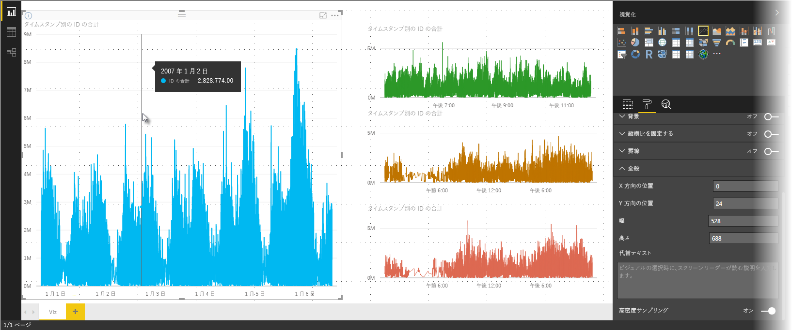
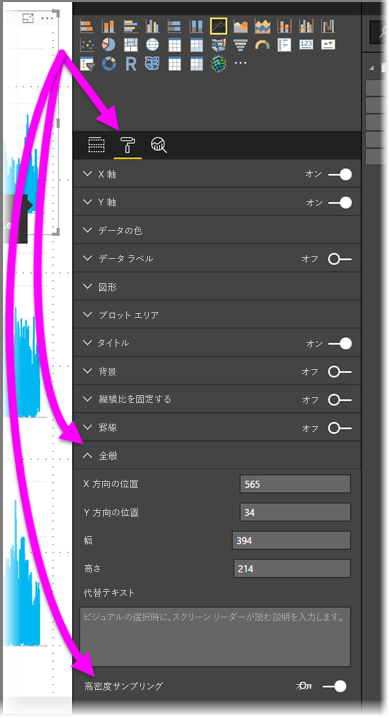

# Power BI の高密度線サンプリング
**Power BI Desktop** の 2017 年 6 月リリースおよび **Power BI サービス**の更新以降、新しいサンプリング アルゴリズムが使用可能です。これにより、高密度データをサンプリングする視覚エフェクトが改善されます。 たとえば、小売店の売上結果から折れ線グラフを作成するとします。各店舗の売上金は毎年 1 万を超えています。 このような売上情報の折れ線グラフで、各店舗のデータをサンプリングし (そのデータのわかりやすい表記を選択して、時間の経過と共に売り上げがどのように変化しているかを示す)、複数系列折れ線グラフを作成し、基になるデータを表します。 これは高密度データを視覚化する一般的な方法です。Power BI Desktop では高密度データのサンプリングが改善されました。詳細については、この記事で説明します。

> [!NOTE]
> この記事で説明する**高密度サンプリング** アルゴリズムは、**Power BI Desktop** と **Power BI サービス**の両方に適用され、使用可能です。
> 
> 

## 高密度データ線サンプリングのしくみ
これまで、**Power BI** では、決定論的な方法で基になるデータ全体のサンプル データ ポイントのコレクションを選択していました。 たとえば、1 カレンダー年にわたる視覚エフェクトの高密度データの場合、350 のサンプル データ ポイントが視覚エフェクトで表示されます。各ポイントを選択すると、データ全体 (基になるデータの系列全体) が視覚エフェクトで表されます。 このしくみをわかりやすくするために、例として、1 年間の株価をプロットし、365 のデータ ポイントを選択して折れ線グラフの視覚エフェクトを作成していました (つまり、1 データ ポイント/日)。

その場合、各日内の株価の値が多数存在します。 もちろん、日々の高値と安値はありますが、株式市場が開いている間、これらは随時変動する可能性があります。 高密度線サンプリングでは、基になるデータ サンプルが毎日午前 10 時 30 分と午後 12 時 00 分に取得された場合、基になるデータの代表的なスナップショット (午前 10 時 30 分と午後 12 時 00 分の価格) を取得しますが、その代表的なデータ ポイント (その日) の株価の実際の高値と安値がキャプチャされていない場合があります。 このような状況 (および他の状況) では、サンプルは基になるデータの代表的なものとなりますが、必ずしも重要なポイントがキャプチャされるとは限りません。その場合、日々の株価の高値と安値が複数存在することになります。

定義上、高密度データは視覚エフェクトを有効にするためにサンプリングされます。視覚エフェクトはある程度簡単に作成でき、対話型です (視覚エフェクトのデータ ポイントが多すぎると動作が完全に停止し、傾向の可視性が損なわれる可能性があります)。 最適な視覚化エクスペリエンスを提供する、このようなデータのサンプリング方法は、サンプリング アルゴリズムの作成を促すものです。 Power BI Desktop では、アルゴリズムが改善され、各タイム スライスの重要なポイントの応答性、表記、および明確な保存の最適な組み合わせが提供されます。

## 新しい線サンプリング アルゴリズムのしくみ
高密度線サンプリングの新しいアルゴリズムは、連続 x 軸を含む折れ線グラフと面グラフの視覚エフェクトで使用可能です。

高密度の視覚エフェクトの場合、**Power BI** はインテリジェントにデータを高解像度のチャンクにスライスしてから、重要なポイントを選んで各チャンクを表します。 高解像度データをスライスするこの処理は特別に調整され、生成されるグラフが、基になるすべてのデータ ポイントをレンダリングする場合と視覚的には区別できないものの、より高速で対話的になるようにします。

### 高密度線の視覚エフェクトの最小値と最大値
特定の視覚エフェクトでは、次の視覚エフェクトに関する制限事項が適用されます。

* 基になるデータ ポイントまたは系列の数に関係なく、視覚エフェクトで*表示される*データ ポイントの最大数は **3,500** です。 そのため、それぞれ 350 のデータ ポイントがある 10 系列の場合、視覚エフェクトはそのデータ ポイント全体の最大制限に達します。 1 系列の場合、新しいアルゴリズムで基になるデータの最適なサンプリングであると判断されると、最大 3,500 のデータ ポイントが含まれる可能性があります。
* 視覚エフェクトには、最大 **60 の系列**があります。 60 を超える系列がある場合は、データを分割し、それぞれ 60 以下の系列を含む複数の視覚エフェクトを作成します。 **スライサー**を使用して、データのセグメントのみ (特定の系列のみ) が表示されるようにすることをお勧めします。 たとえば、凡例ですべてのサブカテゴリを表示する場合は、スライサーを使用して、同じレポート ページのカテゴリ全体でフィルター処理することができます。

これらのパラメーターを使用することで、Power BI Desktop の視覚エフェクトで非常に短時間にレンダリングできるようになります。また、視覚エフェクトをレンダリングするコンピューターでの計算オーバーヘッドが過度になることはありません。

### 高密度線の視覚エフェクトで代表的なデータ ポイントを評価する
基になるデータ ポイントの数が、視覚エフェクトで表すことができるデータ ポイント (3,500) を超えた場合、*ビン分割*と呼ばれるプロセスが開始され、基になるデータは*ビン*と呼ばれるグループにチャンクされてから、それらのビンが繰り返し細分化されます。

アルゴリズムではできるだけ多くのビンを作成し、視覚エフェクトの細分度を最適なものにします。 各ビン内で、アルゴリズムは最小および最大データ値を検索し、視覚エフェクトで重要および重大な値 (外れ値など) がキャプチャされ、表示されることを確認します。 Power BI でのデータのビン分割と以降の評価の結果に基づいて、視覚エフェクトの x 軸の最小解像度が決まり、視覚エフェクトの最大細分度が確保されます。

前述のように、各系列の最小細分度は 350 ポイントで、最大は 3,500 です。

各ビンは 2 つのデータ ポイントで表され、このデータ ポイントが視覚エフェクトのビンの代表的なデータ ポイントになります。 データ ポイントはそのビンの単なる高値と低値であり、高値と低値を選択することで、ビン分割プロセスによって、重要な高値、または重大な低値が視覚エフェクトで確実にキャプチャされ、レンダリングされるようになります。

多くの分析で確実に不定期の外れ値がキャプチャされ、視覚エフェクトで適切に表示されるのが正しい動作です。それがまさしく、新しいアルゴリズムとビン分割プロセスの背後にある理由です。

## ヒントと高密度線サンプリング
特定のビンの最小および最大値が視覚エフェクトでキャプチャされ、表示される、このビン分割プロセスが、データ ポイントにマウス カーソルを合わせたときのヒントでのデータの表示方法に影響する可能性があることに注意してください。 この状態がどのように、また、なぜ発生するのかを説明するために、この記事の前述の株価の例をここでも使用します。

たとえば、株価に基づいて視覚エフェクトを作成し、2 つの異なる株を比較するとします。これらの両方で**高密度サンプリング**を使用します。 各系列の基になるデータには多数のデータ ポイントがあります (常時、株価をキャプチャしていると考えられます)。 高密度線サンプリング アルゴリズムでは、各系列に対して個別にビン分割を実行します。

ここで、最初の株の価格が 12 時 02 分に急騰し、10 秒後にすぐに戻ったとします。これは重要なデータ ポイントです。 その株でビン分割する場合、12 時 02 分の時点の高値がそのビンの代表的なデータ ポイントとなります。

ただし、2 番目の株の場合、12 時 02 分はその時刻を含むビンの高値でも安値でもありませんでした。12 時 02 分を含むビンの高値と安値は 3 分後に発生したと考えられます。 このような場合に、折れ線グラフが作成され、12 時 02 分にマウス カーソルを合わせると、最初の株のヒントには値が表示されますが (12 時 02 分に株価が急騰し、その値がそのビンの高データ ポイントとして選択されたため)、2 番目の株の 12 時 02 分のヒントには値は表示*されません*。 これは、2 番目の株には、12 時 02 分を含むビンの高値と安値がなかったためです。 したがって、12 時 02分の 2 番目の株について表示されるデータはないため、ヒントのデータは表示されません。

このような状態はヒントでは頻繁に発生します。 特定のビンの高値と安値は、均等にスケーリングされた x 軸値のポイントと完全に一致しない場合があり、そのようなヒントには値は表示されません。  

## 高密度線サンプリングを有効にする方法
既定では、新しいアルゴリズムは**有効**になっています。 この設定を変更するには、**[書式設定]** ウィンドウに移動します。その **[全般]** カードの下部には、**[高密度サンプリング]** というトグル スライダーがあります。 これを無効にするは、**[オフ]** にスライドします。

## 考慮事項と制限事項
高密度線サンプリングの新しいアルゴリズムは、Power BI の重要な拡張機能ですが、高密度の値とデータを処理する場合に知っておく必要がある考慮事項がいくつかあります。

* 細分性を高めたことで、またビン分割プロセスが原因で、**ヒント**で値を表示できるのは、代表データをカーソルで揃えた場合のみとなります。 詳細については、この記事の前半の**ツールヒント**に関するセクションを参照してください。
* データ ソース全体のサイズが大きすぎる場合、新しいアルゴリズムでは系列 (凡例の要素) を削除し、データ インポートの最大制約を適用します。
  
  * このような場合、新しいアルゴリズムでは凡例の系列をアルファベット順に並べ替え、データ インポートの上限に達し、追加の系列がインポートされなくなるまで、アルファベット順に上から汎用要素のリストが開始されます。
* 基になるデータ セットに 60 (前述の系列の最大数) 以上の系列が含まれている場合、新しいアルゴリズムではアルファベット順に系列を並べ替え、アルファベット順に並べられた 60 番目の系列より後の系列を削除します。
* データの値の型が*数値*や*日付/時刻*でない場合、Power BI は新しいアルゴリズムを使用せず、以前のアルゴリズム (非高密度サンプリング) に戻します。
* 新しいアルゴリズムでは、**[データのない項目を表示する]** 設定がサポートされていません。
* SQL Server Analysis Services (2016 以前のバージョン) でホストされているモデルへのライブ接続を使用する場合、新しいアルゴリズムはサポートされません。 **Power BI** または Azure Analysis Services でホストされているモデルではサポートされます。

## 次の手順
散布図の高密度サンプリングについては、次の記事をご覧ください。

* [Power BI 散布図の高密度サンプリング](desktop-high-density-scatter-charts.md)

