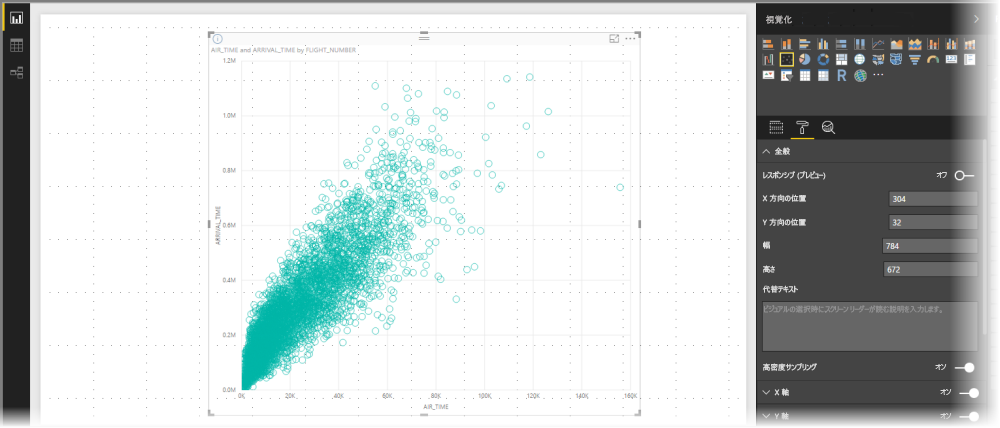
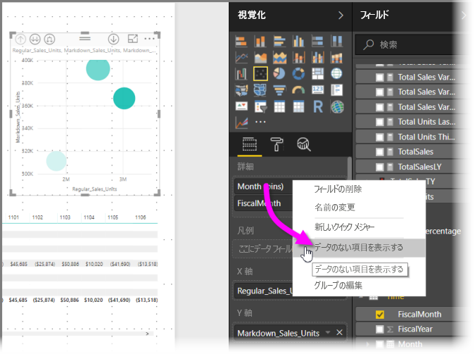
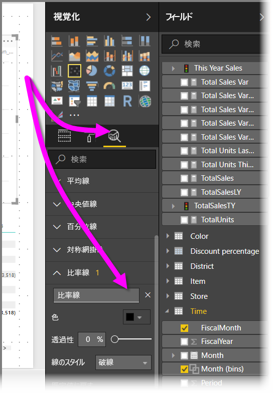
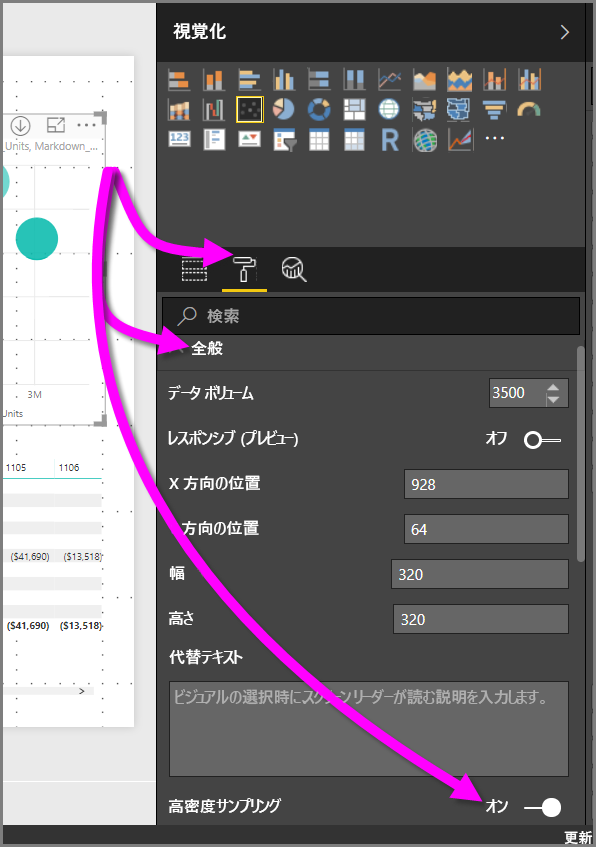

# Power BI 散布図の高密度サンプリング
**Power BI Desktop** の 2017 年 9 月リリースおよび **Power BI サービス**の更新以降、新しいサンプリング アルゴリズムが使用可能です。これにより、散布図で高密度データを表す方法が改善されます。

たとえば、一年あたりの各店舗のデータ ポイントが数万になる組織の営業活動から散布図を作成することがあります。 このような情報の散布図では、使用可能なデータからデータをサンプリングし (そのデータのわかりやすい表現を選択して、時間の経過と共に売上がどのように発生しているかを把握し)、基になるデータを表す散布図を作成します。 これは、高密度散布図の一般的な方法です。 Power BI Desktop では高密度データのサンプリングが改善されました。詳細については、この記事で説明します。

> [!NOTE]
> この記事で説明する**高密度サンプリング** アルゴリズムは、**Power BI Desktop** と **Power BI サービス**の両方の散布図に使用できます。
> 
> 

## 高密度散布図のしくみ
これまで、**Power BI** では、決定論的な方法で基になるデータ全体のサンプル データ ポイントのコレクションを選択して散布図を作成していました。 具体的には、Power BI では、散布図グラフの系列の最初と最後の行のデータを選択し、次に合計 3,500 のデータ ポイントを散布図グラフにプロットできるように、残りの行を均等に分割します。 たとえば、サンプルに 35,000 行がある場合、プロットする最初と最後の行を選択し、次にすべての 10 番目ごとの行 (35,000/10 = すべての 10 番目ごとの行 = 3,500 データ ポイント) もプロットします。 以前は、データ系列内の null 値またはプロットできないポイント (テキスト値など) は表示されませんでした。そのためそれらはビジュアルを生成するときに考慮されませんでした。 このようなサンプリングでは、散布図の見かけ上の密度も、表現可能なデータ ポイントに基づいているため、暗黙的な視覚的密度は、サンプリングされたポイントの状況であり、基になるデータの完全なコレクションではありませんでした。

**高密度サンプリング**を有効にすると、Power BI は、重複するポイントを排除するアルゴリズムを実装し、ビジュアルを操作するときに、ビジュアル上のポイントに確実に到達できるようにします。 また、このアルゴリズムではデータ セット内のすべてのポイントがビジュアルで表現されるので、代表的なサンプルのプロットだけではなく、選択されたポイントの意味を示すコンテキストが提供されます。

定義上、高密度データは、対話機能に応答する視覚エフェクトを妥当な時間で作成するためにサンプリングされます。 ビジュアルのデータ ポイントが多すぎると繁雑になり、トレンドが見えにくくなる可能性があります。 したがって、データのサンプリング方法は、最適な視覚化エクスペリエンスを提供して、すべてのデータを確実に表現する、サンプリング アルゴリズムの作成を促すものです。 Power BI では、アルゴリズムが改善され、全体的なデータ セットの重要なポイントの応答性、表記、および明確な保存の最適な組み合わせが提供されます。

> [!NOTE]
> **高密度サンプリング** アルゴリズムの使用する散布図は、すべての散布図と同じように、正方形のビジュアルにプロットするのが最も効果的です。
> 
> 

## 新しい散布図サンプリング アルゴリズムのしくみ
**高密度サンプリング**用の新しいアルゴリズムでは、基になるデータをより効果的に取得して表現する方法を採用し、重複するポイントを排除しています。 これは、各データ ポイントの小さな半径 (視覚化された特定のポイントの視覚的な円のサイズ) から操作を開始します。 その後すべてのデータ ポイントの半径を増加させ、2 つ (またはそれ以上) のデータ ポイントが重複すると、1 つの円 (増加した半径サイズ) が、それらの重複したデータ ポイントを表します。 このアルゴリズムで、半径値の結果として適切な数のデータ ポイント(3,500) が散布図に表示されるようになるまで、データ ポイントの半径を増加し続けます。

このアルゴリズムのメソッドでは、外れ値が確実に結果のビジュアルで表現されます。 アルゴリズムは、さらに重複を判断するときにスケールを優先します。そのため、指数スケールが基になる視覚化されるポイントに忠実に視覚化されます。

アルゴリズムは、散布図の全体的な形状も維持します。

> [!NOTE]
> 散布図の**高密度サンプリング**アルゴリズムを使用する場合、データの*正確な分布*が目標であり、暗黙的なビジュアル密度は目標*ではありません*。 たとえば、特定のエリア内に多くの重複する円 (密度) がある散布図が表示される場合があります。**高密度サンプリング** アルゴリズムでは、1 つの円を使用して多数のデータ ポイントを表すことができるため、このような暗黙的な密度 (または "クラスタ") は表示されません。 特定のエリアの詳細を取得するには、スライサーを使用してズーム インすることができます。
> 
> 

さらに、プロットできないデータ ポイント (null 値やテキスト値など) は無視されるので、プロットできる別の値が選択され、散布図の真の形がさらに確実に維持されます。

### 散布図の標準のアルゴリズムを使用する場合
**高密度のサンプリング**を散布図に適用できず、元のアルゴリズムを使用する状況があります。 このような状況は次のとおりです。

* **[詳細]** で値を右クリックしてメニューから **[データのない項目を表示する]** に設定した場合、散布図は元のアルゴリズムに戻ります。
  
  
* **[再生]** 軸に値がある場合、散布図は元のアルゴリズムに戻ります。
* 散布図の X と Y の両方の軸が存在しない場合、図は元のアルゴリズムに戻ります。
* **[分析]** ウィンドウで **[比率線]** を使用すると、図は元のアルゴリズムに戻ります。
  
  

## 散布図の [高密度サンプリング] を有効にする方法
**[高密度サンプリング]** を有効にするには、散布図を選択して **[書式設定]** ウィンドウに移動し、**[全般]** カードを展開して、カードの下部にある、**[高密度サンプリング]** トグル スライダーを **[オン]** にスライドします。

> [!NOTE]
> スライダーが有効になると、Power BI は、使用可能なときには常に**高密度サンプリング**の使用を試行します。 このアルゴリズムを使用できない場合 (たとえば、[*再生*] 軸に値を配置した場合)、図は標準アルゴリズムに戻されますが、スライダーは **[オン]** の位置のままです。 *[再生]* 軸の値を削除した場合 (または、高密度サンプリング アルゴリズムを使用できるように条件が変更された場合)、機能が有効になっているので、図は自動的に高密度のサンプリングを使用します。
> 
> [!NOTE]
> データ ポイントはインデックスによってグループ化または選択されます。 凡例の使用は、アルゴリズムに影響しません。ビジュアルの順序にのみ影響します。
> 
> 

## 考慮事項と制限事項
高密度線サンプリング アルゴリズムは、Power BI の重要な拡張機能ですが、高密度の値と散布図を処理する場合に知っておく必要がある考慮事項がいくつかあります。

* **高密度サンプリング** アルゴリズムは、Power BI サービスに基づくモデル、インポートしたモデル、または DirectQuery へのライブ接続でのみ動作します。

## 次の手順
他の図の高密度サンプリングの詳細については、次の記事をご覧ください。

* [Power BI の高密度線サンプリング](desktop-high-density-sampling.md)

