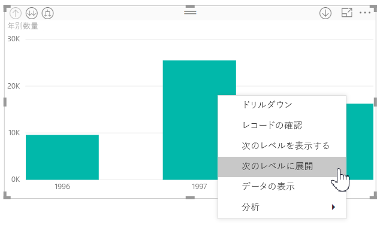
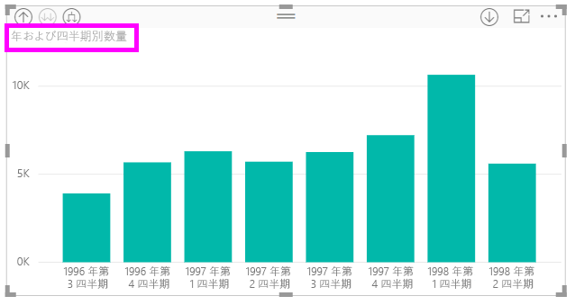
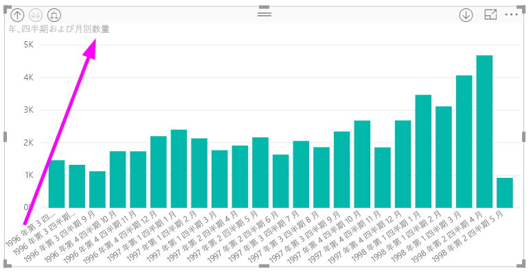
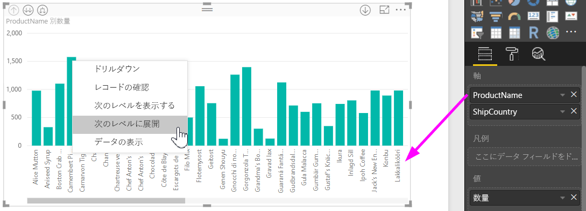
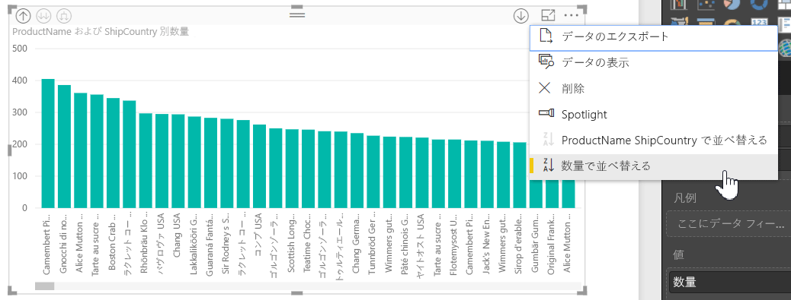
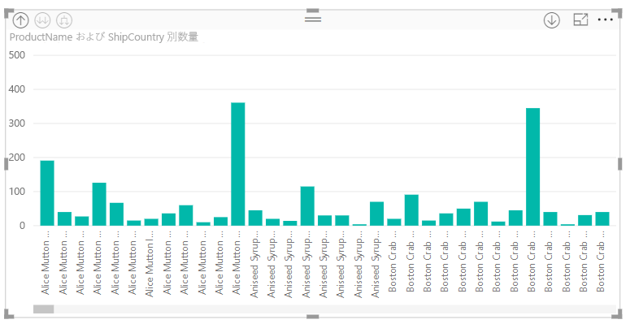

# Power BI Desktop でのインライン階層ラベルの使用
**Power BI Desktop** は**インライン階層ラベル**の使用をサポートします。これは、階層的ドリルダウンの拡張を意図した 2 つの機能の 1 つです。 もう 1 つの機能は、現在開発中の、入れ子の階層ラベルを使用する機能です (頻繁に更新中です。ご期待ください)。   

## インライン階層ラベルのしくみ
インライン階層ラベルの使用時に、**[すべて展開]** 機能を使用してビジュアルを展開すると、階層ラベルを表示できます。 このような階層ラベルを表示する大きなメリットの 1 つは、階層データを展開する際に、これらのさまざまな階層ラベルを基準とした **[並べ替え]** も選べることです。

### 組み込みの展開機能の使用法 (階層ラベルを基準として並べ替えない)
インライン階層ラベルが動作している様子を確認する前に、**[次のレベルに展開]** 機能の既定の動作を確認しましょう。 これは、インライン階層ラベルの便利さを理解する (そして高く評価する) のに役立ちます。

次の図は、年間売り上げ高の棒グラフのビジュアルを示しています。 バーを右クリックすると、**[次のレベルに展開]** を選択できます。

> [!NOTE]
> 代わりに、バーを右クリックして、視覚化の左上で *[展開]* ボタンを選択することもできます。

  ![[展開] ボタン](media/desktop-inline-hierarchy-labels/desktop-inline-hierarchy-labels-expand-button-finger.png)

いったん **[次のレベルに展開]** を選ぶと、次の図に示すように、ビジュアルで日付階層が *[年]* から *[四半期]* に展開されます。

*[年]* と *[四半期]* のラベルが共にインライン表示されることにご注意ください。このラベル付けのスキームは、**[すべて展開]** で階層の最下部に達するまで続きます。

組み込みの*日付*階層は以上のように動作します。この階層は、*日付/時刻*データ型のフィールドに関連付けられています。 次のセクションに進み、新しいインライン階層ラベル機能の相違点を確認しましょう。

### インライン階層ラベルの使用法
次に、非公式な階層のあるデータを使用した、別のグラフを調べてみましょう。 次のビジュアルには、*ProductName* を軸として使用した **Quantity** (数量) の棒グラフが示されています。 このデータでは、*ProductName* と *ShipCountry* が非公式の階層を形成しています。 ここから、もう一度 *[次のレベルに展開]* を選んで階層をドリルダウンします。

**[次のレベルに展開]** を選ぶと、階層ラベルのインライン表示で次のレベルが表示されます。 既定では、インライン階層は、メジャーの値を基準として並べ替えられます。この場合は、**Quantity** (数量) です。 インライン階層ラベルを有効にすると、次の図に示すように、右上隅の省略記号ボタン (**....**) を選んでから、**[ProductName ShipCountry で並べ替え]** を選ぶと、このデータの階層を基準とした並べ替えも選べます。

いったん **[ShipCountry]** を選ぶと、次の図に示すように、非公式の階層の選択内容に基づいてデータが並べ替えられます。

> [!NOTE]
> インライン階層ラベル機能では、組み込みの時刻階層を値で並べ替えることはまだできません。並べ替えは階層の順序に限られます。
> 
> 

## トラブルシューティング
展開されたインライン階層のレベルの状態でビジュアルが固定されてしまうことがあります。 場合によっては、展開されたモードでビジュアルが固定されて、ドリル アップが動作しなくなります。 この状態は、次の手順を実行した場合に発生することがあります (この問題の修正方法を、手順の*下*に示します)。

以下の手順を実行すると、展開された状態でビジュアルが固定される可能性があります。

1. **インライン階層ラベル**機能を有効にします。
2. 階層のあるビジュアルを作成します。
3. その後、**[すべて展開]** してファイルを保存します。
4. その後、**インライン階層ラベル**機能を*無効にして*、Power BI Desktop を再起動します。
5. その後、ファイルを再び開きます。

以上の手順を実行して、展開されたモードでビジュアルが固定されたら、以下の手順に従ってトラブルシューティングできます。

1. もう一度**インライン階層ラベル**機能を有効にしてから、Power BI Desktop を再起動します。
2. もう一度ファイルを開き、影響を受けたビジュアルの最上部にさかのぼってドリルアップします。
3. ファイルを保存します。
4. **インライン階層ラベル**機能を無効にしてから、Power BI Desktop を再起動します。
5. 再びファイルを開きます。

または、単純にビジュアルを削除して再作成するだけでもかまいません。

