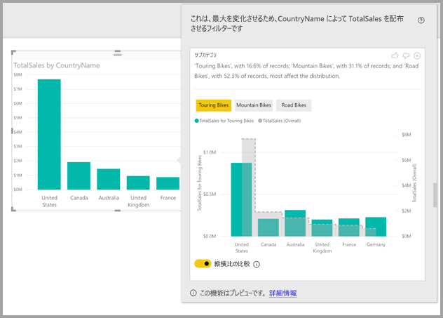
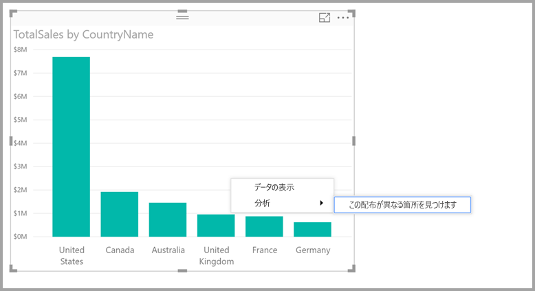

# Power BI Desktop の分析情報を利用し、販売総数が異なる箇所を見つける (プレビュー)

ビジュアルでデータ ポイントを見るとき、異なるカテゴリに対して販売総数 (ディストリビューション) が同じになるか気になることがあります。 **Power BI Desktop** の**分析情報**を利用すれば、数回のクリックでわかります。

*売上合計*を*国*別に示した次のビジュアルについて考えてください。 このグラフが示すように、売り上げのほとんどは米国からであり、売り上げ全体の 57% を占めています。その他の国からの売り上げは米国より少なくなっています。 このような例では、異なる部分母集団でも販売総数が同じかどうかを調べてみると興味深いことがよくあります。 たとえば、この結果は毎年同じでしょうか。全販売経路で同じでしょうか。製品の全カテゴリで同じでしょうか。  さまざまなフィルターを適用し、結果を視覚的に比べてみることはできますが、その方法では時間がかかり、間違いが起こりやすくなります。 

販売総数の異なる箇所を見つけるように **Power BI Desktop** に指示すれば、データを自動分析し、短時間で洞察力のある情報が得られます。 データ ポイントを右クリックし、**[分析]、[Find where the distribution is different]\(分布が異なる部分を見つける\)** の順にクリックします。使いやすいウィンドウに分析情報が表示されます。

この例の自動分析では、*ツーリング バイク*の売り上げに占める割合は米国とカナダが低く、その他の国が高いことをすぐに確認できます。   

> [!NOTE]
> この機能はプレビュー段階であり、変更される可能性があります。 2017 年 9 月バージョンの **Power BI Desktop** 以降では、インサイト機能は既定で有効になります ([プレビュー] チェック ボックスをオンにして有効にする必要はありません)。
> 
> 

## インサイトの使用
分析情報を利用してグラフ上の販売総数が異なる箇所を見るには、データ ポイント (あるいは、グラフ全体) を右クリックし、**[分析]、[Find where the distribution is different]\(分布が異なる部分を見つける\)** の順にクリックします。

次に、**Power BI Desktop** によってデータに対して機械学習アルゴリズムが実行され、分布が最も異なるカテゴリ (縦棒) およびその縦棒の値に関する説明とビジュアルがウィンドウに取り込まれます。 次の画像のように、分析情報は縦棒グラフとして提供されます。 

選択したフィルターが適用された値が通常の既定色で表示されます。 最初のビジュアルにあった値が端から端までグレーで表示されるので簡単に比較できます。 最大 3 つの異なるフィルターを含めることができます (この例では、*ツーリング バイク*、*マウンテン バイク*、*ロード バイク*)。クリックすることでさまざまなフィルターを選択できます (あるいは、Ctrl キーを押しながらクリックして複数選択)。

この例の*売上合計*のように単純な加法測度の場合、比較は絶対値ではなく相対値に基づきます。 そのため、ツーリング バイクの売上は全カテゴリの全体的売上より低いが、既定のビジュアルでは 2 つの軸を利用し、売上に占める割合を国別で比較し、ツーリング バイクの売上と全カテゴリの自転車の売上を比較できます。  ビジュアルの下にあるトグルを切り替えると、同じ軸に 2 つの値が表示され、簡単に絶対値を比較できます (下の画像をご覧ください)。    

説明テキストからは、フィルターに一致するレコードの数により重要性の度合いも示されます。この度合いはフィルター値に付けられることがあります。 この例では、*ツーリング バイク*の販売総数は特異かもしれませんが、レコードに占める割合は 16.6% に過ぎません。

ページの上部にある*上向き親指*と*下向き親指*のアイコンを使用して、ビジュアルと機能に関するフィードバックを送ることができます。 このアイコンからはフィードバックが提供されますが、現在のところ、次回この機能を使用したときに違う結果を返すよう、アルゴリズムがトレーニングされることはありません。

さらに重要なのがビジュアルの上部にある **+** ボタンです。これを使用すれば、ビジュアルを手動で作成した場合と同じように、レポートに選択したビジュアルを追加できます。 その後、レポートの他のビジュアルと同じように、追加したビジュアルの書式を設定したり、調整したりすることができます。 選択したインサイト ビジュアルを追加できるのは、**Power BI Desktop** でレポートを編集する場合のみです。

インサイトは、レポートが読み取りモードの場合、または編集モードの場合に使用でき、データの分析と、レポートに簡単に追加できるビジュアルの作成の両方で使用できます。

## 返される結果の詳細
モデル内のすべての縦棒を取り込み、縦棒のすべての値について値をフィルターとして元のビジュアルに適用し、元のビジュアルとは最も*異なる*結果を生み出すフィルター値を見つけるアルゴリズムについて考えます。

当然、*異なる*とはどのような意味か気になるでしょう。 たとえば、米国とカナダでは売上が全体的に次のように分かれるとします。

|国  |売上 ($M)|
|---------|----------|
|米国      |15        |
|カナダ   |5         |

これに対し、特定の製品カテゴリ ("*ロード バイク*") の売上は次のように分かれます。

|国  |売上 ($M)|
|---------|----------|
|米国      |3        |
|カナダ   |1         |

それぞれの表で数字は異なりますが、米国とカナダの間の相対値は同じです (全体の場合もロード バイクの場合も、75% 対 25% です)。 そのため、この指標は異なるとは見なされません。 このような単純な加法測度の場合、このアルゴリズムでは*相対*値の相違が求められます。  

対照的に、利益を原価で割り算して求められる利益率のような測度について考えてください。米国とカナダの全体的な利益率は次のようになるとします。

|国  |利益率 (%)|
|---------|----------|
|米国      |15        |
|カナダ   |5         |

これに対し、特定の製品カテゴリ ("*ロード バイク*") の売上は次のように分かれます。

|国  |利益率 (%)|
|---------|----------|
|米国      |3        |
|カナダ   |1         |

このような指標の性質からすると、興味深いことにこれが異なると*見なされます*。 この利益率の例のような非加法的測度の場合、このアルゴリズムでは絶対値の相違が求められます。

そのため、表示されるビジュアルの意図は、(元のビジュアルで見られた) 全体的な販売総数と特定のフィルターが適用された値の間に見つけられる相違を明確に示すことになります。  

前の例にあった*売上*のような加法測度の場合、2 つの軸と適切なスケーリングで相対値を簡単に比較できる縦棒/横棒グラフが使用されます。 縦棒ではフィルターが適用された値が示され、横棒では全体値が示されます (通常、縦棒軸が左に、横棒軸が右に表示されます)。 横棒は*ステップ* (段) と破線で描かれ、グレーで塗られます。前の例では、縦棒軸の最大値が 4 で、横棒軸の最大値が 20 の場合、フィルターを適用した値と全体値について、米国とカナダの間の相対値を簡単に比較できます。 

同様に、前の例にあった*利益率*などの非加法的測度の場合、1 つの軸を使用することで絶対値を簡単に比較できる縦棒/横棒グラフが使用されます。 繰り返しになりますが、(グレーで塗られた) 横棒では全体値が示されます。 実際値を比較する場合でも、相対値を比較する場合でも、値の差異を計算するだけでは、2 つの販売総数の違いの程度を判断することはできません。 例:

* 母集団の規模が要因として考慮されます。母集団全体の一部に (部分母集団に) 適用されるとき、違いの意味が統計的に重要でなくなります。 たとえば、特定の製品に対して各国の売上が非常に異なることがあっても、製品が何千種類とあり、その特定の製品が全体的な売上に占める割合が微々たるものであれば、それは重要であるとは見なされません。

* 元の値が非常に高いかゼロに非常に近いカテゴリの差異には、他のカテゴリより高い重み付けが与えられます。 たとえば、ある国が売上全体の 1% にしか貢献していなくても、特定の種類の製品で 6% 貢献しているとき、貢献度が 50% から 55% に変化する国よりも統計的に意味があり、そのため重要であると見なされます。 

* 最も意味のある結果を選択する目的で、さまざまなヒューリスティックス (発見的手法) が採用されます。たとえば、データ間のその他の関係を考慮します。
     
さまざまな縦棒と各縦棒の値を調べた後、最も大きな違いを与える値セットが選択されます。 理解しやすいように縦棒別にグループ化された上で出力され、最も大きな違いを与える値を含む列が一覧の最初に表示されます。 縦棒ごとに最大 3 つの値が表示されますが、効果が大きな値が 3 つより少なければ、あるいはある値のインパクトが他の値よりはるかに高ければ、3 つより少なく表示されることがあります。 

限られた時間では、モデル内の縦棒がすべて調べられるとは限りません。そのため、インパクトが最も大きい縦棒と値が表示される保証はありません。 しかしながら、最も可能性の高い縦棒が最初に調べられるよう、さまざまなヒューリスティックスが採用されています。 たとえば、縦棒をすべて調べた後、次の縦棒/値が販売総数において最もインパクトが大きいと判断されたとします。インパクトの大きい順に上から下に並んでいます。

    Subcategory = Touring Bikes
    Channel = Direct
    Subcategory = Mountain Bikes
    Subcategory = Road Bikes
    Subcategory = Kids Bikes
    Channel = Store

この場合、縦棒の順序で次のように出力されます。

    Subcategory: Touring Bikes, Mountain Bikes, Road Bikes (only three listed, with the text including “...amongst others” to indicate that more than three have a significant impact) 

    Channel = Direct (only Direct listed, if it’s level of impact was much greater than Store)

## 考慮事項と制限事項
**インサイト**で現在サポートされていないシナリオには、次のようなものがあります。

* 上位 N フィルター
* メジャー フィルター
* 数値以外のメジャー
* "値の表示方法" の使用
* フィルターが適用された指標 - フィルターが適用された指標とは、特定のフィルター (*フランスの売上合計*など) が適用されたビジュアル レベルの計算結果であり、分析情報機能によって作成された一部のビジュアルで使用されます。

さらに、次のモデルの種類とデータ ソースは現在、インサイトではサポートされていません。

* DirectQuery
* ライブ接続
* オンプレミスの Reporting Services
* 埋め込み

## 次の手順
**Power BI Desktop** と作業の開始方法の詳細については、次の記事を確認してください。

* [Power BI Desktop とは何ですか?](desktop-what-is-desktop.md)
* [Power BI Desktop でのクエリの概要](desktop-query-overview.md)
* [Power BI Desktop のデータ ソース](desktop-data-sources.md)
* [Power BI Desktop におけるデータへの接続](desktop-connect-to-data.md)
* [Power BI Desktop でのデータの整形と結合](desktop-shape-and-combine-data.md)
* [Power BI Desktop での一般的なクエリ タスク](desktop-common-query-tasks.md)   

