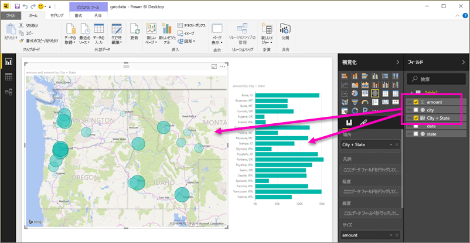
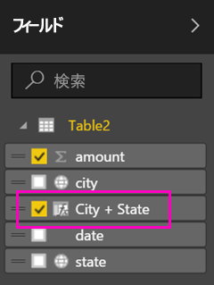

# モバイル アプリ向けの Power BI Desktop で地理的フィルターを設定する
Power BI Desktop で列の[地理的データを分類](desktop-data-categorization.md)し、Power BI Desktop がレポートの表示での値の処理方法を認識できるようにすることができます。 追加された特典として、お客様や仕事仲間が Power BI モバイル アプリでそのレポートを表示すると、Power BI では現在地に一致する地理的フィルターが自動的に適用されます。 

たとえば、顧客を訪問する営業マネージャーが、その顧客の総売上と収益をすばやくフィルター処理し、 県、市、または実際の住所など、現在の場所のデータを抽出したいと考えます。 また、その後で時間があれば、近くの別の顧客も訪問する予定です。 そのような場合は、[場所でレポートをフィルター処理してこれらの顧客を見つける](mobile-apps-geographic-filtering.md)ことができます。

> [!NOTE]
> モバイル アプリを使用して場所でフィルター処理できるのは、レポート内の地名が英語で書かれている場合のみです ("New York City"、"Germany" など)。
> 
> 

## レポートで地理的データを識別する
1. Power BI Desktop でデータ ビュー ![[データ ビュー] アイコンに切り替えます](media/desktop-mobile-geofiltering/pbi_desktop_data_icon.png).
2. 地理的データを含む列を選択します ([市区町村] 列など)。
   
    ![[市区町村] 列](media/desktop-mobile-geofiltering/power-bi-desktop-geo-column.png)
3. **[モデリング]** タブで **[データ カテゴリ]** を選択し、適切なカテゴリ (この例では **[市区町村]**) を選択します。
   
    ![[データ カテゴリ] ボックス](media/desktop-mobile-geofiltering/power-bi-desktop-geo-category.png)
4. モデルの他のフィールドの地理的データ カテゴリの設定を続けます。 
   
   > [!NOTE]
   > モデルの各データ カテゴリに対して複数の列を設定できますが、そうした場合、Power BI モバイル アプリでは地理的にモデルをフィルター処理できません。 モバイル アプリで地理的フィルタリングを使用するには、データ カテゴリごとにただ 1 つの列を設定します (ただ 1 つの **[市区町村]** 列、1 つの **[値道府県]** 列、1 つの **[国]** 列など)。 
   > 
   > 

## 地理的なデータでビジュアルを作成する
1. レポート ビュー に切り替えて、データ内の地理的フィールドを使用するビジュアルを作成します。 
   
    
   
    この例では、モデルには市区町村と都道府県を 1 つの列にする計算列も含まれます。 [Power BI Desktop での計算列の作成](desktop-calculated-columns.md)について参照してください。
   
    
2. Power BI サービスにレポートを発行します。

## Power BI モバイル アプリでレポートを表示する
1. 任意の[Power BI モバイル アプリ](mobile-apps-for-mobile-devices.md)でレポートを開きます。
2. レポートにデータがある地理的な場所にいる場合、その場所に自動的にフィルター処理できます。
   
    

「[Power BI モバイル アプリで場所によるレポートをフィルターする](mobile-apps-geographic-filtering.md)」を参照してください。

## 次の手順
* [Power BI Desktop でのデータ分類](desktop-data-categorization.md)  
* わからないことがある場合は、 [Power BI コミュニティで質問してみてください](http://community.powerbi.com/)。

