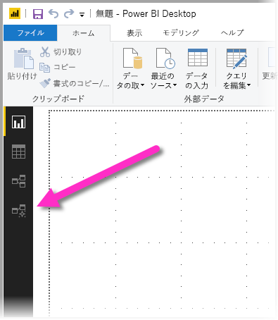
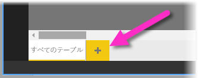
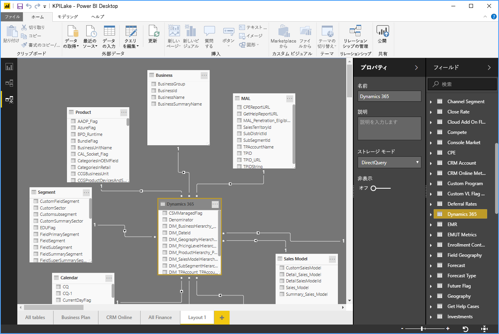
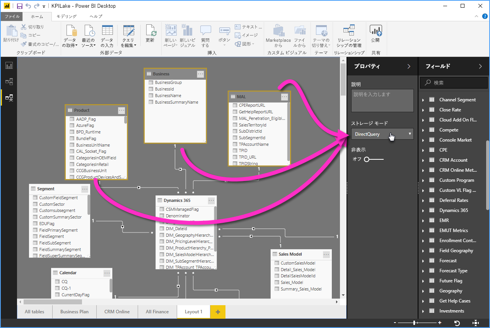

# Power BI Desktop でのビューのモデリング

**Power BI Desktop** の**モデルリング ビュー**を使用すると、多くのテーブルを含む複雑なデータセットを表示して操作することができます。

## モデルリング ビューの使用

モデルリング ビューにアクセスするには、次の図のように、**Power BI Desktop** の左側にある [モデルリング ビュー] アイコンを選択します。

## 個別のダイアグラムの作成

モデリング ビューを使用すると、モデル内のテーブルのサブセットのみを含む、モデルのダイアグラムを作成できます。 これによって作業するテーブルにわかりやすいビューを導入することができ、複雑なデータセットを操作しやすくなります。 テーブルのサブセットのみを使用して新しいダイアグラムを作成するには、Power BI Desktop のウィンドウの下部にある **[すべてのテーブル]** タブの隣にある **+** 記号をクリックします。

その後、 **[フィールド]** 一覧からダイアグラムの画面上にテーブルをドラッグします。 テーブルを右クリックし、表示されるメニューから **[関連テーブルを追加する]** を選択します。

![テーブルを右クリックして [関連テーブルを追加する] を選択する](media/desktop-modeling-view/modeling-view_04.png)

実行すると、元のテーブルに関連するテーブルが新しいダイアグラムに表示されます。 **[関連テーブルを追加する]** メニュー オプションを選択した後に関連テーブルが表示されている様子を、次の図に示します。

## 共通プロパティの設定

**CTRL** キーを押したまま複数のテーブルをクリックすることで、モデリング ビューで一度に複数のオブジェクトを選択することができます。 複数のテーブルを選択すると、それらがモデルリング ビュー内で強調表示されます。 複数のテーブルが強調表示されている場合、 **[プロパティ]** ウィンドウで適用した変更は選択したテーブルすべてに対して適用されます。

たとえば、ダイアグラム ビューにある複数のテーブルの[ストレージ モード](desktop-storage-mode.md)を変更するには、**CTRL** キーを押しながらテーブルを選択した後、 **[プロパティ]** ウィンドウでストレージ モードの設定を変更します。

## 次の手順

以下の記事では、データ モデルと DirectQuery について詳しく説明しています。

* [Power BI Desktop での集計 (プレビュー)](desktop-aggregations.md)
* [Power BI Desktop の複合モデル](desktop-composite-models.md)
* [Power BI Desktop のストレージ モード (プレビュー)](desktop-storage-mode.md)
* [Power BI Desktop での多対多カーディナリティのリレーションシップ](desktop-many-to-many-relationships.md)

DirectQuery に関する記事:

* [Power BI で DirectQuery を使用する](desktop-directquery-about.md)
* [Power BI の DirectQuery でサポートされるデータ ソース](desktop-directquery-data-sources.md)
