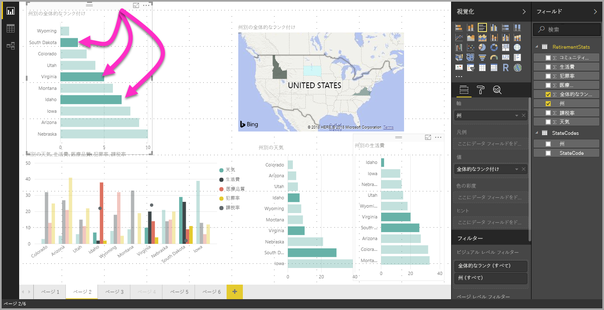

# Power BI Desktop ビジュアルでデータ要素を複数選択する

**Power BI Desktop** では、ビジュアルのデータ ポイントをクリックするだけで、所与のビジュアルでデータ ポイントを強調表示できます。 たとえば、重要なバーまたはグラフ要素があるとき、レポート ページの他のビジュアルで、選択したデータを強調表示する場合、1 つのビジュアルでデータ要素をクリックし、ページの他のビジュアルでその結果を反映させることができます。 これは 1 つを選択する基本的な強調表示です。 次の画像は基本的強調表示のものです。 

複数選択を利用すると、**Power BI Desktop** レポート ページで複数のデータ ポイントを選択し、ページのあらゆるビジュアルで結果を強調表示できます。 これは **and** ステートメントと等しい機能になります。"Idaho **and** Virginia の結果を強調表示する" のようなものです。 ビジュアルでデータ ポイントを複数選択するには、**Ctrl を押しながら複数のデータ ポイントをクリック**します。 次の画像では、**複数のデータ ポイント**が選択されています (複数選択)。

これは単純な機能のように思われますが、レポートを作成、共有、操作するとき、さまざまな可能性が生まれます。 

## 次の手順

次の記事にも興味をもたれるかもしれません。

* [Power BI Desktop レポートでグリッド線と "グリッドにスナップ" を使用する](desktop-gridlines-snap-to-grid.md)
* [Power BI レポートのフィルターと強調表示について](power-bi-reports-filters-and-highlighting.md)

