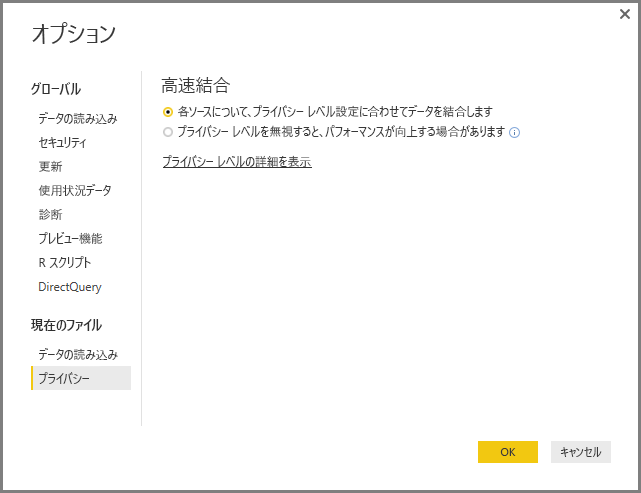

# Power BI Desktop のプライバシー レベル
**Power BI Desktop** では、プライバシー レベルにより、あるデータ ソースが他のデータ ソースから分離している程度を定義する分離レベルを指定します。 制限の厳しい分離レベルは、データ ソース間で交換される情報を妨げますが、機能性とパフォーマンスに与える影響を軽減できます。

**[ファイル] > [オプションと設定] > [オプション]** の **[現在のファイル] > [プライバシー]** にある **[プライバシー レベル]** の設定で、Power BI Desktop がデータの結合時にプライバシー レベルの設定を使うかどうかを指定します。 このダイアログには、プライバシー レベルに関する Power BI Desktop ドキュメント (この記事) へのリンクが含まれています。

## プライバシー レベルの構成
プライバシー レベルの設定では、あるデータ ソースが他のデータ ソースから分離していなければならない程度を定義する分離レベルを指定します。

| 設定 | 説明 | データ ソースの例 |
| --- | --- | --- |
| **プライベート データ ソース** |**[プライベート]** データ ソースには、機密情報や内密情報が含まれています。データ ソースの表示を、許可されているユーザーに限定できます。 プライベート データ ソースは、他のデータ ソースから完全に分離されます。 |Facebook データ、株式報奨が入ったテキスト ファイル、従業員の査定情報が入ったブックなどがあります。 |
| **組織データ ソース** |**[組織]** データ ソースは、データ ソースの表示を、信頼されたユーザー グループに限定できます。 **[組織]** データ ソースは、すべての **[パブリック]** データ ソースから分離されますが、他の **[組織]** データ ソースからは見ることができます。 |たとえば、イントラネットの SharePoint サイトにある **Microsoft Word** 文書に信頼できるグループに対してアクセス許可を与えます。 |
| **パブリック データ ソース** |**[パブリック]** データ ソースは、データ ソースに含まれるデータを全員が表示できます。 ファイル、インターネットのデータ ソース、またはブックのデータのみを **[パブリック]** に指定できます。 |Microsoft Azure Marketplace からの無料のデータ、Wikipedia ページからのデータ、パブリックの Web ページからコピーしたデータの入ったローカル ファイルなどがあります。 |

## プライバシー レベル設定の構成
各データ ソースの **[プライバシー]** 設定ダイアログは、**[ファイル] > [オプションと設定] > [データ ソース設定]** にあります。

データ ソースのプライバシー レベルを構成するには、データ ソースを選び、**[編集]** を選びます。 **[データ ソース設定]** ダイアログが表示されます。このダイアログの下部にあるドロップダウン メニューから、適切なプライバシー レベルを選べます (下の画像をご覧ください)。

> [!CAUTION]
> 機密データや内密データの入っているデータ ソースは、必ず **[プライベート]** に設定してください。
> 

## プライバシー レベルの構成
**[プライバシー レベル]** は、既定では **[各ソースについて、プライバシー レベル設定に合わせてデータを結合します]** という設定になっています。つまり、**[プライバシー レベル]** は使用できません。

| 設定 | 説明 |
| --- | --- |
| **各ソースについて、プライバシー レベル設定に合わせてデータを結合します** (オン、既定の設定) |プライバシー レベルの設定により、データを結合するときのデータ ソース間の分離レベルが決まります。 |
| **プライバシー レベルを無視すると、パフォーマンスが向上する場合があります** (オフ) |データを結合するときにプライバシー レベルは考慮されませんが、データのパフォーマンスと機能が向上することがあります。 |

> **セキュリティに関する注意:****[プライバシー レベル]** ダイアログで **[プライバシー レベルを無視すると、パフォーマンスが向上する場合があります]** を選んで **[プライバシー レベル]** を有効にすると、機密データや内密データが権限のないユーザーに表示される恐れがあります。 データ ソースに機密データや内密データが含まれていないことを確認できない場合は、**[プライバシー レベル]** を有効にしないでください。
> 
> 

> [!CAUTION]
> **[プライバシー レベルを無視すると、パフォーマンスが向上する場合があります]** は、Power BI サービスでは機能しません。 そのため、この設定を有効にした Power BI Desktop レポートを Power BI サービスに発行すると、サービスで使うときにこの動作は "*反映されません*"。
> 

**プライバシー レベルの構成**

Power BI Desktop またはクエリ エディターで、**[ファイル] > [オプションと設定] > [オプション]** を選んだ後、**[現在のファイル] > [プライバシー]** を選びます。

a. **[各ソースについて、プライバシー レベル設定に合わせてデータを結合します]** を選ぶと、プライバシー レベルの設定に従ってデータが結合されます。 異なるプライバシー分離ゾーン間でデータをマージすると、データのバッファー処理が行われます。

b. **[プライバシー レベルを無視すると、パフォーマンスが向上する場合があります]** を選ぶと、プライバシー レベルを無視してデータが結合されるため、権限のないユーザーに機密データや内密データが表示される恐れがあります。 この設定では、パフォーマンスと機能性が向上することがあります。

> **セキュリティに関する注意:****[プライバシー レベルを無視すると、パフォーマンスが向上する場合があります]** を選ぶとパフォーマンスが向上することがありますが、Power BI Desktop は、Power BI Desktop ファイルにマージされるデータのプライバシーを確保できなくなります。
> 
> 

