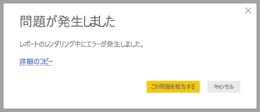

# Power BI Desktop のプライバシー

Microsoft は、お客様のニーズを満たすパフォーマンス、性能、利便性を備えた製品をお届けするにあたり、プライバシーの保護に精力的に取り組んでいます。 Microsoft では、Power BI Desktop の利用状況に関する特定の情報を収集し、問題を診断して、製品の品質向上に役立てています。 Microsoft のプライバシー プラクティスの詳細については、Microsoft のプライバシーに関する声明を確認してください。 これは、**Power BI Desktop** の利用について収集されるデータに適用されます。
 
**Power BI Desktop** ユーザーから収集する情報には、オペレーティング システム、Power BI Desktop の情報、Internet Explorer のバージョンに関するデータを含めることができます。 
 
このデータが収集されないようにするには、以下の画像のように、**[ファイル]、[オプションと設定]、[オプション]** の順に移動し、**[利用状況データ]** タブで、**[利用状況データを送信する]** チェック ボックスをオフにします。

![[利用状況データを送信する] の [オプション] 設定](media/desktop-privacy/privacy_01.png)

## 追加情報の送信

クラッシュまたはその他の問題が発生した場合は、エラー レポートと追加情報を送信するよう選択できます。これらは、今後のリリースでの問題の解決に役立つ場合があります。 ドキュメント ロケール、有効になっているプレビュー機能、およびストレージ モードなど、操作した **Power BI Desktop** ファイルの状態に関する情報も収集します。 これには、モデルのスクリーンショット、エラー メッセージ、および式を含めることができます。 これらの項目には、エラー発生時に使用していたファイルの内容が含まれる場合があるため、送信する前に確認する必要があります。 Microsoft に送信する情報を事前に選択できることを忘れないでください。  
 
この情報を送信しない場合は、エラー発生時に **[閉じる]** をクリックするか、前述のように利用状況データを送信しないようにすることができます。 

