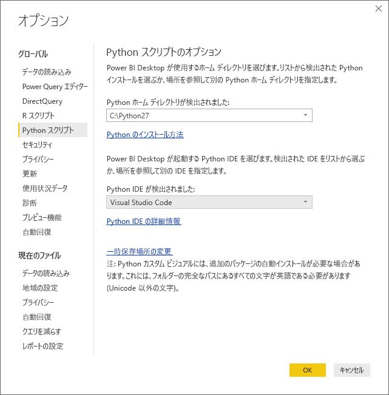
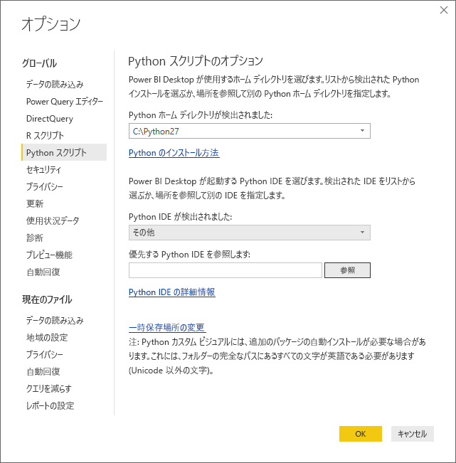
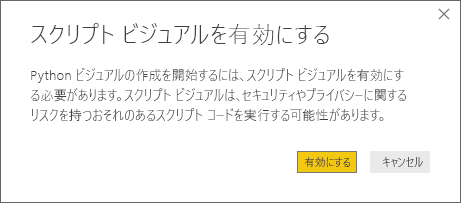
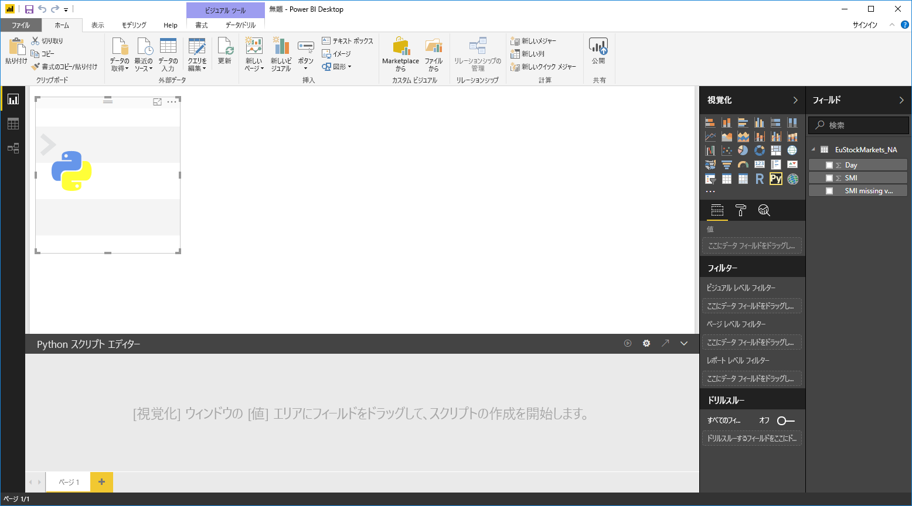
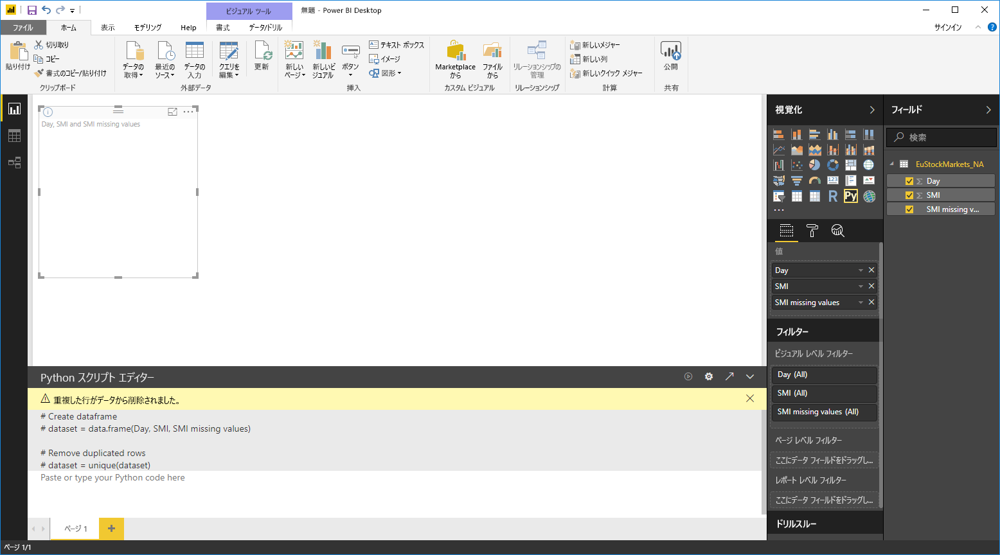
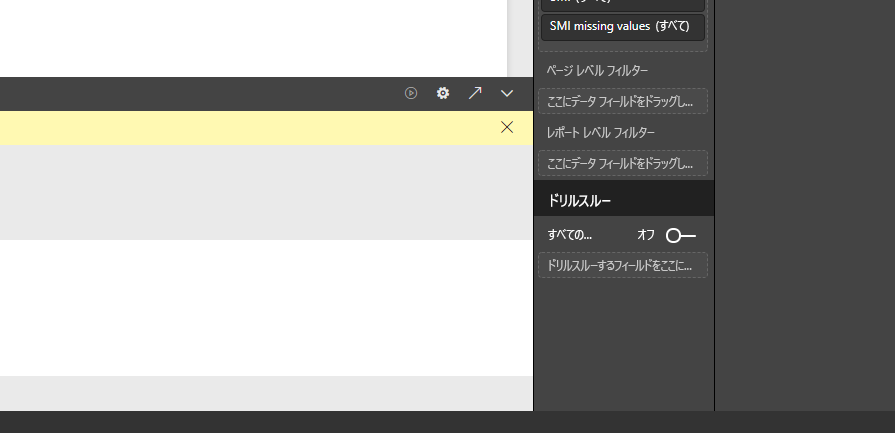
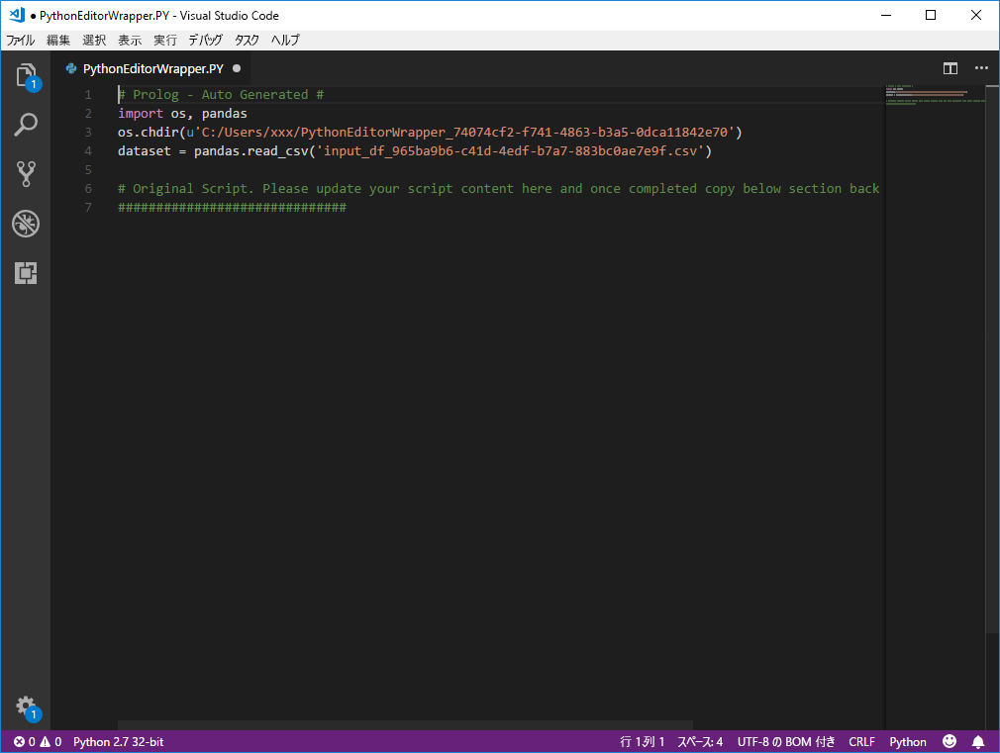

# Power BI で外部 Python IDE を使用する
**Power BI Desktop** では、外部の Python IDE (統合開発環境) を使用して Python スクリプトを作成および調整した後、Power BI でそのスクリプトを使用できます。

## 外部の Python IDE を有効にする
外部の Python IDE を **Power BI Desktop** から起動し、Python IDE にデータを自動的にインポートして表示できます。 その後は、その外部 Python IDE でスクリプトを修正してから、**Power BI Desktop** にスクリプトを貼り付けて、Power BI のビジュアルとレポートを作成できます。

使用する Python IDE を指定して、それを **Power BI Desktop** 内から自動的に起動させることができます。

### 要件
この機能を使用するには、ローカル コンピューターに **Python IDE** をインストールする必要があります。 **Power BI Desktop** には Python エンジンは含まれず、配置もインストールも行われないので、ローカル コンピューターに **Python** を別途インストールする必要があります。 次のオプションで、使用する Python IDE を選択できます。

* 任意の Python IDE をインストールすることができます。それらの多くは、[Visual Studio Code ダウンロード ページ](https://code.visualstudio.com/download/) などのように無料で入手できます。
* **Power BI Desktop** は **Visual Studio** もサポートしています。
* さまざまな Python IDE をインストールし、次のいずれかを実行して、**Power BI Desktop** で **Python IDE** を起動させることもできます。
  
  * **.PY** ファイルを、**Power BI Desktop** で起動させる外部 IDE に関連付けることができます。
  * **[オプション]** ダイアログの **[Python スクリプトのオプション]** セクションから *[その他]* を選択して、**Power BI Desktop** で起動する必要がある .exe を指定できます。 **[オプション]** ダイアログを表示するには、 **[ファイル]、[オプションと設定]、[オプション]** の順に移動します。
    
    

複数の Python IDE がインストールされている場合は、 **[オプション]** ダイアログの *[Detected Python IDEs]\(検出された Python IDE\)* ドロップダウンから選択して、起動する Python IDE を指定できます。

既定で、**Power BI Desktop** は、**Visual Studio Code** がローカル コンピューターにインストールされている場合、外部 Python IDE としてそれを起動します。**Visual Studio Code** がインストールされておらず、**Visual Studio** がある場合は、代わりにそれが起動されます。 どちらの Python IDE もインストールされていない場合は、 **.PY** ファイルに関連付けられたアプリケーションが起動します。

**.PY** ファイルの関連付けが存在しない場合、 **[オプション]** ダイアログの *[Browse to your preferred Python IDE]\(優先する Python IDE を参照します\)* セクションで、カスタム IDE へのパスを指定できます。 **Power BI Desktop** の **[Launch Python IDE]\(Python IDE を起動\)** 矢印アイコンの横にある **[設定]** 歯車アイコンを選択して、別の Python IDE を起動することもできます。

## Power BI Desktop から Python IDE を起動する
**Power BI Desktop** から Python IDE を起動するには、次の手順を実行します。

1. **Power BI Desktop** にデータを読み込みます。
2. **[フィールド]** ウィンドウで使用するフィールドをいくつか選択します。 スクリプトのビジュアルをまだ有効にしていない場合は、有効にするように促されます。
   
   
3. スクリプトのビジュアルを有効にすると、 **[視覚化]** ウィンドウで Python のビジュアルを選択できます。選択すると、スクリプトの結果を表示できる空白の Python のビジュアルが作成されます。 **[Python スクリプト エディター]** ウィンドウも表示されます。
   
   
4. Python スクリプトで使用するフィールドを選択できるようになります。 フィールドを選択すると、選択したフィールドに基づいて **[Python スクリプト エディター]** フィールドにスクリプト コードが自動的に作成されます。 **[Python スクリプト エディター]** ウィンドウで Python スクリプトを直接作成する (または貼り付ける) ことも、ウィンドウを空白のままにすることもできます。
   
   
   
   > [!NOTE]
   > Python ビジュアルの既定の集計タイプは、 *[集計しない]* です。
   > 
   > 
5. **Power BI Desktop** から Python IDE を直接起動できるようになります。 **[Python スクリプト エディター]** のタイトル バーの右側にある **[Launch Python IDE]\(Python IDE を起動\)** ボタンを選択します (次の図を参照)。
   
   
6. 次の図のように、指定した Python IDE が Power BI Desktop によって起動されます (この図では、**Visual Studio Code** が既定の Python IDE です)。
   
   
   
   > [!NOTE]
   > スクリプトを実行した後で **Power BI Desktop** からデータをインポートするために、**Power BI Desktop** はスクリプトの最初の 3 行を追加します。
   > 
   > 
7. **Power BI Desktop** の **[Python スクリプト エディター]** ウィンドウで作成したスクリプトは、Python IDE の 4 行目以降に表示されます。 この状態になれば、Python IDE で Python スクリプトを作成できます。 Python IDE で Python スクリプトが完成した後は、それをコピーし、**Power BI Desktop** の **[Python スクリプト エディター]** ウィンドウに貼り付けて戻す必要があります。ただし、**Power BI Desktop** が自動的に生成したスクリプトの先頭 3 行は*除外する*必要があります。 スクリプトの先頭の 3 行は、**Power BI Desktop** にコピーしないでください。これらの行は、**Power BI Desktop** から Python IDE にデータをインポートするためだけに使用されたものです。

### 既知の制限事項
Power BI Desktop から直接 Python IDE を起動するには、いくつかの制限があります。

* Python IDE から **Power BI Desktop** へのスクリプトの自動的なエクスポートはサポートされていません。

## 次の手順
Power BI での Python については、次の追加情報を参照してください。

* [Power BI Desktop での Python スクリプトの実行](desktop-python-scripts.md)
* [Python を使用して Power BI ビジュアルを作成する](desktop-python-visuals.md)

