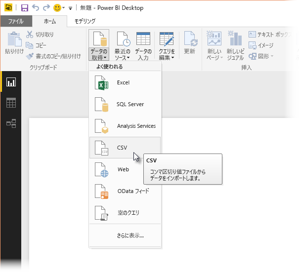
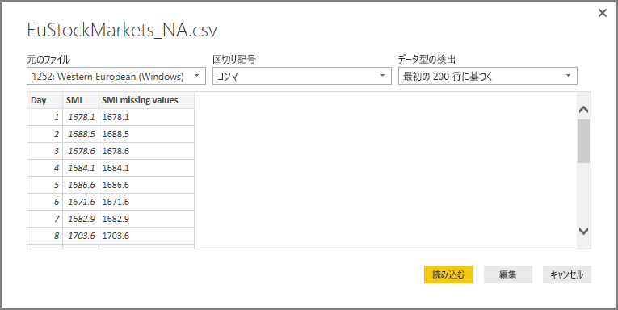
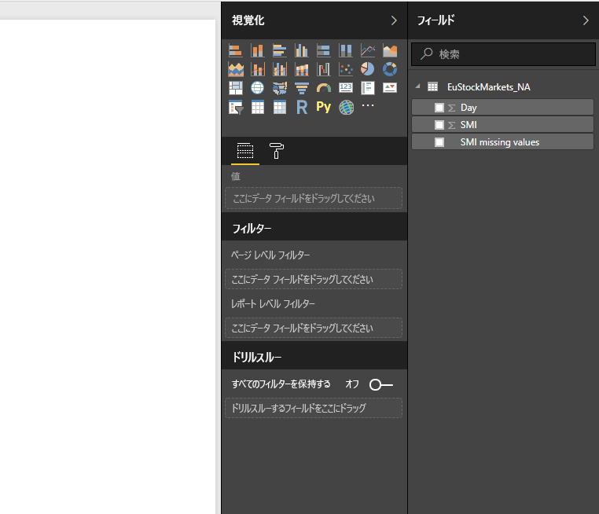
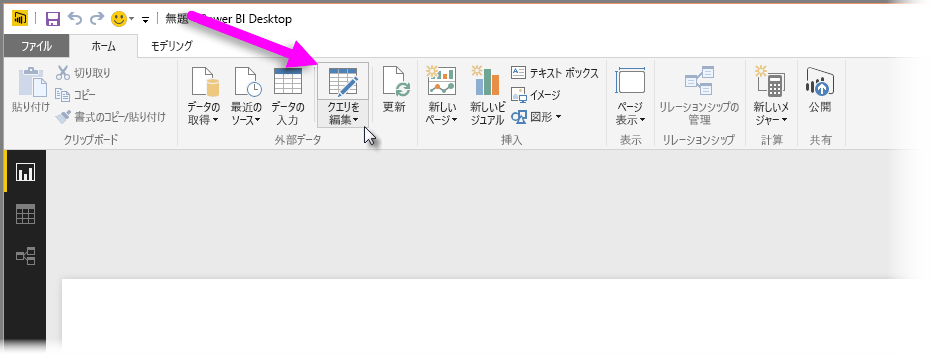
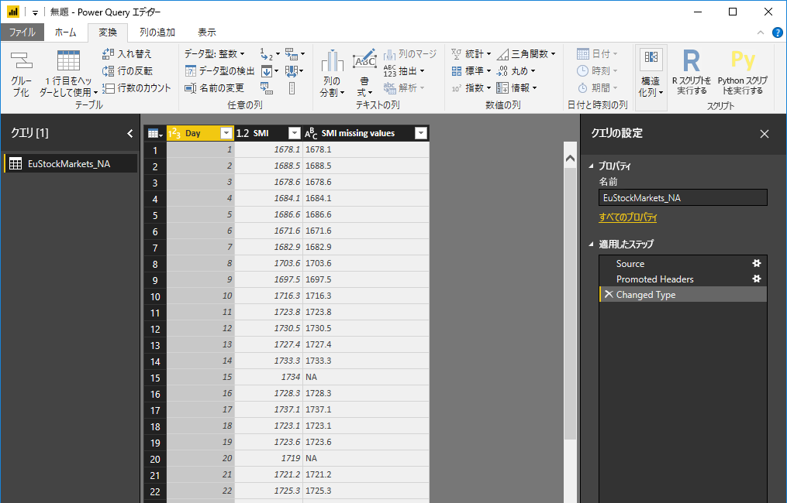
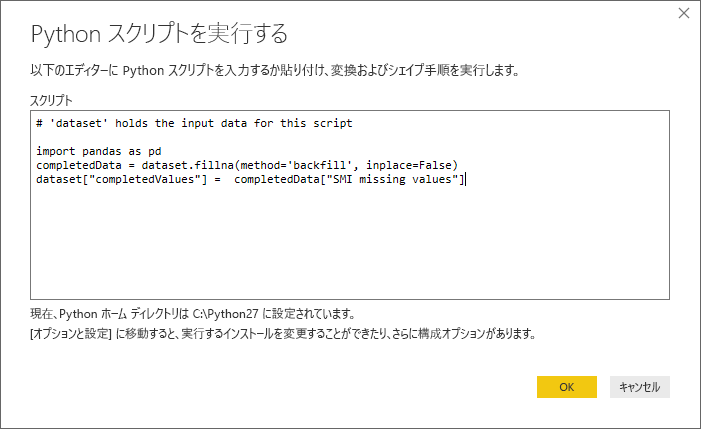
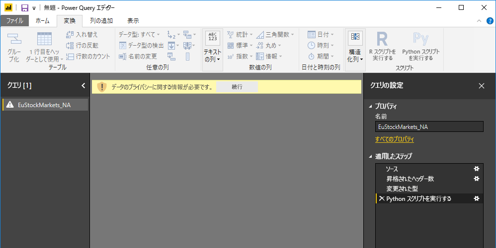
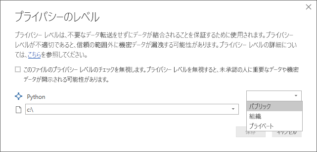
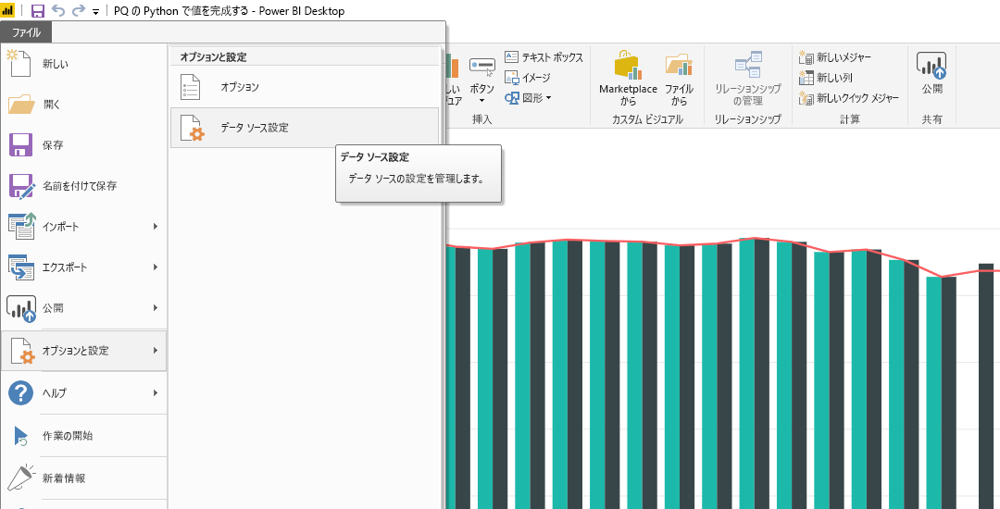
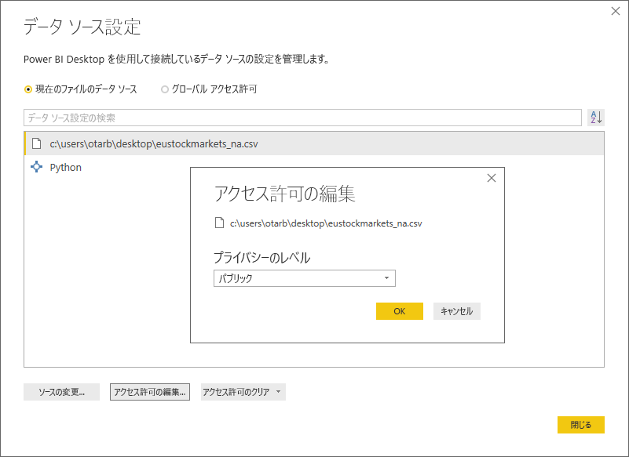

# クエリ エディターでの Python の使用
Power BI Desktop **クエリ エディター**では、統計学者、データ科学者、データ分析官によって広く使用されているプログラミング言語、**Python** を使用できます。 Python と**クエリ エディター**を統合することで、Python を使用したデータ クレンジングを実行したり、データセットで高度なデータ シェイプおよびデータ分析 (失ったデータを埋める、予測、クラスター化など) を実行したりできます。 **Python** は高度な言語であり、**クエリ エディター**で使用し、ご自分のデータ モデルを用意したり、レポートを作成したりできます。

## Python のインストール
Power BI Desktop の**クエリ エディター**で **Python** を使用するには、ご使用のローカル コンピューターに **Python** をインストールする必要があります。 **Python** はさまざまな場所から無料でダウンロードし、インストールできます。たとえば、[公式 Python ダウンロード ページ](https://www.python.org/)や [Anaconda](https://anaconda.org/anaconda/python/) があります。

## クエリ エディターでの Python の使用
**クエリ エディター**で **Python** を使用する方法を示すために、ある株式市場のデータセットを例として使用します。これは .CSV ファイルに基づいており、[ここからダウンロード](http://download.microsoft.com/download/F/8/A/F8AA9DC9-8545-4AAE-9305-27AD1D01DC03/EuStockMarkets_NA.csv)してご利用いただけます。 この例の手順は次のようになります。

1. 最初に、**Power BI Desktop** にデータを読み込みます。 この例では、*EuStockMarkets_NA.csv* ファイルを読み込み、**Power BI Desktop** の **[ホーム]** リボンから **[データの取得] > [CSV]** を選択します。
   
   
2. ファイルを選択し、**[開く]** を選択します。CSV が **[CSV ファイル]** ダイアログに表示されます。
   
   
3. 読み込まれたデータは、Power BI Desktop の **[フィールド]** ウィンドウに表示されます。
   
   
4. **Power BI Desktop** の **[ホーム]** タブで **[クエリを編集]** を選択し、**クエリ エディター**を開きます。
   
   
5. **[変換]** タブで、**[Python スクリプトを実行する]** を選択します。**[Python スクリプトを実行する]** エディターが表示されます (次の手順で示します)。 行 15 と行 20 にデータが欠けています。画像では確認できませんが、他にもデータが欠けている行があります。 以下の手順では、このような行のデータを Python で自動的に補完する方法を示します。
   
   
6. この例では、次のスクリプト コードを入力します。
   
       import pandas as pd
       completedData = dataset.fillna(method='backfill', inplace=False)
       dataset["completedValues"] =  completedData["SMI missing values"]
   
   > [!NOTE]
   > 前のスクリプト コードを正しく動作させるためには、Python 環境に *pandas* ライブラリをインストールする必要があります。 pandas をインストールするには、Python のインストールで |      > pip install pandas コマンドを実行します。
   > 
   > 
   
   **[Python スクリプトを実行する]** ダイアログに入力すると、コードは次のようになります。
   
   
7. **[OK]** を選択すると、**クエリ エディター**にデータ プライバシーに関する警告が表示されます。
   
   
8. Power BI サービスで Python スクリプトを正しく動作させるには、データ ソースをすべて *[パブリック]* に設定する必要があります。 プライバシー設定とその意味に関する詳細については、「[プライバシー レベル](desktop-privacy-levels.md)」を参照してください。
   
   
   
   **[フィールド]** ウィンドウに *completedValues* という新しい列が表示されます。 行 15 や行 18 行など、いくつかの行でデータ要素が不足しています。 次のセクションでは、Python でその不足を処理する方法を確認します。
   

わずか 5 行の Python スクリプトで、**クエリ エディター**では予測モデルに使って不足値が埋められました。

## Python スクリプト データからのビジュアルの作成
これで、次の画像のように、Python スクリプト コードと *pandas* ライブラリで不足値を補うしくみを示すビジュアルを作成できます。

そのビジュアルが完成したら (**Power BI Desktop** を使用して作成する必要がある任意の他のビジュアル)、**Power BI Desktop** ファイルを保存し (.pbix ファイルとして保存)、Power BI サービスでデータ モデル (その一部である Python スクリプトが含まれる) を使用できます。

> [!NOTE]
> 以上の手順を完了した .pbix ファイルをご覧になる場合は、 上記の例で使用されている **Power BI Desktop** ファイルの完成したものを[ここから](http://download.microsoft.com/download/A/B/C/ABCF5589-B88F-49D4-ADEB-4A623589FC09/Complete%20Values%20with%20Python%20in%20PQ.pbix)ダウンロードできます。

.pbix ファイルを Power BI サービスにアップロードしたら、さらにいくつかの手順を行い、(サービスで) データ更新を有効にし、サービスでビジュアルの更新を有効にする必要があります (ビジュアルを更新するには、データが Python にアクセスする必要があります)。 追加の手順は次のとおりです。

* **データセットの定期更新を有効にする** - データセットを含むブックを Python スクリプトで定期的に更新するには、「[スケジュールされた更新の構成](refresh-scheduled-refresh.md)」を参照してください。ここには、**Personal Gateway** に関する情報も含まれています。
* **Personal Gateway をインストールする** - ファイルが置かれ、Python がインストールされているコンピューターに **Personal Gateway** をインストールする必要があります。Power BI サービスは、そのブックにアクセスし、任意の更新されたビジュアルを再レンダリングする必要があります。 [Personal Gateway のインストール方法と構成方法](personal-gateway.md)については、他にも情報を参照できます。

## 制限事項
**クエリ エディター**で作成された Python スクリプトを含むクエリにはいくつかの制限事項があります。

* Python データ ソース設定はすべて、*[パブリック]* に設定する必要があり、**クエリ エディター**で作成されたクエリの他の手順もすべてパブリックにする必要があります。 データ ソース設定にアクセスするには、**Power BI Desktop** で、**[ファイル]、[オプションと設定]、[データ ソース設定]** の順に選択します。
  
  
  
  **[データ ソース設定]** ダイアログで、データ ソースを選択し、**[アクセス許可の編集]** を選択し、**[プライバシー レベル]** が *[パブリック]* に設定されていることを確認します。
  
      
* Python のビジュアルやデータセットの定期更新を有効にするには、**スケジュール更新**を有効にし、ブックが置かれ、Python をインストールしているコンピューターに **Personal Gateway** をインストールする必要があります。 それぞれの詳細な情報については、この記事の前のセクションにリンクがあります。
* 現在、入れ子になったテーブル (テーブルのテーブル) はサポートされていません 

Python とカスタム クエリを使用すると、さまざまなことを行うことができるため、ご自分のデータを調べて好みの方法で表示できるように整形してください。

