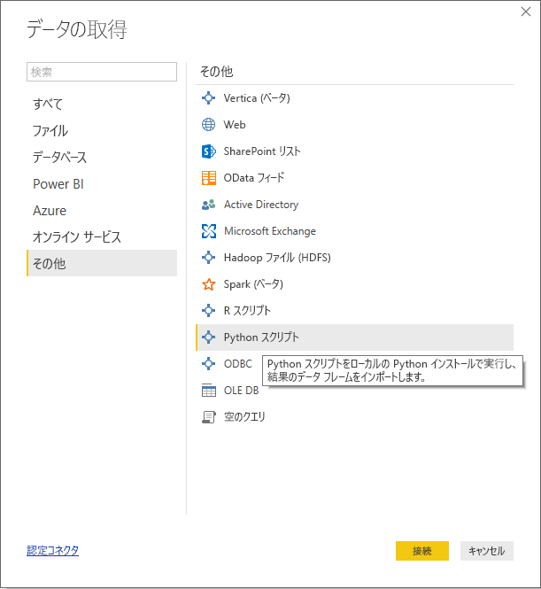
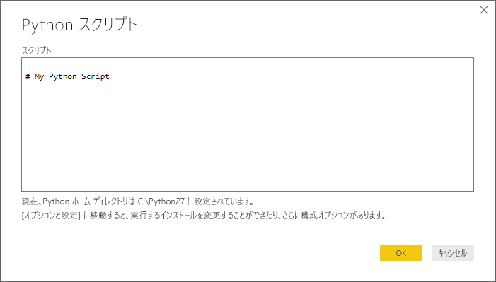
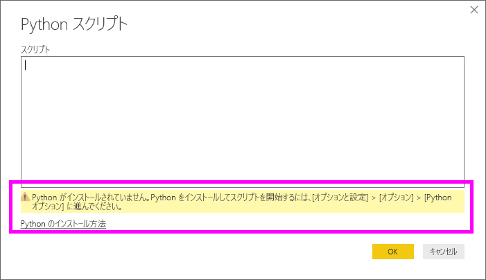
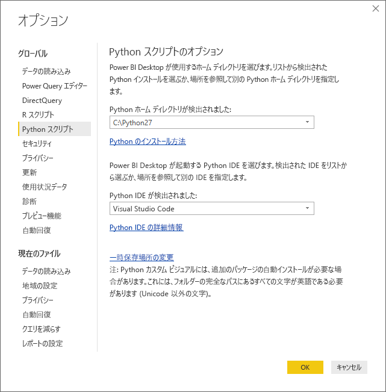

# <a name="run-python-scripts-in-power-bi-desktop"></a>Power BI Desktop で Python スクリプトを実行する
**Power BI Desktop** で Python スクリプトを直接実行し、生成されたデータセットを Power BI Desktop データ モデルにインポートできます。

## <a name="install-python"></a>Python をインストールする
Power BI Desktop で Python スクリプトを実行するには、ローカル コンピューターに **Python** をインストールする必要があります。 **Python** はさまざまな場所から無料でダウンロードし、インストールできます。たとえば、[公式 Python ダウンロード ページ](https://www.python.org/)や [Anaconda](https://anaconda.org/anaconda/python/) があります。 Power BI Desktop での Python スクリプトの現在のリリースでは、インストール パスで Unicode 文字とスペース (空の文字) がサポートされています。

### <a name="install-required-python-packages"></a>必要な Python パッケージをインストールする
Power BI Python 統合では、2 つの Python パッケージがインストールされている必要があります (Pandas および Matplotlib)。  pip コマンド ライン ツールを使って、次の 2 つのパッケージをインストールします。

```
pip install pandas
pip install matplotlib
```

## <a name="run-python-scripts"></a>Python スクリプトを実行する
Power BI Desktop で数回の手順を踏むことで、Python スクリプトを実行し、データ モデルを作成し、データ モデルからレポートを作成し、Power BI サービスで共有できます。

### <a name="prepare-a-python-script"></a>Python スクリプトを準備する
Power BI Desktop で Python スクリプトを実行するには、ローカル Python 開発環境でスクリプトを作成し、それが正常に動作することを確認します。

Power BI Desktop でスクリプトを実行するには、新しく、変更されていないワークスペースでスクリプトが正常に動作することを確認します。 つまり、すべてのパッケージと依存関係を明示的に読み込み、実行する必要があります。

Power BI Desktop で Python スクリプトを準備し、実行するとき、いくつかの制限があります。

* Pandas データ フレームだけがインポートされるため、Power BI にインポートするデータがデータ フレームで表されていることを確認してください
* Python スクリプトは、30 分以上実行するとタイムアウトになります
* ユーザー入力の待機中など、Python スクリプトの対話的呼び出しでスクリプトの実行が停止します
* Python スクリプト内で作業ディレクトリを設定する場合は、作業ディレクトリへの相対パスではなく、完全パスを定義する*必要があります*
* 現在、入れ子になったテーブル (テーブルのテーブル) はサポートされていません 

### <a name="run-your-python-script-and-import-data"></a>Python スクリプトを実行し、データをインポートする
1. Power BI Desktop では、Python スクリプトのデータ コネクタは **[データの取得]** にあります。 Python スクリプトを実行するには、**[データの取得]&gt;[詳細]** の順に選び、次の図に示すように **[その他]&gt;[Python スクリプト]** の順に選びます。
   
   
2. Python がローカル コンピューターにインストールされている場合、最近インストールしたバージョンが Python エンジンとして選択されます。 スクリプトをスクリプト ウィンドウにコピーし、 **[OK]** を選択します。
   
   
3. Python がインストールされていない (識別されていない) 場合、またはご自分のローカル コンピューターに複数のインストールがある場合、警告が表示されます。
   
   
   
   Python インストール設定は、[オプション] ダイアログの [Python スクリプト] セクションの中央に配置されています。 Python インストール設定を指定するには、**[ファイル] > [オプションと設定]** を選択してから、**[オプション] > [Python スクリプト]** を選択します。 Python の複数のインストールを使用できる場合、ドロップダウン メニューが表示され、使用するインストールを選択できます。 **[その他]** を選択して、カスタム パスを指定することもできます。
   
   
4. **[OK]** を選択し、Python スクリプトを実行します。 スクリプトが正常に実行されたら、生成されたデータ フレームを選択し、Power BI モデルに追加できます。

### <a name="refresh"></a>更新
Power BI Desktop で Python スクリプトを更新できます。 Python スクリプトを更新するとき、Power BI Desktop は Power BI Desktop 環境で Python スクリプトをもう一度実行します。

## <a name="next-steps"></a>次の手順
Power BI での Python については、次の追加情報を参照してください。

* [Power BI Desktop で Python ビジュアルを作成する](desktop-python-visuals.md)
* [Power BI で外部 Python IDE を使用する](desktop-python-ide.md)
