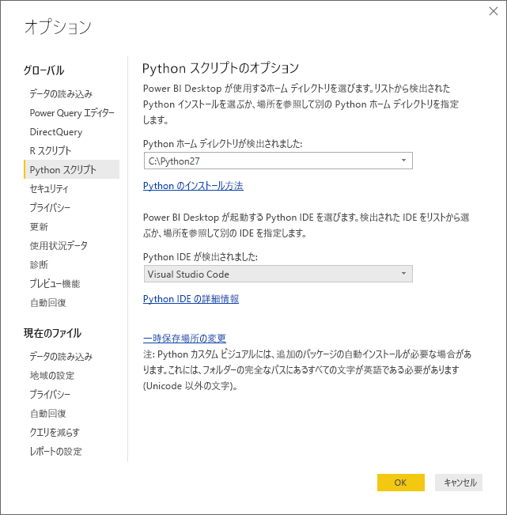
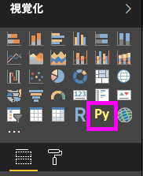
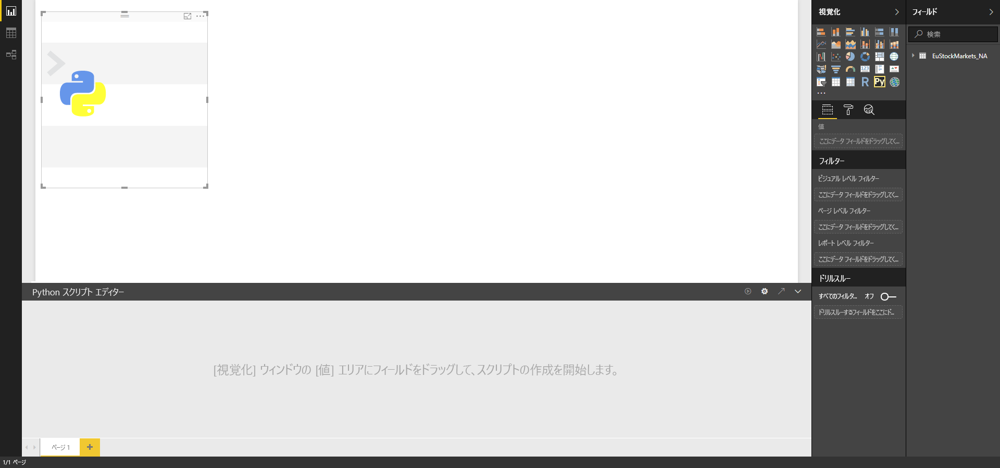
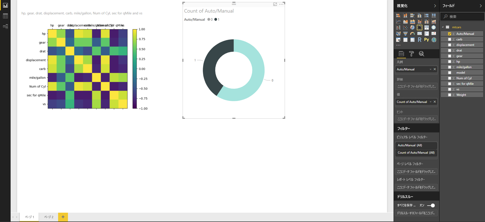
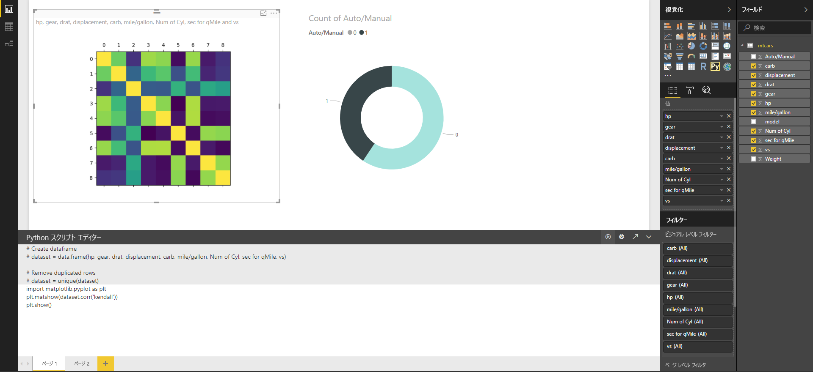
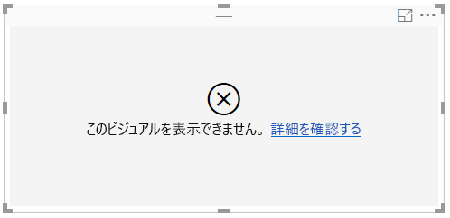

# Python を使用して Power BI ビジュアルを作成する
**Power BI Desktop** では、**Python** を使用してデータを視覚化できます。

## Python をインストールする
**Power BI Desktop** は、**Python** エンジンを含んでいません。また、配置やインストールも行いません。 **Power BI Desktop** で Python スクリプトを実行するには、ローカル コンピューターに **Python** を個別にインストールする必要があります。 **Python** はさまざまな場所から無料でダウンロードし、インストールできます。たとえば、[公式 Python ダウンロード ページ](https://www.python.org/)や [Anaconda](https://anaconda.org/anaconda/python/) があります。 Power BI Desktop での Python スクリプトの現在のリリースでは、インストール パスで Unicode 文字とスペース (空の文字) がサポートされています。

## Python ビジュアルを有効にする
Python ビジュアルを有効にするには、**[ファイル]、[オプションと設定]、[オプション]** の順に選択します。次に、表示された **[オプション]** ページで、以下の画像に示すように、**[オプション]** ウィンドウの **[Python スクリプト]** セクションでローカルの Python インストールが指定されていることを確認します。 以下の画像では、Python のパス ローカル インストールは **C:\Python27** で、そのパスはテキスト ボックスに明示的に指定されています。 正しく表示されたパスが、**Power BI Desktop** が使用するローカル Python インストールであることを確認します。
   
   

ご使用の Python のインストールを指定すると、Python ビジュアルの作成を開始する準備ができます。

## Power BI Desktop で Python ビジュアルを作成する
1. 次の画像に示すように、**[視覚化]** ペインの **[Python ビジュアル]** アイコンを選択し、Python ビジュアルを追加します。
   
   

   レポートに Python ビジュアルを追加すると、**Power BI Desktop** によって次のことが行われます。
   
   - プレース ホルダーの Python ビジュアル イメージが、レポート キャンバスに表示されます。
   
   - **[Python スクリプト エディター]** が中央ペインの下部に表示されます。
   
   

2. 次に、他の **Power BI Desktop** ビジュアルと同様に、Python スクリプトで使用するフィールドを **[フィールド]** の **[値]** セクションに追加します。 
    
    Python スクリプトで使用できるのは、**[フィールド]** に追加されたフィールドだけです。 **Power BI Desktop の Python スクリプト エディター**で Python スクリプトを処理しているときも、新しいフィールドを追加したり、**[フィールド]** から不要なフィールドを削除したりすることができます。 **Power BI Desktop** は、追加または削除したフィールドを自動的に検出します。
   
   > [!NOTE]
   > Python ビジュアルの既定の集計タイプは、*[集計しない]* です。
   > 
   > 
   
3. これで、選択したデータを使用して、プロットを作成できます。 

    フィールドを選択すると、**Python スクリプト エディター**では、エディター ペインの上部にあるグレー表示のセクションの選択内容に基づいてサポートする Python スクリプトのバインド コードが生成されます。 追加のフィールドを選択または削除すると、Python スクリプト エディターのサポート コードが自動的に生成されるか、必要に応じて削除されます。
   
   次のイメージに示される例では、3 つのフィールドが選択されました: HP、gear、および drat。 これらの選択の結果として、Python スクリプト エディターでは、次のバインド コードが生成されます。
   
   * **データセット** と呼ばれるデータ フレームが作成されます
     * そのデータ フレームは、ユーザーが選択したさまざまなフィールドで構成されます
   * 既定の集計は、*[集計しない]* です
   * テーブル ビジュアルと同様、フィールドはグループ化され、重複する行は一度だけ表示されます。
   
   
   
   > [!TIP]
   > 自動グループ化を行いたくない場合や、重複を含めたすべての行を表示させたい場合があります。 その場合は、インデックス フィールドを追加し、すべての行が一意と見なされるようにしてグループ化を防止します。
   > 
   > 
   
   生成されたデータフレームは**データセット**と呼ばれ、選択された列は個々の名前でアクセスすることができます。 たとえば、ご自分の Python スクリプトに「*dataset["gear"]*」と書き込んで、gear フィールドにアクセスします。

4. 選択したフィールドによって自動的に生成されたデータフレームを使って、Python の既定デバイスにプロットすることになる Python スクリプトを書き込む準備ができました。 スクリプトが完了したら、**[Python スクリプト エデイタ]** タイトル バーから **[実行]** を選択します (**[実行]** はタイトル バーの右側にあります)。
   
    **[実行]** を選択すると、**Power BI Desktop** は、プロットを識別し、キャンバス上にそれを示します。 プロセスはローカルの Python インストールで実行されるため、必要なパッケージがインストールされていることを確認してください。
   
   **Power BI Desktop** は、次のイベントのいずれかが発生したときにビジュアルを再度プロットします:
   
   * **[Python スクリプト エディター]** タイトル バーから **[実行]** が選択された
   * データ更新、フィルター処理、または強調表示によってデータの変更が発生した

    次のイメージは、相関プロット コードの例を示し、自動車の異なるタイプの属性間の相関関係をプロットします。

    

5. 視覚化されたより大きなビューを取得するには、**[Python スクリプト エディター]** を最小化することができます。 **Power BI Desktop** での他のビジュアルのように、ドーナツ ビジュアル (上記の例のイメージの右側の丸いビジュアル) のスポーツカーのみを選択して相関プロットをクロスフィルター処理できます。

    

6. Python スクリプトを変更してビジュアルをカスタマイズしたり、パラメーターをプロット コマンドに追加して Python の機能を活用したりすることもできます。

    元のプロット コマンドは次のとおりです:

    plt.matshow(dataset.corr('pearson'))

    Python スクリプトでいくつかの変更があり、コマンドは次のようになりました。

    plt.matshow(dataset.corr('kendall'))

    その結果、Python ビジュアルでは、次の画像のように、ケンドールのタウ相関係数を使用してプロットされます。

    

    Python スクリプトを実行してエラーが発生した場合、Python ビジュアルはプロットされず、キャンバス上にエラー メッセージが表示されます。 エラーの詳細については、キャンバス上の Python ビジュアル エラーから **[詳細の表示]** を選択します。

    

    > **Python スクリプトのセキュリティ:** Python ビジュアルは Python スクリプトから作成されますが、Python スクリプトにはセキュリティやプライバシーのリスクがあるコードが含まれる場合があります。 初めて Python ビジュアルを表示または Python ビジュアルと対話しようとすると、ユーザーにセキュリティ警告メッセージが表示されます。 作成者とソースを信頼する場合、または Python スクリプトを確認して理解した場合にのみ、Python ビジュアルを有効にします。
    > 
    > 

## 既知の制限事項
**Power BI Desktop** での Python ビジュアルには、いくつかの制限があります。

* データ サイズの制限 – プロット作成で Python ビジュアルが使用するデータは、150,000 行に制限されています。 150,000 を超える行が選択されている場合は、上位の 150,000 の行のみが使用され、メッセージがイメージに表示されます。
* 計算時間の制限 – Python ビジュアル計算で実行時間が 5 分を超えると、エラーが発生します。
* リレーションシップ – 他の Power BI Desktop ビジュアルと同様、定義されたリレーションシップを持たない異なるテーブルからデータ フィールドが選択されている場合、エラーが発生します。
* Python ビジュアルは、データ更新、フィルター処理、および強調表示の際に更新されます。 ただし、イメージ自体は対話型ではなく、クロス フィルター処理のソースになることはできません。
* Python ビジュアルは他のビジュアルの強調表示に応答しますが、他の要素をクロス フィルター処理するために Python ビジュアルの要素をクリックすることはできません。
* Python の既定のディスプレイ デバイスにプロットされるプロットだけが、キャンバス上に正しく表示されます。 異なる Python ディスプレイ デバイスを明示的に使用することは避けてください。

## 次の手順
Power BI での Python については、次の追加情報を参照してください。

* [Power BI Desktop での Python スクリプトの実行](desktop-python-scripts.md)
* [Power BI で外部 Python IDE を使用する](desktop-python-ide.md)

