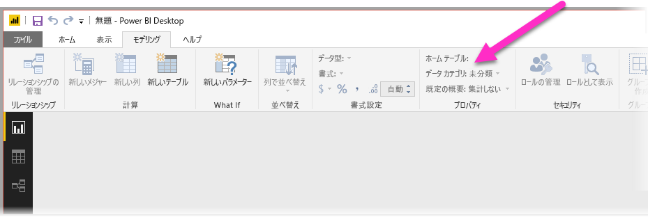
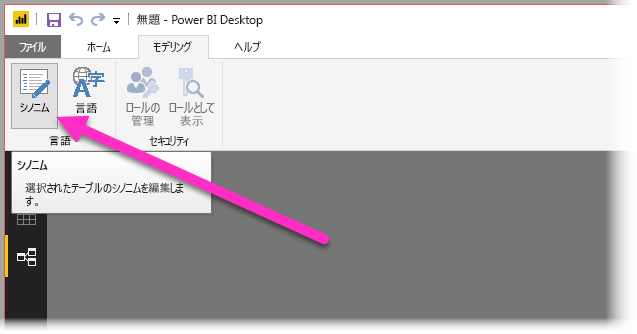
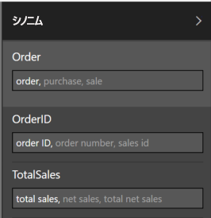

# 自然言語クエリに Power BI Desktop で Q&A を使用する
データに関する質問に、一般的な語句と自然言語を使用するのは効果的です。 データが回答になる場合にはさらに効果的です。**Power BI Desktop** の Q&A ではこれが可能です。

Q&A が回答可能な質問の大規模なコレクションを正常に解釈できるようにするには、Q&A がモデルについてさまざまな推測をする必要があります。 ご利用のモデルの構造がこれらの推測に 1 つ以上当てはまらない場合は、モデルを調整する必要があります。 Q&A のこれらの調整は、Q&A を使用するかどうかに関係なく、Power BI のどのモデルに対しても同じ最適化のベスト プラクティスです。 

> [!NOTE]
> Q&A は、**インポートされた**データを含むモデルを処理するときにのみ使用可能です。 SSAS へのライブ接続および DirectQuery モデルはサポートされていません。
>
>

> [!NOTE]
> Windows 10 以前のバージョンの Windows を使用している場合、Q&A には次の C ランタイムの更新プログラムが必要です。 重要な更新プログラムを Windows Update からインストールしてみることも、Microsoft からの必須コンポーネント (KB2999226) を手動でインストールすることもできます。 https://support.microsoft.com/en-us/help/2999226/update-for-universal-c-runtime-in-windows
>
>

次のセクションでは、Power BI の Q&A でうまく機能するためにモデルを調整する方法について説明します。

## 欠落しているリレーションシップを追加する

モデルでテーブル間のリレーションシップが欠落している場合、これらのテーブルに関する質問をした場合に、Power BI レポートも Q&A も、これらのテーブルを結合する方法が解釈できません。 リレーションシップは、優れたモデルの基礎となります。 たとえば、*注文*テーブルと*顧客*テーブル間のリレーションシップが欠落している場合、"シアトルの顧客の総売上" という質問をすることはできません。 次の図に、作業が必要なモデルと、Q&A の準備ができているモデルの例を示します。

**作業が必要**

**Q&A の準備がてきている**

## テーブルと列の名前を変更する

テーブルと列の選択は Q&A にとって非常に重要です。 たとえば、顧客リストを含む *CustomerSummary* (顧客サマリー) という名前のテーブルがある場合、"シカゴの顧客を一覧表示する" という質問ではなく、"シカゴの顧客のサマリーを一覧表示する" という質問をする必要があります。 

Q&A では、いくつかの基本的な単語区切りと複数形の検出はできますが、Q&A では、テーブル名と列名は、そのコンテンツを正確に反映していることを前提としています。

別の例を見てみましょう。 姓と名と従業員番号を含む *Headcount* (社員数) という名前のテーブルと、従業員番号、ジョブ番号、開始日を含む *Employees* (従業員) という名前の別のテーブルがあるとします。 このモデルに精通している人は理解できるかもしれませんが、他の人が "従業員をカウントする" という質問をすると、"Employees" テーブルの行数がカウントされます。この数は、各従業員がこれまでに行ったすべてのジョブの数であるため、その人が想定していた答えとは異なる場合があります。 内容をきちんと反映するようにテーブルの名前を変更することをお勧めします。

**作業が必要**

**Q&A の準備がてきている**

## 不正なデータ型を修正する

インポートされたデータが不正なデータ型の場合があります。 特に、*string* としてインポートされた *date* と *number* の列は、Q&A で date や number として解釈されません。 ご利用の Power BI モデルで正しいデータ型が選択されていることを確認する必要があります。

## 年と識別子の列を [集計しない] にマークする

Power BI は、既定で積極的に数値列を集計するため、"年ごとの総売上" といった質問には、年の総合計とともに、売上の総合計も返される場合があります。 Power BI でこのような動作をさせたくない具体的な列がある場合は、その列の **[集計の方法]** プロパティを **[集計しない]** に設定します。 **年**、**月**、**日**、および **ID** の列は、よく問題になる列なので、注意してください。 集計したくないその他の列 (*年齢* など) も、**[集計の方法]** プロパティを **[集計しない]** または **[平均]** に設定しておくとよいでしょう。 この設定は **[モデリング]** タブにあります。

![Q&A の年、月、日などの [集計しない] 列](media/desktop-qna-in-reports/desktop-qna_06.png)

## 日付と地理の各列にデータ カテゴリを選択する

**データ カテゴリ**は、データ型以外に、列のコンテンツに関する追加のセマンティック ナレッジを提供します。 たとえば、整数型の列は郵便番号としてマークされ、文字列型の列は、市区町村、国、地域などとしてマークされている場合があります。 この情報は、Q&A では 2 つの重要な使い道があります。視覚化の選択と言語の偏りです。

最初に、Q&A は**データ カテゴリ**の情報を使用して、使用するビジュアル表示の種類を選択します。 たとえば、日付または時刻の**データ カテゴリ**の列は、一般的に、線グラフの横軸またはバブル チャートの再生軸に適していると認識します。 また、地理的な**データ カテゴリ**の列を含む結果は、マップでの表示が適していると判断します。

次に、Q&A は、特定の種類の質問を理解するのに役立てるため、ユーザーが日付と地理の列についてどのように話すかについて、経験に基づく推測を行います。 たとえば、"John Smith が入社したのはいつか" の "いつ" は、 日付列にほぼ確実にマップされ、"ブラウンの顧客をカウントする" の "ブラウン" は、髪の色よりも都市にマップされる可能性がより高くなります。

## 関連する列に [列で並べ替え] を選択する

**[列で並べ替え]** プロパティは、1 つの列を並べ替えることで、代わりに別の列で自動的に並べ替えることができます。 たとえば、"シャツのサイズで顧客を並べ替える" という場合は、シャツのサイズの列をアルファベット順 (L、M、S、XL、XS) ではなく、基になるサイズ番号 (XS、S、M、L、XL) で並べ替えることができます。

![Q&A に適した [列で並べ替え] を選択する](media/desktop-qna-in-reports/desktop-qna_08.png)

## モデルの正規化

ご利用のモデル全体を作り直す必要があると提案しているわけではないので、安心してください。 しかし、Q&A で正しく処理できない非常に難しい特定の構造があります。 モデルの構造の基本的な正規化をいくつか実行すると、Power BI レポートの使いやすさと、Q&A の結果の精度が大幅に向上します。

これには、従うべき一般的な規則があります。ユーザーが話す一意の "もの" それぞれを 1 つのモデル オブジェクト (テーブルまたは列) で表す必要があります。 そのため、ユーザーが顧客について話す場合は、*顧客*オブジェクトが 1 つ必要です。 また、ユーザーが売上について話す場合は、*売上*オブジェクトが 1 つ必要です。 簡単そうだと思いませんか。 開始しているデータのシェイプによっては、簡単です。 必要な場合は、**クエリ エディター**にさまざまなデータのシェイプ機能が用意されていますが、より単純な変換の多くが、Power BI モデルで単に計算を使用するだけで行うことができます。

次のセクションでは、実行が必要な場合がある一般的な変換のいくつかを紹介します。

### 複数列エンティティ用に新しいテーブルを作成する

大きなテーブル内の 1 つの個別単位として機能する複数の列がある場合、それらの列を分割して、独自のテーブルにする必要があります。 たとえば、*Companies* (会社) テーブル内に、Contact Name (連絡先の名前)、Contact Title (連絡先の役職)、および Contact Phone (連絡先の電話番号) の列がある場合、Name (名前)、Title (役職)、および Phone (電話番号) を含む*Contacts* (連絡先) テーブルを別に作成して、それを*Companies* (会社) テーブルとリンクするようにするとよいでしょう。 連絡先の会社に関する質問とは別に、連絡先に関する質問がずっとしやすくなり、表示の柔軟性も向上します。

**作業が必要**

**Q&A の準備がてきている**

### プロパティ バッグを排除するピボット

モデルにプロパティ バッグがある場合は、プロパティごとに 1 つの列になるように再構成する必要があります。 プロパティ バッグは、多数のプロパティを管理するには便利ですが、Power BI レポートまたは Q&A では対処できない多くの固有の制限に悩まされます。

たとえば、CustomerID (顧客 ID)、Property (プロパティ)、Value (値) の列があり、各行が顧客の異なるプロパティ (年齢、結婚歴、市区町村など) を表す *CustomerDemographics* (顧客層) というテーブルを考えてみましょう。 Property (プロパティ) 列のコンテンツに基づいて Value (値) 列の意味を多重定義すると、Q&A がそれを参照するほとんどのクエリを解釈できなくなります。 "各顧客の年齢を表示する" などの単純な質問は機能するかもしれません。それは "プロパティが年齢の顧客と顧客層を表示する" と解釈される可能性があるからです。 しかし、このモデルの構造では、"シカゴの顧客の平均年齢" などのもう少し複雑な質問はまったくサポートされません。 Power BI レポートを直接作成しているユーザーは、場合によっては探しているデータを取得する巧妙な方法を見つけることができますが、Q&A は各列に 1 つの意味がある場合にのみ機能します。

**作業が必要**

**Q&A の準備がてきている**

### 結合してパーティション分割を排除する

複数のテーブル間でデータをパーティション分割している場合、または複数の列にまたがるピボット値がある場合は、ユーザーが多くの一般的な操作を実行できなくなるか、困難になります。 最初に、*Sales2000-2010* テーブルと *Sales2011-2020* テーブルという、一般的なテーブルのパーティション分割を考えてみましょう。 重要なレポートのすべてが特定の 10 年間に限定されている場合は、Power BI レポート用にこのまま残しておくことができます。 しかし、Q&A の柔軟性を高めることで、ユーザーが "年ごとの総売上" などの質問への答えを期待できるようになります。 このためには、データを 1 つの Power BI モデル テーブルに結合する必要があります。

同様に、一般的なピボット値の列を考えてみましょう。*BookTour* テーブルには、Author (著者)、Book (書籍)、City1 (市区町村1)、City2 (市区町村2)、および City3 (市区町村3) の列が含まれています。 このような構造では、"市区町村ごとの書籍をカウントする" といった単純な質問でも、正しく解釈できません。 これを機能させるには、City の値を 1 つの列に結合した *BookTourCities* テーブルを個別に作成する必要があります。

**作業が必要**

**Q&A の準備がてきている**

### 書式設定された列の分割

データのインポート元に書式設定された列が含まれていると、Power BI レポート (および Q&A) は列内に到達できず、そのコンテンツを解析できません。 そのため、たとえば、Address (番地)、City (市区町村)、Country (国) を含む **Full Address** (完全な住所) 列がある場合、それも Address (番地)、City (市区町村)、Country (国) の列に分割して、ユーザーがそれらに対して個別に照会できるようにします。

**作業が必要**

**Q&A の準備がてきている**

同様に、人のフルネームの列がある場合、ユーザーが名前の一部を使用して質問したい場合に備えて、**First Name** (姓) と**Last Name** (名) の列を追加することもできます。 

### 複数値の列用に新しいテーブルを作成する

データのインポート元に複数値の列が含まれている状況でも同様に、Power BI レポート (および Q&A) は列内に到達できず、その内容を解析できません。 そのため、たとえば、1 つの曲に対して複数の作曲家の名前を含む Composer (作曲家) 列がある場合、それを別の *Composer* テーブルの複数の行に分割する必要があります。

**作業が必要**

**Q&A の準備がてきている**

### 非正規化して非アクティブなリレーションシップを削除する

"正規化の方が適している"という規則の 1 つの例外は、あるテーブルから別のテーブルに到達するために複数のパスがある場合です。 たとえば、それぞれが *Cities* (都市) テーブルに関連付けられている SourceCityID (出発地 ID) 列と DestinationCityID (目的地 ID) 列の両方がある *Flights* (フライト) テーブルがある場合、これらのリレーションシップのいずれかを非アクティブとしてマークする必要があります。 Q&A ではアクティブなリレーションシップしか使用できないため、選択に応じて、出発地または目的地のいずれかに関する質問ができなくなります。 代わりに、都市名の列を *Flights* (フライト) テーブルに非正規化すると、"出発地がシアトルで目的地がサンフランシスコの明日のフライトを一覧表示する" といった質問ができるようになります。

**作業が必要**

**Q&A の準備がてきている**

### テーブルと列にシノニムを追加する

この手順は、特に Q&A に適用され、Power BI レポートには通常適用されません。 たとえば、総売上高、正味売上高、正味総売上高のように、同じものを指すのにさまざまな用語を使用することがよくあります。 Power BI のモデルでは、これらのシノニムをモデル内のテーブルと列に追加することができます。 

これは非常に重要な手順です。 単純なテーブル名や列名でも、Q&A のユーザーは、あらかじめ定義された列のリストから選択するのではなく、思いついた最初のボキャブラリを使用して質問をします。 より適切なシノニムを追加するほど、レポートでのユーザーのエクスペリエンスが向上します。 シノニムを追加するには、次の画像に示すように、**[リレーションシップ]** ビューで、リボンにある [シノニム] ボタンを選択します。

次の画像に示すように、**Power BI Desktop** の右側に **[シノニム]** フィールドが表示されます。このフィールドでシノニムを追加できます。

 同じシノニムを複数の列やテーブルに追加すると、あいまいさが生じるため、シノニムを追加する際には注意してください。 Q&A は可能な場合はコンテキストを利用してあいまいなシノニムの中から選択しますが、すべての質問に十分なコンテキストがあるとは限りません。 たとえば、"顧客をカウントする" と質問した場合に、モデル内に "顧客" のシノニムを持つものが 3 つある場合、探している答えを取得できない可能性があります。 このような場合は、プライマリ シノニムが一意になっていることを確認します。これが言い換えで使用されるからです。 これにより、ユーザーにあいまいさを警告して、別の言い方 (たとえば、"アーカイブされた顧客レコードの数を表示する" といった言い換え) で質問できる可能性を示唆することができます。

## 次の手順
Power BI Desktop の機能に関する詳細については、次の記事を参照してください。

* [Power BI Desktop でドリルスルーを使用する](desktop-drillthrough.md)
* [フォーカス モードでダッシュボード タイルまたはレポート ビジュアルを表示する](consumer/end-user-focus.md)

