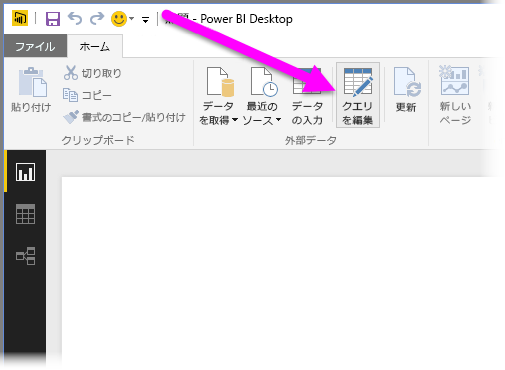
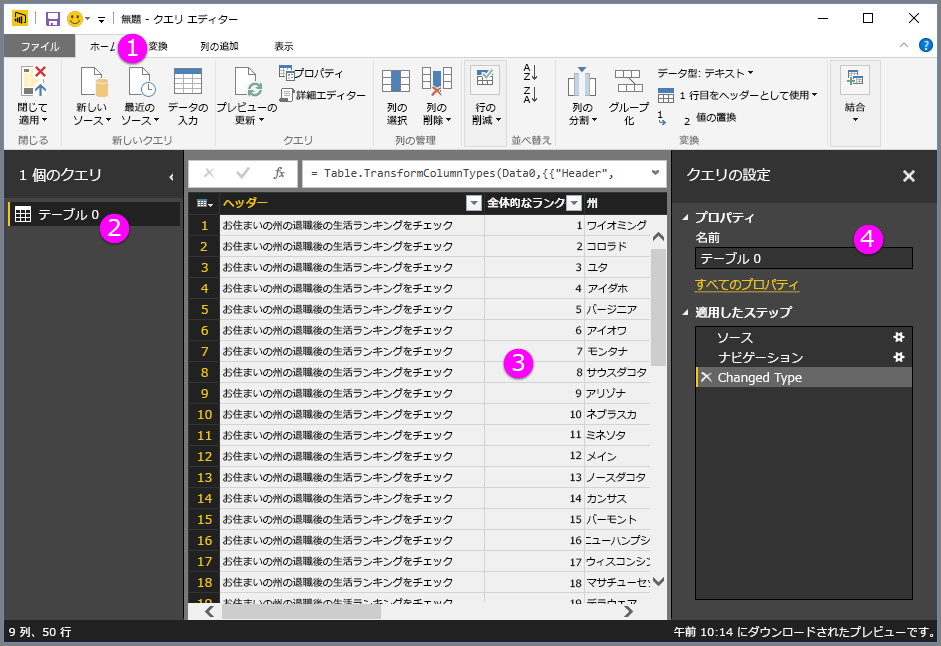
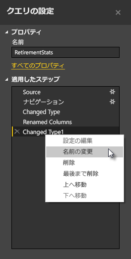
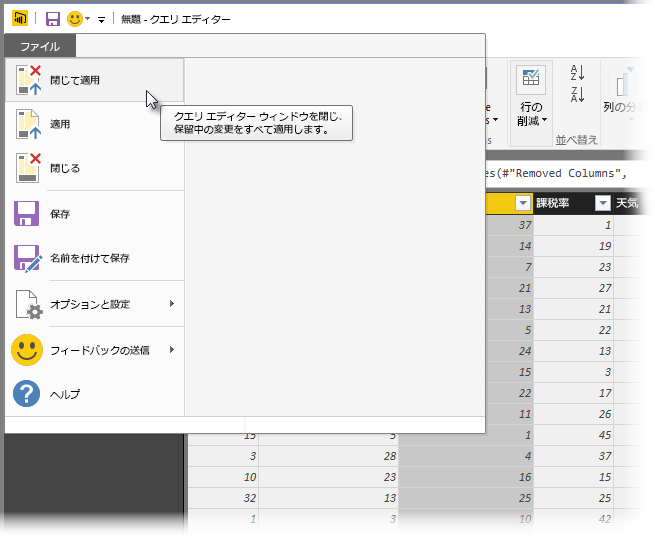

# Power BI Desktop でのクエリの概要
**Power BI Desktop** を使用すると、データの世界への接続、説得力のある基本的なレポートの作成、他のユーザーとの成果の共有を行えます。他のユーザーは、その成果を足場としてビジネス インテリジェンスの成果を拡大することができます。

Power BI Desktop には 3 つのビューがあります。

* **[レポート]** ビュー – ここでは、作成したクエリを使用して説得力のある視覚化を作成し、これを思いどおりに複数のページに配置したり、他のユーザーと共有したりすることができます。
* **[データ]** ビュー – データ モデル形式のレポートにデータを表示します。ここでは、メジャーの追加、新しい列の作成、リレーションシップの管理ができます。
* **[リレーションシップ]** ビュー – データ モデルに確立されたリレーションシップをグラフィカルに表現し、必要に応じて管理または変更できます。

これらのビューは、Power BI Desktop の左側にある 3 つのアイコンのいずれかを選んでアクセスします。 次の図では、[レポート] ビューが選択されていることが、アイコンの横の黄色の帯によって示されています。  

Power BI Desktop には **クエリ エディター**も付属しており、1 つまたは多数のデータ ソースに接続し、要件を満たすようにデータの整形と変換を行い、そのモデルを Power BI Desktop に読み込むことができます。

このドキュメントでは、 **クエリ エディター**を使用したデータ操作の概要を説明します。 もちろん、学習するべきことはほかにもあるため、このドキュメントの末尾には、サポートされているデータ型、データへの接続、データの整形、リレーションシップの作成、作業の開始方法に関する詳しいガイダンスへのリンクが用意されています。

まずは、 **クエリ エディター**に親しむことから始めましょう。

## クエリ エディター
**クエリ エディター**にアクセスするには、Power BI Desktop の **[ホーム]** タブから **[Edit Queries]** (クエリの編集) を選びます。  

データ接続がない場合、**クエリ エディター**は空のウィンドウとして、データの準備ができている状態で開きます。  

クエリが読み込まれると、**クエリ エディター** ビューはさらに興味深いものになります。 次の Web データ ソースに接続すると、**クエリ エディター**は、整形を開始するデータに関する情報を読み込みます。

[*http://www.bankrate.com/finance/retirement/best-places-retire-how-state-ranks.aspx*](http://www.bankrate.com/finance/retirement/best-places-retire-how-state-ranks.aspx)

データ接続が確立された後の**クエリ エディター**の外観を次に示します。

1. リボンでは、多くのボタンがアクティブになり、クエリ内のデータを操作できます。
2. 左側のウィンドウでは、クエリが一覧表示され、選択、表示、および整形に使用できます。
3. 中央のウィンドウでは、選択したクエリのデータが表示され、整形に使用できます。
4. **[クエリの設定]** ウィンドウが表示され、クエリのプロパティと適用される手順が一覧表示されます。  
   
   

この後のセクションでは、4 つの領域 (リボン、[クエリ] ウィンドウ、[データ] ビュー、および [クエリの設定] ウィンドウ) のそれぞれについて見ていきます。

## [クエリ] リボン
**クエリ エディター**のリボンは 4 つのタブ ( **[ホーム]** 、 **[変換]** 、 **[列の追加]** 、 **[表示]** ) で構成されています。

**[ホーム]** タブには、**データの取得**のような、クエリの最初の手順を含む一般的なクエリのタスクが含まれています。 次の図は、 **[ホーム]** リボンを示しています。  

データに接続してクエリの作成プロセスを開始するには、 **[データの取得]** ボタンを選びます。 最も一般的なデータ ソースが用意されたメニューが表示されます。  

使用できるデータ ソースについて詳しくは、「 **データ ソース**」をご覧ください。 例と手順を含む、データへの接続に関する情報については、「 **データへの接続**」をご覧ください。

**[変換]** タブでは、列の追加や削除、データ型の変更、列の分割、その他のデータドリブン タスクなどの一般的なデータ変換タスクにアクセスできます。 次の図は、 **[変換]** タブを示しています。  

例を含む、データの変換について詳しくは、「 **データの結合と整形**」をご覧ください。

**[列の追加]** タブでは、列の追加、列のデータの書式設定、カスタムの列の追加に関連するその他のタスクが用意されています。 次の図は、 **[列の追加]** タブを示しています。  

リボンの **[表示]** タブは、特定のペインまたはウィンドウに表示を切り替えるために使用します。 また、詳細設定エディターの表示にも使用します。 次の図は、 **[表示]** タブを示しています。  

リボンから使用可能なタスクの多くは、中央のウィンドウで列またはその他のデータを右クリックしても使用できることを知っておくと便利です。

## 左側のウィンドウ
左側のウィンドウには、アクティブなクエリの数だけでなく、クエリの名前も表示されます。 左側のペインからクエリを選択すると、データが中央のウィンドウに表示されます。ここではニーズに合わせてデータを整形および変換できます。 次の図は、複数のクエリを含む左側のウィンドウを示しています。  

## 中央の [データ] ウィンドウ
中央のウィンドウ、つまり [データ] ウィンドウに、選んだクエリのデータが表示されます。 ここで、[クエリ] ビューの作業の多くが実行されます。

次の図では、前に確立された Web データの接続が表示されています。 **[総得点]** 列が選ばれ、そのヘッダーが右クリックされて使用可能なメニュー項目が表示されています。 なお、右クリックで表示されるこれらのメニューの多くは、[リボン] タブのボタンと同じです。  

右クリックして表示されるメニュー項目 (またはリボンのボタン) を選ぶと、クエリがデータに手順を適用し、クエリ自体の一部として保存します。 次のセクションで説明するように、手順は **[クエリの設定]** ウィンドウに順番に記録されます。  

## [クエリの設定] ウィンドウ
**[クエリの設定]** ウィンドウには、クエリに関連付けられているすべての手順が表示されます。 たとえば、次の図では、 **[クエリの設定]** ウィンドウの **[適用される手順]** セクションで、 **[総得点]** 列の型を変更したことが反映されています。

その他の整形手順がクエリに適用される際、これらの手順は **[適用される手順]** セクションにキャプチャされます。

基になるデータは変更*されない*ことを知っておくことが重要です。むしろ、クエリ エディターはデータの表示だけでなく、クエリ エディターによって整形および変更されたそのデータに基づいて発生する、基になるデータとの相互作用を調整および整形しているのです。

**[クエリの設定]** ウィンドウで、手順の名前の変更、手順の削除、または手順の順序の変更を適宜行うことができます。 これを行うには、 **[手順の適用]** セクションで手順を右クリックし、表示されるメニューから選びます。 クエリの手順はすべて、 **[手順の適用]** ウィンドウの表示順に実行されます。

## 詳細設定エディター
クエリ エディターが各手順で作成しているコードを表示する場合や、独自の整形コードを作成する場合は、 **詳細設定エディター**を使用できます。 詳細設定エディターを起動するには、リボンから **[表示]** をクリックした後、 **[詳細設定エディター]** をクリックします。 既存のクエリのコードを示すウィンドウが表示されます。  

**[詳細設定エディター]** ウィンドウでは直接コードを編集できます。 ウィンドウを閉じるには、 **[完了]** ボタンまたは **[キャンセル]** ボタンを選びます。  

## 作業を保存する
クエリが目的にかなう状態になったなら、クエリ エディターでデータ モデルへの変更を Power BI Desktop に適用し、クエリ エディターを閉じることができます。 そのためには、クエリ エディターの **[ファイル]** メニューから **[閉じて適用]** を選びます。  

処理が進む間、Power BI Desktop には、その状態を表示するダイアログが開きます。  

希望する場所にクエリを作成したら、または作業内容を確実に保存したい場合、Power BI Desktop では .pbix ファイル形式で作業内容を保存できます。

作業内容を保存するには、次の図に示すように、 **[ファイル] \&gt; [保存]\> (または** [ファイル] \&gt; [名前を付けて保存] **) の順に選びます\>** 。  

## 次の手順
Power BI Desktop を使用すると、さまざまなことを行えます。 そのような機能について詳しくは、次のリソースをご覧ください。

* [Power BI Desktop とは何ですか?](desktop-what-is-desktop.md)
* [Power BI Desktop のデータ ソース](desktop-data-sources.md)
* [Power BI Desktop におけるデータへの接続](desktop-connect-to-data.md)
* [Power BI Desktop でのデータの整形と結合](desktop-shape-and-combine-data.md)
* [Power BI Desktop での一般的なクエリ タスク](desktop-common-query-tasks.md)   

