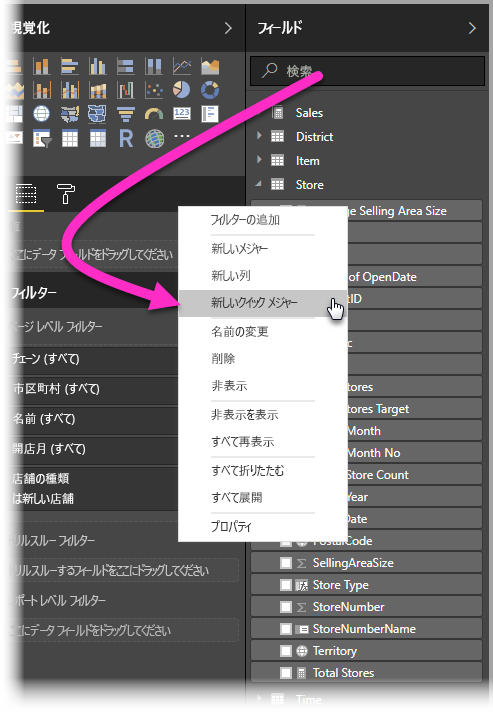
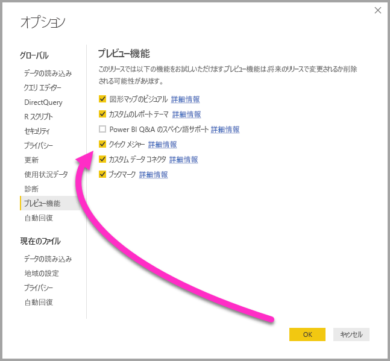
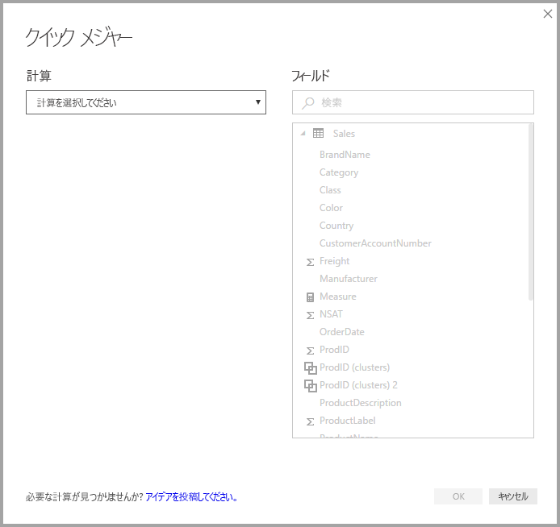
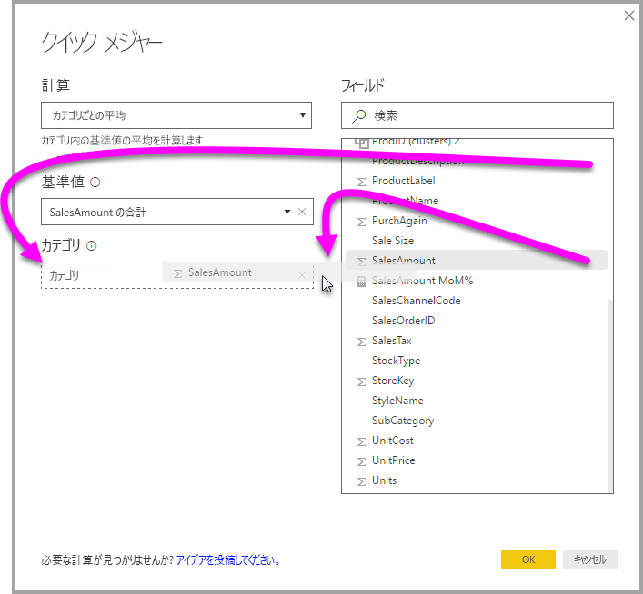
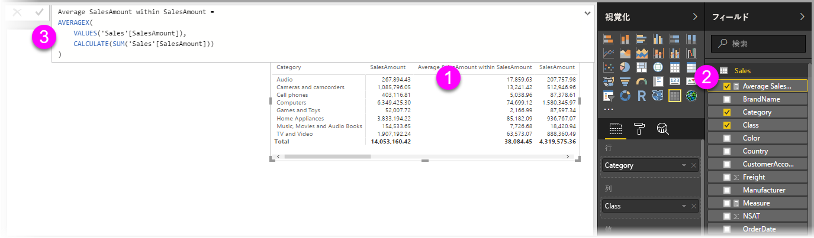
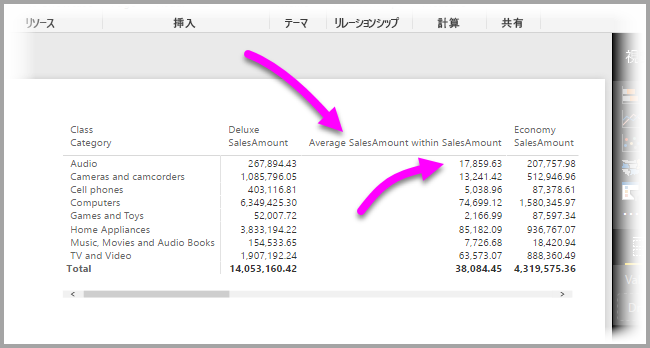
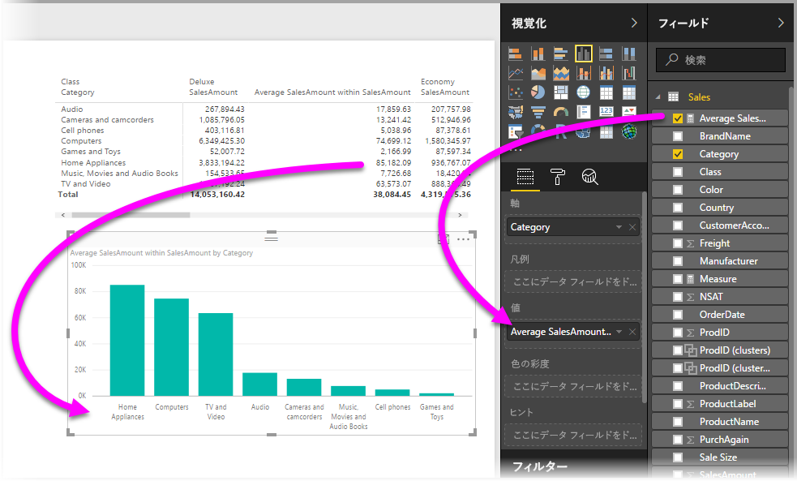
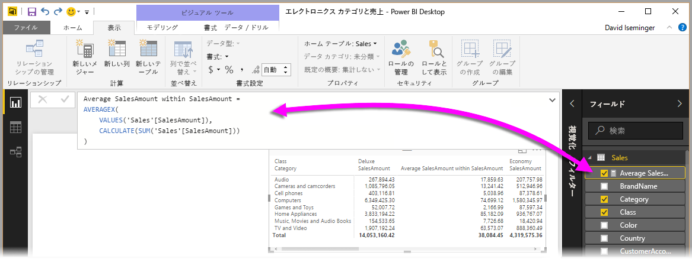
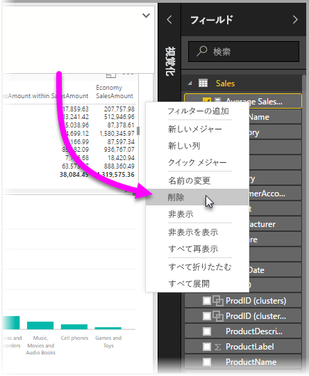

# クイック メジャーを使用して一般的で強力な計算を簡単に実行する
**クイック メジャー**を使用し、一般的で強力な計算を簡単に実行できます。 **クイック メジャー**は、ダイアログ ボックスで指定された入力に基づいて、一連の DAX コマンドをバックグラウンドで実行し (DAX は自動的に作成されるので、自分で記述する必要はありません)、レポートで使える結果を提供します。 何より、クイック メジャーによって実行される DAX を参照でき、すぐに始めたり、自分の DAX の知識を広げたりすることができます。

**クイック メジャー**を作成するには、**[フィールド]** ウェル内のフィールドを右クリックし、表示されるメニューから **[クイック メジャー]** を選びます。 また、既存のビジュアルの **[値]** ペインの値を右クリックしてもかまいません (*横棒グラフ* ビジュアルの *[値]* フィールドなど)。 計算のカテゴリ、およびニーズに合わせた各計算の変更方法が、数多くあります。

### クイック メジャーが通常利用できるようになりました

**Power BI Desktop** の 2018 年 2 月リリースより、クイック メジャーが通常利用できるようになりました (プレビューでなくなりました)。 以前のリリースの **Power BI Desktop** を使用している場合、**Power BI Desktop** の **2017 年 4 月**リリースから始まる**クイック メジャー**機能をお試しいただけます。**[ファイル]、[オプションと設定]、[オプション]、[プレビュー機能]** の順に選択し、**[クイック メジャー]** の横にあるチェックボックスを選択します。

選択を行った後、**Power BI Desktop** を再起動する必要があります。

## クイック メジャーを使用する
**クイック メジャー**を作成するには、**Power BI Desktop** の **[フィールド]** ウェル内のフィールド (任意のフィールド) を右クリックして、表示されるメニューから **[クイック メジャー]** を選びます。

**クイック メジャー**を使うには、現在読み込まれているデータセットでモデリングが使用できる必要があります。 そのため、ライブ接続 (Power BI サービス データセットへの接続など) では、**[フィールド]** リストを右クリックしても **[クイック メジャー]** メニュー項目は表示されません (SSAS ライブ接続を除きます)。 

SQL Server Analysis Services (SSAS) ライブ接続を使っているときは、一部の**クイック メジャー**を利用できます。 **Power BI Desktop** には、接続している SSAS のバージョンでサポートされる**クイック メジャー**のコレクションのみが表示されます。 したがって、SSAS ライブ データ ソースに接続していて、特定の**クイック メジャー**が一覧に表示されない場合は、その**クイックメジャー**の実装に使われる DAX メジャーを、接続している SSAS のバージョンがサポートしていないためです。

右クリック メニューで選ぶと次のような **[クイック メジャー]** ウィンドウが表示され、必要な計算と、計算対象のフィールドを選ぶことができます。

ドロップダウン メニューを選ぶと、使用可能な**クイック メジャー**の長いリストが表示されます。

クイック メジャーの計算タイプには 5 つのグループがあり、それぞれに計算のコレクションが含まれます。 これらのグループおよび計算は次のとおりです。

* **カテゴリごとの集計**
  * カテゴリ内の平均
  * カテゴリ内の分散
  * カテゴリ内の最大値
  * カテゴリ内の最小値
  * カテゴリごとの加重平均
* **フィルター**
  * フィルターされた値
  * 基準との差異
  * フィルターされた値に対する差異の比率
  * 新しいカテゴリからの売上高
* **タイム インテリジェンス**
  * 年度累計
  * 四半期累計
  * 月度累計
  * 前年比の変化
  * 四半期ごとの変化
  * 月ごとの変化
  * 移動平均
* **合計**
  * 累積値
  * カテゴリの合計 (フィルター適用)
  * カテゴリの合計 (フィルター非適用)
* **数学演算**
  * 加算
  * 減算
  * 乗算
  * 除算
  * 差の割合
  * 相関係数
* **テキスト**
  * 星評価
  * 値の連結リスト

計算はさらに追加される予定です。また、使いたい**クイック メジャー**や、追加して欲しい**クイック メジャー**のアイデア (基になる DAX 式も) などについて、意見を送りください。 詳しくは、記事の最後をご覧ください。

## クイック メジャーの例
これらの**クイック メジャー**が動作する例を見てみましょう。

次の**マトリックス** ビジュアルでは、さまざまな電子製品の売上のテーブルが示されています。 各カテゴリの合計を含む基本的なテーブルです。

**[値]** フィールド ウェルを右クリックして **[クイック メジャー]** を選び、*[計算]* として *[カテゴリ内の平均]* を選び、*[基準値]* として *[Sum of SalesAmount]* を選び、右側のペインの *[フィールド]* ボックスから左側の *[カテゴリ]* セクションにフィールドをドラッグして *[SalesAmount]* を指定します。

**[OK]** を選ぶと、次の一覧の後の図で示すように、いくつか興味深いことが起こります。

1. **マトリックス** ビジュアルに、計算を示す新しい列が追加されます (この例では、*Average SalesAmount within SalesAmount*)。
2. 新しい**メジャー**が作成されて、**[フィールド]** ウェルで使用できるようになり、強調表示されます (黄色のボックスで囲まれます)。 このメジャーは、それがもともと作成されたビジュアルだけでなく、レポート内の他のビジュアルでも使用できます。
3. **クイック メジャー**用に作成された DAX 式が、数式バーに表示されます。

まず最初の項目については、**クイック メジャー**がビジュアルに適用されたことに注意してください。 新しい列とそれに関連する値があり、これらはどちらも作成された**クイック メジャー**に基づきます。

次に、**クイック メジャー**がデータ モデルの **[フィールド]** ウェルに表示され、モデル内の他のフィールドと同じように、他のビジュアルで使うことができます。 次の図では、**クイック メジャー**によって作成された新しいフィールドを使って、クイック**縦棒グラフ** ビジュアルが作成されています。

次のセクションでは、3 番目の項目である DAX 式について説明します。

## クイック メジャーを使って DAX を学習する
**クイック メジャー**機能のもう 1 つの優れた利点は、メジャーを実装するために作成された DAX 式が直接表示されることです。 次の図は、**クイック メジャー**で作成されたメジャーを選択したところです (**[フィールド]** ウェルに追加されているので、それをクリックするだけです)。 選択すると、**数式バー**が表示され、メジャーを実装するために Power BI が作成した DAX 式が示されます。

これ自体も、メジャーの背後にある式がわかって便利です。 しかし、さらに重要なことはおそらく、**クイック メジャー**を使うと、基になる DAX 式の作成方法を確認できることです。

年度ごとの計算を行う必要があっても、DAX 式の構成方法がよくわからない場合を想像してみてください (または、何から手を付ければよいのかわからない場合)。 机に頭を打ちつける代わりに、**[年度ごとの変化]** 計算を使って**クイック メジャー**を作成し、どうなるか見てください。 このように、**クイック メジャー**を作成してビジュアルでどのように表示されるかを調べ、DAX 式の動作を確認した後、DAX を直接変更するか、別のメジャーを作成して、計算がニーズや期待を満たすようにします。

仮定の質問に数クリックですぐに答えてくれる教師がいるようなものです。 気に入らない場合は、モデルからメジャーをいつでも削除できます。メジャーを右クリックし、**[削除]** を選ぶだけです。

メジャーが完成したら、同じ右クリック メニューで適切な名前に変更できます。

## 制限事項と考慮事項
注意すべきいくつかの制限事項と考慮事項があります。

* **クイック メジャー**は、モデルを変更できる場合にのみ使うことができます。したがって、DirectQuery やほとんどのライブ接続 (前に説明したように SSAS ライブ接続はサポートされます) を使っているときは利用できません。
* **[フィールド]** ウェルに追加されたメジャーは、レポートのすべてのビジュアルで使用できます。
* **[フィールド]** ウェルで作成されたメジャーを選び、**数式バー**の式を見ることによって、**クイック メジャー**に関連付けられた DAX をいつでも確認できます。

> [!WARNING]
> クイック メジャーで生成される DAX ステートメントでは、現在、引数の区切り記号としてコンマ*のみ*が使用されます。 **Power BI Desktop** のローカライズ先の言語で、コンマが小数点記号として使用されていると、クイック メジャーは正しく動作しません。
> 
> 

### タイム インテリジェンスとクイック メジャー
**Power BI Desktop** の 2017 年 10 月の更新プログラム以降では、タイム インテリジェンス **クイック メジャー**で独自のカスタム日付テーブルを使うことができます。 データ モデルにカスタム日付テーブルがある場合、タイム インテリジェンス クイック メジャーでそのテーブル内のプライマリ日付列を使うことができます。 [こちらの記事](https://docs.microsoft.com/sql/analysis-services/tabular-models/specify-mark-as-date-table-for-use-with-time-intelligence-ssas-tabular)で説明されているように、モデルを作成するときに、そのテーブルのプライマリ日付列が日付テーブルとしてマークされたことを、確認する "*必要があります*"。

### その他の情報と例
各**クイック メジャー**の計算に関する例とガイダンスを提供する予定なので、該当する記事を確認してください。

まだ提供されていない**クイック メジャー**についてのアイデアがありますか。 それは素晴らしいことです。 [こちらのページ](https://go.microsoft.com/fwlink/?linkid=842906)で、**Power BI Desktop** に追加して欲しい**クイック メジャー**についてのアイデア (および DAX 式) をお送りください。今後リリースされる**クイック メジャー**に追加するかどうか検討させていただきます。

