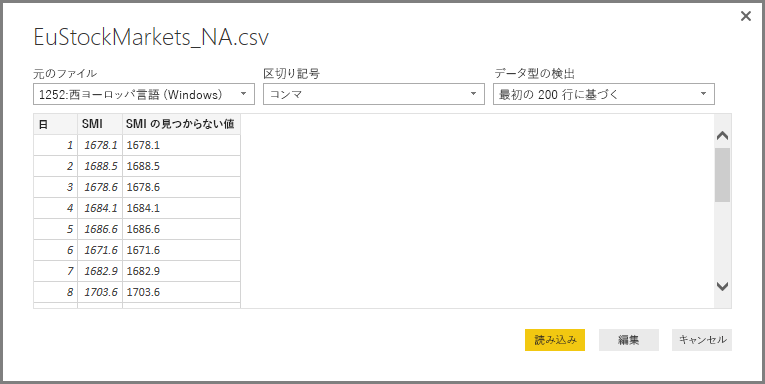
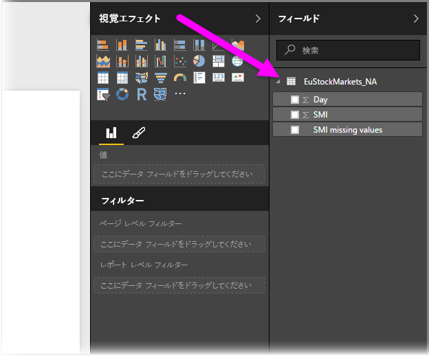
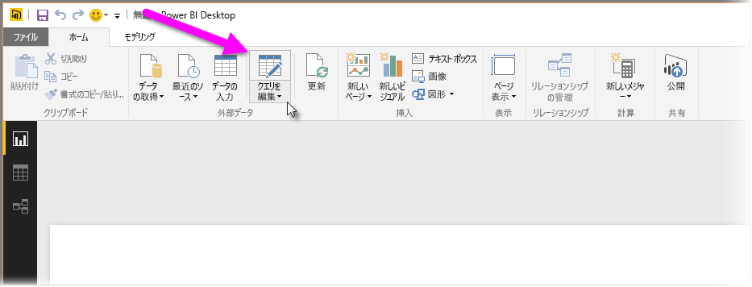
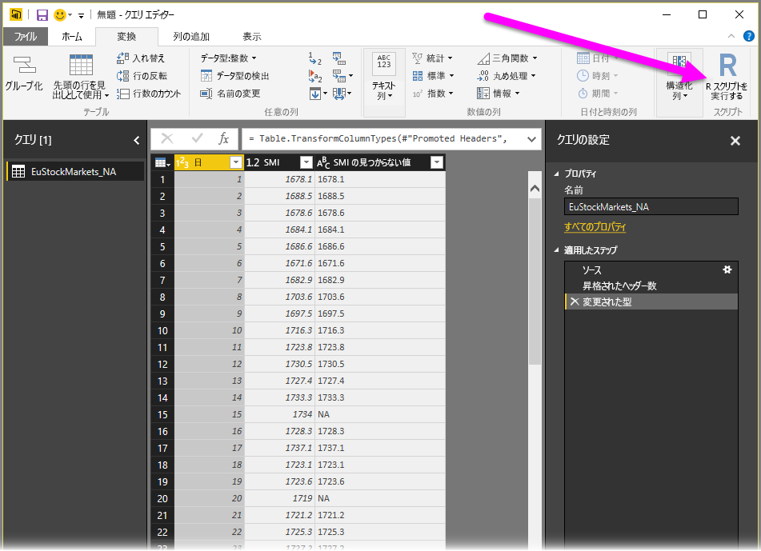
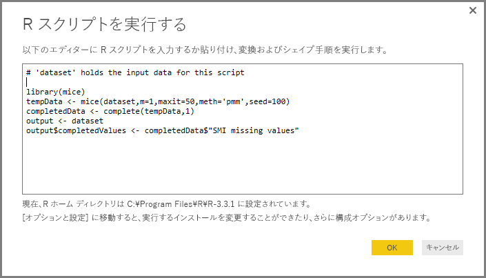
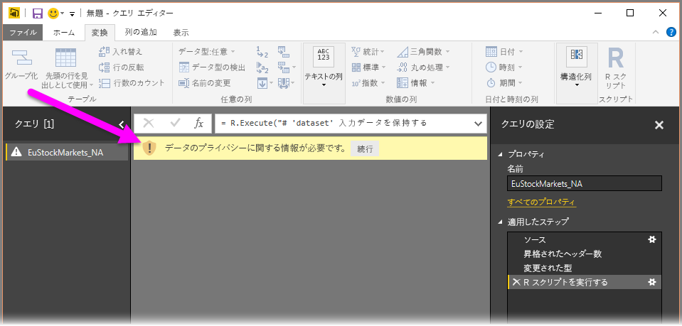
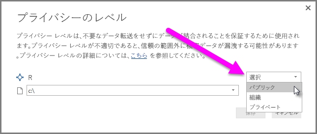
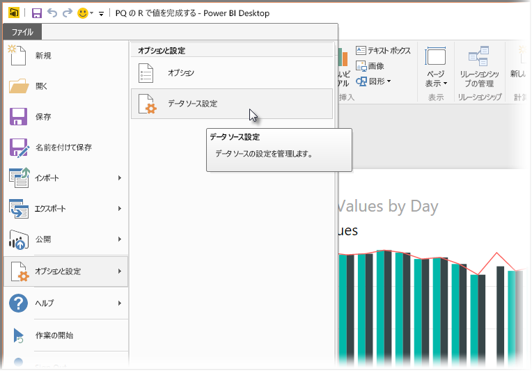
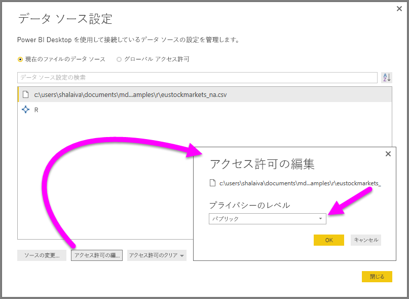

# クエリ エディターで R を使用する
Power BI Desktop **クエリ エディター**では、統計学者、データ科学者、データ分析官によって広く使用されているプログラミング言語、**R** を使用できます。 R と**クエリ エディター**を統合することで、R によるデータ クレンジングを実行したり、データセットで高度なデータ シェイプ/データ分析 (失ったデータを埋める、予測、クラスター化など) を実行したりできます。 **R** は高度な言語であり、**クエリ エディター**で使用し、データ モデルを用意したり、レポートを作成したりできます。

## R をインストールする
Power BI Desktop の**クエリ エディター**で **R** を実行するには、ローカル コンピューターに **R** をインストールする必要があります。 **R** はさまざまな場所から無料でダウンロードし、インストールできます。たとえば、[Revolution Open ダウンロード ページ](https://mran.revolutionanalytics.com/download/)や [CRAN Repository](https://cran.r-project.org/bin/windows/base/) があります。

## クエリ エディターで R を使用する
**クエリ エディター**で **R** を使用する方法を示すために、ある株式市場のデータセットを例として使用します。これは .CSV ファイル形式であり、[ここからダウンロード](http://download.microsoft.com/download/F/8/A/F8AA9DC9-8545-4AAE-9305-27AD1D01DC03/EuStockMarkets_NA.csv)し、ご利用いただけます。 この例の手順は次のようになります。

1. 最初に、**Power BI Desktop** にデータを読み込みます。 この例では、*EuStockMarkets_NA.csv* ファイルを読み込み、**Power BI Desktop** の **[ホーム]** リボンから **[データの取得] > [CSV]** を選択します。
   
   
2. ファイルを選択し、**[開く]** を選択します。CSV が **[CSV ファイル]** ダイアログに表示されます。
   
   
3. 読み込まれたデータは、Power BI Desktop の **[フィールド]** ウィンドウに表示されます。
   
   
4. **Power BI Desktop** の **[ホーム]** タブで **[クエリを編集]** を選択し、**クエリ エディター**を開きます。
   
   
5. **[変換]** タブで、**[R スクリプトを実行する]** を選択します。**[R スクリプトを実行する]** エディターが表示されます (次の手順の画像を参照してください)。 行 15 と行 20 にデータが欠けています。画像では確認できませんが、他にもデータが欠けている行があります。 このような行のデータを R で自動的に補完する方法を以下に示します。
   
   
6. この例では、次のスクリプト コードを入力します。
   
       library(mice)
       tempData <- mice(dataset,m=1,maxit=50,meth='pmm',seed=100)
       completedData <- complete(tempData,1)
       output <- dataset
       output$completedValues <- completedData$"SMI missing values"
   
   > [!NOTE]
   > 前のスクリプト コードを正しく動作させるためには、R 環境に *mice* ライブラリをインストールする必要があります。 mice をインストールするには、R のインストールで |      > install.packages('mice') コマンドを実行します。
   > 
   > 
   
   **[R スクリプトを実行する]** ダイアログに入力するコードは次のようになります。
   
   
7. **[OK]** を選択すると、**クエリ エディター**にデータ プライバシーに関する警告が表示されます。
   
   
8. Power BI サービスで R スクリプトを正しく動作させるためには、すべてのデータ ソースを *[パブリック]* に設定する必要があります。 プライバシー設定とその意味に関する詳細については、「[プライバシー レベル](desktop-privacy-levels.md)」を参照してください。
   
   
   
   **[フィールド]** ウィンドウに *completedValues* という新しい列が表示されます。 行 15 や行 18 行など、いくつかの行でデータ要素が不足しています。 次のセクションでは、R がデータ要素の不足を処理するしくみを確認します。
   

わずか 5 行の R スクリプトで、**クエリ エディター**は予測モデルで不足値を埋めました。

## R スクリプト データからビジュアルを作成する
これで、R スクリプト コードと *mice* ライブラリで不足値を補うしくみを示すビジュアルを作成できます。次の画像のようになります。

そのビジュアルが完成したら (**Power BI Desktop** 他のビジュアルを作成すると、さらに効果的な場合もあります)、**Power BI Desktop** ファイルを保存し (.pbix ファイルとして保存)、Power BI サービスでデータ モデル (R スクリプトが含まれる) を使用できます。

> [!NOTE]
> 以上の手順を完了した .pbix ファイルをご覧になる場合は、 上記の例で使用されている **Power BI Desktop** ファイルの完成したものを[ここから](http://download.microsoft.com/download/F/8/A/F8AA9DC9-8545-4AAE-9305-27AD1D01DC03/Complete Values with R in PQ.pbix)ダウンロードできます。
> 
> 

.pbix ファイルを Power BI サービスにアップロードしたら、さらにいくつかの手順を実行し、(サービスで) データ更新を有効にし、サービスでビジュアルの更新を有効にする必要があります (ビジュアルを更新するには、データが R にアクセスする必要があります)。 追加の手順は次のとおりです。

* **データセットの定期更新を有効にする** - データセットを含むブックを R スクリプトで定期的に更新する方法については、「[スケジュールされた更新の構成](refresh-scheduled-refresh.md)」を参照してください。**Personal Gateway** に関する情報もあります。
* **Personal Gateway をインストールする** - ファイルが置かれ、R がインストールされているコンピューターに **Personal Gateway** をインストールする必要があります。Power BI サービスは、そのブックにアクセスし、更新されたビジュアルがあれば、それを再レンダリングできなければなりません。 [Personal Gateway のインストール方法と構成方法](personal-gateway.md)については、他にも情報を参照できます。

## 制限事項
**クエリ エディター**で作成された R スクリプトを含むクエリにはいくつかの制限事項があります。

* R データ ソース設定はすべて、*[パブリック]* に設定する必要があります。**クエリ エディター**で作成されたクエリの他の手順もすべてパブリックにする必要があります。 データ ソース設定にアクセスするには、**Power BI Desktop** で、**[ファイル]、[オプションと設定]、[データ ソース設定]** の順に選択します。
  
  
  
  **[データ ソース設定]** ダイアログで、データ ソースを選択し、**[アクセス許可の編集]** を選択し、**[プライバシー レベル]** が *[パブリック]* に設定されていることを確認します。
  
      
* R のビジュアルやデータセットの定期更新を有効にするには、**スケジュール更新**を有効にし、ブックが置かれ、R をインストールしているコンピューターに **Personal Gateway** をインストールする必要があります。 それぞれの詳細な情報については、この記事の前のセクションにリンクがあります。

R とカスタム クエリを利用すれば、さまざまなデータ表示が可能です。いろいろ試してください。

