# Power BI で R を利用したカスタム ビジュアルを使用する
**Power BI Desktop** および **Power BI サービス**では、R の知識がなく、R スクリプトを作成しなくても、R を利用したカスタム ビジュアルを使用できます。 これにより、自分で R を学習したりプログラミングを実行したりしなくても、R ビジュアルの分析や視覚機能に加え、R スクリプトを活用できます。

R を利用したカスタム ビジュアルを使用するには、まず、使用したい R カスタム ビジュアルを、Power BI **カスタム ビジュアル**の [**AppSource**](https://appsource.microsoft.com/marketplace/apps?product=power-bi-visuals&page=1) ギャラリーで選択してダウンロードします。

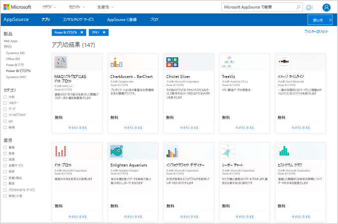

以下のセクションでは、R を利用したビジュアルを **Power BI Desktop** で選択して読み込み、使用する方法について説明します。

## R カスタム ビジュアルを使用する
R を利用したカスタム ビジュアルを使用するには、各ビジュアルを**カスタム ビジュアル** ライブラリからダウンロードした後、このビジュアルを **Power BI Desktop** で他の種類のビジュアルと同様に使用します。 カスタム ビジュアルを取得する場合、オンラインの **AppSource** サイトからダウンロードする方法と、**Power BI Desktop** 内から参照して取得する方法の 2 つがあります。 

### AppSource からカスタム ビジュアルを取得する

オンラインの **AppSource** サイトからビジュアルを参照して選択する手順を以下に示します。

1. [https://appsource.microsoft.com](https://appsource.microsoft.com/) にある Power BI visuals ライブラリに移動します。*[製品で絞り込む]* にある *[Power BI apps]* チェックボックスを選択して、**[すべて表示]** リンクを選択します。
   
   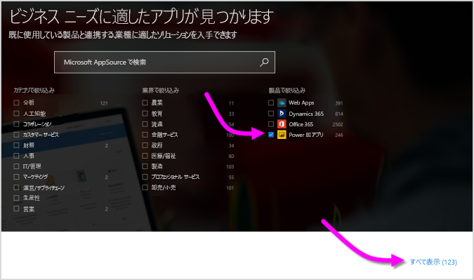

2. [Power BI visuals](https://appsource.microsoft.com/marketplace/apps?product=power-bi-visuals&page=1) ライブラリ ページで、左側のウィンドウのアドインの一覧から、**[Power BI visual]** を選択します。

   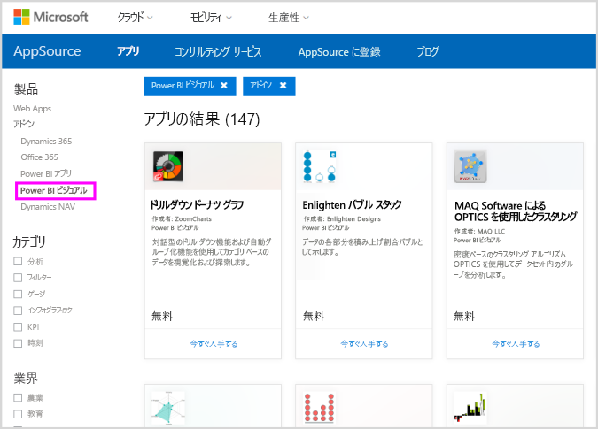

3. 関心のある**ビジュアル**をギャラリーから選択すると、ビジュアルに関する説明のページに移動します。 **[今すぐ入手する]** ボタンを選択してダウンロードします。
   
   > [!NOTE]
    > **Power BI Desktop** で作成している場合は、ローカル コンピューターに R をインストールしておく必要があります。 ただし、ユーザーが R を利用したビジュアルを **Power BI サービス**に表示したい場合は、R をローカルにインストールしておく必要はありません。
   > 
   > 
   
   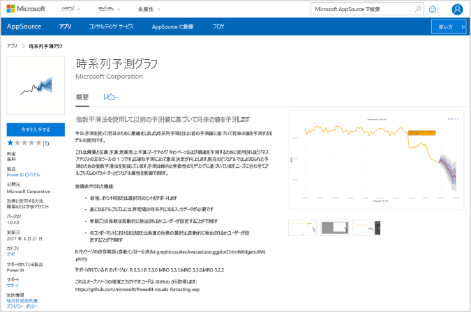
   
   R を利用したカスタム ビジュアルを **Power BI サービス**で使用するために R をインストールする必要はありませんが、**Power BI Desktop** で使用する場合は、ローカル コンピューターに R をインストールする "*必要があります*"。 R は、次の場所からダウンロードできます。
   
   * [CRAN](https://cran.r-project.org/)
   * [MRO](https://mran.microsoft.com/)

4. ビジュアルがダウンロードされたら (ブラウザーから任意のファイルをダウンロードするのと似ています)、**Power BI Desktop** に移動し、**[視覚化]** ウィンドウの省略記号 ([...]) をクリックして、**[ファイルからインポートする]** を選択します。
   
   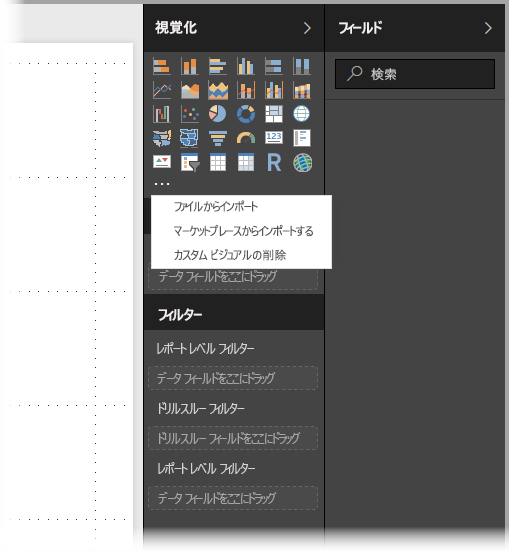
5. 次の図に示すように、カスタム ビジュアルのインポートに関する警告が表示されます。
   
   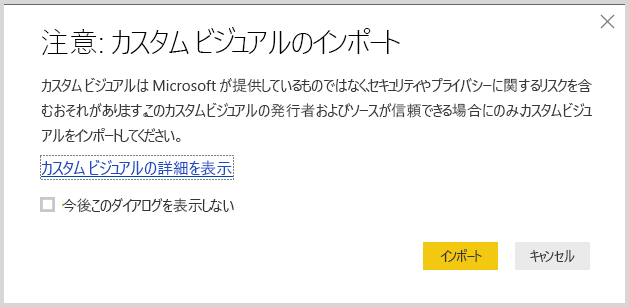
6. ビジュアル ファイルが保存された場所に移動し、そのファイルを選択します。 **Power BI Desktop** のカスタム ビジュアルの拡張子は .pbiviz です。
   
   
7. Power BI Desktop に戻ると、**[視覚化]** ウィンドウに新しいビジュアルの種類が表示されます。
   
   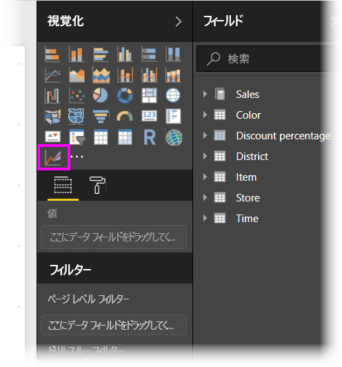
8. 新しいビジュアルをインストールする (または、R を利用したカスタム ビジュアルを含むレポートを開く) と、**Power BI Desktop** によって、必要な R パッケージがインストールされます。
   
   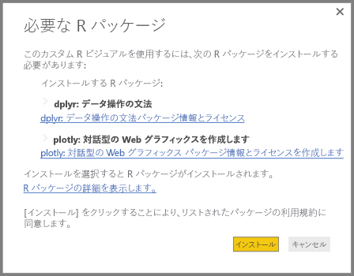

9. そこから、その他の **Power BI Desktop** ビジュアルと同様に、ビジュアルにデータを追加できます。 完了すると、完成したビジュアルがキャンバスに表示されます。 次のビジュアルでは、R を利用したビジュアル "**予測**" が、国連 (UN) の出生率予測 (左側のビジュアル) と共に使用されています。

    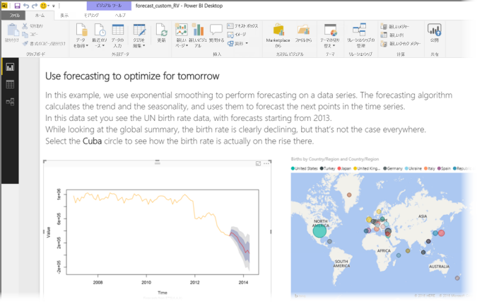

    他の **Power BI Desktop** ビジュアルと同様、その R を利用したビジュアルを含むこのレポートを **Power BI サービス**に発行し、他のユーザーと共有することができます。

    新しいビジュアルが頻繁に追加されるため、ライブラリはこまめに確認してください。

### **Power BI Desktop** 内からカスタム ビジュアルを入手する

1. **Power BI Desktop** 内からカスタム ビジュアルを入手することもできます。 **Power BI Desktop** の **[視覚化]** ウィンドウで省略記号 (...) をクリックして、**[Import from marketplace]\(Marketplace からインポート\)** を選択します。
   
   

2. これを行うと、**[Power BI ビジュアル]** ダイアログが表示され、ここから入手可能なカスタム ビジュアルをスクロールして選択することができます。 名前での検索やカテゴリの選択ができるだけでなく、単に入手可能なビジュアルをスクロールすることもできます。 準備ができたら、**[追加]** を選択してカスタム ビジュアルを **Power BI Desktop** に追加します。

   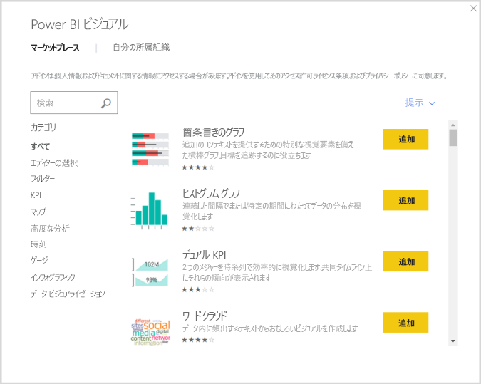

## R を利用したカスタム ビジュアルを投稿する
レポートに使用するために独自の R ビジュアルを作成した場合は、そのカスタム ビジュアルを**カスタム ビジュアル ギャラリー**に投稿することで、世界中に公開できます。 投稿は GitHub を通じて行われるため、その処理については次の場所で説明されています。

* [R を利用したカスタム ビジュアル ギャラリーに投稿する](https://github.com/Microsoft/PowerBI-visuals#building-r-powered-custom-visual-corrplot)

## R を利用したカスタム ビジュアルをトラブルシューティングする
R を利用したカスタム ビジュアルには、ビジュアルが適切に機能するために満たす必要のある特定の依存関係があります。 R を利用したカスタム ビジュアルの実行や読み込みが正常に行われないときは、通常、次のいずれかの問題があります。

* R エンジンがない
* ビジュアルの基になっている R スクリプトにエラーがある
* R パッケージが存在しないか期限切れである

以下のセクションでは、発生した問題に対処するために実行できるトラブルシューティング手順について説明します。

### R パッケージが存在しないか期限が切れている
R パッケージが存在しないか、古くなっていると、R を利用したカスタム ビジュアルをインストールするときにエラーが発生します。これは通常、次のいずれかの理由によるものです。

* R のインストールと R パッケージの間に互換性がありません
* ファイアウォール、ウイルス対策ソフトウェア、またはプロキシの設定により、R がインターネットに接続できません
* インターネットの接続が遅いか、インターネット接続に問題があります

Power BI チームはこれらの問題の軽減に懸命に取り組んでおり、次の Power BI Desktop には、これらの問題に対処する更新プログラムが組み込まれる予定です。 それまでは、次の手順を使って問題を軽減できます。

1. カスタム ビジュアルを削除してから、再インストールします。 これにより、R パッケージの再インストールが開始します。
2. R のインストールが最新ではない場合は、R のインストールをアップグレードした後、前の手順のようにカスタム ビジュアルを削除して再インストールします。
   
   サポートされている R のバージョンは、次の図のように、R を利用したカスタム ビジュアルの説明に表示されます。
   
     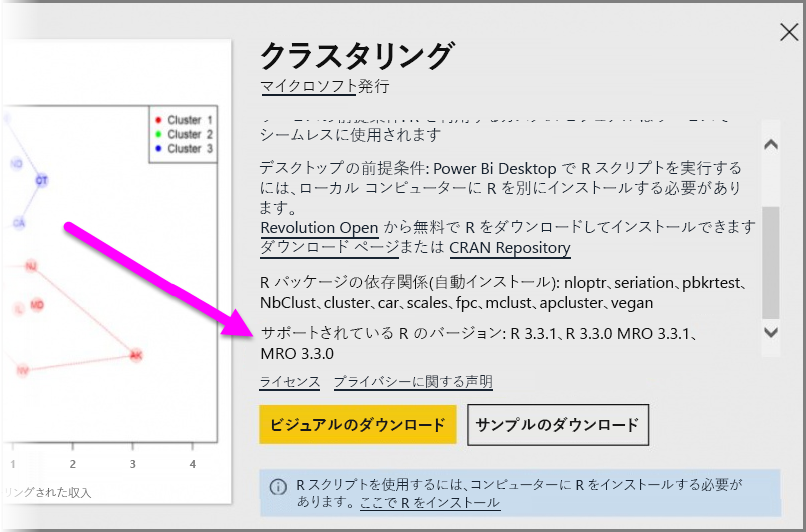
     > [!NOTE]
    > 元の R のインストールを残しておき、Power BI Desktop とインストールした最新バージョンの関連付けのみを行うことができます。 **[ファイル] > [オプションと設定] > [オプション] > [R スクリプト]** の順に移動します。
    >
    >
3. R コンソールを使って、R パッケージを手動でインストールします。 このアプローチの手順は次のとおりです。
   
   a.  R を利用したビジュアルのインストール スクリプトをダウンロードし、そのファイルをローカル ドライブに保存します。
   
   b.  R コンソールから、次の手順を実行します。
   
       > source(“C:/Users/david/Downloads/ScriptInstallPackagesForForecastWithWorkarounds.R”)    
   
   標準的な既定のインストール場所は次のとおりです。
   
       c:\Program Files\R\R-3.3.x\bin\x64\Rterm.exe (for CRAN-R)
       c:\Program Files\R\R-3.3.x\bin\x64\Rgui.exe (for CRAN-R)
       c:\Program Files\R\R-3.3.x\bin\R.exe (for CRAN-R)
       c:\Program Files\Microsoft\MRO-3.3.x\bin\R.exe (for MRO)
       c:\Program Files\Microsoft\MRO-3.3.x\bin\x64\Rgui.exe (for MRO)
       c:\Program Files\RStudio\bin\rstudio.exe (for RStudio)
4. 前の手順でうまくいかない場合は、次のことを試してください。
   
   a. **R Studio** を使い、上の 3.b  (R コンソールからのスクリプト行の実行) に記載されている手順に従います。
   
   b. 前の手順でうまくいかない場合は、**R Studio** で **[ツール] > [グローバル オプション] > [パッケージ]** に移動し、**[Use Internet Explorer library/proxy for HTTP]** (HTTP に Internet Explorer のライブラリ/プロキシを使用する) チェック ボックスをオンにして、上の手順の 3.b を 繰り返します。

## 次の手順
Power BI での R については、次の追加情報を参照してください。

* [Power BI カスタム ビジュアル ギャラリー](https://app.powerbi.com/visuals/)
* [Power BI Desktop での R スクリプトの実行](desktop-r-scripts.md)
* [Power BI Desktop で R ビジュアルを作成する](desktop-r-visuals.md)
* [Power BI で外部 R IDE を使用する](desktop-r-ide.md)

