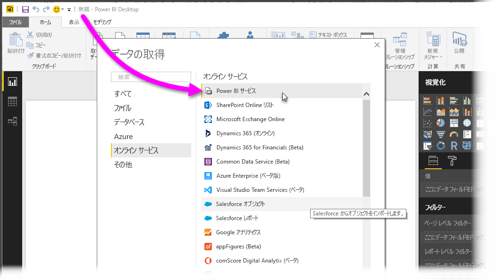
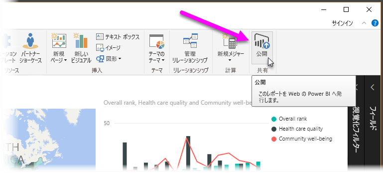
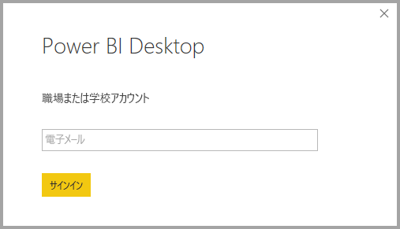
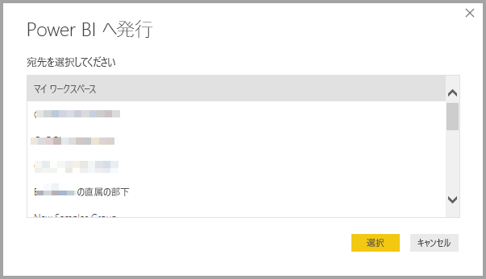
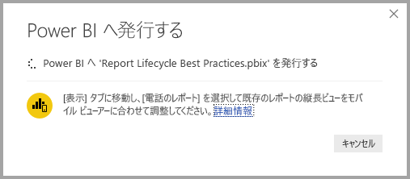
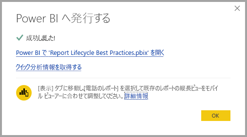
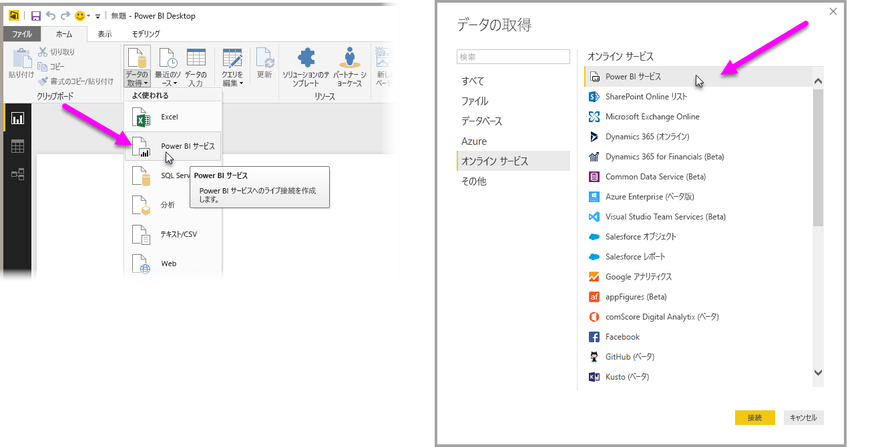
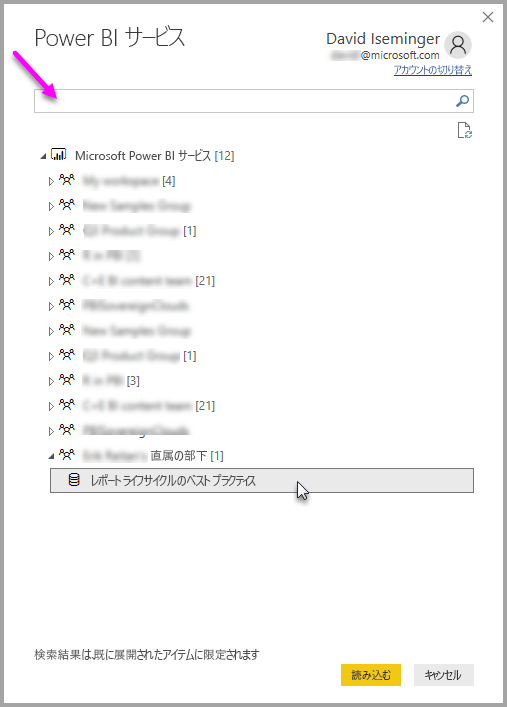

# Power BI Desktop から Power BI サービスのデータセットに接続する
Power BI サービスの共有データセットへのライブ接続を確立し、同じデータセットから多数の異なるレポートを作成できます。 つまり、Power BI Desktop で完全なデータ モデルを作成し、それを Power BI サービスに発行した後、その同じ共通のデータ モデルから複数の異なるレポート (異なる .pbix ファイル) を作成できます。 この機能は、**Power BI サービス ライブ接続**と呼ばれます。

この機能にはベスト プラクティスなどあらゆる種類の利点があり、この記事ではそれについて説明します。 考慮事項と制限もいくつかあり、この記事の最後に記載してあるので、よく読んでおいてください。

## レポートのライフサイクル管理に Power BI サービス ライブ接続を使う
Power BI の 1 つの課題は、レポート、ダッシュボード、およびその基になるデータ モデルの急増です。 このようなことが問題になるのは、**Power BI Desktop** で説得力のあるレポートを簡単に作成し、そのレポートを **Power BI サービス**で共有 ([発行](desktop-upload-desktop-files.md)) して、それらのデータセットから優れたダッシュボードを作成できるためです。 非常に多くのユーザーが、多くの場合は同じ (またはほぼ同じ) データセットを使って、これを行うため、レポートの基になっているデータセットや、各データセットの新しさを把握することが、困難になります。 **Power BI サービス ライブ接続**はそのような課題に対処し、共通のデータセットに基づくレポートとダッシュボードの作成、共有、拡張を、簡単かつ一貫性のあるものにします。

### 誰でも使用できるデータセットを作成して共有する
Anna (ビジネス アナリスト) は、優れたデータ モデル (データセット) を作成するものとします。 Anna は専門知識を駆使してデータセットとレポートを作成し、そのレポートを **Power BI サービス**で共有します。

誰もが Anna のレポートとデータセットを好みますが、それが問題の始まりです。チームの全員がそのデータセットの "*自分用バージョン*" を作成し、自分のレポートをチームで共有しようとします。 そして突然、**Power BI サービス**のチームのワークスペースに、(異なるデータセットに基づく) 大量のレポートが出現します。 どれが最新のものでしょう。 データセットは同じですか、それともほぼ同じなだけですか。 何が違うのですか。 **Power BI サービス ライブ接続**機能を使うと、このようなことをすべて改善できます。 次のセクションでは、Anna が発行したデータセットを、他のユーザーが自分のレポートに使用し、誰もが同じ発行されたデータセットを使って独自のレポートを作成できるようにする方法を説明します。

### ライブ接続を使用して Power BI サービス データセットに接続する
Anna が自分のレポート (および、その基になるデータセット) を作って **Power BI サービス**に発行すると、Power BI サービスのチームのワークスペースに表示されます。 そのワークスペースに含まれるすべてのユーザーが、それを表示して使用できます。

ワークスペースの詳細については、「[アプリ ワークスペース](service-create-workspaces.md)」を参照してください。

ワークスペースの他のメンバーは、**Power BI サービス ライブ接続**機能を使って Anna の共有データ モデルへのライブ接続を確立し、" *の元のデータセット*" から独自のレポートを作成できます。

次の図は、Anna が **Power BI Desktop** レポートを作成し、**Power BI サービス**に (データ モデルを含む) それを発行する様子を示しています。 ワークスペースの他のユーザーは、**Power BI サービス ライブ接続**を使ってそのデータ モデルに接続し、それを基にして独自のレポートを作成できます。

> [!NOTE]
> データセットは 1 つのワークスペースでのみ共有されます。 Power BI サービス ライブ接続を確立するには、接続先のデータセットが共有されているワークスペースのメンバーである必要があります。
> 
> 

## Power BI サービス ライブ接続を使う手順
**Power BI サービス ライブ接続**の有用性と、レポート ライフサイクル管理のベスト プラクティス手法としてそれを使う方法はわかったので、Anna の優れたレポート (およびデータセット) を Power BI ワークスペースのチームメートが使用できる共有データセットに発行する手順を見ていきます。

### Power BI レポートとデータセットを発行する
**Power BI サービス ライブ接続**を使ってレポートのライフサイクルを管理する最初の手順は、チームメートが使いたくなるレポート (とデータセット) を用意することです。 したがって、まず、Anna は **Power BI Desktop** からレポートを**発行**する必要があります。 それには、Power BI Desktop の **[ホーム]** リボンで **[発行]** を選びます。

発行を行うには、Power BI サービス アカウントにサインする必要があります。

レポートとデータセットの発行先のワークスペースを選びます。 レポートが発行されるワークスペースにアクセスできるメンバーだけが、**Power BI サービス ライブ接続**を使ってデータセットにアクセスできることに注意してください。

発行プロセスが開始し、**Power BI Desktop** に進行状況が表示されます。

完了すると、**Power BI Desktop** に、成功したことと、**Power BI サービス**内のレポート自体およびレポートの**クイック分析情報**を取得するための 2 つのリンクが表示されます。

次に、レポート (とデータセット) が発行されたワークスペースにアクセスできる他のチームメートが、データセットに接続して独自のレポートを作成する方法を説明します。

### 発行されたデータセットへの Power BI サービス ライブ接続を確立する
発行されたレポートへの接続を確立し、発行されたデータセットを基にして独自のレポートを作るには、**Power BI Desktop** の **[ホーム]** リボンで **[データの取得]** を選び、**[Power BI サービス]** を選びます。 **[データの取得] > [オンライン サービス] > [Power BI サービス]** から選ぶこともできます。

Power BI にサインインしていない場合は、サインインするように促されます。 ログインすると、自分がメンバーであるワークスペースを示すウィンドウが表示され、**Power BI サービス ライブ接続**の確立先データセットを含むワークスペースを選ぶことができます。

ワークスペースの横にあるかっこ内の数字は、そのワークグループで使用可能な共有データセットの数を示し、左側にある三角形を選択すると、ワークスペースが展開して、共有データセットを選ぶことができます。

前の **Power BI サービス** ライブ接続ウィンドウでは、注意することがいくつかあります。

* 共有データセットを検索できますが、検索結果は展開されている項目に限定され、展開されていないワークスペースは含まれません。
* 複数のワークスペースを開いて検索対象を拡大できます。

ウィンドウから **[読み込み]** を選ぶと、選んだデータセットへのライブ接続が確立されます。つまり、表示されるデータ (フィールドおよび値) は、リアルタイムで **Power BI Desktop** に読み込まれます。

複数のユーザーが同じデータセットからカスタム レポートを作成して共有できるようになります。 これは、Anna のような有能なユーザーがよくできたデータセットを作成し、他の多くのチームメートは共有データセットを使って独自のレポートを作成できる、優れた方法です。

> [!NOTE]
> **Power BI サービス**へのライブ接続を使ってデータセットから作成したレポートは、使われたデータセットを含む同じ Power BI サービス ワークスペースに対してのみ発行できます。
> 
> 

## 制限事項と考慮事項
**Power BI サービス ライブ接続**を利用するとき、注意すべきいくつかの制限事項と考慮事項があります。

* ワークスペースの読み取り専用のメンバーは、**Power BI Desktop** からデータセットに接続できません。
* 公開されたデータセットに **Power BI サービス ライブ接続**を使って接続できるのは、同じ **Power BI サービス** ワークスペースのユーザーだけです。 ユーザーは複数のワークスペースに属すことができます (多くの場合、実際に属しています)。
* これはライブ接続のため、**SQL Server Analysis Services** に接続するときの動作と同様に、左側のナビゲーションおよびモデリングは無効になります。
* これはライブ接続のため、**SQL Server Analysis Services** に接続するときと同様に、RLS (行レベルとロール レベルのセキュリティ)、OneDrive for Business、および他のそのような接続動作が適用されます。
* **Power BI サービス**で接続するデータセットを選ぶとき、検索ボックスは展開されているワークスペースにのみ適用されます。
* 所有者が元の共有 .pbix ファイルを変更すると、**Power BI サービス**で共有されているデータセットおよびレポートが上書きされます。
* ワークスペースのメンバーは、もともと共有されていたレポートを置き換えることはできません。 置き換えようとすると、ファイルの名前を変更して発行するよう求める警告が表示されます。
* **Power BI サービス**で共有データセットを削除した場合、他の **Power BI Desktop** (.pbix ファイル) は正常に動作しないか、ビジュアルが表示されなくなります。
* コンテンツ パックの場合は、**Power BI サービス**に .pbix レポートおよびデータセットを共有するための基礎として使う前に、コンテンツ パックのコピーを作成しておく必要があります。
* "*自分の所属組織*" からのコンテンツ パックの場合、コピーした後は、サービスで作成されたレポートや、ライブ接続でのコンテンツ パックのコピーの一部として作成されたレポートを、置き換えることはできません。 置き換えようとすると、ファイルの名前を変更して発行するよう求める警告が表示されます。 このような状況では、発行されたライブ接続されているレポートのみを置換できます。
* **Power BI サービス**へのライブ接続を使ってデータセットから作成したレポートは、使われたデータセットを含む同じ Power BI サービス ワークスペースに対してのみ発行できます。
* **Power BI サービス**で共有データセットを削除すると、**Power BI Desktop** からそのデータセットにアクセスできなくなります。

