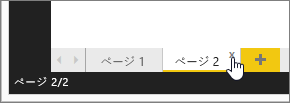

# Power BI Desktop のレポート ビュー
Power BI を操作したことがあるユーザーは、レポートを作成して動的なパースペクティブとデータへの洞察を得ることがいかに簡単であるかをご存知でしょう。 Power BI では、Power BI Desktop にさらに多くの高度な機能を備えています。 Power BI Desktop を使用すると、高度なクエリの作成、複数のソースからのデータのマッシュアップ、テーブル間のリレーションシップの作成などを行えます。

Power BI Desktop には、**[レポート] ビュー**が含まれています。ここでは、視覚化を含む任意の数のレポート ページを作成することができます。 [レポート] ビューには、Power BI サービスのレポートの [編集] ビューとほとんど同じデザイン機能が用意されています。 視覚化の移動、コピーと貼り付け、マージなどを行えます。

これらの相違点は、Power BI Desktop を使用すると、データのクエリとモデルを操作して、レポートでの最適な分析を支えるデータが確実に得られるようになることです。 その後、Power BI Desktop のファイルは、ローカルのドライブまたはクラウドに関係なく、お好みの場所に保存することができます。

## では、見てみましょう。
最初にデータを Power BI Desktop に読み込むとき、**[レポート] ビュー**が空白のキャンバスであることがわかります。

左側のナビゲーション バーのアイコンを選んで、**[レポート] ビュー**、**[データ] ビュー**、**[リレーションシップ] ビュー**の間で切り替えることができます。

一部のデータを追加すると、キャンバスの新しい視覚化にフィールドを追加できます。

視覚化の種類を変更するには、リボンの **[視覚化]** グループから視覚化を選ぶか、右クリックして **[視覚化の種類を変更]** アイコンから別の視覚化を選びます。

> [!TIP]
> 必ず複数の視覚化の種類をお試しください。 データの情報を明確に伝える視覚化を使用することが重要です。
> 
> 

レポートは、1 つ以上の空白ページから開始します。 ページは、キャンバスの左側にある [ナビゲーター] ウィンドウに表示されます。 あらゆる種類の視覚化をページに追加できますが、過剰にならないように注意します。 ページに視覚化が多すぎると、込み入った表示になり、適切な情報を見つけにくくなります。 リボンで **[新しいページ]** をクリックするだけで、レポートに新しいページを追加できます。

ページを削除するには、[レポート] ビューの下部にあるページのタブで、**[X]** をクリックします。

> [!NOTE]
> レポートと視覚化は、Power BI Desktop からダッシュボードにピン留めすることはできません。 これを行うには、Power BI サイトに [[Power BI Desktop からの発行]](desktop-upload-desktop-files.md) を行う必要があります。
> 
> 

