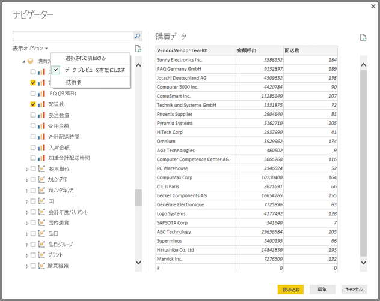

# Power BI Desktop で SAP BW Connector を使用する
Power BI Desktop で、**SAP BusinessWarehouse (BW)** のデータにアクセスできます。

SAP のお客様が既存の SAP Business Warehouse (BW) システムに Power BI を接続することで得られる利点については、[Power BI と SAP BW に関するホワイトペーパー](https://aka.ms/powerbiandsapbw)をご覧ください。

## SAP BW Connector のインストール
**SAP BW Connector** を使用するには、次の手順でインストールしてください。

1. ローカル コンピューターに **SAP NetWeaver** ライブラリをインストールします。 **SAP NetWeaver** ライブラリは、SAP の管理者から入手するか、[SAP Software Download Center](https://support.sap.com/swdc) から直接入手してください。 **SAP Software Download Center** は構成が頻繁に変更されるので、サイトのナビゲーションに関する具体的なガイダンスはありません。 通常、**SAP NetWeaver** ライブラリは、SAP クライアント ツールのインストールにも含まれます。
   
   最新バージョンをダウンロードできる可能性がある場所は、*SAP Note #1025361* に記載されています。 **SAP NetWeaver** ライブラリのアーキテクチャ (32 ビットまたは 64 ビット) がインストールされている **Power BI Desktop** と一致することを確認した後、SAP Note に従って **SAP NetWeaver RFC SDK** に含まれるすべてのファイルをインストールします。
2. **[データの取得]** ダイアログの **[データベース]** カテゴリに **[SAP Business Warehouse Application サーバー]** と **[SAP Business Warehouse メッセージ サーバー]** のエントリが含まれるようになります。
   
   

## SAP BW Connector の機能
Power BI Desktop で **SAP BW コネクタ**を使って **SAP Business Warehouse サーバー** キューブからデータをインポートすること、または DirectQuery を使うことができます。 

**SAP BW コネクタ**の詳細および DirectQuery でそれを使う方法については、「[DirectQuery と SAP Business Warehouse (BW)](desktop-directquery-sap-bw.md)」をご覧ください。

接続するときは、*[サーバー]*、*[システム番号]*、*[クライアント ID]* を指定して接続を確立する必要があります。

また、**[Advanced options]** (詳細設定オプション) として、言語コードと、指定したサーバーに対して実行するカスタム MDX ステートメントの 2 つを指定できます。

MDX ステートメントを指定しなかった場合、**[ナビゲーター]** ウィンドウが表示されます。このウィンドウには、サーバーで利用可能なキューブのリストのほか、項目をドリルダウンし、利用可能なキューブからディメンションやメジャーなどの項目を選択するオプションが表示されます。 Power BI は、[BW Open Analysis Interface OLAP BAPI](https://help.sap.com/saphelp_nw70/helpdata/en/d9/ed8c3c59021315e10000000a114084/content.htm) によって公開されているクエリとキューブを公開しています。

サーバーから 1 つ以上の項目を選択すると、選択項目に基づいた出力テーブルのプレビューが作成されます。

**[ナビゲーター]** ウィンドウではいくつかの **[表示オプション]** を選ぶことができ、以下のことが可能です。

* ***[選択された項目のみ]* または *[All Items]* (すべての項目) (既定のビュー) を表示:** このオプションは、選択した項目の最終セットを確認するのに役立ちます。 *[プレビュー]* エリアの*列名*を選択しても、同様の確認ができます。
* **[Enable Data Previews]\(データ プレビューの有効化) (既定の動作):** このダイアログ内でデータ プレビューを表示するかどうかを選択できます。 データ プレビューを無効にすると、プレビューのためのデータが必要なくなるため、サーバー呼び出しの量が減ります。
* **[技術名]:** SAP BW はキューブ内のオブジェクトの*技術名*の概念をサポートしています。 技術名を使うと、キューブの所有者がキューブ内のオブジェクトの*物理名*だけでなく、*ユーザー フレンドリ*名も公開できます。

**[ナビゲーター]** で必要なオブジェクトをすべて選択したら、**[ナビゲーター]** ウィンドウの下部にある次のボタンのいずれかを選択して次の処理を決定することができます。

* **[読み込む]** を選択すると、出力テーブル作成のため、Power BI Desktop のデータ モデルへすべての行のセットの読み込みを開始します。その後は **[レポート]** ビューへ移ってデータを視覚化したり、**[データ]** ビューまたは **[リレーションシップ]** ビューを使用してさらに修正を加えたりできます。
* **[編集]** を選択すると **[クエリ エディター]** が開き、Power BI Desktop のデータ モデルにすべての行のセットを読み込む前に、追加でデータの変換とフィルタリングを実行できます。

Power BI Desktop では **SAP BW** のキューブから情報をインポートするだけでなく、他のさまざまなデータ ソースからもデータをインポートし、1 つのレポートにまとめることができます。 これにより、**SAP BW** のデータに加えて、レポートや分析の際のさまざまな興味深いシナリオが得られます。

## トラブルシューティング
このセクションでは、**SAP BW** Connector プレビュー版のご利用にあたってのトラブルシューティング状況 (および解決策) を説明します。

1. **SAP BW** からの数値データで、桁区切りがコンマではなくピリオドになります。 たとえば、1,000,000 が 1.000.000 として返されます。
   
   **SAP BW** が返す 10 進数の小数点記号には、"*,*" (コンマ) または "*.*" (ピリオド) が使われます。 **SAP BW** が小数点記号にどちらを使うかを指定するため、**Power BI Desktop** によって使われるドライバーは *BAPI_USER_GET_DETAIL* を呼び出します。 この呼び出しから返される **DEFAULTS** という名前の構造体には、"*10 進形式表記法*" が格納されている *DCPFM* という名前のフィールドがあります。 次の 3 つの値のいずれかになります。
   
       ‘ ‘ (space) = Decimal point is comma: N.NNN,NN
       'X' = Decimal point is period: N,NNN.NN
       'Y' = Decimal point is N NNN NNN,NN
   
   正しくないデータで *BAPI_USER_GET_DETAIL* を呼び出すと次のようなメッセージでエラーになる (正しくないデータが表示される) 問題がお客様から報告されています。
   
       You are not authorized to display users in group TI:
           <item>
               <TYPE>E</TYPE>
               <ID>01</ID>
               <NUMBER>512</NUMBER>
               <MESSAGE>You are not authorized to display users in group TI</MESSAGE>
               <LOG_NO/>
               <LOG_MSG_NO>000000</LOG_MSG_NO>
               <MESSAGE_V1>TI</MESSAGE_V1>
               <MESSAGE_V2/>
               <MESSAGE_V3/>
               <MESSAGE_V4/>
               <PARAMETER/>
               <ROW>0</ROW>
               <FIELD>BNAME</FIELD>
               <SYSTEM>CLNTPW1400</SYSTEM>
           </item>
   
   このエラーを解決するには、Power BI で使われている SAPBW ユーザーに *BAPI_USER_GET_DETAIL* の実行権限を付与するよう、SAP 管理者に依頼する必要があります。 また、このトラブルシューティング ソリューションで前述したように、ユーザーが必要な *DCPFM* 値を持つことを確認することもお勧めします。
2. **SAP BEx クエリ用の接続**
   
   Power BI Desktop で **BEx** クエリを実行するには、次の図に示すように特定のプロパティを有効にします。
   
   

## 次の手順
SAP HANA と DirectQuery については、次のリソースをご覧ください。

* [DirectQuery と SAP HANA](desktop-directquery-sap-hana.md)
* [Power BI の DirectQuery](desktop-directquery-about.md)
* [DirectQuery でサポートされるデータ ソース](desktop-directquery-data-sources.md)
* [Power BI と SAP BW に関するホワイト ペーパー](https://aka.ms/powerbiandsapbw)
