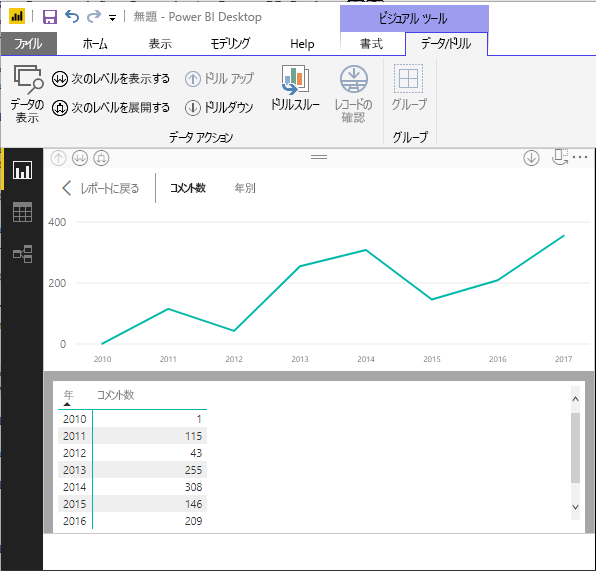
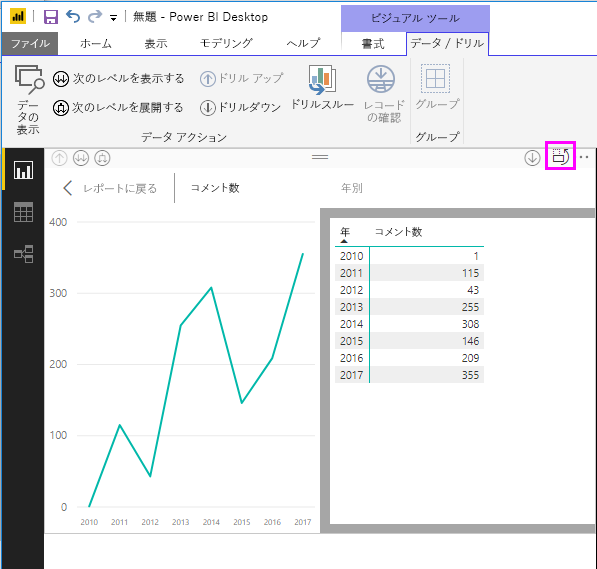
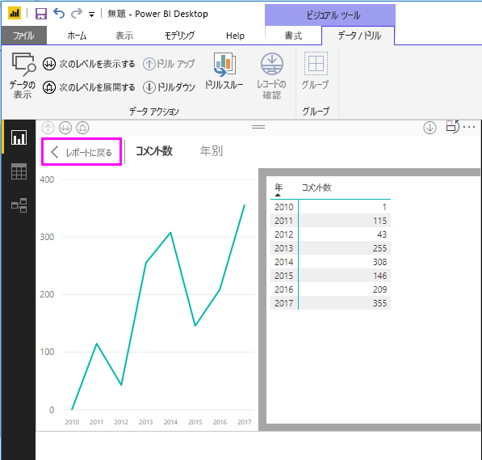
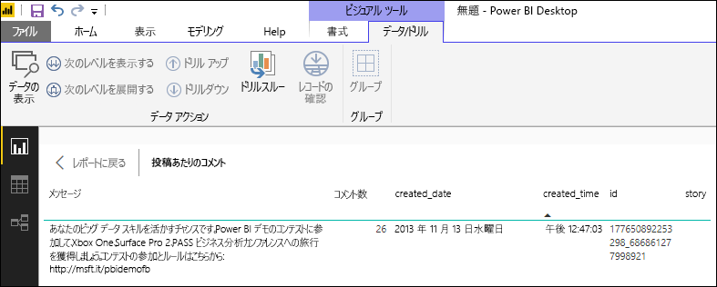
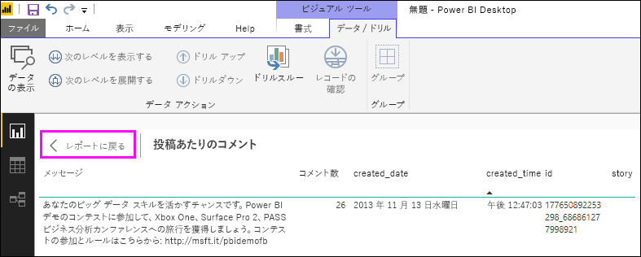

# Power BI Desktop のデータの確認とレコードの確認を使用する
**Power BI Desktop** では、視覚エフェクトの詳細にドリルダウンして、基になるデータのテキスト表現または選択したビジュアルの個々のデータ レコードを見ることができます。 これらの機能は、"*クリックスルー*"、"*ドリルスルー*"、"*詳細情報へのドリルスルー*" などとも呼ばれます。

**[データの確認]** を使うと選択した視覚エフェクトで使われている値のテキスト版を表示でき、**[レコードの確認]** を使うと選択した 1 つのレコードまたはデータ ポイントのすべてのデータを表示できます。 

![[データの確認] と [レコードの確認]](media/desktop-see-data-see-records/see-data-record.png)

>[!IMPORTANT]
>**[データの確認]**  と **[レコードの確認]** では、次の視覚エフェクトの種類のみがサポートされます。
>  - 横棒グラフ
>  - 縦棒グラフ
>  - ドーナツ グラフ
>  - 塗り分け地図
>  - じょうごグラフ
>  - マップ
>  - 円グラフ
>  - ツリーマップ

## Power BI Desktop での [データの確認] の使用

**[データの確認]** では、視覚エフェクトの基になるデータが表示されます。 **[データの確認]** は、視覚エフェクトを選択したときにリボンの **[ビジュアル ツール]** セクションの **[データ/ドリル]** タブに表示されます。

![リボンの [データの確認]](media/desktop-see-data-see-records/see-data1.png)

データは、視覚エフェクトを右クリックし、表示されるメニューから **[データの表示]** を選択するか、視覚エフェクトの右上隅で **その他のオプション**の省略記号 (...) を選択し、**[データの表示]** を選択することでも表示できます。

![右クリックの [データの表示]](media/desktop-see-data-see-records/see-data2.png)&nbsp;&nbsp;![その他のオプションの [データの表示]](media/desktop-see-data-see-records/see-data3.png)

> [!NOTE]
> 右クリック メニューを使うには、ビジュアル内のデータ ポイントの上にマウス ポインターを移動する必要があります。

**[データの確認]** または **[データの表示]** を選択すると、Power BI Desktop キャンバスに、データのビジュアル表現とテキスト表現の両方が表示されます。 "*横表示*" では、ビジュアルがキャンバスの上部に表示され、データが下部に表示されます。 

キャンバスの右上隅のアイコンを選ぶことで、横表示と "*縦表示*" の間を切り替えることができます。

レポートに戻るには、キャンバスの左上隅にある **[< レポートに戻る]** を選びます。

## Power BI Desktop での [レコードの確認] の使用

視覚エフェクト内の 1 つのデータ レコードに注目して、その背後にあるデータにドリルダウンできます。 **[レコードの確認]** を使用するには、視覚エフェクトを選択し、リボンの **[ビジュアル ツール]** セクションの **[データ/ドリル]** タブで **[レコードの確認]** を選択し、視覚エフェクト上のデータ ポイントまたは行を選択します。 

![リボンの [レコードの確認]](media/desktop-see-data-see-records/see-record1.png)

> [!NOTE]
> リボンで **[レコードの確認]** が無効になってグレー表示されている場合は、選択した視覚エフェクトで **[レコードの確認]** がサポートされていないことを意味します。

データ要素を右クリックし、表示されるメニューから **[レコードの確認]** を選択することもできます。

![右クリックによる [レコードの確認]](media/desktop-see-data-see-records/see-record2.png)

データ要素に対して **[レコードの確認]** を選択すると、Power BI Desktop キャンバスに、選択した要素に関連付けられているすべてのデータが表示されます。 

レポートに戻るには、キャンバスの左上隅にある **[< レポートに戻る]** を選びます。

> [!NOTE]
>**[レコードの確認]** には次の制限事項があります。
> - **[レコードの確認]** ビュー内のデータを変更してレポートに保存することはできません。
> - 計算されるメジャーがビジュアルで使われている場合は、**[レコードの確認]** を使用できません。
> - ライブ多次元 (MD) モデルに接続されている場合は、**[レコードの確認]** を使用できません。

## 次の手順
**Power BI Desktop** には、あらゆる種類のレポートの書式指定とデータ管理機能があります。 例については、次のリソースをご覧ください。

* [Power BI Desktop でグループ化とビン分割を使用する](desktop-grouping-and-binning.md)
* [Power BI Desktop レポートで、グリッド線、グリッドへのスナップ、重ね順、配置、および分布を使用する](desktop-gridlines-snap-to-grid.md)

