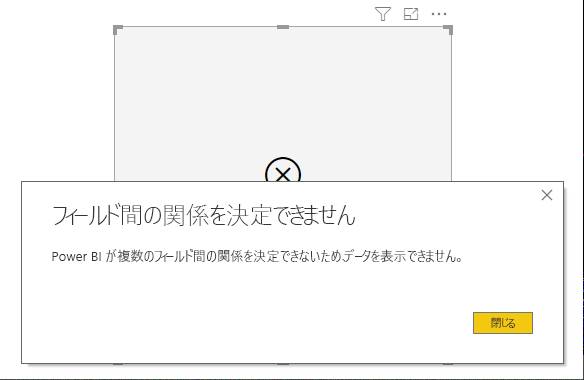

# Power BI でデータのない項目を表示する

Power BI では、さまざまなソースのあらゆる種類のデータを視覚化することができます。 ビジュアルを作成するとき、Power BI では、データの提示および表示方法が適切に管理されるように、ビジュアル作成時に関連するデータのみが表示されます。 Power BI では、ビジュアルの構成と基になるデータ モデルに基づいて、どのデータが適切か判断します。 この記事では、適切なデータを判断する際の Power BI の動作のしくみについて、判断方法を示す例を使って説明します。

![[データのない項目を表示する] 機能を有効にする方法](media/desktop-show-items-no-data/show-items-no-data_02.png)

## 適切なデータを判断する

表示するべきデータが Power BI によって判断されるしくみを理解するために、まず単純な例として 1 つのテーブルを考えてみます。 この記事の最後にあるサンプルのセクション内で示されているモデルを使って、次の設定でテーブルを作成するとします。

**1.同じテーブルからのグループ:** "*Product[Color] - Product[Size] (製品 [色] - 製品 [サイズ])* "

|"*Product[Color] (製品 [色])* "  |"*Product[Size] (製品 [サイズ])* "  |
|---------|---------|
|ブルー     |大         |
|ブルー     |中         |
|ブルー     |小         |
|レッド     |大         |

この例では、テーブル " *[Product] ([製品])* " 内に存在する " *[Color-Size] ([色 - サイズ])* " の組み合わせが Power BI で表示されます。 

次は別の組み合わせを見てみましょう。

**2.直接関連付けられた別のテーブルからのグループとメジャー:** "*ProductStyle[Finish] - Product[Color] - Sum(Sales[Quantity]) (製品のスタイル [仕上がり] - 製品 [色] - Sum(売上 [数量]))* "

|"*ProductStyle[Finish] (製品のスタイル [仕上がり])* "  |"*Product[Color] (製品 [色])* "  |" *[SumQuantity] ([数量の合計])* "  |
|---------|---------|---------|
|光沢     |ブルー         |10         |
|艶消し     |ブルー         |15         |

この例では、存在する組み合わせのみが Power BI で表示されます。 たとえば、("なし" + "ブルー") や ("艶消し" + "レッド") は表示されません。モデル内にその組み合わせが存在していないためです。 どの組み合わせが存在しているかを決める条件は、空白でない "*Sum(Sales[Quantity]) (Sum(売上 [数量]))* " の値です。

別のケースを見てみましょう。 

**3.関連付けられた別のテーブルからのグループ (メジャーなし):** "*ProductStyle[Finish] - Product[Color] (製品のスタイル [仕上がり] - Sum(売上 [数量]))* "

|"*ProductStyle[Finish] (製品のスタイル [仕上がり])* "  |"*Product[Color] (製品 [色])* "  |
|---------|---------|
|光沢     |ブルー         |
|光沢     |レッド         |
|艶消し     |ブルー         |

明示的なメジャーがなく、2 つのテーブルが直接関連付けられているため、Power BI では、メジャーを挿入して結果の組み合わせを制限しようとします。 この場合は、Power BI により "*CALCULATE(COUNTROWS('Product')) (CALCULATE(COUNTROWS('製品')))* " メジャーが挿入されます。"*Product (製品)* " が両方のテーブルに共通するテーブルであるため、これが空白になることはありません。

このように、Product (製品) テーブルにエントリが存在している組み合わせが Power BI で表示されます。" *("なし" + "ブルー")* " や " *("艶消し" + "レッド")* " の組み合わせは除外されます。

**4.関連付けられていない別のテーブルからのグループ**

サンプル モデルにはこの組み合わせが含まれていませんが、関連付けられていない別のテーブルからのグループが存在した場合は、Power BI で 2 つの列を関連付けることができます。 結果は各列のすべての値のクロス積になります。 そのような状況では、(このようなクロス結合はデータベースのコンピューティング コストが高いため) "*制限のない結合*" という種類のエラーが Power BI で発生し、ユーザーに多くの情報は表示されません。 

## データのない項目の表示

前のセクションでは、表示するべきデータが Power BI で判断されるしくみについて説明しました。 しかし、データのない項目を表示する "*必要がある*" 場合がある可能性があります。 

**[データのない項目を表示する]** 機能を使うと、(メジャー データを含まない (空白のメジャー値) データ行と列を含めて) まさにそれを実行できます。

**データのないアイテムの表示**機能を有効にするには、次の図に示すように、ビジュアルを選択し、 **[フィールド]** 内で、フィールドを右クリックして表示されるメニューの **[データのないアイテムの表示]** を選択します。

![[データのない項目を表示する] 機能を有効にする方法](media/desktop-show-items-no-data/show-items-no-data_02.png)

以下の状況では、 **[データのない項目を表示する]** 機能は効果が "*ありません*"。

* ビジュアルに追加されるメジャーがなく、グループ化列が同じテーブルからのものである
* グループが関連付けられていない (Power BI では、関連付けられていないグループを含むビジュアルに対するクエリは実行されません)
* メジャーがグループのいずれとも関連付けられていない (これは、一部のグループの組み合わせに対してしかメジャーが空白にならないためです)
* 空白のメジャーを除外するユーザー定義のメジャーのフィルターが存在する (例:"*SalesAmount > 0 (売上数量 > 0)* ")

### [データのない項目を表示する] のしくみ

**[データのない項目を表示する]** の最も興味深いユース ケースは、メジャーが存在している場合です。 グループが同じテーブルからのものであるか、モデル内のパスを使って関連付けることができる場合について見てみましょう。 たとえば、"*ProductStyle (製品のスタイル)* " は "*Product (製品)* " と直接関連付けられ、"*Sales (売上)* " と間接的に関連付けられます。または、"*ProductStyle (製品のスタイル)* " と "*ProductCategory (製品のカテゴリ)* " は "*Product (製品)* " テーブルを使って関連付けることができます。

いくつかの興味深いケースについて調べ、 **[データのない項目を表示する]** がオフの場合とオンの場合を比べてみましょう。 

**1.同じテーブルからのグループ化列:** "*Product[Color] - Product[Size] - Sum(Sales[Quantity]) (製品 [色] - 製品 [サイズ] - Sum(売上 [数量]))* "

表示結果 ( **[データのない項目を表示する]** 機能がオフの場合):

|"*Product[Color] (製品 [色])* "  |"*Product[Size] (製品 [サイズ])* "  |" *[SumQuantity] ([数量の合計])* "  |
|---------|---------|---------|
|ブルー     |中         |15         |
|ブルー     |小         |10         |

表示結果 ( **[データのない項目を表示する]** 機能がオンの場合):

|"*Product[Color] (製品 [色])* "  |"*Product[Size] (製品 [サイズ])* "  |" *[SumQuantity] ([数量の合計])* "  |
|---------|---------|---------|
|ブルー     |大         |         |
|ブルー     |中         |15         |
|ブルー     |小         |10         |
|レッド     |大         |         |

機能をオンにした場合、2 つの新しい組み合わせがどのように表示されるかに注目してください。"*ブルー - 大*" と "*レッド - 大*" です。 これらのエントリは両方とも "*Sales (売上)* " テーブル内に対応する "*Quantity (数量)* " を持っていません。 しかし、これらは "*Product (製品)* " テーブルに表示されています。

**2.関連テーブルからのグループ化列:** "*ProductStyle[Finish] - Product[Color] - Sum(Sales[Quantity]) (製品のスタイル [仕上がり] - 製品 [色] - Sum(売上 [数量]))* "

表示結果 ( **[データのない項目を表示する]** 機能がオフの場合):

|"*ProductStyle[Finish] (製品のスタイル [仕上がり])* "  |"*Product[Color] (製品 [色])* "  |" *[SumQuantity] ([数量の合計])* "  |
|---------|---------|---------|
|光沢     |ブルー         |10         |
|艶消し     |ブルー         |15         |

表示結果 ( **[データのない項目を表示する]** 機能がオンの場合):

|"*ProductStyle[Finish] (製品のスタイル [仕上がり])* "  |"*Product[Color] (製品 [色])* "  |" *[SumQuantity] ([数量の合計])* "  |
|---------|---------|---------|
|光沢     |ブルー         |10         |
|光沢     |レッド         |         |
|艶消し     |ブルー         |15         |
|なし     |         |         |

" *(光沢 - 艶消し)* " と " *(なし、空白)* " が組み合わせとしてどのように表示されたかに注目してください。 これらが表示された理由は次のとおりです。
* Power BI では、最初に ProductStyle[Finish] (製品のスタイル [仕上がり]) が考慮され、表示するすべての値が選択されました。この結果は光沢、艶消し、なしです。
* これらの値をそれぞれ使って、一致する "*Product[Color] (製品 [色])* " エントリがすべて Power BI により選択されました 
* "*なし*" は どの "*Product[Color] (製品 [色])* " とも一致しないため、その値として空白が表示されます

列の値を選択するメカニズムは順序に依存していて、テーブル間の "*左外部結合*" 操作と見なすことができることに注意してください。 列の順序が変更されると、その結果も変更されます。

順序を変更する例と、それが結果に与える影響について見ていきましょう。 これはこのセクションの項目 **2** と同じものですが、順序が変更されています。

**Product[Color] - ProductStyle[Finish] - Sum(Sales[Quantity]) (製品 [色] - 製品のスタイル [仕上がり] - Sum(売上 [数量]))**

表示結果 ( **[データのない項目を表示する]** 機能がオンの場合):

|"*Product[Color] (製品 [色])* " |"*ProductStyle[Finish] (製品のスタイル [仕上がり])* "  |" *[SumQuantity] ([数量の合計])* "  |
|---------|---------|---------|
|ブルー     |光沢         |10         |
|ブルー     |艶消し         |15         |
|レッド     |光沢         |         |

この場合、"*ProductStyle[Finish]=None (製品のスタイル [仕上がり] = なし)* " がテーブルに表示されないことに注目してください。 これは、この場合、"*Product (製品)* " テーブルにあるすべての "*Color (色)* " の値が最初に Power BI により選択されたためです。 次に各色に対して、データを含んでいた "*Finish (仕上がり)* " の対応する値が Power BI により選択されました。 "*なし*" は "*Color (色)* " のどの組み合わせにも表示されないため、選択されません。

## データ モデルの例

このセクションでは、この記事の例で使用されるサンプル データ モデルを示します。

**モデル**:

**データ**:

|Product[ProductId] (製品 [製品 ID])|    Product[ProductName] (製品 [製品名])|   Product[Color] (製品 [色])| Product[Size] (製品 [サイズ])|  Product[CategoryId] (製品 [カテゴリ ID])|    Product[StyleId] (製品 [スタイル ID])|
|---------|---------|---------|---------|---------|---------|
|1  |製品 1  |ブルー   |小  |1  |1 |
|2  |製品 2  |ブルー   |中 |2  |2 |
|3  |製品 3  |レッド    |大  |1  |1 |
|4  |製品 4  |ブルー   |大  |2  |2 |

|ProductCategory[CategoryId] (製品カテゴリ [カテゴリ ID])|   ProductCategory[CategoryName] (製品カテゴリ [カテゴリ名])|
|---------|---------|
|1  |スマートフォン   |
|2  |カメラ |
|3  |テレビ |

|ProductStyle[StyleId] (製品のスタイル [スタイル ID])| ProductStyle[Finish] (製品のスタイル [仕上がり])|   ProductStyle[Polished] (製品のスタイル [艶出し])|
|---------|---------|---------|
|1  |光沢  |はい |
|2  |艶消し  |いいえ |
|3  |なし   |いいえ |

|Sales[SaleId] (売上 [売上 ID])| Sales[ProductId] (売上 [製品 ID])|   Sales[Date] (売上 [日付])|    Sales[Quantity] (売上 [数量])|
|---------|---------|---------|---------|
|1  |1  |2012 年 1 月 1 日 0:00| 10 |
|2  |2  |2013 年 1 月 1 日 0:00| 15 |

## 次の手順

この記事では、Power BI で **[データのない項目を表示する]** 機能を有効にする方法について説明しました。 次の記事にも興味をもたれるかもしれません。 

* [Power BI での多次元モデルの既定のメンバー](desktop-default-member-multidimensional-models.md)
