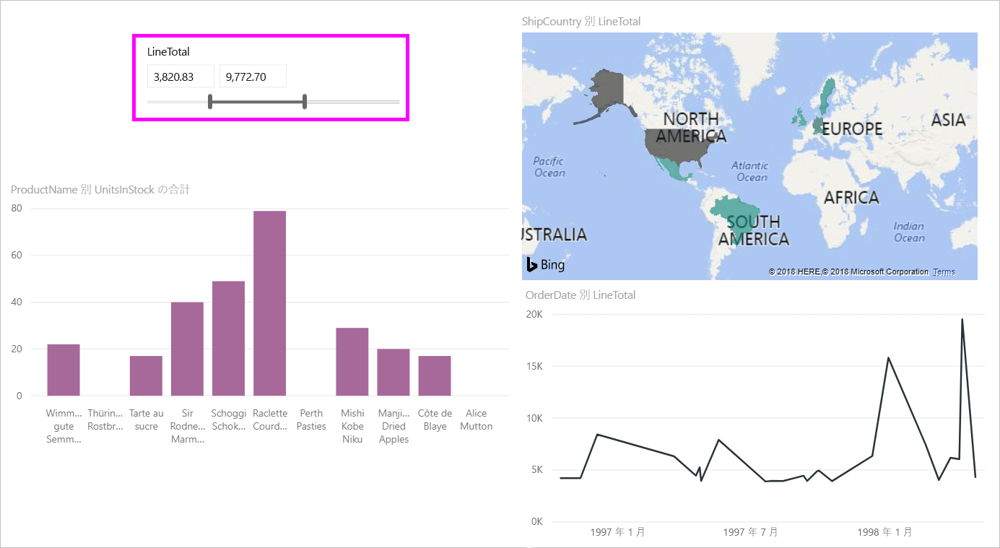
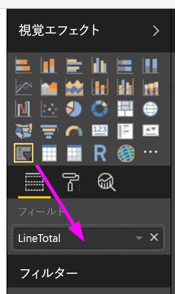
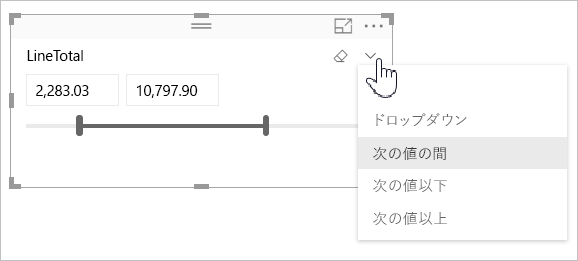

# Power BI Desktop で数値範囲スライサーを使用する
**数値範囲スライサー**を使用して、データ モデルの数値列にあらゆるフィルターを適用することができます。 フィルターの種類は、数値の**範囲**、数値**以下**、数値**以上**から選択できます。 これは単純なようですが、データをフィルターするには非常に強力な方法です。

## 数値範囲スライサーの使用
他のスライサーと同じように数値範囲スライサーを使用できます。 レポートの**スライサー** ビジュアルを作成し、**[フィールド]** 値の数値を選択するだけです。 次の図では、*LineTotal* フィールドが選択されています。

**数値範囲スライサー**の右上隅にある下向き矢印のリンクを選択すると、メニューが表示されます。

数値範囲として、次の 3 つから選択できます。

* 次の値の間
* 次の値以下
* 次の値以上

メニューから **[次の値の間]** を選択すると、スライダーが表示され、対象の数値の間にある数値をフィルターできます。 スライダー バーを使用する以外にも、いずれかのボックス内でクリックし、値を入力することができます。 この方法は、特定の数値でスライスする際に、スライサー バーをほんの少しだけ動かして対象の数値に正確に合わせるのが難しい場合に便利です。

次の図のレポート ページでは、2500.00 から 6000.00 までの範囲の *LineTotal* 値がフィルターされています。

![[次の値の間] を使用した数値範囲スライサー](media/desktop-slicer-numeric-range/desktop-slicer-numeric-range-3-between-range.png)

**[次の値以下]** を選択すると、スライダー バーの左側 (下限) のハンドルが消え、調整できるのはスライダー バーの上限のみとなります。 次の図では、スライダー バーが最大の 5928.19 に設定されています。

![[次の値以下] を使用した数値範囲スライサー](media/desktop-slicer-numeric-range/desktop-slicer-numeric-range-4-less-than.png)

最後に **[次の値以上]** を選択します。その場合、次の図のように、右側 (上限) のスライダー バーが消え、調整できるのは下限のみとなります。 これで、レポート ページのビジュアルには、*LineTotal* が 4902.99 以上のアイテムのみが表示されます。

![[次の値以上] を使用した数値範囲スライサー](media/desktop-slicer-numeric-range/desktop-slicer-numeric-range-5-greater-than.png)

## 数値範囲スライサーを整数にスナップする

数値範囲スライサーは、10 進数の範囲である場合を除き、整数にスナップされます。 スライサーで整数がきれいに整列させることができます。 

## 制限事項と考慮事項
現在、**数値範囲スライサー**には次の制限事項と考慮事項が適用されています。

* 現在、**数値範囲スライサー**では、集計値ではなく、データの基になるすべての行がフィルターされます。 たとえば、*Sales Amount* フィールドが使用されている場合、ビジュアルのデータ ポイントごとの *Sales Amount* の合計ではなく、*Sales Amount* に基づく各トランザクションがフィルターされます。
* 現在、メジャーでは動作しません。
