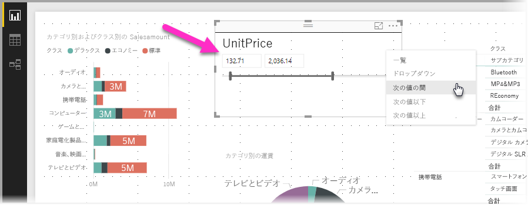
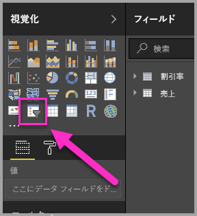
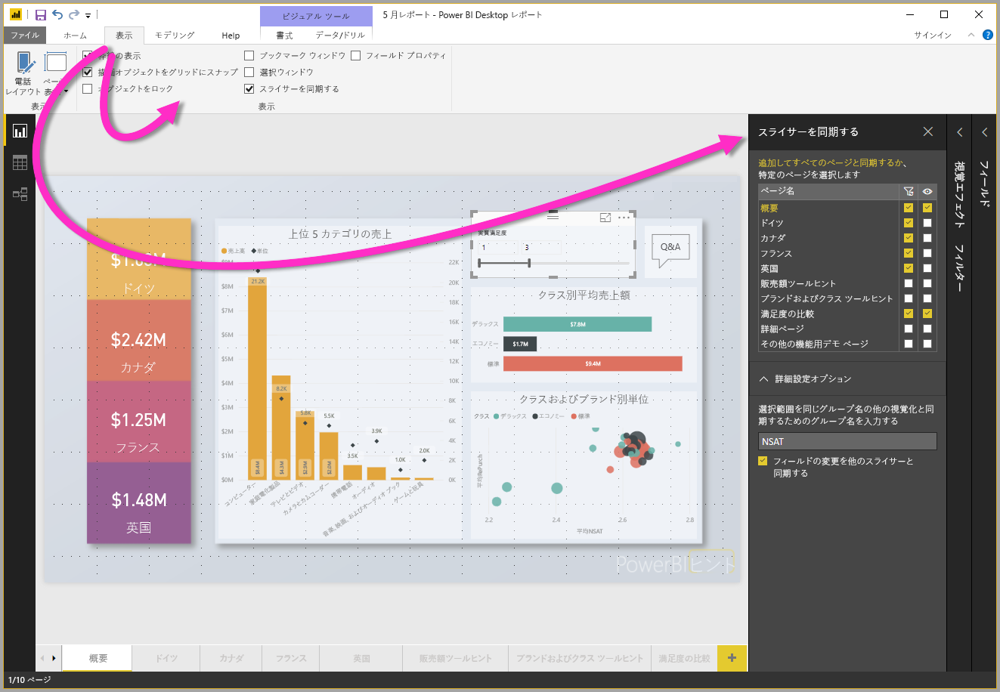
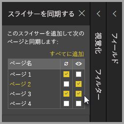

# Power BI Desktop でスライサーを使用する

**Power BI Desktop** で**スライサー**を使用し、レポート ページのビジュアルの結果を絞り込むことができます。 また、スライサーを利用すれば、スライサー自体を操作することで、適用されているフィルターを簡単に調整できます。 また、スライサーの表示方法や操作方法を決めるオプションを指定できます。 次の画像でスライサーを確認できます。*種類*のドロップダウンが表示されています。 

次のいずれかのスライサーが表示されます。

* 一覧
* ドロップダウン
* 次の値の間
* 次の値以下
* 次の値以上

レポートにスライサーを追加できます。**[視覚化]** ウィンドウの**スライサー** ビジュアルをクリックしてください。

**Power BI Desktop** と **Power BI サービス**の両方でスライサーは同じように動作します。 スライサーの使用に関するチュートリアルが必要な場合、[Power BI サービスのスライサー (チュートリアル)](power-bi-visualization-slicers.md) ページをご覧ください。

## レポート ページ全体でスライサーを同期する

**Power BI Desktop** では、複数のレポート ページ間でスライサーを同期できます。 スライサーを同期するには、リボンの **[表示]** ウィンドウで **[スライサーの同期]** を選択します。 スライサーを同期すると、次の画像のように **[スライサーの同期]** ウィンドウが表示されます。

**[スライサーの同期]** ウィンドウでは、レポート ページ全体でのスライサーの同期方法を指定できます。 個々のレポート ページに各スライサーを**適用**するかどうか、個々のレポート ページにスライサーを**表示**するかどうかを指定できます。

たとえば、次の画像のように、レポートの**ページ 2** にスライサーを置くことができます。 それから、選択した各ページにそのスライサーを*適用*するかどうか、レポートで選択した各ページにそのスライサーを*表示*するかどうかを選択できます。 スライサーごとに、さまざまな組み合わせを適用できます。 

このウィンドウで **[すべてに追加]** リンクをクリックすると、選択したスライサーがレポート内の全ページに適用されます。

**[スライサーの同期]** ウィンドウに表示される選択は*選択したスライサー*のみに適用されることに注意してください。 複数のスライサーを複数のページに適用できます。また、このウィンドウでは、レポートのページ全体で個々のスライサーをどのように適用するか定義できます。 

スライサーの選択は同期できますが、スタイル設定、編集、削除など、その他の選択は同期*されません*。 

## 次の手順

次の記事にも興味をもたれるかもしれません。

* [Power BI サービスのスライサー (チュートリアル)](power-bi-visualization-slicers.md)
* [Power BI Desktop で数値範囲スライサーを使用する](desktop-slicer-numeric-range.md)
* [Power BI Desktop で相対日付のスライサーおよびフィルターを使用する](desktop-slicer-filter-date-range.md)

