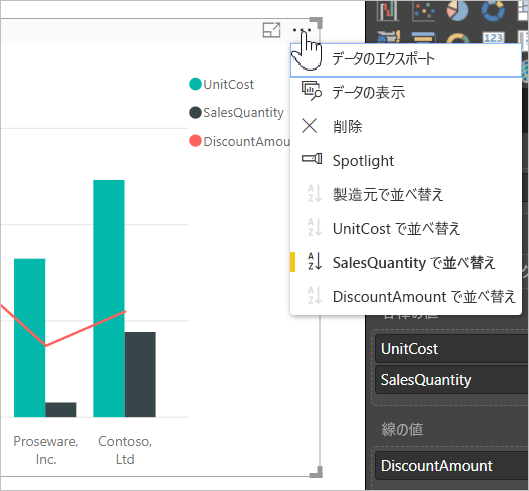
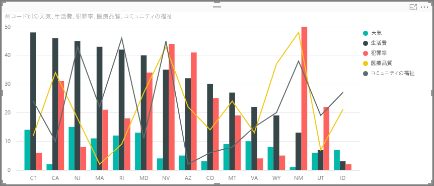
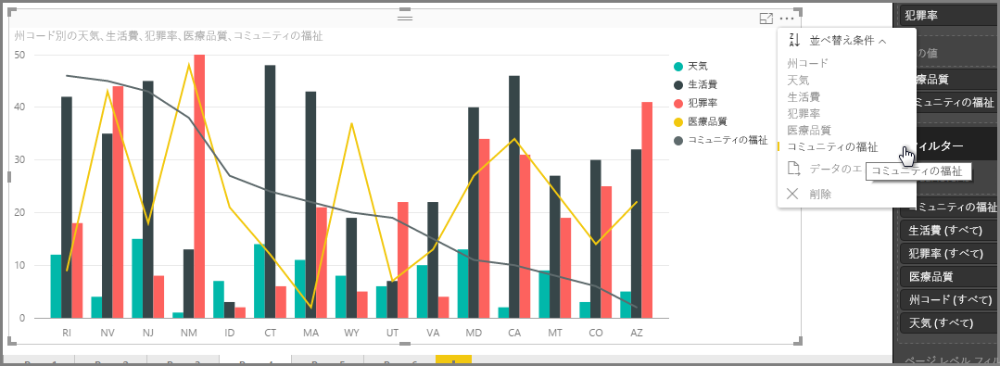
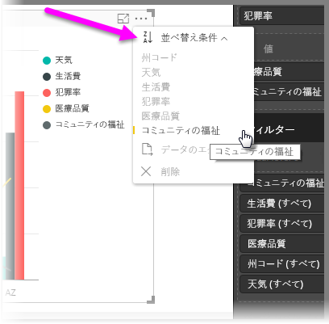
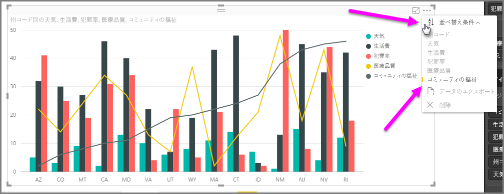
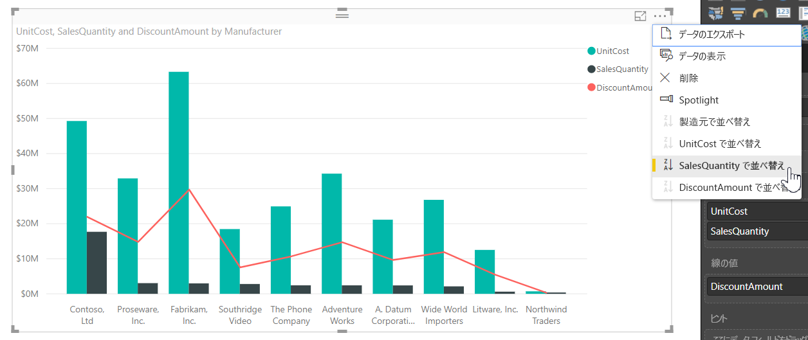
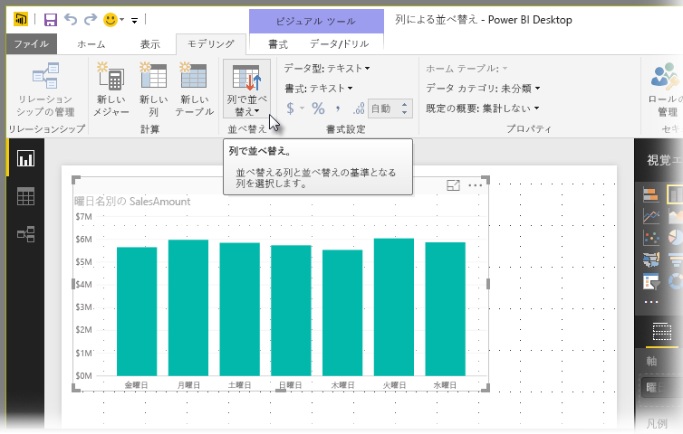
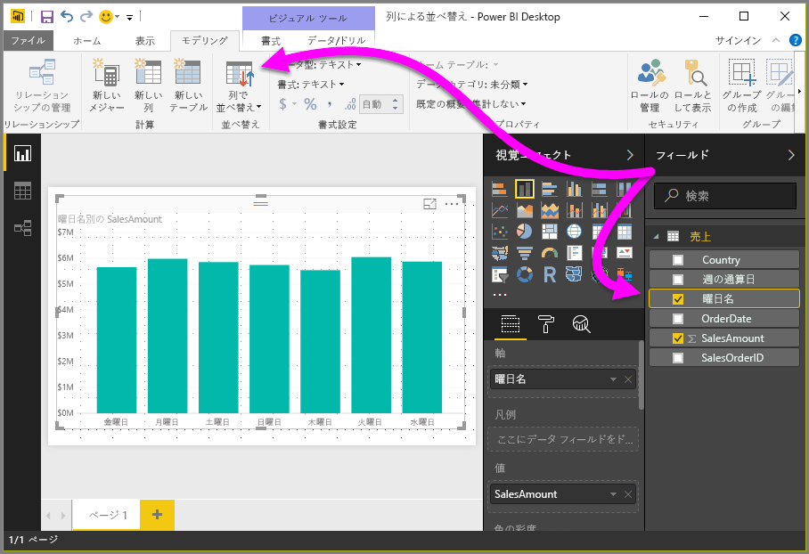
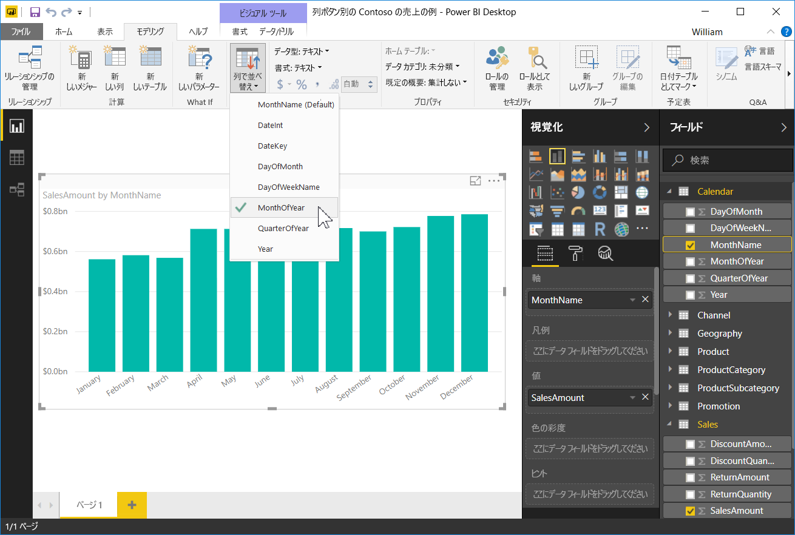
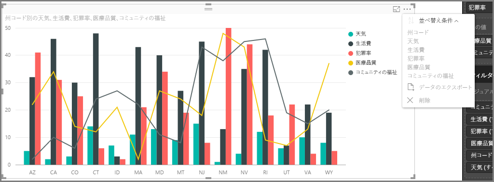

# Power BI Desktop での列による並べ替え
**Power BI Desktop** と **Power BI サービス**では、さまざまなデータ フィールドを並べ替えることで視覚効果を変更できます。 並べ替えで視覚効果を変更することで、伝えたい情報を強調できます。伝えたい傾向 (あるいは、重要な点) を視覚的に示すことができます。

数値データ (売り上げ高など) やテキスト データ (州名など) のいずれを使用しているかにかかわらず、視覚エフェクトを目的に応じて並べ替え、目的に応じたスタイルで表示できます。  **Power BI** は柔軟な並べ替え機能とクイック メニューを備えています。 視覚効果画面で省略記号 (...) を選択し、**[並べ替え]** を選択し、並べ替えるフィールドを選択します。下の画像をご覧ください。

## 詳細と例
もっと詳しい例を見て、**Power BI Desktop** のしくみを確認しましょう。

次の視覚エフェクトのリストは、気象の観点からのトップ 15 州です (晴天の日の多さのランキングで 1 位から 50 位まで、1 位は晴天の日が最も多い州です)。 並べ替えを行う前は、ここに表示されているとおりの視覚エフェクトです。

この図では、**生活費** が並べ替えの基準になっています。降順になっている縦棒の色と凡例を照合すると、そのことがわかります。しかし、ここで並べ替えの基準になっている列を判断する、より良い方法があります。それは、図の右上隅にある省略記号のメニュー (...) から利用できる、**[並べ替え条件]** ダイアログを使用することです。 省略記号を選ぶと、次のように表示されます。

省略記号を選ぶと表示されるメニューには、注目に値するいくつかの項目があります。

* **生活費**の横に黄色のバーがあり、**生活費**の項目は太字で表示されています。
* **[並べ替え条件]**という語の横に、**Z/A** (A の上に Z があります) と下向きの矢印が表示されている小さなアイコンがあります。

次の 2 つのセクションでは、それらの各々について個別に紹介します。

## 並べ替えに使用する列を選ぶ
お気付きのとおり、**[並べ替え条件]** メニューの**生活費**の横にある黄色のバーは、その図で、図を並べ替える基準に**生活費**の列を使用していることを示します。 別の列を基準にして並び替えるのは簡単です。省略記号を選んで、**[並べ替え条件]** メニューを表示させ、別の列を選ぶだけです。 これは簡単です。

次の図では、並べ替える条件列として**コミュニティの福祉**を選びました。 図ではその列は、棒の 1 つで表示されるのではなく、線の 1 つで表示されています。 これは、**コミュニティの福祉**を選んだ後の表示です。

図がどのように変更されたかに注目してください。 値が並べ替えられて、この図に含まれている州のうち、"コミュニティの福祉" の値が最高のもの (このケースでは RI: ロード アイランド州) から、最低のもの (AZ: アリゾナ州) の順になりました。 依然としてこのグラフ全体は、晴天の日が多い上位 15 の州だけからなっていることに注意してください。それらの州を、図に含まれている別の列を基準にして並べたに過ぎません。

降順ではなく、昇順に並べ替える必要がある場合は、どうしたらよいでしょうか。 次のセクションで、それを簡単に行う方法をご紹介します。

## 最小値から最大値へ、最大値から最小値へ、並べ替え順序を選ぶ
上の図の **[並べ替え条件]** メニューをよく見ると、**[並べ替え条件]** の隣のアイコンには、**Z/A** (A の上に Z があります) と表示されているのがわかります。 どうぞ、ご覧ください。

**Z/A** と表示されている場合、その図では選ばれた列を最大値から最小値の順序で並べたという意味です。 変更する必要がありますか。 簡単です。**[Z/A]** アイコンをタップまたはクリックするだけで、並べ替え順序は **A/Z** に変更されます。図 (選ばれた列に基づく図) は最小値から最大値に向かう順序に並び替えられます。

以下に示すのは上と同じ図ですが、順序を変更するために、**[並べ替え条件]** メニューの **[Z/A]** アイコンをタップした後のものです。 AZ (アリゾナ州) が最初の州に挙げられ、RI (ロードアイランド州) は最後に挙げられていることにご注意ください。前とは逆に並んでいます。

図に含まれる任意の列を基準にして並べ替えることができます。並べ替える基準の列として気象を選び、**[並べ替え条件]** メニューから **[Z/A]** を選んで、晴天の日数が上位 (最大値。このデータ モデルでは、"気象" は晴天の日数のことを指します) の州を最初に表示するのも簡単です。その州にどんな条件を適用したとしても、図中の他の列は、そのまま保持されます。 これは、それらの設定で表示された図です。

## [列で並べ替え] ボタンを使用して並び替える
データの並べ替えには別の方法があります。それは **[モデリング]** リボンの **[列で並べ替え]** ボタンを使用するというものです。

この並べ替えのアプローチでは、**[フィールド]** ウィンドウで列を選択し、さらに **[列で並べ替え]** ボタンを選択してビジュアルの並べ替え方法 (列に基づく) をクリックする必要があります。 **[列で並べ替え]** ボタンをアクティブにするために、**[フィールド]** ウィンドウで、並び替える列 (フィールド) を選択する必要があります。そうしないと、このボタンは非アクティブのままです。

一般的な例を見てみましょう。週の各曜日のデータがあり、このデータを時系列に基づいて並べ替えたいとします。 その手順を次に示します。

1. まず、ビジュアルは選択されているが、**[フィールド]** ウィンドウで列が選択されていない場合、**[列で並べ替え]** ボタンが非アクティブ (灰色表示) になっていることに注目してください。
   
   
2. **[フィールド]** ウィンドウで、並べ替える列を選択すると、**[列で並べ替え]** ボタンがアクティブになります。
   
   
3. 次に、ビジュアルが選択された状態で、既定値 (*[曜日名]*) の代わりに *[週の通算日]* を選択します。これにより、ビジュアルは目的の順序 (曜日順) に並べ替えられます。
   
   

これで完了です。 **[列で並べ替え]** ボタンをアクティブにするために、**[フィールド]** ウィンドウで列を選択する必要があることに注意してください。

## 並べ替えを既定の列に戻す
任意の列を基準にして並べ替えることができますが、既定の並べ替えの基準の列に戻して、図を表示したい場合もあります。 問題はありません。 図で並べ替えの基準となる列を選んだ場合 (すでに学習したように、**[並べ替え条件]** メニューで、並び替えの基準として選ばれた列には黄色のバーが付いています)、**[並べ替え条件]** メニューを開いて、その列をもう一度選ぶだけで、視覚エフェクトは既定の並べ替え列に戻ります。

たとえば、前のグラフを次に示します。

メニューに戻り、**気象**をもう一度選ぶと、次のイメージのように、アルファベット順の**州コード**で並べられた既定の図になります。

これほどたくさんの図の並べ替えのオプションがあるため、望みどおりのグラフやイメージを簡単に作成できます。

