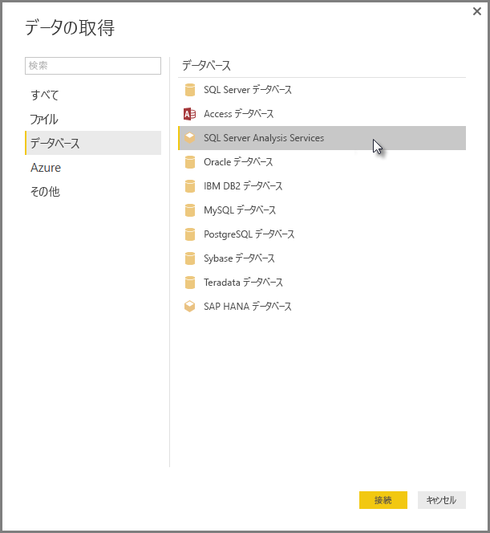

# Power BI Desktop で SSAS 多次元モデルに接続する
Power BI Desktop を利用し、 **SSAS 多次元モデル**( **SSAS MD**とも呼ばれる) にアクセスできます。

**SSAS MD** データベースに接続するには、次の画像のように、**[データの取得] &gt; [データベース] &gt; [SQL Server Analysis Services Database]** を選びます。

ライブ接続モードの **SSAS 多次元モデル**は、Power BI サービスと Power BI Desktop の両方でサポートされます。 ライブ モードの **SSAS 多次元モデル**を使用するレポートを Power BI サービスに公開およびアップロードすることもできます。

## SSAS MD の能力と機能
次のセクションでは、Power BI および SSAS MD 接続の機能と能力について説明します。

### 多次元モデルの表形式のメタデータ
次の表は、多次元オブジェクトと Power BI Desktop に返される表形式のメタデータ間の対応を示しています。 テーブル、マトリックス、グラフ、またはスライサーなどの視覚エフェクトを作成する場合、Power BI は表形式のメタデータのモデルにクエリを実行し、返されたメタデータに基づき、Analysis Services に対して適切な DAX クエリを実行します。

| BISM 多次元オブジェクト | 表形式のメタデータ |
| --- | --- |
| キューブ |モデル |
| キューブ ディメンション |テーブル |
| ディメンション属性 (Keys)、Name) |列 |
| メジャー グループ |テーブル |
| メジャー |メジャー |
| 関連付けられたメジャー グループのないメジャー |*メジャー*という名前のテーブル内 |
| [メジャー グループ] -> [キューブ ディメンションのリレーションシップ] |リレーションシップ |
| パースペクティブ |パースペクティブ |
| KPI |KPI |
| ユーザー/親子の階層 |階層 |

### メジャー、メジャー グループ、および KPI
多次元キューブのメジャー グループは、 **フィールド** ウィンドウで、隣の ∑ 記号によってテーブルとして Power BI に公開されます。 関連付けられたメジャー グループがない計算されたメジャーは、表形式のメタデータ内で *メジャー* という名前の特殊なテーブルの下にグループ化されます。

多次元モデルでは、キューブ内の一連のメジャーまたは KPI を定義して*表示フォルダー*内に配置することができます。これにより、複雑なモデルを簡素化できます。 Power BI は、表形式のメタデータの表示フォルダーを認識し、表示フォルダー内にメジャーと KPI を表示します。 多次元データベースの KPI は*値*、*目標*、*状態マーク*、および*傾向マーク*をサポートします。

### ディメンション属性の種類
多次元モデルでは、ディメンション属性と特定ディメンション属性の種類の関連付けもサポートしています。 たとえば、 **Geography** ディメンションで、 *City*、 *State-Province*、 *Country* 、および *Postal Code* ディメンション属性に適切な地理の種類が関連付けられている場合、ディメンションは表形式のメタデータで公開されます。 Power BI はメタデータを認識し、マップの視覚エフェクトを作成できるようにします。 これらの関連は、Power BI の *[フィールド]* ウィンドウで、要素の隣にある **[マップ]** アイコンより識別できます。

Power BI は、イメージの URL (Uniform Resource Locator) を含むフィールドを指定すると、イメージのレンダリングも行うことができます。 これらのフィールドは SQL Server Data Tools で (またはその後の Power BI で) *ImageURL* 型として指定でき、その型の情報は表形式のメタデータで Power BI に提供されます。 その後 Power BI は、URL からこれらのイメージを取得し、ビジュアルに表示します。

### 親子の階層
多次元モデルは親子階層をサポートしており、表形式のメタデータで *階層* として表示されます。 親子階層の各レベルは、表形式のメタデータで非表示の列として公開されます。 親子ディメンションのキー属性は、表形式のメタデータでは公開されません。

### ディメンションが計算されるメンバー
多次元モデルはさまざまな型の *計算されるメンバー*の作成をサポートしています。 2 種類の最も一般的な計算されるメンバーは、次のとおりです。

* 属性階層の計算されるメンバーであり、*いずれ*の兄弟でもない
* ユーザー階層の計算されるメンバー

多次元モデルは列の値として *属性階層の計算されるメンバー* を公開します。 この種類の計算されるメンバーを公開するときは、他にいくつかのオプションと制約があります。

* *UnknownMember* がディメンション属性のオプションとなる場合があります。
* ディメンションの唯一の属性である場合を除き、計算されるメンバーを含む属性をディメンションのキー属性にすることはできません
* 計算されるメンバーを含む属性を親子属性にすることはできません

ユーザー階層の計算されるメンバーは、Power BI で公開されません。 代わりに、ユーザー階層に計算されるメンバーを含むキューブに接続することができますが、前の箇条書きリストに記載されている制約を満たしていない場合は、計算されるメンバーを表示することはできません。

### セキュリティ
多次元モデルでは、 *ロール*によりディメンションおよびセル レベルのセキュリティをサポートしています。 Power BI でキューブに接続する場合、認証が行われ、適切なパーミッションの有無が評価されます。 あるユーザーで *ディメンション セキュリティ* が適用されている場合、それぞれのディメンションのメンバーを Power BI のユーザーが表示することはできません。 ただし、ユーザーで *セル セキュリティ* パーミッションが定義されており、特定のセルが制限されている場合、そのユーザーは Power BI を使用してキューブに接続することはできません。

## Power BI Desktop での SSAS 多次元モデルの制限
**SSAS MD**の使用には、次のようないくつかの制限があります。

* Power BI Desktop SSAS MD コネクタが機能するには、サーバーは SQL Server 2012 SP1 CU4 以降のバージョンの Analysis Services を実行する必要があります。
* *アクション* および *名前付きセット* は Power BI には公開されませんが、 *アクション* または *名前付きセット* も含むキューブに接続し、ビジュアルおよびレポートを作成することはできます。

## Power BI Desktop  での SSAS MD のサポートされている機能
Power BI Desktop では、SSAS MD の次の機能がサポートされています。

* このリリースの **SSAS MD** では次の要素を利用できます (これらの機能に関する[詳しい情報](https://msdn.microsoft.com/library/jj969574.aspx)を入手できます)。
  * フォルダーの表示
  * KPI 傾向
  * 既定のメンバー
  * 次元の属性
  * 次元が計算されるメンバー (次元に複数の属性がある場合、1 人の実メンバーにする必要があります。唯一の属性でない限り、次元の主要属性にはなりません。親子属性にはできません。)
  * 次元の属性の種類
  * 階層
  * メジャー (メジャー グループありまたはなし)
  * バリアントとしてのメジャー
  * KPI
  * ImageUrls
  * 次元セキュリティ

