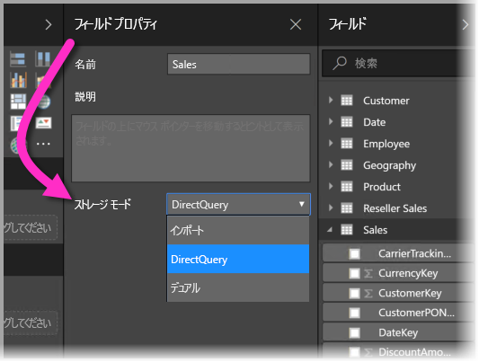
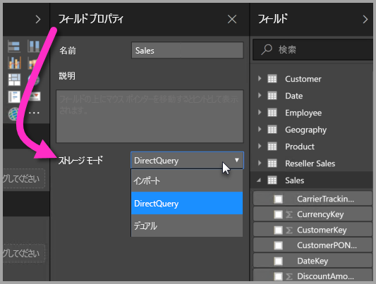
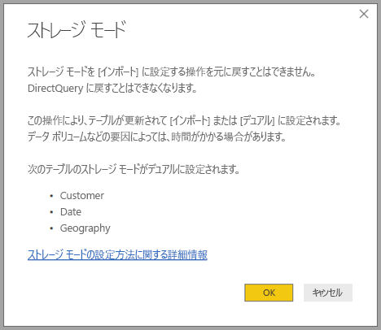

# Power BI Desktop (プレビュー) でのストレージ モード

**Power BI Desktop** では、テーブルの**ストレージ モード**を指定して、レポートのテーブル データをメモリ内にキャッシュするかどうかを制御できます。 

**ストレージ モード**を設定すると、多くの利点があります。 モデルの個々のテーブルに**ストレージ モード**を設定できるので、単一のデータセットで以下の利点のいずれかまたは複数を利用できます。

* **クエリのパフォーマンス**: ユーザーが Power BI レポートのビジュアルを操作するときに、DAX クエリがデータセットに送信されます。 **ストレージ モード**を適切に設定してデータをメモリにキャッシュすると、クエリのパフォーマンスとレポートの対話機能が向上します。
* **大規模なデータセット**: キャッシュされていないテーブルは、キャッシュ目的のメモリを消費しません。 大きすぎて、またはコストが高すぎてメモリ内に完全にキャッシュできない大規模なデータセットに対して、対話型の分析を有効にすることができます。 キャッシュする価値があるテーブルと、価値がないテーブルを選択できます。
* **データ更新の最適化**: キャッシュされていないテーブルを更新する必要はありません。 サービス レベル アグリーメント (SLA) とビジネス要件を満たすために必要なデータのみをキャッシュすることで、更新時間を短縮できます。
* **ほぼリアルタイムの要件**: ほぼリアルタイムの要件があるテーブルの場合、キャッシュしないことで、データの待機時間を短縮できる可能性があります。
* **書き戻し**: ビジネス ユーザーは、書き戻しを利用し、セル値を変更して what-if シナリオを探索できます。 カスタム アプリケーションは、データ ソースに変更を適用できます。 キャッシュされていないテーブルは変更が直ちに反映されるので、結果を即時に分析できます。

**Power BI Desktop** の**ストレージ モード**設定は、3 つの関連する機能の 1 つです。

* **複合モデル**: 複数のデータ接続 (DirectQuery 接続やインポートなど) を任意の組み合わせでレポートに含めることができます。
* **多対多のリレーションシップ**: **複合モデル**を使用すると、テーブル間に**多対多のリレーションシップ**を確立できます。これにより、テーブル内の一意の値に関する要件と、リレーションシップを確立するためだけに新しいテーブルを導入するなどの以前の回避策が不要になります。 
* **ストレージ モード**: DirectQuery に基づく場合でも、バックエンド データ ソースに対するクエリが必要で、インポートが不要なビジュアルを指定できるようになりました。その結果、パフォーマンスが向上し、バックエンドの負荷が軽減されます。 以前は、スライサーのような単純なビジュアルでも、バックエンド ソースに対してクエリの送信が開始されました。 

**複合モデル**のこの 3 つの関連機能群については、それぞれ別々の記事で説明されています。

* **複合モデル**の詳細については、「[Power BI Desktop の複合モデル (プレビュー)](desktop-composite-models.md)」を参照してください。
* **多対多のリレーションシップ**については、「[Power BI Desktop の多対多のリレーションシップ (プレビュー)](desktop-many-to-many-relationships.md)」を参照してください。
* **ストレージ モード**については、この記事で詳しく説明します。

## ストレージ モード プレビュー機能を有効にする

**ストレージ モード**機能はプレビュー段階であり、**Power BI Desktop** で有効にする必要があります。 **ストレージ モード**を有効にするには、**[ファイル] > [オプションと設定] > [オプション] > [プレビュー機能]** の順に選択し、**[複合モデル]** チェックボックスをオンにします。 

この機能を有効にするには、**Power BI Desktop** を再起動する必要があります。

## ストレージ モード プロパティを使用する

**ストレージ モード**は、モデルの各テーブルに設定できるプロパティです。 **ストレージ モード**を設定するには、**[フィールド]** ウィンドウからテーブルを選択し、右クリックしてコンテキスト メニューを表示します。 コンテキスト メニューから **[プロパティ]** を選択します。

![コンテキスト メニューで [プロパティ] を選択する](media/desktop-storage-mode/storage-mode_02.png)

**ストレージ モード**の選択肢がテーブルの **[フィールドのプロパティ]** ウィンドウに表示されます。 ここから、現在の**ストレージ モード** を確認したり、変更したりすることができます。

**ストレージ モード**には 3 つの値があります。

* **インポート**: **[インポート]** に設定すると、インポートされたテーブルはキャッシュされます。 インポート テーブルからデータを返す Power BI データセットに送信されるクエリは、キャッシュされたデータからのみ実行できます。
* **DirectQuery**: この設定を選択すると、DirectQuery テーブルはキャッシュされません。 DirectQuery テーブルからデータを返す Power BI データセットに送信されるクエリ (DAX クエリなど) を実行するには、データ ソースに対してオンデマンド クエリを実行する必要があります。 データ ソースに送信されるクエリは、そのデータ ソースのクエリ言語 (SQL など) を使用します。
* **デュアル**: デュアル テーブルは、Power BI データセットに送信されたクエリのコンテキストに応じて、キャッシュまたは非キャッシュとして動作することができます。 場合によっては、キャッシュされたデータからクエリが実行されます。また、データ ソースに対するオンデマンド クエリを実行してクエリが実行される場合もあります。

テーブルを [インポート] に変更する操作は、*不可逆的*です。つまり、[DirectQuery] や [デュアル] に戻すことはできません。

## DirectQuery テーブルとデュアル テーブルに関する制約

デュアル テーブルは、DirectQuery テーブルと同じ制約を受けます。 たとえば、計算列での M 変換の制限や DAX 関数の制限などです。 詳細については、「[DirectQuery を使用する影響](desktop-directquery-about.md#implications-of-using-directquery)」を参照してください。

## ストレージ モードが異なるテーブルのリレーションシップ ルール

リレーションシップは、関連するテーブルの**ストレージ モード**に基づくルールに従う必要があります。 このセクションでは、有効な組み合わせの例を紹介します。 詳細については、「[Power BI Desktop の多対多のリレーションシップ (プレビュー)](desktop-many-to-many-relationships.md)」を参照してください。

データ ソースが 1 つのデータセットでは、以下の **1 対多の**のリレーションシップの組み合わせが有効です。

| **多**側のテーブル | **1** 側のテーブル |
| ------------- |----------------------| 
| デュアル          | デュアル                 | 
| インポート        | インポートまたはデュアル       | 
| DirectQuery   | DirectQuery またはデュアル  | 

## デュアルの伝達
例を見てみましょう。 次の単純なモデルを考えてみましょう。このモデルでは、すべてのテーブルがインポートと DirectQuery をサポートする単一のソースのテーブルです。

このモデルのすべてのテーブルが最初は DirectQuery だとしましょう。 *SurveyResponse* テーブルの**ストレージ モード**をインポートに変更すると、次のプロンプトが表示されます。

前述のリレーションシップ ルールに準拠するには、ディメンション テーブル (*Customer* (顧客)、*Date* (日付)、*Geography* (地域)) を **[デュアル]** に設定する必要があります。 これらのテーブルを事前に **[デュアル]** に設定する必要はなく、1 回の操作で設定することができます。

伝達ロジックは、多数のテーブルが含まれるモデルに役立つように設計されています。 たとえば、テーブル数が 50 個のモデルがあり、特定のファクト (トランザクション) テーブルのみをキャッシュする必要があるとします。 **Power BI Desktop** のロジックによって **[デュアル]** に設定する必要があるディメンション テーブルの最小セットが特定されるので、手動で特定する必要はありません。

伝達ロジックは、**1 対多**のリレーションシップの一方向に対してのみ横断されます。

* (*SurveyResponse* を変更する代わりに) *Customer* (顧客) テーブルを **[インポート]** に変更することはできません。これは、DirectQuery テーブル *Sales* (売上) と *SurveyResponse* (アンケート回答) テーブルに対するリレーションシップだからです。
* (*SurveyResponse* を変更する代わりに) *Customer* (顧客) テーブルを **[デュアル]** に変更することはできます。 伝達ロジックで、*Geography* (地域) テーブルも **[デュアル]** に設定されます。

## ストレージ モードの使用例
前のセクションの例を続けて、次の**ストレージ モード**のプロパティ設定を適用してみましょう。

| テーブル                   | ストレージ モード         |
| ----------------------- |----------------------| 
| *Sales*                 | DirectQuery          | 
| *SurveyResponse*        | インポート               | 
| *Date*                  | デュアル                 | 
| *Customer*              | デュアル                 | 
| *Geography*             | デュアル                 | 

*Sales* (売上) テーブルに大規模なデータ ボリュームがあると仮定すると、これらのストレージ モードのプロパティ設定を行う場合、次のような動作になります。
* ディメンション テーブル (*Date* (日付)、*Customer* (顧客)、*Geography* (地理)) はキャッシュされるため、表示するスライサー値を取得するときに、初期レポートの読み込み時間が速くなります。
* *Sales* テーブルをキャッシュしないと、次のようにな結果になります。
    * データの更新時間が改善され、メモリ消費量が減少します
    * *Sales* テーブルに基づくレポート クエリは DirectQuery モードで実行されます。キャッシュの待機時間が生じないので、時間はかかりますがリアルタイムに近くなる可能性があります

* *SurveyResponse* テーブルに基づくレポート クエリはメモリ内のキャッシュから返されるので、比較的高速になります。

## キャッシュにヒットするクエリまたはヒットしないクエリ

**SQL Profiler** を **Power BI Desktop** の診断ポートに接続し、次のイベントに基づいてトレースを実行すると、メモリ内のキャッシュにヒットするクエリとヒットしないクエリを確認できます。

* Queries Events\Query Begin
* Query Processing\Vertipaq SE Query Begin
* Query Processing\DirectQuery Begin

*Query Begin* イベントごとに、同じ *ActivityID* を使用して他のイベントを確認します。 たとえば、*DirectQuery Begin* イベントが存在せず、*Vertipaq SE Query Begin* イベントが存在する場合、クエリはキャッシュから応答されました。

**デュアル** モード テーブルを参照するクエリは、可能であればキャッシュからデータを返し、そうでない場合は DirectQuery に戻ります。

前の例を続けて、次のクエリは**デュアル** モードの *Date* (日付) テーブルの列のみを参照します。 そのため、キャッシュにヒットします。

次のクエリは、**DirectQuery** モードの *Sales* (売上) テーブルの列のみを参照します。 そのため、キャッシュにはヒット*しません*。

次の例は、両方の列を結合する興味深いクエリです。 このクエリはキャッシュにヒットしません。 最初は、キャッシュから *CalendarYear* 値を取得し、ソースから *SalesAmount* 値を取得してから、結果を組み合わせることを考えるかもしれませんが、ソース システムに SUM/GROUP BY 操作を送信するよりも効率的ではありません。 操作がソースにプッシュされた場合、返される行数ははるかに少なくなります。 

> [!NOTE]
> キャッシュされたテーブルとキャッシュされていないテーブルを組み合わせる場合、この動作は、[Power BI Desktop の多対多のリレーションシップ (プレビュー)](desktop-many-to-many-relationships.md) とは異なります。

## キャッシュの同期状態を保つ

前のセクションで示したクエリは、**デュアル** テーブルがキャッシュにヒットすることと、キャッシュにヒットしないことがあることを示しています。 このため、キャッシュが古い場合、異なる値が返される可能性があります。 たとえば、キャッシュされた値と一致するように DirectQuery の結果をフィルター処理するなど、クエリを実行しても、データの問題は非表示になりません。 お客様がデータ フローを把握し、それに応じて設計する必要があります。 必要に応じて、ソースのそのようなケースを処理する手法が確立されています。

**デュアル** ストレージ モードはパフォーマンスの最適化です。 ビジネス要件を満たすことができる条件を損なわない方法でのみ使用する必要があります。 他の動作については、「[Power BI Desktop の多対多のリレーションシップ (Preview)](desktop-many-to-many-relationships.md)」で説明されている手法を使用することを検討してください。

## データ ビュー
データセット内の少なくとも 1 つのテーブルの**ストレージ モード**がインポートまたはデュアルに設定されている場合、**[データ ビュー]** タブが表示されます。

*データ ビュー**で選択すると、**デュアル** テーブルと**インポート** テーブルにはキャッシュ データが表示されます。 DirectQuery テーブルにはデータが表示されず、DirectQuery テーブルを表示できないことを示すメッセージが表示されます。

## 制限事項と考慮事項

このリリースの**ストレージ モード**と**複合モデル**との相関関係にはいくつかの制限事項があります。

次の多次元ソースは、**複合モデル**に使用できません。

* SAP HANA
* SAP Business Warehouse
* SQL Server Analysis Services
* Power BI データ セット

DirectQuery を使用してこのような多次元ソースに接続する場合、別の DirectQuery ソースに接続することも、インポートしたデータと結合することもできません。

DirectQuery を使用する際の既存の制限は、**複合モデル**を使用する場合にも適用されます。 これらの制限事項の多くは、テーブルの**ストレージ モード**に応じてテーブルごとに適用されるようになりました。 たとえば、インポートされたテーブルの計算列からは他のテーブルを参照できますが、DirectQuery テーブルの計算列は同じテーブルの列のみを参照するように制限されています。 モデル内のテーブルのいずれかが DirectQuery の場合、モデル全体に他の制限事項が適用されます。 たとえば、モデル内のいずれかのテーブルに**ストレージ モード**の DirectQuery がある場合、**QuickInsights** 機能と **Q&A** 機能は使用できません。 

## 次の手順

以下の記事では、複合モデルと DirectQuery について詳しく説明しています。

* [Power BI Desktop の複合モデル (プレビュー)](desktop-composite-models.md)
* [Power BI Desktop (プレビュー) での多対多のリレーションシップ](desktop-many-to-many-relationships.md)

DirectQuery に関する記事:

* [Power BI で DirectQuery を使用する](desktop-directquery-about.md)
* [Power BI の DirectQuery でサポートされるデータ ソース](desktop-directquery-data-sources.md)

