# Power BI Desktop のレポート ページを基にしてヒントを作成する
**Power BI Desktop** で作成したレポート ページを基にして、ビジュアルをマウス ポインターでポイントすると表示されるさまざまな視覚的**レポート ヒント**を作成できます。 ヒントとして機能するレポート ページを作成することにより、レポート ページで作成したビジュアル、イメージ、その他の項目のコレクションを、カスタム ヒントに含めることができます。 

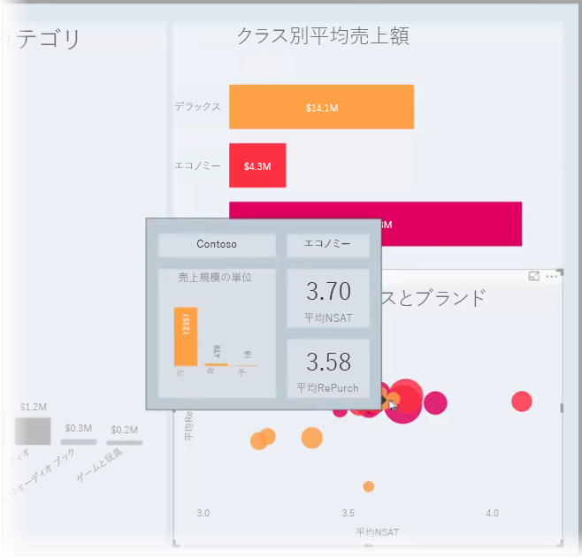

必要なだけいくつでもヒント ページを作成することができます。 各ヒント ページをレポート内の 1 つ以上のフィールドと関連付けることにより、選択したフィールドを含むビジュアルをマウス ポインターでポイントすると、ヒント ページで作成したヒントが、ポイントしたデータポイントでフィルター処理されて表示されます。 

レポート ヒントではさまざまなことができます。 以下では、ヒントを作成する方法と、それを構成するために行う必要があることを説明します。

## レポート ヒント ページを作成する
最初に、**Power BI Desktop** キャンバス下端のページ タブ領域にある **[+]** ボタンをクリックして、新しいレポート ページを作成します。 ボタンはレポートの最後のページにあります。 

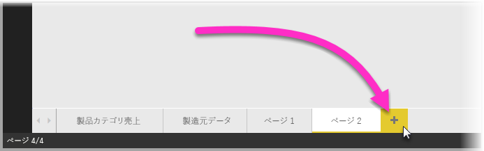

ヒントはどのようなサイズでもかまいませんが、ヒントがレポート キャンバスの前面に重なって表示されることを考えると、手頃な小ささにする必要があります。 **[ページ サイズ]** カードの **[書式]** ペインには、"*ヒント*" という名前の新しいページ サイズ テンプレートがあります。 このテンプレートでは、ヒントにすぐに使用できるレポート ページのキャンバス サイズが提供されます。

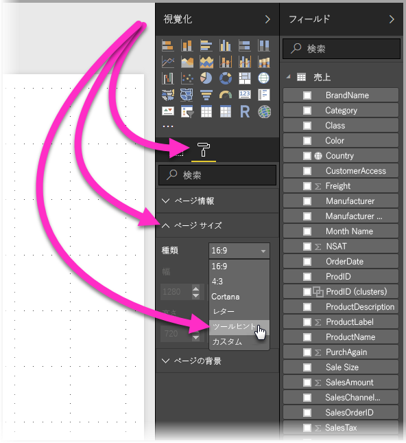

既定では、**Power BI Desktop** はページで使用可能な領域にレポート キャンバスを合わせます。 多くの場合はそれで問題ありませんが、ヒントでは問題があります。 作成したヒントの外観を確認するには、**[ページ表示]** を実際のサイズに変更できます。 

そのためには、リボンの **[表示]** タブを選択します。 そして、次の図に示すように **[ページ表示] > [原寸大]** の順に選択します。

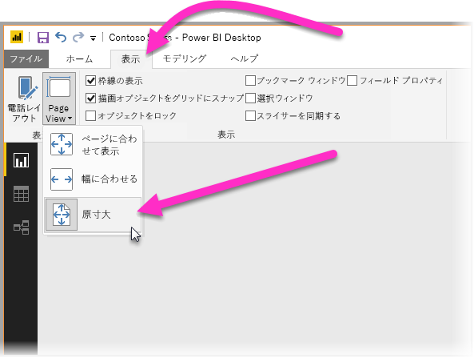

目的がはっきりわかるように、レポート ページに名前を付けることもできます。 そのためには、**[書式]** ペインで **[ページ情報]** カードを選択し、**[名前]** フィールドに名前を入力します。 次の図のヒント レポート名は *Tooltip 1* ですが、よりわかりやすい名前を自由に付けることができます。

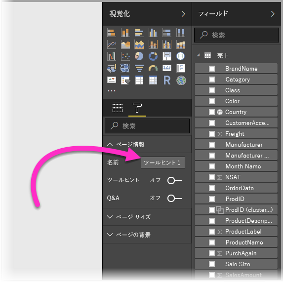

後は、ヒントに表示したいどのようなビジュアルでも作成できます。 次の図のヒント ページは、2 つのカードと一群の横棒グラフで構成され、ページ自体の背景色と個々のビジュアルの背景が設定されています。

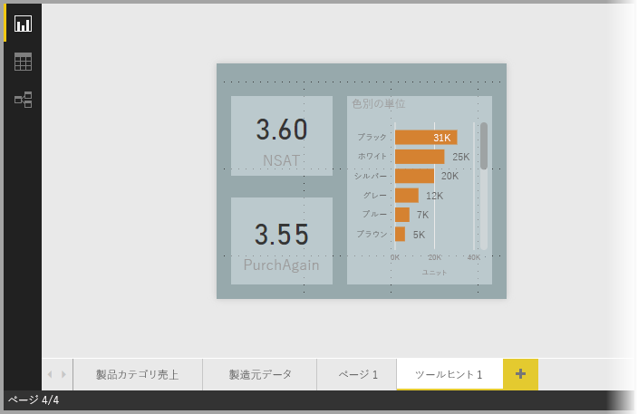

ヒント レポート ページをヒントとして機能させるには、さらにいくつか行わなければならないことがあります。 次のセクションで説明するように、いくつかの方法でヒント ページを構成する必要があります。 

## ヒント レポート ページを構成する

ヒント レポート ページを作成した後は、**Power BI Desktop** がそれをヒントとして登録し、ヒントが適切なビジュアルの上に表示されるように、ページを構成する必要があります。

最初に、**[ページ情報]** カードで **[ヒント]** スライダーを **[オン]** にして、ページをヒントにします。 

スライダーをオンに設定した後、レポート ヒントを表示するフィールドを指定します。 指定したフィールドを含むレポートのビジュアルに、ヒントが表示されます。 適用するフィールド (1 つまたは複数) を指定するには、**[視覚化]** ペインの **[フィールド]** セクションにある **[ヒント フィールド]** バケットに、フィールドをドラッグします。 次の図では、*SalesAmount* フィールドを **[ヒント フィールド]** バケットにドラッグしています。

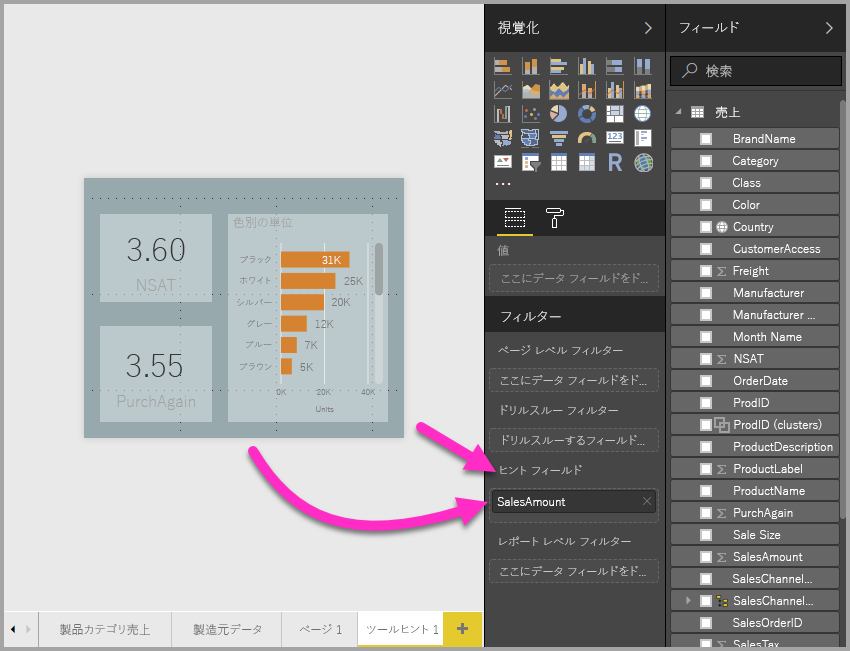
 
**[ヒント フィールド]** バケットには、カテゴリ フィールドと数値フィールドの両方を含めることができます (メジャーも)。

完了すると、**[ヒント フィールド]** バケットに入れたフィールドを使うレポートのビジュアルのヒントとして、Power BI の既定のヒントの代わりに、作成したヒント レポート ページが表示されます。

## レポート ヒントの手動設定

指定したフィールドを含むビジュアルをポイントしたときに自動的に表示されるヒントを作成するだけでなく、ヒントを手動で設定することもできます。 

レポート ヒントをサポートするビジュアルの **[書式設定]** ペインには、**[ヒント]** カードが追加されています。 

ヒントを手動で設定するには、手動ヒントを指定するビジュアルを選択し、**[視覚化]** ペインの **[書式]** セクションを選択して、**[ヒント]** カードを展開します。

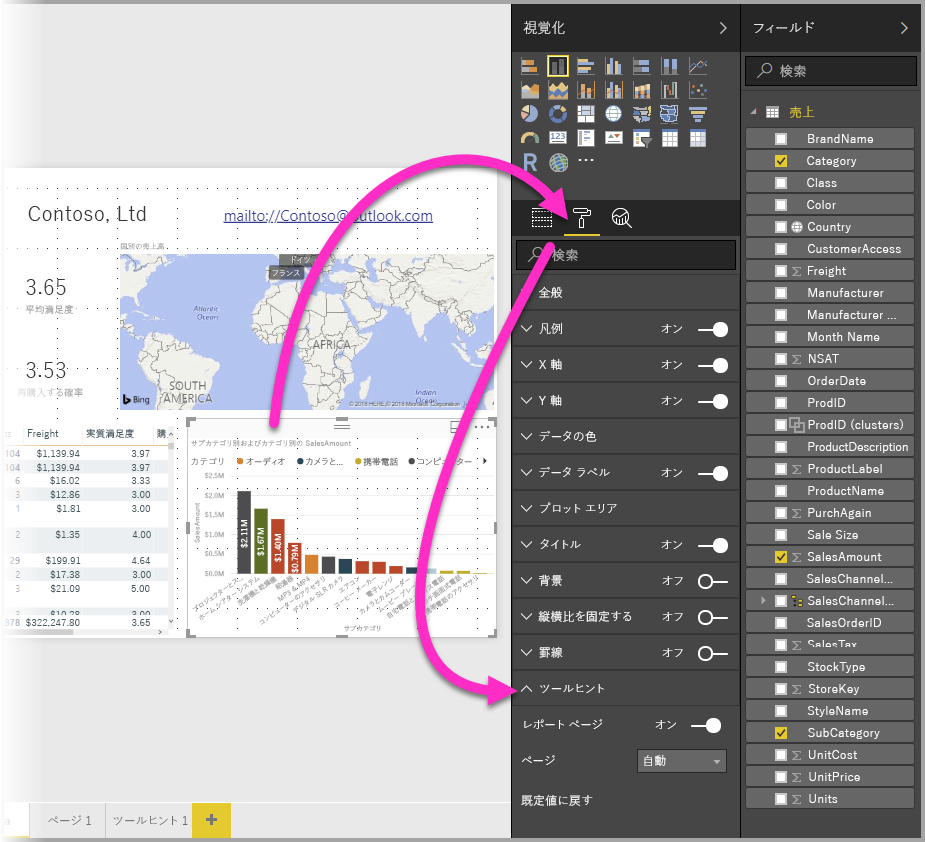

次に、**[ページ]** ドロップダウンで、選択したビジュアルに使うヒント ページを選びます。 ダイアログには**ヒント** ページとして指定したレポート ページだけが表示されることに注意してください。

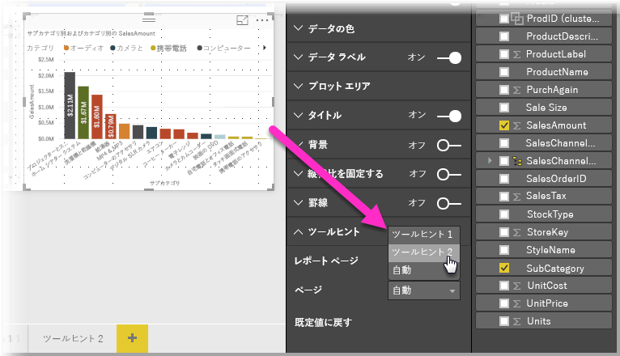

ヒントの手動設定には多くの用途があります。 ヒント用に空白のページを設定し、それで Power BI の既定のヒント選択をオーバーライドできます。 または、Power BI によって自動的に選択されるヒントを使いたくない場合にも使用できます。 たとえば、2 つのフィールドを含むビジュアルがあり、両方のフィールドにヒントが関連付けられている場合、Power BI は 1 つだけ選んで表示します。 それが望ましくない場合は、表示されるヒントを手動で選択できます。

## 既定のヒントに戻す

ビジュアルに手動ヒントを作成した後で既定のヒントを使うことにした場合は、いつでも Power BI が提供する既定のヒントに戻すことができます。 そのためには、ビジュアルを選んで **[ヒント]** カードを展開し、**[ページ]** ドロップダウンから *[自動]* を選びます。

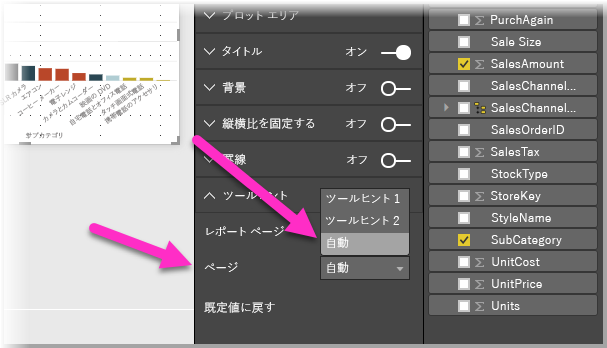

## カスタム レポートのヒントと折れ線グラフ

折れ線グラフ ビジュアルおよびクロス強調表示のあるビジュアルとレポート ヒントが相互作用するときに留意する必要のある考慮事項がいくつかあります。

### レポート ヒントと折れ線グラフ

折れ線グラフにレポート ヒントを表示すると、グラフのすべての線に対して 1 つのヒントだけが表示されます。 これは、折れ線グラフに対する既定のヒントの動作と同じです。 

これは、凡例内のフィールドがヒントのフィルターとして渡されないためです。 次の図では、レポート ヒントに表示される 3 つのクラス (Deluxe、Economy、Regular) すべてについてのその日の合計販売数がヒントに表示されています。 

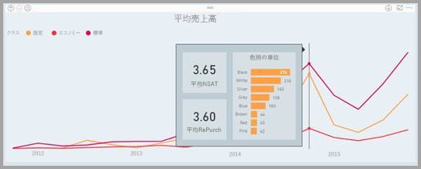

### レポート ヒントとクロス強調表示

レポートでビジュアルがクロス強調表示されている場合、データ ポイントのフェードされているセクションをポイントした場合であっても、レポート ヒントにはクロス強調表示されているデータが常に表示されます。 次の図では、棒グラフのフェードされているセクション (強調表示されていないセクション) をポイントしていますが、レポート ヒントにはそのデータ ポイントの強調表示された部分のデータ (強調表示されたデータ) が表示されます。

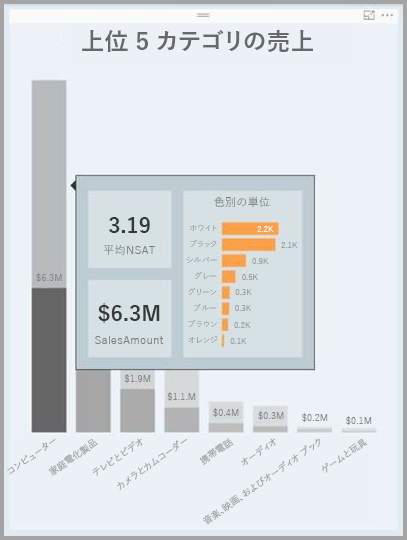

## 制限事項と考慮事項
**ヒント**に関して注意すべきいくつかの制限事項と考慮事項があります。

* **Power BI Desktop** の 2018 年 12 月リリースより、ボタン ビジュアルでもツールヒントがサポートされます。
* モバイル アプリでレポートを表示するときには、レポート ヒントはサポートされていません。 
* カスタム ビジュアルでは、レポート ヒントはサポートされません。 
* 現在、クラスターはレポート ヒントに表示できるフィールドとしてサポートされません。 
* レポート ヒントに表示するフィールドを選択するとき、フィールドとカテゴリが使われていると、そのフィールドを含むビジュアルは、選択されたフィールドの要約が一致する場合にのみ指定されたヒントを表示します。 

## 次の手順
レポート ヒントと似た機能またはレポート ヒントと相互作用する機能の詳細については、次の記事をご覧ください。

* [Power BI Desktop でドリルスルーを使用する](desktop-drillthrough.md)
* [フォーカス モードでダッシュボード タイルまたはレポート ビジュアルを表示する](consumer/end-user-focus.md)

