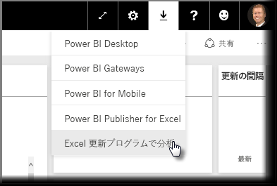
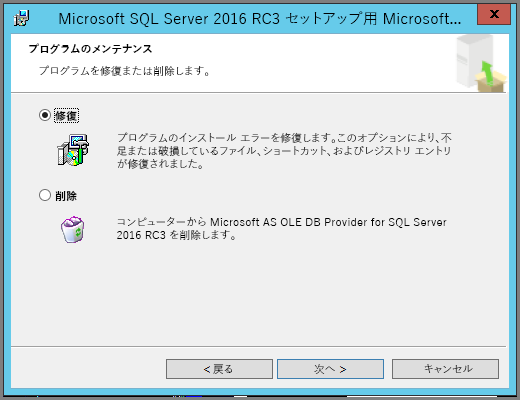
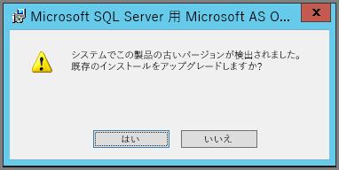

# ”Excel で分析” に関するトラブルシューティング
”Excel で分析” の使用中に、予期しない結果が出る場合や、機能が期待どおりに動作しない場合があります。 このページでは、”Excel で分析” の使用中に発生する一般的な問題の解決方法を説明します。

> [!NOTE]
> [Excel で分析](service-analyze-in-excel.md)の説明とその有効化についてのみ扱ったページを別に用意しています。
> 
> 以下に記載されていないシナリオが発生し、問題を引き起こしている場合は、[コミュニティ サイト](http://community.powerbi.com/)でさらに支援を求めることや、[サポート チケット](https://powerbi.microsoft.com/support/)を作成することができます。
> 
> 

この記事にはトラブルシューティングに関する次のセクションが含まれます。

* OLE DB プロバイダーの Excel ライブラリを更新する
* Excel ライブラリを更新する必要があるかどうかを判別する
* ”接続を確立できません” エラー
* ”許可されていません” エラー
* データ モデルがない
* ”トークンの期限が切れています” エラー
* オンプレミスの Analysis Services にアクセスできない
* ピボットテーブルの値領域 (メジャーなし) にドラッグできない

## OLE DB プロバイダーの Excel ライブラリを更新する
**Excel で分析**を使用するには、コンピューターに最新の AS OLE DB プロバイダーがインストールされている必要があります。 この[コミュニティ投稿](http://community.powerbi.com/t5/Service/Analyze-in-Excel-Initialization-of-the-data-source-failed/m-p/30837#M8081)は、OLE DB プロバイダーのインストールを確認したり、最新バージョンをダウンロードしたりするうえで有益な情報源です。

Excel ライブラリは、ビット レベルが Windows のバージョンと一致している必要があります。 64 ビットの Windows がインストールされている場合は、64 ビットの OLE DB プロバイダーをインストールする必要があります。

最新版の Excel ライブラリをダウンロードするには、Power BI にアクセスし、Power BI サービスの右上隅で**下向きの矢印**を選択し、**[Excel 更新プログラムで分析]** を選択します。

表示されるダイアログで、**[ダウンロード (プレビュー)]** を選択します。

## Excel ライブラリを更新する必要があるかどうかを判別する
最新バージョンの Excel OLE DB プロバイダー ライブラリは、前のセクションにあるリンクからダウンロードできます。 適切な OLE DB プロバイダー ライブラリをダウンロードしてインストールを開始すると、現在インストールされているバージョンに対する確認が実行されます。

Excel OLE DB プロバイダーのクライアント ライブラリが最新のものである場合は、次のようなダイアログが表示されます。

C:\Users\davidi\Desktop\powerbi-content-pr\articles\media\powerbi-desktop-troubleshooting-analyze-in-excel

また、インストール中の新しいバージョンがコンピューター上のバージョンよりも新しい場合は、次のダイアログが表示されます。

アップグレードを求めるダイアログが表示される場合は、インストールを続けて、コンピューターにインストールされている OLE DB プロバイダーの最新バージョンを取得する必要があります。

## ”接続を確立できません” エラー
”*接続を確立できません*” エラーの主な原因は、コンピューター上の OLE DB プロバイダーのクライアント ライブラリが最新でないことによるものです。 適切な更新プログラムを確認する方法の詳細と、ダウンロード リンクについては、この記事で前述した「**OLE DB プロバイダーの Excel ライブラリを更新する**」をご覧ください。

## ”許可されていません” エラー
複数の Power BI アカウントを持っているユーザーの場合、Excel が既存の資格情報を使用して Power BI に接続しようとしたときに、アクセスしたいデータセットまたはレポートへのアクセス許可がない資格情報が使用されることがあります。

このような場合、”**許可されていません**” というタイトルのエラーが表示されることがあります。このエラーは、データセットへのアクセス許可がない資格情報を使用して Power BI にサインインしている可能性があることを意味します。 ”**許可されていません**” エラーが発生し、資格情報の入力を求められた場合は、使用したいデータセットへのアクセス許可を持つ資格情報を使用してください。

エラーが解消されない場合は、アクセス許可を持つアカウントで Power BI にログインし、Excel でアクセスしようとしている Power BI のデータセットを表示してアクセスできることを確認します。

## データ モデルがない
”**OLAP キューブ モデルが見つかりません**” というエラーが発生する場合、アクセスしようとしているデータセットにデータ モデルがないため、Excel で分析することはできません。

## ”トークンの期限が切れています” エラー
”**トークンの期限が切れています**” エラーが表示される場合は、使用しているコンピューターで ”**Excel で分析**” 機能を最近使用していないことを意味します。 資格情報を入力し直すか、またはファイルをもう一度開くと、エラーは表示されなくなります。

## オンプレミスの Analysis Services にアクセスできない
オンプレミスの Analysis Services データに接続するデータセットにアクセスしようとする場合、エラー メッセージが表示されることがあります。 **[Excel で分析]** では、使用しているコンピューターが **Analysis Services** サーバーと同じドメインにあり、アカウントがその **Analysis Services** サーバーへのアクセス権を持つ限り、接続文字列によるオンプレミス **Analysis Services** 上のデータセットおよびレポートへの接続をサポートしています。

## ピボットテーブルの値領域 (メジャーなし) にドラッグできない
**Excel で分析**から外部 OLAP モデルに接続する場合 (Excel から Power BI に接続する方法)、*ピボットテーブル*には[外部モデルで定義される**メジャー**が必要です](https://support.microsoft.com/kb/234700)。これは、すべての計算がサーバーで実行されるためです。 ローカル データ ソースを操作する場合 (Excel のテーブルを操作する場合や、**Power BI Desktop** または**Power BI サービス** でデータセットを操作する場合) は、これとは異なります。つまり、テーブル モデルをローカルに利用でき、[暗黙的なメジャーを使用できます](https://msdn.microsoft.com/library/gg399077.aspx)。暗黙的なメジャーとは、動的に生成され、データ モデルに格納されないメジャーです。 このような場合、Excel での動作は **Power BI Desktop** や **Power BI サービス**とは異なります。つまり、データの中に、Power BI でメジャーとして扱うことができても、Excel で値 (メジャー) として使用できない列が存在する可能性があります。

この問題に対処するには、いくつかの選択肢があります。

1. [**Power BI Desktop** でデータ モデルにメジャーを作成](desktop-tutorial-create-measures.md)し、データ モデルを **Power BI サービス**に公開して、その公開したデータセットに Excel からアクセスします。
2. [Excel PowerPivot でデータ モデルにメジャーを作成](https://support.office.com/article/Create-a-Measure-in-Power-Pivot-d3cc1495-b4e5-48e7-ba98-163022a71198)します。
3. テーブルのみ (データ モデルなし) の Excel ブックからデータをインポートした場合は、[データ モデルにテーブルを追加](https://support.office.com/article/Add-worksheet-data-to-a-Data-Model-using-a-linked-table-d3665fc3-99b0-479d-ba09-a37640f5be42)した後、直前のオプション 2 の手順に従って、データ モデルにメジャーを作成します。

Power BI サービスでモデルに定義したメジャーを、Excel ピボットテーブルの **[値]** 領域で使用できます。

## 次の手順
[Excel で分析](service-analyze-in-excel.md)

[チュートリアル: Power BI Desktop で独自のメジャーを作成する](desktop-tutorial-create-measures.md)

[PowerPivot で使用するメジャー](https://msdn.microsoft.com/library/gg399077.aspx)

[PowerPivot でメジャーを作成する](https://support.office.com/article/Create-a-Measure-in-Power-Pivot-d3cc1495-b4e5-48e7-ba98-163022a71198)

[リンク テーブルを使用したデータ モデルへのワークシート データの追加](https://support.office.com/article/Add-worksheet-data-to-a-Data-Model-using-a-linked-table-d3665fc3-99b0-479d-ba09-a37640f5be42)

[Excel での OLAP と OLAP 以外のピボット テーブルの違い](https://support.microsoft.com/kb/234700)

