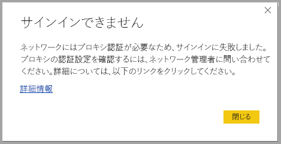
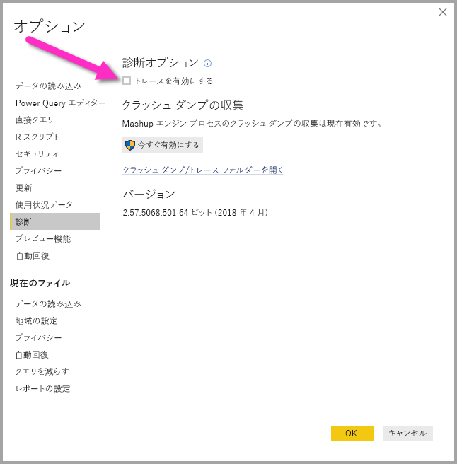

# Power BI Desktop のサインインに関するトラブルシューティング
**Power BI Desktop** にサインインしようとして、エラーになる場合があります。 サインインの問題には 2 つの主な理由があります。**プロキシ認証エラー**と**非 HTTPS URL リダイレクト エラー**です。 

サインインに関する問題の原因がどちらであるかを特定するには、最初に管理者に連絡し、問題の原因を判別できるように診断情報を提供します。 サインインの問題に関連する問題をトレースすることで、管理者は次のエラーのどちらが該当するかを特定できます。 

各問題について順番に見ていきます。 この記事の最後では、Power BI Desktop で "*トレース*" をキャプチャする方法について説明します。これは、問題のトラブルシューティングを追求するのに役立ちます。

## プロキシ認証が必要であるというエラー

次の画面は、"*プロキシの認証が必要*" な場合のエラーの例です。

このエラーには、*Power BI Desktop* トレース ファイルの次の例外が関連します。

* *Microsoft.PowerBI.Client.Windows.Services.PowerBIWebException*
* *HttpStatusCode: ProxyAuthenticationRequired*

このエラーが発生した場合に最も可能性が高い原因は、ネットワーク上のプロキシ認証サーバーが、**Power BI Desktop** によって発行された Web 要求をブロックしていることです。 

ネットワークがプロキシ認証サーバーを使っている場合、管理者はプロキシ認証サーバーで次のドメインをホワイトリストに登録することにより、問題を解決できます。

* app.powerbi.com
* api.powerbi.com
* *.analysis.windows.net 名前空間内のドメイン

政府機関向けクラウドの一部であるお客様の場合は、プロキシ認証サーバーで次のドメインをホワイトリストに登録することにより、この問題を解決できます。

* app.powerbigov.us
* api.powerbigov.us
* *.analysis.usgovcloudapi.net 名前空間内のドメイン

## 非 HTTPS URL リダイレクトがサポートされていない場合のエラー

最新バージョンの **Power BI Desktop** は Active Directory 認証ライブラリ (ADAL) の最新バージョンを使用していますが、このライブラリではセキュリティで保護されていない (HTTPS 以外の) URL へのリダイレクトは許可されません。 

このエラーには、*Power BI Desktop* トレース ファイルの次の例外が関連します。

* *Microsoft.IdentityModel.Clients.ActiveDirectory.AdalServiceException: Non-HTTPS url redirect is not supported in webview* (webview では HTTPS 以外の URL リダイレクトはサポートされていません)
* *ErrorCode: non_https_redirect_failed*

*ErrorCode: non_https_redirect_failed* が発生する場合は、リダイレクト チェーン内の 1 つ以上のリダイレクト ページまたはプロバイダーが HTTPS で保護されたエンドポイントではないこと、または 1 つ以上のリダイレクトの証明書発行者がデバイスの信頼されたルートに含まれないことを意味します。 サインイン リダイレクト チェーンのすべてのプロバイダーは、HTTPS URL を使用している必要があります。 この問題を解決するには、管理者に連絡し、その認証サイトにセキュリティで保護された URL を使用するよう要求してください。 

## Power BI Desktop でトレースを収集する方法

**Power BI Desktop** でトレースを収集するには、次の手順のようにします。

1. **[ファイル] > [オプションと設定] > [オプション]** に移動し、左側のウィンドウのオプションで **[診断]** を選択することにより、**Power BI Desktop** でトレースを有効にします。 表示されるウィンドウで、**[トレースを有効にする]** チェック ボックスをオンにします (次の図を参照)。 **Power BI Desktop** の再起動が必要な場合があります。
   
   

2. その後、エラーを再現する手順を実行します。 エラーが発生すると、**Power BI Desktop** はトレース ログにイベントを追加します。トレース ログは、ローカル コンピューターに保持されています。

3. ローカル コンピューター上のトレース フォルダーに移動します。 このフォルダーは、トレースを有効にした **[診断]** の *[クラッシュ ダンプ/トレース フォルダーを開く]* リンク (前図を参照) を選ぶことで確認できます。 通常、このフォルダーはローカル コンピューターの次の場所にあります。

    `C:\Users/<user name>/AppData/Local/Microsoft/Power BI Desktop/Traces`

このフォルダーには多くのトレース ファイルが存在する可能性があります。 エラーの迅速な識別が容易なように、管理者には最近のファイルだけを送るようにしてください。 

